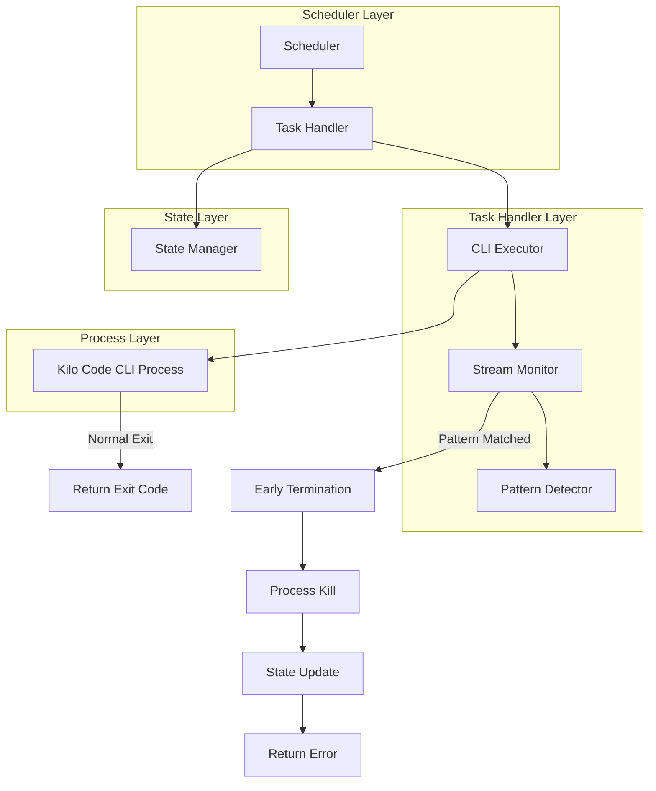
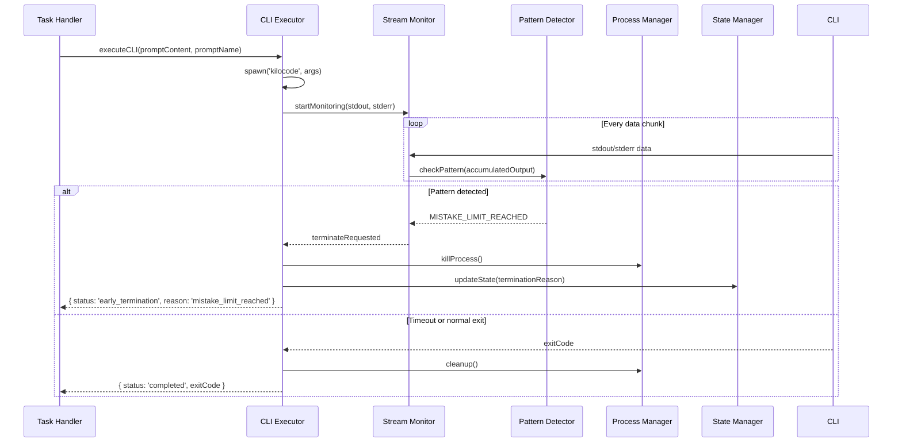
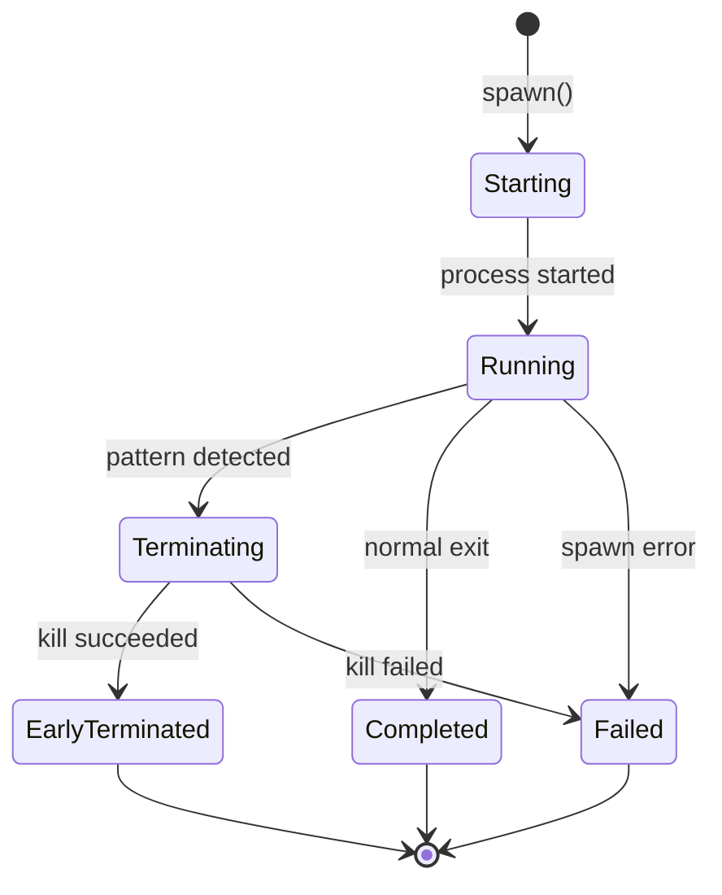

# Mistake Limit Detection - Technical Plan

**Version:** 1.0  
**Date:** 2026-02-07  
**Status:** Planning Document  
**Target:** `automation-parallel` system

---

## Table of Contents

1. [Executive Summary](#executive-summary)
2. [Current Implementation Analysis](#current-implementation-analysis)
3. [Architecture Design](#architecture-design)
4. [Implementation Strategy](#implementation-strategy)
5. [Error Pattern Matching](#error-pattern-matching)
6. [Early Termination Mechanism](#early-termination-mechanism)
7. [State Updates](#state-updates)
8. [Backward Compatibility](#backward-compatibility)
9. [Testing Strategy](#testing-strategy)
10. [Code Specifications](#code-specifications)
11. [Deployment Considerations](#deployment-considerations)

---

## Executive Summary

This document outlines a technical solution for detecting "Mistake Limit Reached" errors in Kilo Code CLI instances and terminating turns early instead of waiting for the full timeout period (30 minutes). The current implementation uses synchronous process execution with inherited output, preventing real-time output monitoring.

**Key Changes:**
- Replace `spawnSync` with `spawn` for asynchronous process execution
- Capture and monitor stdout/stderr streams in real-time
- Implement pattern matching for "Mistake Limit Reached" error
- Add process cleanup and state updates on early termination
- Maintain backward compatibility with existing behavior

**Files to Modify:**
- `automation-parallel/run-architect.js`
- `automation-parallel/run-janitor.js`
- `automation-parallel/run-prompt.js`

**New Files to Create:**
- `automation-parallel/lib/cli-executor.js` - Shared CLI execution module

---

## Current Implementation Analysis

### Existing Execution Pattern

All three parallel runners use the same synchronous execution pattern:

```javascript
// Current implementation in run-architect.js, run-janitor.js, run-prompt.js
function runKiloWithPrompt(promptContent, promptName) {
  const args = [
    '--mode', 'orchestrator',
    '--auto',
    '--timeout', '1800',  // 30 minutes hardcoded
    '--workspace', WORKSPACE_PATH
  ];

  const result = spawnSync('kilocode', args, {
    stdio: ['pipe', 'inherit', 'inherit'],  // Output inherited, not captured
    input: promptContent,
    shell: true
  });

  return result.status;  // Only return exit code
}
```

### Key Characteristics

| Aspect | Current State | Limitation |
|--------|---------------|------------|
| Execution | Synchronous (`spawnSync`) | Blocks, cannot monitor output |
| Timeout | 30 minutes (`--timeout 1800`) | Fixed, no early termination |
| Output | Inherited (`inherit`) | Cannot detect patterns |
| Detection | Exit code only | No content-based detection |
| Early Exit | `.done` file check only | No error pattern detection |

### Problem Scenario

When a CLI instance encounters "Mistake Limit Reached":

```
┌────────────────────────────────────────────────────────────────────────────┐
 │ ✖ Mistake Limit Reached                                                    │
 │                                                                            │
 │ This may indicate a failure in the model's reasoning or an inability to    │
 │ use a tool properly. Try one of the following:                             │
 │                                                                            │
 │ • Use a smarter model, or simply a different model (each model has its own │
 │  weaknesses)                                                               │
 │ • Reduce the amount of context (simplify the prompt for the LLM)           │
 │ • Provide additional instructions that help the LLM (e.g. "Try breaking    │
 │  down the task into smaller steps")                                         │
 └────────────────────────────────────────────────────────────────────────────┘
```

**Timeout Note:** The CLI timeout is being increased from 15 minutes to 30 minutes to provide more time for complex tasks to complete successfully. The early termination mechanism will still detect "Mistake Limit Reached" errors and terminate well before the 30-minute timeout expires, saving significant time on failures.

The process continues until the timeout expires, wasting up to 30 minutes per failure.

---

## Architecture Design

### System Architecture Overview



### Component Responsibilities

| Component | Responsibility |
|-----------|---------------|
| **CLI Executor** | Spawns CLI process, manages lifecycle, captures streams |
| **Stream Monitor** | Accumulates output chunks, provides to detector |
| **Pattern Detector** | Matches output against error patterns |
| **Process Manager** | Handles graceful and forceful termination |
| **State Updater** | Records termination reason in state files |

### Data Flow



---

## Implementation Strategy

### Phase 1: Create Shared CLI Executor Module

Create a new reusable module that handles CLI execution with output monitoring.

**File:** `automation-parallel/lib/cli-executor.js`

**Responsibilities:**
- Spawn CLI processes asynchronously
- Capture and monitor stdout/stderr streams
- Detect error patterns in output
- Terminate processes early when errors detected
- Return structured execution results

### Phase 2: Update Runner Files

Modify each runner file to use the new CLI executor:

1. **run-architect.js**
2. **run-janitor.js**
3. **run-prompt.js**

Changes per file:
- Replace `runKiloWithPrompt()` function with new CLI executor
- Update state handling to include termination reason
- Adjust async/await patterns as needed

### Phase 3: Update State Structure

Extend state objects to include termination reason:

```javascript
// New state fields
{
  // ... existing fields
  lastTerminationReason: null,  // 'mistake_limit_reached', 'timeout', 'normal', etc.
  lastTerminationTime: null,
  earlyTerminationCount: 0
}
```

### Phase 4: Testing and Validation

- Unit tests for pattern detection
- Integration tests with mock CLI processes
- End-to-end tests with actual CLI instances
- Backward compatibility verification

---

## Error Pattern Matching

### Pattern Design

The "Mistake Limit Reached" error uses an ASCII art box format. We need robust pattern matching that accounts for:

1. The primary text: "Mistake Limit Reached"
2. The box drawing characters (Unicode box-drawing or ASCII equivalents)
3. Variations in formatting (spacing, line breaks)
4. Case sensitivity

### Primary Pattern (Recommended)

```javascript
// Primary detection pattern - matches the core error message
const MISTAKE_LIMIT_PATTERNS = [
  // Direct text match - most reliable
  /Mistake Limit Reached/i,

  // With common decorations
  /[\s\|]*✖\s*Mistake Limit Reached/i,
  /[\s\|]*X\s*Mistake Limit Reached/i,
  /[\s\|]*\*\s*Mistake Limit Reached/i,

  // Box border variations
  /[\s┌│─└]*Mistake Limit Reached[\s└│─]*/i,
];
```

### Multi-Line Pattern (Optional Enhanced Detection)

```javascript
// Multi-line pattern for more precise detection
const MISTAKE_LIMIT_MULTILINE_PATTERN = /Mistake Limit Reached[\s\S]{0,500}This may indicate a failure in the model/i;
```

### Pattern Matching Strategy

```javascript
/**
 * Check if output contains mistake limit error
 * @param {string} output - Accumulated output to check
 * @returns {boolean} True if pattern detected
 */
function isMistakeLimitDetected(output) {
  if (!output || typeof output !== 'string') {
    return false;
  }

  // Check primary patterns (most efficient first)
  for (const pattern of MISTAKE_LIMIT_PATTERNS) {
    if (pattern.test(output)) {
      return true;
    }
  }

  // Fallback to multi-line pattern if needed
  if (MISTAKE_LIMIT_MULTILINE_PATTERN.test(output)) {
    return true;
  }

  return false;
}
```

### Detection Configuration

```javascript
/**
 * Configuration for error detection
 */
const ERROR_DETECTION_CONFIG = {
  // Patterns to detect
  mistakeLimitPatterns: MISTAKE_LIMIT_PATTERNS,
  
  // Minimum output before checking (to avoid false positives on early output)
  minOutputLength: 50,
  
  // Maximum lines to accumulate (memory management)
  maxBufferLines: 1000,
  
  // Additional error patterns (extensible for future)
  additionalPatterns: {
    // Can add more error types here in the future
  }
};
```

### Future Extensibility

The pattern system is designed to be extensible. Additional error types can be added:

```javascript
// Example of extensible pattern system
const ERROR_TYPES = {
  MISTAKE_LIMIT: {
    patterns: MISTAKE_LIMIT_PATTERNS,
    terminationReason: 'mistake_limit_reached',
    shouldTerminate: true
  },
  // Future error types can be added here
  // TIMEOUT_ERROR: { ... },
  // API_ERROR: { ... }
};
```

---

## Early Termination Mechanism

### Process Lifecycle Management

```javascript
/**
 * Process lifecycle states
 */
const ProcessState = {
  STARTING: 'starting',
  RUNNING: 'running',
  TERMINATING: 'terminating',
  COMPLETED: 'completed',
  EARLY_TERMINATED: 'early_terminated',
  FAILED: 'failed'
};
```

### Termination Process



### Termination Implementation

```javascript
/**
 * Terminate CLI process with graceful then forceful approach
 * @param {ChildProcess} process - The CLI process to terminate
 * @param {Object} options - Termination options
 * @returns {Promise<Object>} Termination result
 */
async function terminateProcess(process, options = {}) {
  const {
    gracefulTimeout = 5000,  // 5 seconds for graceful shutdown
    forceTimeout = 2000,     // 2 seconds for force kill
    signal = 'SIGTERM'
  } = options;

  const startTime = Date.now();
  let terminated = false;
  let method = null;

  try {
    // Phase 1: Graceful termination
    if (process.pid && !process.killed) {
      logWithTimestamp(`Sending ${signal} to process ${process.pid}`);
      process.kill(signal);
      method = 'graceful';

      // Wait for graceful shutdown
      await Promise.race([
        new Promise(resolve => {
          process.once('exit', resolve);
        }),
        new Promise(resolve => setTimeout(resolve, gracefulTimeout))
      ]);

      if (process.killed || process.exitCode !== null) {
        terminated = true;
        logWithTimestamp(`Process terminated gracefully in ${Date.now() - startTime}ms`);
      }
    }

    // Phase 2: Forceful termination if graceful failed
    if (!terminated && process.pid && !process.killed) {
      logWithTimestamp(`Graceful termination failed, sending SIGKILL`);
      process.kill('SIGKILL');
      method = 'force';

      await new Promise(resolve => setTimeout(resolve, forceTimeout));

      if (process.killed || process.exitCode !== null) {
        terminated = true;
        logWithTimestamp(`Process force-terminated in ${Date.now() - startTime}ms`);
      }
    }

    return {
      success: terminated,
      method: method,
      duration: Date.now() - startTime,
      exitCode: process.exitCode,
      signal: process.signalCode
    };

  } catch (error) {
    logWithTimestamp(`Error during process termination: ${error.message}`);
    return {
      success: false,
      method: method || 'failed',
      duration: Date.now() - startTime,
      error: error.message
    };
  }
}
```

### Output Buffering

```javascript
/**
 * Output buffer for pattern detection
 */
class OutputBuffer {
  constructor(maxLines = 1000) {
    this.lines = [];
    this.maxLines = maxLines;
    this.fullOutput = '';
  }

  /**
   * Add output chunk to buffer
   * @param {Buffer|string} chunk - Output chunk
   */
  add(chunk) {
    const text = chunk.toString();
    this.fullOutput += text;
    
    // Split into lines and keep only recent ones
    const newLines = text.split('\n');
    this.lines.push(...newLines);
    
    if (this.lines.length > this.maxLines) {
      this.lines = this.lines.slice(-this.maxLines);
    }
  }

  /**
   * Get full accumulated output
   * @returns {string}
   */
  getFullOutput() {
    return this.fullOutput;
  }

  /**
   * Get recent N lines
   * @param {number} count - Number of lines
   * @returns {string}
   */
  getRecentLines(count = 100) {
    return this.lines.slice(-count).join('\n');
  }

  /**
   * Clear buffer
   */
  clear() {
    this.lines = [];
    this.fullOutput = '';
  }
}
```

### Stream Monitoring

```javascript
/**
 * Monitor CLI output streams for error patterns
 * @param {ReadableStream} stdout - Standard output stream
 * @param {ReadableStream} stderr - Standard error stream
 * @param {Array<RegExp>} patterns - Patterns to detect
 * @param {Function} onDetect - Callback when pattern detected
 * @param {Function} onOutput - Callback for each output chunk
 * @returns {Object} Monitor control object
 */
function monitorOutputStreams(stdout, stderr, patterns, onDetect, onOutput) {
  const buffer = new OutputBuffer();
  let isMonitoring = true;
  let detectionTimeout = null;

  const checkPattern = (chunk) => {
    buffer.add(chunk);
    
    // Notify callback of output
    if (onOutput) {
      onOutput(chunk.toString(), buffer.getFullOutput());
    }

    // Check if output meets minimum length before pattern matching
    if (buffer.getFullOutput().length < ERROR_DETECTION_CONFIG.minOutputLength) {
      return;
    }

    // Check all patterns
    for (const pattern of patterns) {
      if (pattern.test(buffer.getFullOutput())) {
        isMonitoring = false;
        
        // Clear any pending timeout
        if (detectionTimeout) {
          clearTimeout(detectionTimeout);
        }
        
        // Trigger detection callback
        onDetect(pattern);
        return;
      }
    }
  };

  // Set up stream handlers
  stdout.on('data', checkPattern);
  stderr.on('data', checkPattern);

  // Clean up when streams close
  const cleanup = () => {
    isMonitoring = false;
    if (detectionTimeout) {
      clearTimeout(detectionTimeout);
    }
    stdout.off('data', checkPattern);
    stderr.off('data', checkPattern);
  };

  stdout.on('close', cleanup);
  stderr.on('close', cleanup);

  // Return control object
  return {
    stop: cleanup,
    getBuffer: () => buffer,
    isMonitoring: () => isMonitoring
  };
}
```

---

## State Updates

### Extended State Schema

```javascript
/**
 * Extended state object with termination tracking
 */
const createStateWithTerminationInfo = (baseState) => ({
  // Existing fields (from StateManager.createInitialState())
  lastRun: null,
  lastSuccess: null,
  lastFailure: null,
  errorCount: 0,
  consecutiveFailures: 0,
  status: 'idle',

  // New fields for termination tracking
  lastTerminationReason: null,    // 'mistake_limit_reached', 'timeout', 'normal', 'error'
  lastTerminationTime: null,      // ISO timestamp of last early termination
  earlyTerminationCount: 0,       // Count of early terminations
  totalExecutionTimeMs: 0,        // Total execution time across all runs
  lastExecutionDurationMs: null,  // Duration of last execution

  // Performance metrics
  averageExecutionTimeMs: null,  // Average execution time
  successfulTerminations: 0,     // Count of normal completions
  timeoutTerminations: 0         // Count of timeout terminations
});
```

### State Update Helper

```javascript
/**
 * Update state with termination information
 * @param {StateManager} stateManager - State manager instance
 * @param {string} taskName - Name of the task
 * @param {Object} executionResult - Execution result
 * @returns {Promise<Object>} Updated state
 */
async function updateStateWithTermination(stateManager, taskName, executionResult) {
  const currentState = await stateManager.readState(taskName) || {};
  
  const updates = {
    lastRun: new Date().toISOString(),
    lastExecutionDurationMs: executionResult.durationMs
  };

  // Calculate running average execution time
  const totalCount = (currentState.successfulTerminations || 0) + 
                     (currentState.earlyTerminationCount || 0) + 
                     (currentState.timeoutTerminations || 0);
  
  if (totalCount > 0) {
    const totalTime = (currentState.totalExecutionTimeMs || 0) + executionResult.durationMs;
    updates.totalExecutionTimeMs = totalTime;
    updates.averageExecutionTimeMs = Math.round(totalTime / (totalCount + 1));
  } else {
    updates.totalExecutionTimeMs = executionResult.durationMs;
    updates.averageExecutionTimeMs = executionResult.durationMs;
  }

  if (executionResult.earlyTermination) {
    // Early termination (mistake limit detected)
    updates.lastTerminationReason = executionResult.reason;
    updates.lastTerminationTime = new Date().toISOString();
    updates.earlyTerminationCount = (currentState.earlyTerminationCount || 0) + 1;
    updates.status = 'early_terminated';
    updates.lastFailure = new Date().toISOString();
    updates.error = executionResult.reason;
    updates.consecutiveFailures = (currentState.consecutiveFailures || 0) + 1;
  } else if (executionResult.exitCode === 0) {
    // Successful completion
    updates.status = 'success';
    updates.lastSuccess = new Date().toISOString();
    updates.lastTerminationReason = 'normal';
    updates.successfulTerminations = (currentState.successfulTerminations || 0) + 1;
    updates.consecutiveFailures = 0;
  } else {
    // Failed with non-zero exit code
    updates.status = 'failed';
    updates.lastFailure = new Date().toISOString();
    updates.lastTerminationReason = executionResult.exitCode ? 'exit_code_' + executionResult.exitCode : 'unknown';
    updates.errorCount = (currentState.errorCount || 0) + 1;
    updates.consecutiveFailures = (currentState.consecutiveFailures || 0) + 1;
  }

  return await stateManager.updateState(taskName, updates);
}
```

### State Query Helpers

```javascript
/**
 * Query helper to get termination statistics
 * @param {Object} state - State object
 * @returns {Object} Termination statistics
 */
function getTerminationStats(state) {
  return {
    totalRuns: (state.successfulTerminations || 0) + 
               (state.earlyTerminationCount || 0) + 
               (state.timeoutTerminations || 0),
    successRate: calculateSuccessRate(state),
    earlyTerminationRate: calculateEarlyTerminationRate(state),
    averageExecutionTimeMs: state.averageExecutionTimeMs,
    lastTerminationReason: state.lastTerminationReason,
    consecutiveFailures: state.consecutiveFailures || 0
  };
}

function calculateSuccessRate(state) {
  const total = (state.successfulTerminations || 0) + 
                (state.earlyTerminationCount || 0) + 
                (state.timeoutTerminations || 0);
  return total > 0 ? Math.round((state.successfulTerminations || 0) / total * 100) : 0;
}

function calculateEarlyTerminationRate(state) {
  const total = (state.successfulTerminations || 0) + 
                (state.earlyTerminationCount || 0) + 
                (state.timeoutTerminations || 0);
  return total > 0 ? Math.round((state.earlyTerminationCount || 0) / total * 100) : 0;
}
```

---

## Backward Compatibility

### Compatibility Requirements

| Aspect | Requirement | Strategy |
|--------|-------------|----------|
| Command-line args | No changes required | Keep existing `--workspace`, `--state`, `--interval`, `--timeout` |
| State file format | Extensible | Add new fields, preserve existing ones |
| Exit codes | Maintain consistency | Return meaningful codes from new executor |
| Logging format | Compatible | Use existing `logWithTimestamp()` pattern |
| Scheduler integration | No changes | Scheduler sees async function, handles gracefully |

### Migration Strategy

```javascript
/**
 * Backward-compatible CLI execution function
 * This function maintains the same signature as the original runKiloWithPrompt
 * but uses the new async executor internally
 */
async function runKiloWithPrompt(promptContent, promptName) {
  const startTime = Date.now();
  
  try {
    logWithTimestamp(`[${TASK_NAME}] Starting ${promptName}...`);
    logWithTimestamp(`[${TASK_NAME}] Target Workspace: ${WORKSPACE_PATH}`);

    // Use the new CLI executor
    const result = await executeCLI(promptContent, {
      timeoutMs: TASK_TIMEOUT_MS,
      workspace: WORKSPACE_PATH,
      taskName: promptName
    });

    const durationMs = Date.now() - startTime;
    
    if (result.earlyTermination) {
      logWithTimestamp(`[${TASK_NAME}] ${promptName} terminated early: ${result.reason}`);
      logWithTimestamp(`[${TASK_NAME}] Execution time: ${durationMs}ms (saved ${TASK_TIMEOUT_MS - durationMs}ms)`);
    } else {
      logWithTimestamp(`[${TASK_NAME}] ${promptName} completed with exit code ${result.exitCode}`);
      logWithTimestamp(`[${TASK_NAME}] Execution time: ${durationMs}ms`);
    }

    // Return exit code for backward compatibility
    return result.exitCode || 1;

  } catch (error) {
    logWithTimestamp(`[${TASK_NAME}] Error executing ${promptName}: ${error.message}`);
    return -1;
  }
}
```

---

## Testing Strategy

### Unit Tests

**File:** `automation-parallel/test/cli-executor.test.js`

```javascript
const { spawn } = require('child_process');
const { executeCLI, isMistakeLimitDetected } = require('../lib/cli-executor');

describe('CLI Executor', () => {
  describe('isMistakeLimitDetected', () => {
    it('should detect mistake limit error with full box', () => {
      const output = `
┌────────────────────────────────────────────────────────────────────────────┐
 │ ✖ Mistake Limit Reached                                                    │
 │                                                                            │
 │ This may indicate a failure in the model's reasoning or an inability to    │
 │ use a tool properly. Try one of the following:                             │
 └────────────────────────────────────────────────────────────────────────────┘
      `;
      expect(isMistakeLimitDetected(output)).toBe(true);
    });

    it('should detect mistake limit with simple text', () => {
      const output = 'Error: Mistake Limit Reached - please try again';
      expect(isMistakeLimitDetected(output)).toBe(true);
    });

    it('should not detect false positives in normal output', () => {
      const output = 'The limit was reached for the task';
      expect(isMistakeLimitDetected(output)).toBe(false);
    });

    it('should handle empty or null output', () => {
      expect(isMistakeLimitDetected(null)).toBe(false);
      expect(isMistakeLimitDetected('')).toBe(false);
      expect(isMistakeLimitDetected(undefined)).toBe(false);
    });
  });

  describe('executeCLI', () => {
    it('should execute command and return result', async () => {
      // Test with a simple echo command
      const result = await executeCLI('test input', {
        command: 'echo',
        timeoutMs: 5000
      });
      
      expect(result).toHaveProperty('exitCode');
      expect(result).toHaveProperty('durationMs');
      expect(result).toHaveProperty('output');
      expect(result.earlyTermination).toBe(false);
    });

    it('should detect mistake limit and terminate early', async () => {
      // This would require a mock CLI that outputs the error
      // Implementation would use child_process with mocked stdout
    });

    it('should handle timeout gracefully', async () => {
      const result = await executeCLI('test', {
        command: 'sleep',
        args: ['100'],
        timeoutMs: 1000
      });
      
      expect(result.exitCode).not.toBe(0);
      expect(result.terminationReason).toBe('timeout');
    });
  });
});
```

### Integration Tests

**File:** `automation-parallel/test/integration/mistake-detection.test.js`

```javascript
const path = require('path');
const { executeCLI } = require('../../lib/cli-executor');

describe('Mistake Limit Detection Integration', () => {
  const workspace = path.join(__dirname, '../fixtures/test-workspace');

  it('should integrate with architect runner', async () => {
    // Test actual integration with run-architect.js
    // This would require setting up a test environment
  });

  it('should update state correctly after early termination', async () => {
    // Test state manager integration
  });
});
```

### Manual Testing Procedures

1. **Create test scenario that triggers mistake limit:**
   - Use a prompt with known problematic context
   - Monitor for early termination
   - Verify state updates

2. **Test normal execution:**
   - Run with a simple, correct prompt
   - Verify no false positives
   - Check normal completion handling

3. **Test timeout scenarios:**
   - Run with prompts that take longer than timeout
   - Verify timeout handling
   - Check state updates

4. **Test concurrent executions:**
   - Run multiple instances in parallel
   - Verify no race conditions
   - Check lock management

### Performance Benchmarks

| Metric | Current | Target | Measurement Method |
|--------|---------|--------|-------------------|
| Mistake limit detection time | N/A (waits timeout) | < 5 seconds | Time from error to termination |
| False positive rate | N/A | 0% | Manual review of logs |
| Memory overhead | Baseline | + < 10 MB | Process memory monitoring |
| CPU overhead | Baseline | + < 5% | CPU usage monitoring |

---

## Code Specifications

### File: `automation-parallel/lib/cli-executor.js`

```javascript
/**
 * CLI Executor Module
 * Handles execution of Kilo Code CLI with output monitoring and early termination
 */

const { spawn } = require('child_process');
const { promisify } = require('util');

// Error detection patterns
const MISTAKE_LIMIT_PATTERNS = [
  /Mistake Limit Reached/i,
  /[\s\|]*✖\s*Mistake Limit Reached/i,
  /[\s\|]*X\s*Mistake Limit Reached/i,
  /[\s\|]*\*\s*Mistake Limit Reached/i,
];

const MISTAKE_LIMIT_MULTILINE_PATTERN = /Mistake Limit Reached[\s\S]{0,500}This may indicate a failure in the model/i;

const ERROR_DETECTION_CONFIG = {
  minOutputLength: 50,
  maxBufferLines: 1000,
};

/**
 * Output buffer class for accumulating and managing CLI output
 */
class OutputBuffer {
  constructor(maxLines = 1000) {
    this.lines = [];
    this.maxLines = maxLines;
    this.fullOutput = '';
  }

  add(chunk) {
    const text = chunk.toString();
    this.fullOutput += text;
    const newLines = text.split('\n');
    this.lines.push(...newLines);
    
    if (this.lines.length > this.maxLines) {
      this.lines = this.lines.slice(-this.maxLines);
    }
  }

  getFullOutput() {
    return this.fullOutput;
  }

  getRecentLines(count = 100) {
    return this.lines.slice(-count).join('\n');
  }

  clear() {
    this.lines = [];
    this.fullOutput = '';
  }
}

/**
 * Check if output contains mistake limit error pattern
 * @param {string} output - Output to check
 * @returns {boolean} True if pattern detected
 */
function isMistakeLimitDetected(output) {
  if (!output || typeof output !== 'string') {
    return false;
  }

  for (const pattern of MISTAKE_LIMIT_PATTERNS) {
    if (pattern.test(output)) {
      return true;
    }
  }

  if (MISTAKE_LIMIT_MULTILINE_PATTERN.test(output)) {
    return true;
  }

  return false;
}

/**
 * Terminate a process with graceful then forceful approach
 * @param {ChildProcess} process - Process to terminate
 * @param {Object} options - Termination options
 * @returns {Promise<Object>} Termination result
 */
async function terminateProcess(process, options = {}) {
  const {
    gracefulTimeout = 5000,
    forceTimeout = 2000,
    signal = 'SIGTERM'
  } = options;

  const startTime = Date.now();
  let terminated = false;
  let method = null;

  try {
    if (process.pid && !process.killed) {
      process.kill(signal);
      method = 'graceful';

      await Promise.race([
        new Promise(resolve => {
          process.once('exit', resolve);
        }),
        new Promise(resolve => setTimeout(resolve, gracefulTimeout))
      ]);

      if (process.killed || process.exitCode !== null) {
        terminated = true;
      }
    }

    if (!terminated && process.pid && !process.killed) {
      process.kill('SIGKILL');
      method = 'force';

      await new Promise(resolve => setTimeout(resolve, forceTimeout));

      if (process.killed || process.exitCode !== null) {
        terminated = true;
      }
    }

    return {
      success: terminated,
      method: method,
      duration: Date.now() - startTime,
      exitCode: process.exitCode,
      signal: process.signalCode
    };

  } catch (error) {
    return {
      success: false,
      method: method || 'failed',
      duration: Date.now() - startTime,
      error: error.message
    };
  }
}

/**
 * Execute CLI with output monitoring
 * @param {string} promptContent - Prompt content to pipe to CLI
 * @param {Object} options - Execution options
 * @returns {Promise<Object>} Execution result
 */
async function executeCLI(promptContent, options = {}) {
  const {
    command = 'kilocode',
    workspace = process.env.WORKSPACE_PATH || '/workspace',
    timeoutMs = 900000,
    taskName = 'unknown',
    logFunction = null
  } = options;

  const startTime = Date.now();
  const log = logFunction || (() => {});

  log(`[${taskName}] Executing ${command} with ${promptContent.length} chars of input`);

  const args = [
    '--mode', 'orchestrator',
    '--auto',
    '--timeout', Math.floor(timeoutMs / 1000).toString(),
    '--workspace', workspace
  ];

  return new Promise((resolve) => {
    const buffer = new OutputBuffer();
    let process = null;
    let isMonitoring = true;
    let errorPatternDetected = false;

    try {
      process = spawn(command, args, {
        stdio: ['pipe', 'pipe', 'pipe'],
        shell: true
      });

      // Write input to stdin
      process.stdin.write(promptContent);
      process.stdin.end();

      // Handle stdout
      process.stdout.on('data', (chunk) => {
        if (!isMonitoring) return;
        
        buffer.add(chunk);
        const output = buffer.getFullOutput();

        // Check for pattern if we have enough output
        if (output.length >= ERROR_DETECTION_CONFIG.minOutputLength) {
          if (isMistakeLimitDetected(output)) {
            errorPatternDetected = true;
            isMonitoring = false;
            log(`[${taskName}] Mistake Limit pattern detected, terminating early...`);
            
            terminateProcess(process, { gracefulTimeout: 3000 }).then(result => {
              resolve({
                exitCode: 1,
                durationMs: Date.now() - startTime,
                output: output,
                earlyTermination: true,
                reason: 'mistake_limit_reached',
                termination: result
              });
            });
          }
        }

        // Also forward to console for visibility
        process.stdout.write(chunk);
      });

      // Handle stderr
      process.stderr.on('data', (chunk) => {
        if (!isMonitoring) return;
        
        buffer.add(chunk);
        const output = buffer.getFullOutput();

        if (output.length >= ERROR_DETECTION_CONFIG.minOutputLength) {
          if (isMistakeLimitDetected(output)) {
            errorPatternDetected = true;
            isMonitoring = false;
            log(`[${taskName}] Mistake Limit pattern detected in stderr, terminating early...`);
            
            terminateProcess(process, { gracefulTimeout: 3000 }).then(result => {
              resolve({
                exitCode: 1,
                durationMs: Date.now() - startTime,
                output: output,
                earlyTermination: true,
                reason: 'mistake_limit_reached',
                termination: result
              });
            });
          }
        }

        // Also forward to console for visibility
        process.stderr.write(chunk);
      });

      // Handle process exit
      process.on('exit', (code, signal) => {
        if (!errorPatternDetected) {
          const durationMs = Date.now() - startTime;
          log(`[${taskName}] Process exited with code ${code}, signal ${signal}`);
          
          resolve({
            exitCode: code,
            durationMs: durationMs,
            output: buffer.getFullOutput(),
            earlyTermination: false,
            terminationReason: signal ? 'signal_' + signal : (code === 0 ? 'normal' : 'exit_code_' + code)
          });
        }
      });

      // Handle process errors
      process.on('error', (error) => {
        log(`[${taskName}] Process error: ${error.message}`);
        
        if (!errorPatternDetected) {
          resolve({
            exitCode: -1,
            durationMs: Date.now() - startTime,
            output: buffer.getFullOutput(),
            earlyTermination: false,
            terminationReason: 'process_error',
            error: error.message
          });
        }
      });

      // Set up hard timeout
      const timeoutHandle = setTimeout(() => {
        if (isMonitoring && process && !process.killed) {
          log(`[${taskName}] Timeout (${timeoutMs}ms) reached, terminating...`);
          isMonitoring = false;
          
          terminateProcess(process, { gracefulTimeout: 3000 }).then(result => {
            resolve({
              exitCode: null,
              durationMs: Date.now() - startTime,
              output: buffer.getFullOutput(),
              earlyTermination: true,
              reason: 'timeout',
              termination: result
            });
          });
        }
      }, timeoutMs);

      // Cleanup on exit
      process.on('exit', () => {
        clearTimeout(timeoutHandle);
      });

    } catch (error) {
      log(`[${taskName}] Error spawning process: ${error.message}`);
      resolve({
        exitCode: -1,
        durationMs: Date.now() - startTime,
        output: buffer.getFullOutput(),
        earlyTermination: false,
        terminationReason: 'spawn_error',
        error: error.message
      });
    }
  });
}

module.exports = {
  executeCLI,
  isMistakeLimitDetected,
  terminateProcess,
  OutputBuffer,
  MISTAKE_LIMIT_PATTERNS,
  ERROR_DETECTION_CONFIG
};
```

### Example Runner Update: `run-architect.js`

```javascript
// At the top of the file, add:
const { executeCLI } = require('./lib/cli-executor.js');

// Replace the existing runKiloWithPrompt function:
async function runKiloWithPrompt(promptContent, promptName) {
  const startTime = Date.now();
  
  try {
    logWithTimestamp(`[${TASK_NAME}] Starting ${promptName}...`);
    logWithTimestamp(`[${TASK_NAME}] Target Workspace: ${WORKSPACE_PATH}`);

    const result = await executeCLI(promptContent, {
      workspace: WORKSPACE_PATH,
      timeoutMs: TASK_TIMEOUT_MS,
      taskName: promptName,
      logFunction: logWithTimestamp
    });

    const durationMs = Date.now() - startTime;
    
    if (result.earlyTermination) {
      logWithTimestamp(`[${TASK_NAME}] ${promptName} terminated early: ${result.reason}`);
      logWithTimestamp(`[${TASK_NAME}] Execution time: ${durationMs}ms (saved ${TASK_TIMEOUT_MS - durationMs}ms)`);
    } else {
      logWithTimestamp(`[${TASK_NAME}] ${promptName} completed with exit code ${result.exitCode}`);
      logWithTimestamp(`[${TASK_NAME}] Execution time: ${durationMs}ms`);
    }

    return result.exitCode || 1;

  } catch (error) {
    logWithTimestamp(`[${TASK_NAME}] Error executing ${promptName}: ${error.message}`);
    return -1;
  }
}

// Update the architectExecutionHandler to handle state updates:
async function architectExecutionHandler() {
  const handlerTimestamp = new Date().toISOString();
  logWithTimestamp(`[${TASK_NAME}] Starting architect execution handler at ${handlerTimestamp}`);
  
  let lockAcquired = false;
  
  try {
    // ... existing lock and state code ...

    // Execute the prompt
    const promptResult = await executePromptTemplate('ARCHITECT.md', context);

    if (!promptResult.success) {
      throw new Error(`Failed to execute ARCHITECT.md template: ${promptResult.error}`);
    }

    // Execute CLI with new executor
    logWithTimestamp(`[${TASK_NAME}] Executing Kilo Code CLI with ARCHITECT prompt...`);
    const exitCode = await runKiloWithPrompt(promptResult.output, 'ARCHITECT');
    
    // Update state with termination info
    await updateStateWithTermination(stateManager, TASK_NAME, {
      exitCode,
      durationMs: Date.now() - Date.parse(handlerTimestamp),
      earlyTermination: exitCode !== 0 && await wasEarlyTermination(),
      reason: exitCode !== 0 ? 'error' : 'normal'
    });

    logWithTimestamp(`[${TASK_NAME}] Kilo Code CLI exited with code ${exitCode}`);

    // ... rest of existing code ...
  } catch (error) {
    // ... existing error handling ...
  }
}
```

### State Update Helper: Add to each runner

```javascript
/**
 * Update state with termination information
 * @param {StateManager} stateManager - State manager instance
 * @param {string} taskName - Name of the task
 * @param {Object} executionResult - Execution result from executeCLI
 * @returns {Promise<Object>} Updated state
 */
async function updateStateWithTermination(stateManager, taskName, executionResult) {
  const currentState = await stateManager.readState(taskName) || {};
  
  const updates = {
    lastRun: new Date().toISOString(),
    lastExecutionDurationMs: executionResult.durationMs
  };

  // Calculate running average
  const totalCount = (currentState.successfulTerminations || 0) + 
                     (currentState.earlyTerminationCount || 0) + 
                     (currentState.timeoutTerminations || 0);
  
  if (totalCount > 0) {
    const totalTime = (currentState.totalExecutionTimeMs || 0) + executionResult.durationMs;
    updates.totalExecutionTimeMs = totalTime;
    updates.averageExecutionTimeMs = Math.round(totalTime / (totalCount + 1));
  } else {
    updates.totalExecutionTimeMs = executionResult.durationMs;
    updates.averageExecutionTimeMs = executionResult.durationMs;
  }

  if (executionResult.earlyTermination && executionResult.reason === 'mistake_limit_reached') {
    updates.lastTerminationReason = 'mistake_limit_reached';
    updates.lastTerminationTime = new Date().toISOString();
    updates.earlyTerminationCount = (currentState.earlyTerminationCount || 0) + 1;
    updates.status = 'early_terminated';
    updates.lastFailure = new Date().toISOString();
    updates.error = executionResult.reason;
    updates.consecutiveFailures = (currentState.consecutiveFailures || 0) + 1;
  } else if (executionResult.exitCode === 0) {
    updates.status = 'success';
    updates.lastSuccess = new Date().toISOString();
    updates.lastTerminationReason = 'normal';
    updates.successfulTerminations = (currentState.successfulTerminations || 0) + 1;
    updates.consecutiveFailures = 0;
  } else {
    updates.status = 'failed';
    updates.lastFailure = new Date().toISOString();
    updates.lastTerminationReason = executionResult.reason || 'unknown';
    updates.errorCount = (currentState.errorCount || 0) + 1;
    updates.consecutiveFailures = (currentState.consecutiveFailures || 0) + 1;
  }

  return await stateManager.updateState(taskName, updates);
}
```

---

## Deployment Considerations

### Deployment Checklist

- [ ] Create backup of current state files
- [ ] Deploy new `cli-executor.js` module
- [ ] Update `run-architect.js`
- [ ] Update `run-janitor.js`
- [ ] Update `run-prompt.js`
- [ ] Monitor logs for pattern detection
- [ ] Verify state updates are correct
- [ ] Check for performance regressions

### Monitoring Requirements

After deployment, monitor:

1. **Early termination rate:** Should correlate with actual mistake limit errors
2. **False positives:** Review logs for incorrect early terminations
3. **Time saved:** Compare execution times before and after
4. **State file integrity:** Ensure state updates are consistent
5. **Error rates:** Should not increase significantly

### Rollback Procedure

```bash
# Restore original files from git
git checkout automation-parallel/run-architect.js
git checkout automation-parallel/run-janitor.js
git checkout automation-parallel/run-prompt.js
rm automation-parallel/lib/cli-executor.js

# Restart services
docker-compose restart
```

### Logging Enhancements

Consider adding structured logging for monitoring:

```javascript
// Enhanced logging with structured data
logWithTimestamp(`[${TASK_NAME}] Execution completed`, {
  exitCode: result.exitCode,
  durationMs: result.durationMs,
  earlyTermination: result.earlyTermination,
  terminationReason: result.reason,
  timeSavedMs: result.earlyTermination ? TASK_TIMEOUT_MS - result.durationMs : 0
});
```

---

## Summary

This technical plan provides a complete roadmap for implementing mistake limit detection and early termination in the Kilo Code CLI automation system. The key benefits are:

1. **Time Savings:** Eliminate up to 30 minutes of wasted time per mistake limit error
2. **Better Observability:** State tracking shows why terminations occurred
3. **Extensible Design:** Pattern system can detect other error types in the future
4. **Backward Compatible:** Maintains existing interfaces and behavior
5. **Minimal Risk:** Direct implementation with simple rollback if issues arise

The implementation follows clean architecture principles with:
- Separation of concerns (CLI executor, state manager, task handlers)
- Reusable shared module
- Comprehensive error handling
- Detailed testing strategy

---

**Document Version History**

| Version | Date | Author | Changes |
|---------|------|--------|---------|
| 1.0 | 2026-02-07 | Architect | Initial technical plan |
