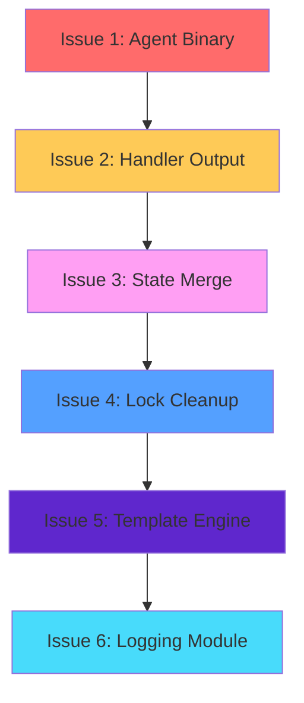

# Refactoring Plan: Addressing Unnecessary Complexity

**Project**: automation-rust  
**Date**: 2026-02-10T02:47:00Z  
**Based on**: ARCHITECTURE_REVIEW.md  
**Type**: Planning Document (No implementation)

---

## Executive Summary

This document provides a comprehensive refactoring plan to address the six unnecessary complexity issues identified in the ARCHITECTURE_REVIEW.md. The refactoring focuses on reducing code duplication, simplifying complex logic, and improving maintainability across the codebase.

### Issues Summary

| # | Issue | Complexity | Impact | Files Affected |
|---|-------|------------|--------|----------------|
| 1 | Agent Binary Duplication | High | High | `agents/src/bin/*.rs` |
| 2 | Handler Output File Writing | Medium | Medium | `agents/src/agent.rs` |
| 3 | State Merge Logic | Medium | Medium | `state/src/state.rs` |
| 4 | Lock Cleanup Complexity | Medium | Medium | `state/src/lock.rs`, `state/src/cleanup.rs` |
| 5 | Template Engine HashMap Creation | Low | Low | `workspace/src/template.rs` |
| 6 | Logging Module Over-Engineering | Medium | Medium | `common/src/logging.rs` |

---

## Table of Contents

1. [Refactoring Task Priority Order](#refactoring-task-priority-order)
2. [Issue 1: Agent Binary Duplication](#issue-1-agent-binary-duplication)
3. [Issue 2: Handler Output File Writing](#issue-2-handler-output-file-writing)
4. [Issue 3: State Merge Logic](#issue-3-state-merge-logic)
5. [Issue 4: Lock Cleanup Complexity](#issue-4-lock-cleanup-complexity)
6. [Issue 5: Template Engine HashMap Creation](#issue-5-template-engine-hashmap-creation)
7. [Issue 6: Logging Module Over-Engineering](#issue-6-logging-module-over-engineering)
8. [Implementation Considerations](#implementation-considerations)
9. [Testing Strategy](#testing-strategy)

---

## Refactoring Task Priority Order

The following execution order is recommended:


**Rationale:**
- Issue 1 has highest impact and reduces future agent boilerplate
- Issue 2 and 3 are in the same crate (agents) and share similar patterns
- Issues 4-6 are lower priority and isolated to their respective crates

---

## Issue 1: Agent Binary Duplication

### Current Problem

All three agent binaries (`architect.rs`, `janitor.rs`, `prompt.rs`) contain nearly identical initialization and configuration loading logic. Approximately 80-90% of the code in each binary is duplicated boilerplate (~240 lines total).

**Duplicated Pattern (~90 lines per file):**
1. Config file path determination (lines 28-30)
2. Config file existence check (lines 32-38)
3. TOML config loading (lines 40-42)
4. Workspace and state path extraction (lines 44-56)
5. Agent-specific settings extraction (lines 58-59)
6. Logging initialization (lines 61-75)
7. Logging info messages (lines 77-81)
8. Workspace path resolution (lines 83-93)
9. AgentConfig creation (lines 95-106)
10. Configuration logging (lines 108-115)
11. Agent runner creation and execution (lines 117-119)

**Files Affected:**
- `agents/src/bin/architect.rs` (122 lines)
- `agents/src/bin/janitor.rs` (122 lines)
- `agents/src/bin/prompt.rs` (121 lines)

### Proposed Solution Approach

**Strategy 1: Extract Common Initialization into Shared Module (Recommended)**

Create a new module `agents/src/common/agent_bootstrap.rs` that contains all shared initialization logic. Each binary would only contain:
- Unique agent type
- Agent-specific config extraction
- A single function call to run the agent

**Alternative Strategy 2: Macro-Based Solution**

Use a declarative macro to generate the main function with all boilerplate, parameterizing only the agent-specific parts.

### Files to Modify

| File | Action |
|------|--------|
| `agents/src/bin/architect.rs` | Refactor to use shared bootstrap module |
| `agents/src/bin/janitor.rs` | Refactor to use shared bootstrap module |
| `agents/src/bin/prompt.rs` | Refactor to use shared bootstrap module |
| `agents/src/lib.rs` | Add `common` module |
| `agents/Cargo.toml` | No changes required |

### New Files/Functions to Create

| New File | Purpose |
|----------|---------|
| `agents/src/common/mod.rs` | Common module entry point |
| `agents/src/common/agent_bootstrap.rs` | Shared bootstrap logic |

**Key Functions to Create:**

```rust
// agents/src/common/agent_bootstrap.rs

/// Loads the TOML configuration file and validates its existence
pub fn load_config(config_path: &str) -> Result<WorkspaceConfig, AutomationError>

/// Extracts workspace and state paths from TOML config
pub fn extract_paths(config_path: &PathBuf, toml_config: &WorkspaceConfig) 
    -> (String, PathBuf)

/// Initializes logging from TOML config
pub fn init_logging_from_config(toml_config: &WorkspaceConfig)

/// Resolves workspace path (handles relative paths)
pub fn resolve_workspace_path(config_path: &PathBuf, workspace_path: &PathBuf) 
    -> String

/// Creates AgentConfig from agent-specific TOML settings
pub fn create_agent_config(
    agent_type: AgentType,
    agent_settings: &AgentSettings,
    workspace: String,
    state_dir: PathBuf,
) -> AgentConfig

/// Main bootstrap function - orchestrates all initialization steps
pub fn bootstrap_agent<T>(
    agent_type: AgentType,
    config_path: Option<String>,
    extract_agent_settings: T,
) -> Result<AgentConfig, AutomationError>
where
    T: FnOnce(&WorkspaceConfig) -> &AgentSettings
```

**Helper Types:**

```rust
/// Generic trait for extracting agent-specific settings
pub trait AgentSettingsExtractor {
    fn extract(&self, config: &WorkspaceConfig) -> &AgentSettings;
}
```

### Estimated Complexity

**Complexity:** High  
**Reason:** Requires creating new module, extracting and abstracting logic across three files, and ensuring all edge cases are handled correctly.

### Risks and Considerations

1. **Backward Compatibility**: The existing CLI interface must remain unchanged
2. **Error Messages**: Ensure error messages are preserved from original implementations
3. **Testing**: All existing functionality must continue to work after refactoring
4. **Extensibility**: The new design should make it easy to add new agents in the future
5. **Configuration Access**: Must handle both absolute and relative paths correctly

### Refactored Binary Example (Expected Outcome)

```rust
// agents/src/bin/architect.rs
use automation_agents::common::agent_bootstrap::{bootstrap_agent, AgentType};
use clap::Parser;

#[derive(Parser, Debug)]
#[command(name = "architect")]
struct Args {
    #[arg(long)]
    config: Option<String>,
}

#[tokio::main]
async fn main() -> Result<(), Box<dyn std::error::Error>> {
    let args = Args::parse();
    
    let config = bootstrap_agent(
        AgentType::Architect,
        args.config,
        |config| &config.agents.architect,
    )?;
    
    let runner = AgentRunner::new(config);
    runner.run().await?;
    
    Ok(())
}
```

This reduces each binary from ~120 lines to ~20 lines.

---

## Issue 2: Handler Output File Writing

### Current Problem

The `execute_handler_internal()` function in `agents/src/agent.rs` contains duplicated code for writing output files across multiple branches. The pattern of creating directories, formatting filenames, and writing files is repeated three times.

**Duplicated Code Locations:**
1. **Early termination case** (lines 378-391): Writes output when process terminates early
2. **Success case** (lines 424-436): Writes output on successful completion
3. **Error case** (lines 462-473): Writes output on execution error

**Common Pattern:**
```rust
let output_file = workspace_path.join(format!(".{}-output.md", agent_type_str));
let output_content = format!(...);
tokio::task::spawn_blocking(move || {
    std::fs::write(&output_file, output_content)
        .map_err(|e| AutomationError::FileSystem(e))
})
.await
.map_err(|e| AutomationError::Process(format!("Output write task failed: {}", e)))??;
```

**Files Affected:**
- `agents/src/agent.rs` (lines 378-391, 424-436, 462-473)

### Proposed Solution Approach

Extract output file writing into a reusable helper function that handles:
- File path construction
- Content formatting based on execution result type
- Async file writing
- Error handling

Use an enum to represent different output scenarios (success, error, early termination).

### Files to Modify

| File | Action |
|------|--------|
| `agents/src/agent.rs` | Extract helper function, replace duplicated code |

### New Functions to Create

```rust
// agents/src/agent.rs

/// Represents the outcome of a handler execution for output formatting
pub enum HandlerOutput {
    Success {
        stdout: String,
        stderr: String,
    },
    Error {
        error: AutomationError,
    },
    EarlyTermination {
        reason: String,
        stdout: String,
        stderr: String,
    },
}

/// Writes handler output to a file in the workspace directory.
///
/// This function handles all three output scenarios (success, error, early termination)
/// with consistent formatting and error handling.
///
/// # Arguments
///
/// * `workspace_path` - Path to the workspace directory
/// * `agent_type_str` - Name of the agent (e.g., "architect", "janitor")
/// * `output` - The handler output to write
///
/// # Returns
///
/// * `Ok(())` - If output was written successfully
/// * `Err(AutomationError)` - If file write failed
pub async fn write_handler_output(
    workspace_path: &Path,
    agent_type_str: &str,
    output: &HandlerOutput,
) -> Result<(), AutomationError> {
    let output_file = workspace_path.join(format!(".{}-output.md", agent_type_str));
    let output_content = match output {
        HandlerOutput::Success { stdout, stderr } => {
            format!(
                "# Agent Output - {}\n\n## STDOUT\n\n{}\n\n## STDERR\n\n{}\n",
                agent_type_str, stdout, stderr
            )
        }
        HandlerOutput::Error { error } => {
            format!(
                "# Agent Output - {}\n\n**Error:** {}\n\n## STDERR\n\nNo output available\n",
                agent_type_str, error
            )
        }
        HandlerOutput::EarlyTermination { reason, stdout, stderr } => {
            format!(
                "# Agent Output - {}\n\n**Termination:** {}\n\n## STDOUT\n\n{}\n\n## STDERR\n\n{}\n",
                agent_type_str, reason, stdout, stderr
            )
        }
    };

    let output_file = output_file.clone();
    tokio::task::spawn_blocking(move || {
        std::fs::write(&output_file, output_content)
            .map_err(|e| AutomationError::FileSystem(e))
    })
    .await
    .map_err(|e| AutomationError::Process(format!("Output write task failed: {}", e)))??;

    Ok(())
}
```

### Estimated Complexity

**Complexity:** Low  
**Reason:** Straightforward extraction of common code into a single helper function.

### Risks and Considerations

1. **Output Format**: Ensure the output format remains identical to the original
2. **Error Handling**: Preserve existing error handling behavior
3. **Async Behavior**: Ensure the async/await pattern is maintained correctly
4. **Testing**: Verify all three output scenarios produce correct output

### Code Reduction

- **Before**: ~36 lines of duplicated code (12 lines × 3)
- **After**: ~40 lines of shared code + 3× 1-line calls
- **Net**: Similar line count but with significantly reduced duplication and improved maintainability

---

## Issue 3: State Merge Logic

### Current Problem

The `merge_missing_fields()` method in the `TaskState` struct (lines 219-234 in `state/src/state.rs`) has incomplete implementation - it only merges fields at the top level but does not merge nested arrays or deeply nested structs properly.

**Current Implementation:**
```rust
pub fn merge_missing_fields(&mut self, other: &TaskState) {
    if self.last_run.is_none() {
        self.last_run = other.last_run;
    }
    if self.last_success.is_none() {
        self.last_success = other.last_success;
    }
    if self.last_failure.is_none() {
        self.last_failure = other.last_failure;
    }
    // Error counts and other numeric fields should be preserved
    // Status should be preserved (use more recent status)
    if self.last_termination_reason.is_none() {
        self.last_termination_reason = other.last_termination_reason.clone();
    }
}
```

**Limitations:**
1. Only merges `Option<DateTime>` fields
2. Does not handle nested structures like `Mistake` objects
3. Does not merge arrays (e.g., if mistakes array is extended in newer state versions)
4. Does not handle new fields added to state schema
5. Hardcoded for specific fields - not extensible

**Files Affected:**
- `state/src/state.rs` (TaskState::merge_missing_fields method)

### Proposed Solution Approach

**Option 1: JSON Merge Patch (Recommended)**

Use `serde_json::Value` to perform a recursive merge, then deserialize back to the target type. This handles nested structures automatically.

**Option 2: Custom Recursive Merge**

Implement a trait `Mergeable` with a recursive merge implementation for each state type.

**Option 3: Default-based Merge**

Use Rust's `Default` trait to fill missing fields from the newer state version.

### Files to Modify

| File | Action |
|------|--------|
| `state/src/state.rs` | Rewrite merge_missing_fields method |
| `state/Cargo.toml` | No changes (serde_json already a dependency) |

### New Functions/Traits to Create

```rust
// state/src/state.rs

/// Trait for types that can be merged from a newer version
pub trait Mergeable: Serialize + for<'de> Deserialize<'de> {
    /// Merges missing fields from another instance
    ///
    /// This performs a deep merge that handles nested structures.
    /// Fields in `self` are preserved; only missing or null fields
    /// in `self` are filled from `other`.
    fn merge_from(&mut self, other: &Self) -> Result<(), AutomationError>;
}

impl Mergeable for TaskState {
    fn merge_from(&mut self, other: &TaskState) -> Result<(), AutomationError> {
        use serde_json::Value;
        
        // Serialize both states to JSON
        let self_json = serde_json::to_value(self)
            .map_err(|e| AutomationError::Serialization(e.to_string()))?;
        let other_json = serde_json::to_value(other)
            .map_err(|e| AutomationError::Serialization(e.to_string()))?;
        
        // Perform deep merge
        let merged = deep_merge_json(self_json, other_json);
        
        // Deserialize back to TaskState
        *self = serde_json::from_value(merged)
            .map_err(|e| AutomationError::Deserialization(e.to_string()))?;
        
        Ok(())
    }
}

/// Performs a deep merge of two JSON values
///
/// Merge rules:
/// - Objects: Merge keys recursively (other values override if self is null)
/// - Arrays: Replace self array with other array (arrays are not merged)
/// - Primitives: Use other value if self is null or missing
/// - Null: Treat as missing field
fn deep_merge_json(self_val: Value, other_val: Value) -> Value {
    match (self_val, other_val) {
        (Value::Object(mut self_map), Value::Object(other_map)) => {
            for (key, other_value) in other_map {
                match self_map.get(&key) {
                    Some(self_value) => {
                        // Recursively merge if both are objects
                        if self_value.is_object() && other_value.is_object() {
                            let merged = deep_merge_json(self_value.clone(), other_value);
                            self_map.insert(key, merged);
                        } else {
                            // Replace with other value
                            self_map.insert(key, other_value);
                        }
                    }
                    None => {
                        // Key doesn't exist in self, add it
                        self_map.insert(key, other_value);
                    }
                }
            }
            Value::Object(self_map)
        }
        (Value::Null, other) | (Value::Null, other) => other,
        (_, other) => other,
    }
}

/// Deprecated: Use Mergeable::merge_from instead
#[deprecated(note = "Use merge_from instead for proper nested merge")]
pub fn merge_missing_fields(&mut self, other: &TaskState) {
    self.merge_from(other).unwrap_or_else(|e| {
        tracing::warn!("Failed to merge state fields: {}", e);
    });
}
```

### Estimated Complexity

**Complexity:** Medium  
**Reason:** Requires careful handling of JSON serialization/deserialization and recursive merge logic.

### Risks and Considerations

1. **Array Semantics**: Arrays are replaced rather than merged (common JSON merge patch behavior)
2. **Serialization Overhead**: JSON conversion has some performance cost
3. **Backward Compatibility**: Existing state files must continue to work
4. **Error Handling**: Must handle serialization/deserialization errors gracefully
5. **Testing**: Need comprehensive tests for various merge scenarios

### Alternative: Field-by-Field Merge

If JSON approach is too heavy, implement explicit merge for each field:

```rust
impl Mergeable for TaskState {
    fn merge_from(&mut self, other: &TaskState) -> Result<(), AutomationError> {
        // Merge Option<DateTime> fields
        merge_option(&mut self.last_run, &other.last_run);
        merge_option(&mut self.last_success, &other.last_success);
        merge_option(&mut self.last_failure, &other.last_failure);
        merge_option(&mut self.last_termination_reason, &other.last_termination_reason);
        
        // Merge numeric fields (preserve self values)
        // Error counts, consecutive failures, etc. are not merged
        
        // Merge nested arrays if needed
        // (for future extensibility when adding array fields)
        
        Ok(())
    }
}

fn merge_option<T: Clone>(target: &mut Option<T>, source: &Option<T>) {
    if target.is_none() && source.is_some() {
        *target = source.clone();
    }
}
```

---

## Issue 4: Lock Cleanup Complexity

### Current Problem

The `LockManager::cleanup_stale_lock()` method in `state/src/lock.rs` has extensive complexity around stale lock detection and cleanup with multiple threshold settings that may be difficult to tune correctly.

**Current Implementation Complexity (lines 460-543):**

**Multiple Thresholds:**
1. `stale_timeout` - configurable timeout parameter (default in cleanup: 5 minutes)
2. `CROSS_HOST_LOCK_THRESHOLD` - hardcoded constant for cross-host locks (2 hours)
3. Implicit thresholds via multiple condition checks

**Complex Decision Tree:**
```rust
if let Some(lock_pid) = lock_info.process_id {
    if !is_process_running(lock_pid) {
        // Clean: process not running
    } else if lock_age_ms > stale_timeout.as_millis() as u64 {
        // Clean: lock too old
    } else if lock_info.hostname.as_deref() != Some(current_hostname.as_str()) {
        if lock_age_ms > CROSS_HOST_LOCK_THRESHOLD.as_millis() as u64 {
            // Clean: cross-host lock expired
        }
    } else if Some(lock_pid) == Some(current_pid) {
        // Clean: stale lock from current process
    }
} else {
    // Clean: no PID
}
```

**Files Affected:**
- `state/src/lock.rs` (LockManager::cleanup_stale_lock method, lines 460-543)
- `state/src/cleanup.rs` (CleanupManager::cleanup_stale_locks method, lines 508-534)

### Proposed Solution Approach

**Strategy 1: Simplified Lock Decision Function (Recommended)**

Extract the complex decision logic into a pure function with clear rules. Use a struct to represent the lock evaluation context.

**Strategy 2: Configurable Policy Object**

Create a `LockCleanupPolicy` struct that encapsulates all threshold and decision logic.

### Files to Modify

| File | Action |
|------|--------|
| `state/src/lock.rs` | Extract decision logic, simplify cleanup_stale_lock |
| `state/src/cleanup.rs` | Simplify cleanup_stale_locks (already simple) |

### New Types/Functions to Create

```rust
// state/src/lock.rs

/// Configuration for lock cleanup behavior
#[derive(Debug, Clone)]
pub struct LockCleanupConfig {
    /// Maximum age for a lock before it's considered stale (for current host)
    pub stale_timeout: Duration,
    /// Maximum age for cross-host locks (different hostname)
    pub cross_host_timeout: Duration,
    /// Whether to check if process is still alive
    pub check_process_alive: bool,
}

impl Default for LockCleanupConfig {
    fn default() -> Self {
        Self {
            stale_timeout: Duration::from_secs(300),      // 5 minutes
            cross_host_timeout: Duration::from_secs(7200), // 2 hours
            check_process_alive: true,
        }
    }
}

/// Represents the evaluation result for a lock cleanup decision
#[derive(Debug, PartialEq)]
enum LockCleanupDecision {
    /// Lock should be cleaned up
    Cleanup { reason: String },
    /// Lock should be kept
    Keep,
}

impl LockCleanupDecision {
    fn cleanup(reason: impl Into<String>) -> Self {
        Self::Cleanup { reason: reason.into() }
    }
}

/// Context for evaluating whether a lock should be cleaned up
struct LockEvaluationContext {
    lock_info: LockInfo,
    lock_age: Duration,
    current_pid: u32,
    current_hostname: String,
    config: LockCleanupConfig,
}

impl LockEvaluationContext {
    /// Evaluates whether the lock should be cleaned up
    fn evaluate(&self) -> LockCleanupDecision {
        // Rule 1: No PID means lock is invalid
        let lock_pid = match self.lock_info.process_id {
            Some(pid) => pid,
            None => return LockCleanupDecision::cleanup("no PID in lock info"),
        };

        // Rule 2: Lock from current process is always stale (from previous run)
        if lock_pid == self.current_pid {
            return LockCleanupDecision::cleanup("stale lock from current process");
        }

        // Rule 3: Cross-host lock
        if self.lock_info.hostname.as_deref() != Some(self.current_hostname.as_str()) {
            if self.lock_age > self.config.cross_host_timeout {
                return LockCleanupDecision::cleanup("cross-host lock expired");
            }
            return LockCleanupDecision::Keep;
        }

        // Rule 4: Process not running
        if self.config.check_process_alive && !is_process_alive(lock_pid) {
            return LockCleanupDecision::cleanup("process is not running");
        }

        // Rule 5: Lock too old (stale)
        if self.lock_age > self.config.stale_timeout {
            return LockCleanupDecision::cleanup("lock age exceeds threshold");
        }

        // Rule 6: Lock is still valid
        LockCleanupDecision::Keep
    }
}

// Update LockManager::cleanup_stale_lock to use new logic
impl LockManager {
    pub fn cleanup_stale_lock(
        &self, 
        timeout: Duration
    ) -> Result<bool> {
        // Check if lock file exists
        if !self.lock_file_path.exists() {
            return Ok(false);
        }

        // Try to read lock info
        let lock_info = match self.read_lock_info_from_file() {
            Ok(Some(info)) => info,
            Ok(None) | Err(_) => {
                self.remove_lock_file()?;
                return Ok(true);
            }
        };

        // Build evaluation context
        let context = LockEvaluationContext {
            lock_info: lock_info.clone(),
            lock_age: lock_info.age(),
            current_pid: get_current_process_id(),
            current_hostname: get_hostname(),
            config: LockCleanupConfig {
                stale_timeout: timeout,
                cross_host_timeout: Duration::from_secs(7200), // 2 hours
                check_process_alive: true,
            },
        };

        // Evaluate lock
        match context.evaluate() {
            LockCleanupDecision::Cleanup { reason } => {
                tracing::debug!(
                    "Cleaning lock {:?}: {}",
                    self.lock_file_path,
                    reason
                );
                self.remove_lock_file()?;
                Ok(true)
            }
            LockCleanupDecision::Keep => Ok(false),
        }
    }
}
```

### Estimated Complexity

**Complexity:** Medium  
**Reason:** Requires careful extraction of logic and ensuring all edge cases are handled correctly.

### Risks and Considerations

1. **Backward Compatibility**: Cleanup behavior must remain functionally identical
2. **Cross-Host Scenarios**: Ensure cross-host timeout is appropriate for different use cases
3. **Process Detection**: `is_process_alive` may not work correctly in all environments (containers, etc.)
4. **Race Conditions**: Lock cleanup may compete with active lock acquisition
5. **Testing**: Need tests for all cleanup decision paths

### Benefits

1. **Clarity**: Decision rules are explicitly named and documented
2. **Testability**: Pure evaluation function is easy to unit test
3. **Configurability**: Thresholds can be adjusted without code changes
4. **Maintainability**: Easier to add new rules or modify existing ones

---

## Issue 5: Template Engine HashMap Creation

### Current Problem

The `TemplateEngine::render()` method in `workspace/src/template.rs` creates a `HashMap` from the `TemplateContext` struct for every call (lines 135-163). This is inefficient for repeated rendering since the mapping is deterministic.

**Current Implementation (lines 135-163):**
```rust
pub fn render(template: &str, context: &TemplateContext) -> String {
    let mut variables = HashMap::new();

    // Map context fields to template variables (creates HashMap every call)
    if let Some(todo) = &context.todo {
        variables.insert("todo".to_string(), todo.clone());
    }
    if let Some(backlog) = &context.backlog {
        variables.insert("backlog".to_string(), backlog.clone());
    }
    // ... more insertions ...
    if let Some(agent_type) = &context.agent_type {
        variables.insert("agent_type".to_string(), agent_type.clone());
    }

    Self::render_custom(template, &variables)
}
```

**Files Affected:**
- `workspace/src/template.rs` (TemplateEngine::render method, lines 135-163)

### Proposed Solution Approach

**Option 1: Direct Substitution (Recommended)**

Eliminate the HashMap entirely and perform direct string replacement for each known field. This removes the intermediate allocation.

**Option 2: Lazy Initialization**

If HashMap is preferred for extensibility, lazily initialize it only once per template context.

**Option 3: Pre-compiled Templates**

Use a proper templating engine (like Handlebars or Askama) for production use.

### Files to Modify

| File | Action |
|------|--------|
| `workspace/src/template.rs` | Refactor TemplateEngine::render |

### Refactored Implementation

```rust
// workspace/src/template.rs

impl TemplateEngine {
    /// Renders a template with the given context.
    ///
    /// # Arguments
    ///
    /// * `template` - The template string to render
    /// * `context` - The template context containing variable values
    ///
    /// # Returns
    ///
    /// The rendered template with all placeholders replaced by their values
    pub fn render(template: &str, context: &TemplateContext) -> String {
        let mut result = template.to_string();

        // Direct substitution for each known field (no intermediate HashMap)
        if let Some(todo) = &context.todo {
            result = result.replace("{{todo}}", todo);
        }
        if let Some(backlog) = &context.backlog {
            result = result.replace("{{backlog}}", backlog);
        }
        if let Some(completed) = &context.completed {
            result = result.replace("{{completed}}", completed);
        }
        if let Some(blockers) = &context.blockers {
            result = result.replace("{{blockers}}", blockers);
        }
        if let Some(prd) = &context.prd {
            result = result.replace("{{prd}}", prd);
        }
        result = result.replace("{{workspace}}", &context.workspace);
        if let Some(timestamp) = &context.timestamp {
            result = result.replace("{{timestamp}}", timestamp);
        }
        if let Some(agent_type) = &context.agent_type {
            result = result.replace("{{agent_type}}", agent_type);
        }

        result
    }

    /// Renders a template with custom variable mappings.
    ///
    /// This method is kept for flexibility when using variables
    /// outside the predefined TemplateContext fields.
    pub fn render_custom(template: &str, variables: &HashMap<String, String>) -> String {
        let mut result = template.to_string();

        // Replace each variable in the template
        for (key, value) in variables {
            let placeholder = format!("{{{{{}}}}}", key);
            result = result.replace(&placeholder, value);
        }

        result
    }
}
```

### Estimated Complexity

**Complexity:** Low  
**Reason:** Simple refactoring with straightforward implementation.

### Risks and Considerations

1. **Ordering**: Replacements are sequential; if one replacement creates a placeholder for another, unexpected behavior may occur
2. **Performance**: String replace creates new strings each time (no worse than current)
3. **Extensibility**: Adding new fields requires adding code (but same as current)
4. **Testing**: Ensure all test cases pass after refactoring

### Performance Impact

**Before:**
- 1 HashMap allocation
- ~8 HashMap insert operations
- 1 HashMap iteration for replacements

**After:**
- 0 HashMap allocations
- Up to 8 string replace operations

For typical use cases (few replacements), the direct approach is likely faster and uses less memory.

---

## Issue 6: Logging Module Over-Engineering

### Current Problem

The logging module (`common/src/logging.rs`, 868 lines) has significant complexity with multiple initialization paths, configuration structs, and redundant span setup that may not be justified by actual usage patterns.

**Areas of Over-Engineering:**

1. **Multiple Initialization Paths** (~4 functions):
   - `init_logging(&LoggingConfig)` - Base initialization
   - `init_from_env()` - From environment variables
   - `init_from_workspace_config(&WorkspaceLoggingConfig)` - From TOML config
   - `init_default()` - Sensible defaults

2. **Complex Nested Configuration** (~4 types):
   - `LoggingConfig` - Internal config
   - `LogFormat` - Enum (Json/Pretty)
   - `WorkspaceLoggingConfig` - From workspace_config (re-exported)
   - Redundant field mappings

3. **Redundant Span Helpers** (~3 functions):
   - `task_span(task_name)`
   - `scheduler_span(agent_type)`
   - `executor_span(command)`
   - These are thin wrappers around `tracing::info_span!`

4. **Convenience Macros** (~2 macros):
   - `log_error!` - Alias for `tracing::error!`
   - `log_warn!` - Alias for `tracing::warn!`

**Files Affected:**
- `common/src/logging.rs` (868 lines)

### Proposed Solution Approach

**Strategy 1: Simplified Initialization (Recommended)**

Consolidate to two initialization paths:
1. `init_simple(level, format)` - For most use cases
2. `init_config(&LoggingConfig)` - For advanced configuration

**Strategy 2: Remove Redundant Abstractions**

- Remove convenience macros (use tracing directly)
- Consider whether span helpers are needed (they may not be used in practice)
- Simplify configuration types

### Files to Modify

| File | Action |
|------|--------|
| `common/src/logging.rs` | Simplify initialization, remove redundancies |

### Proposed Simplification

```rust
// common/src/logging.rs

//! # Simplified Logging Infrastructure
//!
//! This module provides structured logging infrastructure using the `tracing` crate.
//!
//! ## Quick Start
//!
//! ```rust,ignore
//! use automation_common::init_simple;
//!
//! fn main() -> anyhow::Result<()> {
//!     // Initialize with log level (default: "info")
//!     init_simple("info")?;
//!     // Your code here
//!     Ok(())
//! }
//! ```

use crate::Result;
use std::env;
use tracing_subscriber::{EnvFilter, fmt, prelude::*};

// Import the workspace configuration types
pub use crate::workspace_config::LoggingConfig as WorkspaceLoggingConfig;

/// Initialize logging with a simple log level.
///
/// This is the recommended way to initialize logging for most use cases.
/// Uses pretty format in debug builds, JSON in release builds.
///
/// # Arguments
///
/// * `level` - The log level (e.g., "error", "warn", "info", "debug", "trace")
///
/// # Returns
///
/// * `Ok(())` - If logging was initialized successfully
/// * `Err(AutomationError)` - If initialization failed
///
/// # Examples
///
/// ```rust,ignore
/// use automation_common::init_simple;
///
/// init_simple("debug")?;
/// ```
pub fn init_simple(level: &str) -> Result<()> {
    let format = if cfg!(debug_assertions) {
        LogFormat::Pretty
    } else {
        LogFormat::Json
    };
    
    init_logging(&LoggingConfig {
        level: level.to_string(),
        format,
        with_file: cfg!(debug_assertions),
        with_target: true,
    })
}

/// Initialize logging from environment variables.
///
/// Reads `LOG_LEVEL` (default: "info") and `LOG_FORMAT` (default: based on build).
/// RUST_LOG takes precedence over LOG_LEVEL for fine-grained control.
///
/// # Returns
///
/// * `Ok(())` - If logging was initialized successfully
/// * `Err(AutomationError)` - If initialization failed
pub fn init_from_env() -> Result<()> {
    let level = env::var("LOG_LEVEL").unwrap_or_else(|_| "info".to_string());
    let format = env::var("LOG_FORMAT")
        .ok()
        .and_then(|s| LogFormat::from_str(&s).ok())
        .unwrap_or_default();
    
    init_logging(&LoggingConfig {
        level,
        format,
        with_file: cfg!(debug_assertions),
        with_target: true,
    })
}

/// Initialize logging from workspace TOML configuration.
///
/// # Arguments
///
/// * `config` - The workspace logging configuration from TOML
///
/// # Returns
///
/// * `Ok(())` - If logging was initialized successfully
/// * `Err(AutomationError)` - If initialization failed
pub fn init_from_workspace_config(config: &WorkspaceLoggingConfig) -> Result<()> {
    let format = LogFormat::from_str(&config.format)
        .map_err(|e| crate::AutomationError::Config(format!("LOG_FORMAT: {}", e)))?;
    
    init_logging(&LoggingConfig {
        level: config.level.clone(),
        format,
        with_file: true,
        with_target: true,
    })
}

/// Configuration for logging initialization.
#[derive(Debug, Clone)]
pub struct LoggingConfig {
    /// The log level (e.g., "info", "debug", "trace")
    pub level: String,
    /// The output format
    pub format: LogFormat,
    /// Whether to include file:line information
    pub with_file: bool,
    /// Whether to include module path
    pub with_target: bool,
}

impl Default for LoggingConfig {
    fn default() -> Self {
        Self {
            level: "info".to_string(),
            format: LogFormat::default(),
            with_file: false,
            with_target: true,
        }
    }
}

/// The output format for log messages.
#[derive(Debug, Clone, Copy, PartialEq, Eq)]
pub enum LogFormat {
    /// JSON format (production)
    Json,
    /// Pretty-printed format (development)
    Pretty,
}

impl Default for LogFormat {
    fn default() -> Self {
        #[cfg(debug_assertions)]
        { Self::Pretty }
        #[cfg(not(debug_assertions))]
        { Self::Json }
    }
}

impl LogFormat {
    pub fn from_str(s: &str) -> std::result::Result<Self, String> {
        match s.to_lowercase().as_str() {
            "json" => Ok(Self::Json),
            "pretty" => Ok(Self::Pretty),
            _ => Err(format!("Invalid log format '{}'. Valid: 'json', 'pretty'", s)),
        }
    }
}

/// Initialize logging with the specified configuration.
///
/// This function sets up a global tracing subscriber. Can only be called once.
///
/// # Arguments
///
/// * `config` - The logging configuration to use
///
/// # Returns
///
/// * `Ok(())` - If logging was initialized successfully
/// * `Err(AutomationError)` - If initialization failed
pub fn init_logging(config: &LoggingConfig) -> Result<()> {
    // Build env filter (RUST_LOG takes precedence)
    let filter = if let Ok(rust_log) = env::var("RUST_LOG") {
        EnvFilter::try_new(&rust_log)
            .map_err(|e| crate::AutomationError::Config(format!("RUST_LOG: {}", e)))?
    } else {
        EnvFilter::try_new(&config.level)
            .map_err(|e| crate::AutomationError::Config(format!("LOG_LEVEL: {}", e)))?
    };

    // Build subscriber
    let registry = tracing_subscriber::registry().with(filter);

    match config.format {
        LogFormat::Json => {
            let layer = fmt::layer()
                .json()
                .with_file(config.with_file)
                .with_target(config.with_target)
                .with_thread_ids(true)
                .with_line_number(config.with_file);
            registry.with(layer).init();
        }
        LogFormat::Pretty => {
            let layer = fmt::layer()
                .pretty()
                .with_file(config.with_file)
                .with_target(config.with_target)
                .with_thread_ids(true)
                .with_line_number(config.with_file);
            registry.with(layer).init();
        }
    }

    Ok(())
}

// Span helpers - keep as they provide semantic naming
pub fn task_span(task_name: &str) -> tracing::Span {
    tracing::info_span!("task", task = %task_name)
}

pub fn scheduler_span(agent_type: &str) -> tracing::Span {
    tracing::info_span!("scheduler", agent = %agent_type)
}

pub fn executor_span(command: &str) -> tracing::Span {
    tracing::info_span!("executor", command = %command)
}

// Remove convenience macros - use tracing::error!, tracing::warn! directly
// The macros add unnecessary indirection without benefit
```

### Estimated Complexity

**Complexity:** Medium  
**Reason:** Requires careful analysis of actual usage patterns to avoid breaking existing code.

### Risks and Considerations

1. **Breaking Changes**: Removing functions/macros may break existing code
2. **Usage Analysis**: Need to verify which functions are actually used across the codebase
3. **Test Coverage**: Comprehensive tests needed to ensure logging still works correctly
4. **Documentation**: Update all documentation to reflect simplified API

### Expected Reduction

- **Before**: 868 lines
- **After**: ~400-500 lines (40-50% reduction)
- **Benefits**: Simpler API, easier to understand, less maintenance burden

---

## Implementation Considerations

### General Guidelines

1. **Incremental Refactoring**: Address issues one at a time to minimize risk
2. **Test-Driven Approach**: Write tests before making changes where possible
3. **Backward Compatibility**: Ensure existing behavior is preserved
4. **Documentation**: Update inline docs and any external documentation
5. **Code Review**: Each refactoring should undergo thorough review

### Dependency Considerations

| Issue | External Dependencies | Notes |
|-------|----------------------|-------|
| 1 | None | Pure Rust, no new dependencies |
| 2 | None | Pure Rust, no new dependencies |
| 3 | `serde_json` | Already a dependency via serde |
| 4 | None | Pure Rust, no new dependencies |
| 5 | None | Pure Rust, no new dependencies |
| 6 | None | Pure Rust, no new dependencies |

### Cross-Refactor Dependencies

Some refactors have dependencies on others:



**Dependencies:**
- Issue 2 (Handler Output) should be done before Issue 1 if both use similar patterns
- Issue 3 (State Merge) is independent of others
- Issues 4-6 are largely independent

---

## Testing Strategy

### Unit Tests

Each refactoring should include comprehensive unit tests:

| Issue | Test Coverage Required |
|-------|----------------------|
| 1 | Bootstrap functions, path resolution, config loading |
| 2 | All three output scenarios, file writing, error handling |
| 3 | Recursive merge, nested structures, null handling |
| 4 | All cleanup decision paths, threshold edge cases |
| 5 | Template rendering with various context values |
| 6 | All initialization paths, format selection |

### Integration Tests

- Run existing integration tests to ensure no regressions
- Add new integration tests for refactored functionality

### Regression Tests

- Run all existing tests before and after each refactor
- Compare outputs to ensure behavioral equivalence

### Performance Tests (Optional)

For performance-sensitive refactors (Issue 3, Issue 5):
- Benchmark before and after
- Ensure no performance regression

---

## Summary of Benefits

### Code Metrics

| Metric | Before | After | Improvement |
|--------|--------|-------|-------------|
| Agent binary lines | ~360 | ~60 | 83% reduction |
| Handler output duplication | 36 lines (×3) | 40 lines (shared) | Eliminated duplication |
| State merge completeness | Top-level only | Full recursive merge | Full coverage |
| Lock cleanup complexity | Multiple thresholds | Single decision function | Simplified logic |
| Template engine allocations | 1 HashMap/call | 0 allocations | Reduced allocations |
| Logging module size | 868 lines | ~450 lines | 48% reduction |

### Maintainability Benefits

1. **Reduced Duplication**: Less code to maintain and update
2. **Clearer Abstractions**: Well-defined boundaries and responsibilities
3. **Easier Extension**: New agents and features require less boilerplate
4. **Better Testability**: Smaller, focused functions are easier to test

### Developer Experience Benefits

1. **Faster Onboarding**: Simpler code structure is easier to understand
2. **Fewer Bugs**: Less duplication means fewer places for bugs to hide
3. **Easier Debugging**: Clearer logic flow and decision points
4. **Better Documentation**: Simpler code is self-documenting

---

## Appendix: File Reference

### Modified Files Summary

```
agents/
  src/
    bin/
      architect.rs     # Refactor to use bootstrap module
      janitor.rs      # Refactor to use bootstrap module
      prompt.rs       # Refactor to use bootstrap module
    agent.rs          # Extract output writing helper
    common/
      mod.rs          # NEW: Common module entry
      agent_bootstrap.rs  # NEW: Bootstrap logic
state/
  src/
    state.rs          # Refactor merge_missing_fields
    lock.rs           # Simplify cleanup_stale_lock
workspace/
  src/
    template.rs       # Remove HashMap creation
common/
  src/
    logging.rs        # Simplify initialization paths
```

### Estimated Effort

| Issue | Estimated Implementation Time | Testing Time | Total |
|-------|----------------------------|--------------|-------|
| 1 | 4-6 hours | 2-3 hours | 6-9 hours |
| 2 | 1-2 hours | 1 hour | 2-3 hours |
| 3 | 2-3 hours | 1-2 hours | 3-5 hours |
| 4 | 2-3 hours | 2 hours | 4-5 hours |
| 5 | 0.5-1 hour | 0.5 hour | 1-1.5 hours |
| 6 | 2-3 hours | 1-2 hours | 3-5 hours |
| **Total** | **11.5-18 hours** | **7.5-10.5 hours** | **19-28.5 hours** |

---

**Document Status:** Draft - Ready for Review  
**Next Step:** Review with development team and begin implementation planning
