# gRPC/Microservices Based Architecture for Parallel Agent Execution

## Approach 2: gRPC/Microservices Architecture

**Version:** 1.0  
**Date:** 2026-02-06  
**Author:** Architecture Design Document

---

## Executive Summary

This document describes a gRPC/microservices based architecture that enables parallel execution of AI agents using Protocol Buffers for service definition and communication. The architecture transforms the current sequential orchestration system into a distributed, type-safe, high-performance system where multiple CODE agents can work in parallel on different tasks while ARCHITECT and JANITOR agents coordinate the overall workflow.

### Key Decisions

| Decision | Choice | Rationale |
|----------|--------|-----------|
| Communication Protocol | **gRPC + Protocol Buffers** | Type-safe, efficient binary serialization, built-in streaming, excellent tooling |
| Service Registration | **Custom Registry Service** | Lightweight, integrates with gRPC health checking, no external dependencies |
| Task Granularity | **Entire TODO item** | Aligns with current orchestration model, maintains task coherence |
| Parallelism | **3-5 CODE agents** | Balanced resource utilization without overwhelming the workspace |
| Deconfliction | **Lease-based distributed lock** | Built on gRPC timeout/retry semantics, handles crashes gracefully |
| Priority | **Type Safety & Performance** | Strong contracts between services, efficient binary protocol |

---

## 1. High-Level Architecture

### 1.1 Architecture Overview

```
┌─────────────────────────────────────────────────────────────────────────────────────┐
│                         gRPC Microservices Orchestration System                      │
├─────────────────────────────────────────────────────────────────────────────────────┤
│                                                                                    │
│  ┌─────────────────────────────────────────────────────────────────────────────┐  │
│  │                       Service Registry (gRPC Service)                       │  │
│  │  - Service registration/deregistration                                       │  │
│  │  - Service discovery queries                                                 │  │
│  │  - Health aggregation                                                       │  │
│  └─────────────────────────────────────────────────────────────────────────────┘  │
│                                           ▲                                       │
│                                           │ Register/Discover                     │
│                                           │ (gRPC RPC)                            │
│      ┌────────────────────────────────────┼────────────────────────────────────┐   │
│      │                                    │                                    │   │
│      │                                    │                                    │   │
│ ┌─────────────────────────────┐  ┌──────────────────────────────────┐  ┌─────────────────────────────┐
│ │   Task Manager Service     │  │        Agent Services             │  │  Orchestrator Controller     │
│ │   (gRPC Server)             │  │                                 │  │  (gRPC Client + Local Logic) │
│ │                             │  │  ┌──────────────────────────┐   │  │                             │
│ │  - Task queue management    │  │  │  CODE Agent Service      │   │  │  - Monitors progress        │
│ │  - Task assignment          │◄─┼──│  (3-5 gRPC Servers)      │   │  │  - Triggers ARCHITECT       │
│ │  - Deconfliction (leases)   │  │  │                          │   │  │  - Triggers JANITOR        │
│ │  - Task state tracking      │  │  │  CODE Worker 1 (Server)  │   │  │  - Coordinates workflow    │
│ │  - Lease management         │  │  │  CODE Worker 2 (Server)  │   │  │                             │
│ │                             │  │  │  CODE Worker N (Server)  │   │  │                             │
│ └─────────────────────────────┘  │  └──────────────────────────┘   │  └─────────────────────────────┘
│                                  │                                  │
│                                  │  ┌──────────────────────────┐   │
│                                  │  │  ARCHITECT Agent Service │   │
│                                  │  │  (1 gRPC Server)         │   │
│                                  │  └──────────────────────────┘   │
│                                  │                                  │
│                                  │  ┌──────────────────────────┐   │
│                                  │  │  JANITOR Agent Service  │   │
│                                  │  │  (1 gRPC Server)         │   │
│                                  │  └──────────────────────────┘   │
│                                  └──────────────────────────────────┘
│                                                                                    │
└─────────────────────────────────────────────────────────────────────────────────────┘
                                       │
                                       │ gRPC Bidirectional Stream
                                       │ (Task Queue Management)
                                       ▼
                         ┌─────────────────────────────────────┐
                         │         Shared Workspace             │
                         │  - /workspace (volume mount)         │
                         │  - TODO.md, ARCHITECTURE.md         │
                         │  - PRD.md, state files               │
                         └─────────────────────────────────────┘
```

### 1.2 Mermaid Architecture Diagram

```mermaid
graph TB
    subgraph Services["gRPC Microservices"]
        Registry[Service Registry<br/>Port: 50051<br/>gRPC Service]
        TaskMgr[Task Manager Service<br/>Port: 50052<br/>gRPC Server]
        Orch[Orchestrator Controller<br/>gRPC Client + Coordinator]
        
        subgraph CodePool["CODE Agent Pool (3-5 workers)"]
            CW1[CODE Worker 1<br/>Port: 50101]
            CW2[CODE Worker 2<br/>Port: 50102]
            CWN[CODE Worker N<br/>Port: 5010N]
        end
        
        ARCH[ARCHITECT Agent<br/>Port: 50201<br/>gRPC Server]
        JAN[JANITOR Agent<br/>Port: 50301<br/>gRPC Server]
    end
    
    subgraph Workspace["Shared Workspace Volume"]
        TODO[TODO.md]
        PRD[PRD.md]
        ARCHMD[ARCHITECTURE.md]
        STATE[State files]
    end
    
    TaskMgr -->|RegisterService| Registry
    CW1 -->|RegisterService| Registry
    CW2 -->|RegisterService| Registry
    CWN -->|RegisterService| Registry
    ARCH -->|RegisterService| Registry
    JAN -->|RegisterService| Registry
    
    CW1 -->|DiscoverServices| Registry
    CW2 -->|DiscoverServices| Registry
    CWN -->|DiscoverServices| Registry
    Orch -->|DiscoverServices| Registry
    
    Orch -->|PopulateTaskQueue| TaskMgr
    Orch -->|MonitorTaskStatus| TaskMgr
    
    CW1 -->|ClaimTask RPC| TaskMgr
    CW2 -->|ClaimTask RPC| TaskMgr
    CWN -->|ClaimTask RPC| TaskMgr
    
    CW1 -->|ReportResult RPC| TaskMgr
    CW2 -->|ReportResult RPC| TaskMgr
    CWN -->|ReportResult RPC| TaskMgr
    
    Orch -->|TriggerAgent RPC| ARCH
    Orch -->|TriggerAgent RPC| JAN
    
    TaskMgr <-->|Read/Write TODO.md| TODO
    TaskMgr <-->|Write state| STATE
    ARCH <-->|Read/Write| ARCHMD
    JAN <-->|Read/Write| TODO
    CW1 <-->|Read/Write| TODO
    CW2 <-->|Read/Write| TODO
    CWN <-->|Read/Write| TODO
    
    style Registry fill:#e1f5fe
    style TaskMgr fill:#f3e5f5
    style Orch fill:#fff3e0
    style CodePool fill:#e8f5e9
    style ARCH fill:#fff9c4
    style JAN fill:#ffcdd2
```



### 1.3 Component Summary

| Component | Type | Primary Function | gRPC Role | Count |
|-----------|------|-------------------|-----------|-------|
| Service Registry | Docker Container | Service registration and discovery | gRPC Server | 1 |
| Task Manager Service | Docker Container | Task queue, assignment, deconfliction | gRPC Server | 1 |
| Orchestrator Controller | Docker Container | Workflow coordination, monitoring | gRPC Client | 1 |
| CODE Worker | Docker Container | Processes TODO items | gRPC Client | 3-5 (configurable) |
| ARCHITECT Agent | Docker Container | Periodic architecture review | gRPC Server | 1 |
| JANITOR Agent | Docker Container | Repository maintenance | gRPC Server | 1 |
| Shared Workspace | Volume | Shared file storage | N/A | 1 |

---

## 2. gRPC Service Definitions

### 2.1 Service Registry Definition

```protobuf
// registry.proto
syntax = "proto3";

package orchestration.registry;

option go_package = "github.com/agent-system/protobuf/registry";

import "google/protobuf/timestamp.proto";
import "google/protobuf/duration.proto";

// Service Registry gRPC Service
service ServiceRegistry {
  // Register a service with the registry
  rpc RegisterService(RegisterServiceRequest) returns (RegisterServiceResponse);
  
  // Deregister a service from the registry
  rpc DeregisterService(DeregisterServiceRequest) returns (DeregisterServiceResponse);
  
  // Discover services by type
  rpc DiscoverServices(DiscoverServicesRequest) returns (stream ServiceInfo);
  
  // Get a specific service by instance ID
  rpc GetService(GetServiceRequest) returns (ServiceInfo);
  
  // Health check endpoint (used by all services)
  rpc HealthCheck(HealthCheckRequest) returns (HealthCheckResponse);
  
  // Stream health updates for monitoring
  rpc WatchHealth(WatchHealthRequest) returns (stream HealthEvent);
}

// Service types
enum ServiceType {
  SERVICE_TYPE_UNSPECIFIED = 0;
  SERVICE_TYPE_TASK_MANAGER = 1;
  SERVICE_TYPE_CODE_WORKER = 2;
  SERVICE_TYPE_ARCHITECT = 3;
  SERVICE_TYPE_JANITOR = 4;
  SERVICE_TYPE_ORCHESTRATOR = 5;
}

// Service status
enum ServiceStatus {
  SERVICE_STATUS_UNSPECIFIED = 0;
  SERVICE_STATUS_STARTING = 1;
  SERVICE_STATUS_READY = 2;
  SERVICE_STATUS_BUSY = 3;
  SERVICE_STATUS_DRAINING = 4;
  SERVICE_STATUS_SHUTTING_DOWN = 5;
}

message RegisterServiceRequest {
  string service_id = 1;
  ServiceType service_type = 2;
  string host = 3;
  uint32 port = 4;
  map<string, string> metadata = 5;
  google.protobuf.Duration ttl = 6; // Time-to-live for registration
}

message RegisterServiceResponse {
  bool success = 1;
  string message = 2;
  google.protobuf.Timestamp registered_at = 3;
  google.protobuf.Timestamp expires_at = 4;
}

message DeregisterServiceRequest {
  string service_id = 1;
}

message DeregisterServiceResponse {
  bool success = 1;
  string message = 2;
}

message DiscoverServicesRequest {
  ServiceType service_type = 1;
  bool only_healthy = 2;
}

message ServiceInfo {
  string service_id = 1;
  ServiceType service_type = 2;
  string host = 3;
  uint32 port = 4;
  ServiceStatus status = 5;
  map<string, string> metadata = 6;
  google.protobuf.Timestamp registered_at = 7;
  google.protobuf.Timestamp last_heartbeat = 8;
  google.protobuf.Timestamp expires_at = 9;
}

message GetServiceRequest {
  string service_id = 1;
}

message HealthCheckRequest {
  string service_id = 1;
}

message HealthCheckResponse {
  enum ServingStatus {
    SERVING_STATUS_UNKNOWN = 0;
    SERVING_STATUS_SERVING = 1;
    SERVING_STATUS_NOT_SERVING = 2;
    SERVING_STATUS_SERVICE_UNKNOWN = 3; // Used only by the Watch method
  }
  ServingStatus status = 1;
  string message = 2;
}

message WatchHealthRequest {
  repeated string service_ids = 1;
  ServiceType service_type = 2;
}

message HealthEvent {
  string service_id = 1;
  ServiceType service_type = 2;
  HealthCheckResponse.ServingStatus status = 3;
  google.protobuf.Timestamp timestamp = 4;
}
```

### 2.2 Task Manager Service Definition

```protobuf
// task_manager.proto
syntax = "proto3";

package orchestration.task;

option go_package = "github.com/agent-system/protobuf/task";

import "google/protobuf/timestamp.proto";
import "google/protobuf/duration.proto";

// Task Manager gRPC Service
service TaskManager {
  // Client: Orchestrator - Populate task queue from TODO.md
  rpc PopulateTaskQueue(PopulateTaskQueueRequest) returns (PopulateTaskQueueResponse);
  
  // Client: CODE Workers - Claim (lease) a task from the queue
  rpc ClaimTask(ClaimTaskRequest) returns (ClaimTaskResponse);
  
  // Client: CODE Workers - Extend task lease (heartbeat)
  rpc ExtendTaskLease(ExtendTaskLeaseRequest) returns (ExtendTaskLeaseResponse);
  
  // Client: CODE Workers - Report task completion or failure
  rpc ReportTaskResult(ReportTaskResultRequest) returns (ReportTaskResultResponse);
  
  // Client: Orchestrator - Query task status
  rpc GetTaskStatus(GetTaskStatusRequest) returns (TaskStatus);
  
  // Client: Orchestrator - Stream task status updates
  rpc WatchTasks(WatchTasksRequest) returns (stream TaskStatusEvent);
  
  // Client: Orchestrator - Get queue statistics
  rpc GetQueueStats(GetQueueStatsRequest) returns (QueueStats);
  
  // Client: Orchestrator - Force release a task lease
  rpc ReleaseTask(ReleaseTaskRequest) returns (ReleaseTaskResponse);
  
  // Health check
  rpc HealthCheck(HealthCheckRequest) returns (HealthCheckResponse);
}

// Task states
enum TaskState {
  TASK_STATE_UNSPECIFIED = 0;
  TASK_STATE_PENDING = 1;       // Task in queue, waiting to be claimed
  TASK_STATE_LEASED = 2;        // Task claimed by a worker
  TASK_STATE_IN_PROGRESS = 3;   // Worker actively processing
  TASK_STATE_COMPLETED = 4;     // Task completed successfully
  TASK_STATE_FAILED = 5;        // Task failed
  TASK_STATE_TIMEOUT = 6;       // Task lease expired
  TASK_STATE_CANCELLED = 7;     // Task cancelled
}

message Task {
  string task_id = 1;
  string todo_item = 2;
  int32 priority = 3;
  google.protobuf.Timestamp created_at = 4;
  map<string, string> metadata = 5;
  repeated string dependencies = 6;
}

message TaskStatus {
  Task task = 1;
  TaskState state = 2;
  string assigned_worker_id = 3;
  google.protobuf.Timestamp leased_at = 4;
  google.protobuf.Timestamp started_at = 5;
  google.protobuf.Timestamp completed_at = 6;
  google.protobuf.Duration lease_expires_at = 7;
  string error_message = 8;
  repeated string subtasks_completed = 9;
  int32 subtasks_total = 10;
  string commit_hash = 11;
}

message PopulateTaskQueueRequest {
  repeated string todo_items = 1;
  bool clear_existing = 2;
}

message PopulateTaskQueueResponse {
  int32 tasks_added = 1;
  int32 total_pending = 2;
  string message = 3;
}

message ClaimTaskRequest {
  string worker_id = 1;
  string worker_host = 2;
  uint32 worker_port = 3;
  google.protobuf.Duration requested_lease_duration = 4;
  string preferred_task_id = 5; // Optional: claim specific task
}

message ClaimTaskResponse {
  TaskStatus task_status = 1;
  bool success = 2;
  string message = 3;
}

message ExtendTaskLeaseRequest {
  string task_id = 1;
  string worker_id = 2;
  google.protobuf.Duration extension_duration = 3;
}

message ExtendTaskLeaseResponse {
  bool success = 1;
  google.protobuf.Timestamp new_expires_at = 2;
  string message = 3;
}

message ReportTaskResultRequest {
  string task_id = 1;
  string worker_id = 2;
  TaskResult result = 3;
  repeated string subtasks_completed = 4;
  string commit_hash = 5;
  string summary = 6;
}

message TaskResult {
  enum Outcome {
    OUTCOME_UNSPECIFIED = 0;
    OUTCOME_SUCCESS = 1;
    OUTCOME_FAILURE = 2;
    OUTCOME_PARTIAL = 3;  // Some subtasks failed
  }
  Outcome outcome = 1;
  string error_message = 2;
  google.protobuf.Duration execution_time = 3;
}

message ReportTaskResultResponse {
  bool success = 1;
  string message = 2;
}

message GetTaskStatusRequest {
  string task_id = 1;
}

message WatchTasksRequest {
  repeated TaskState states_to_watch = 1;
  bool include_metadata = 2;
}

message TaskStatusEvent {
  TaskStatus task_status = 1;
  string event_type = 2; // "state_changed", "lease_extended", etc.
  google.protobuf.Timestamp timestamp = 3;
}

message GetQueueStatsRequest {
  // Empty request
}

message QueueStats {
  int32 pending_tasks = 1;
  int32 leased_tasks = 2;
  int32 in_progress_tasks = 3;
  int32 completed_tasks = 4;
  int32 failed_tasks = 5;
  int32 total_tasks = 6;
  google.protobuf.Timestamp last_updated = 7;
}

message ReleaseTaskRequest {
  string task_id = 1;
  string worker_id = 2;
  string reason = 3;
}

message ReleaseTaskResponse {
  bool success = 1;
  TaskState new_state = 2;
  string message = 3;
}

message HealthCheckRequest {
  // Empty request
}

message HealthCheckResponse {
  bool serving = 1;
  string version = 2;
  google.protobuf.Timestamp timestamp = 3;
}
```

### 2.3 Agent Service Definition (CODE, ARCHITECT, JANITOR)

```protobuf
// agent.proto
syntax = "proto3";

package orchestration.agent;

option go_package = "github.com/agent-system/protobuf/agent";

import "google/protobuf/timestamp.proto";
import "google/protobuf/duration.proto";

// Agent gRPC Service (implemented by CODE, ARCHITECT, JANITOR)
service AgentService {
  // Execute a task (for CODE workers)
  rpc ExecuteTask(ExecuteTaskRequest) returns (stream TaskProgress);
  
  // Trigger agent execution (for ARCHITECT/JANITOR)
  rpc TriggerAgent(TriggerAgentRequest) returns (TriggerAgentResponse);
  
  // Get agent status
  rpc GetAgentStatus(GetAgentStatusRequest) returns (AgentStatus);
  
  // Stream agent health/events
  rpc WatchAgent(WatchAgentRequest) returns (stream AgentEvent);
  
  // Health check
  rpc HealthCheck(HealthCheckRequest) returns (HealthCheckResponse);
  
  // Graceful shutdown request
  rpc Shutdown(ShutdownRequest) returns (ShutdownResponse);
}

// Agent types
enum AgentType {
  AGENT_TYPE_UNSPECIFIED = 0;
  AGENT_TYPE_CODE = 1;
  AGENT_TYPE_ARCHITECT = 2;
  AGENT_TYPE_JANITOR = 3;
}

// Agent status
enum AgentState {
  AGENT_STATE_UNSPECIFIED = 0;
  AGENT_STATE_IDLE = 1;
  AGENT_STATE_BUSY = 2;
  AGENT_STATE_STARTING = 3;
  AGENT_STATE_SHUTTING_DOWN = 4;
}

message ExecuteTaskRequest {
  string task_id = 1;
  string todo_item = 2;
  map<string, string> context = 3;
  google.protobuf.Duration timeout = 4;
}

message TaskProgress {
  enum Phase {
    PHASE_UNSPECIFIED = 0;
    PHASE_DECOMPOSING = 1;
    PHASE_DELEGATING = 2;
    PHASE_VERIFYING = 3;
    PHASE_COMMITTING = 4;
    PHASE_COMPLETED = 5;
    PHASE_FAILED = 6;
  }
  Phase phase = 1;
  string message = 2;
  float progress_percent = 3; // 0.0 to 1.0
  string subtask_description = 4;
  google.protobuf.Timestamp timestamp = 5;
}

message TriggerAgentRequest {
  string trigger_id = 1;
  string reason = 2;
  map<string, string> context = 3;
}

message TriggerAgentResponse {
  bool accepted = 1;
  string message = 2;
  string execution_id = 3;
}

message GetAgentStatusRequest {
  // Empty request
}

message AgentStatus {
  string agent_id = 1;
  AgentType agent_type = 2;
  AgentState state = 3;
  google.protobuf.Timestamp started_at = 4;
  int32 tasks_completed = 5;
  int32 tasks_failed = 6;
  string current_task_id = 7;
  google.protobuf.Timestamp last_activity = 8;
  map<string, string> metadata = 9;
}

message WatchAgentRequest {
  bool include_progress_updates = 1;
}

message AgentEvent {
  enum EventType {
    EVENT_TYPE_UNSPECIFIED = 0;
    EVENT_TYPE_STATE_CHANGED = 1;
    EVENT_TYPE_TASK_STARTED = 2;
    EVENT_TYPE_TASK_COMPLETED = 3;
    EVENT_TYPE_TASK_FAILED = 4;
    EVENT_TYPE_ERROR = 5;
  }
  EventType event_type = 1;
  string message = 2;
  google.protobuf.Timestamp timestamp = 3;
  map<string, string> details = 4;
}

message HealthCheckRequest {
  // Empty request
}

message HealthCheckResponse {
  bool serving = 1;
  string version = 2;
  google.protobuf.Timestamp timestamp = 3;
}

message ShutdownRequest {
  bool graceful = 1;
  string reason = 2;
}

message ShutdownResponse {
  bool accepted = 1;
  google.protobuf.Timestamp estimated_completion = 2;
  string message = 3;
}
```

---

## 3. Component Descriptions

### 3.1 Service Registry Container

**Purpose:** Central service registry for service discovery, health monitoring, and service lifecycle management.

**Responsibilities:**
1. Register services as they start up
2. Track service health via heartbeats
3. Provide service discovery queries
4. Handle TTL-based automatic deregistration
5. Stream health events for monitoring
6. Respond to health check probes

**Entry Point:** `registry-service.js` (Node.js with gRPC)

**Environment Variables:**
- `REGISTRY_HOST` (default: `0.0.0.0`)
- `REGISTRY_PORT` (default: `50051`)
- `DEFAULT_TTL_SECONDS` (default: `60`)
- `HEARTBEAT_INTERVAL_MS` (default: `10000`)

**gRPC Port:** `50051`

**Workflow:**
```
1. Start registry-service.js
2. Initialize gRPC server with Registry service
3. Start health monitoring thread
4. On RegisterService RPC:
   - Validate request
   - Store service info in memory
   - Set expiration timer based on TTL
   - Return success with expiry
5. On heartbeat/timer:
   - Check for expired services
   - Auto-deregister expired services
   - Emit health events for any changes
6. On DiscoverServices RPC:
   - Query by service type
   - Filter by health status if requested
   - Stream matching services
```

**Internal Data Structures:**
```javascript
{
  services: Map<serviceId, {
    id: string,
    type: ServiceType,
    host: string,
    port: number,
    status: ServiceStatus,
    metadata: Map<string, string>,
    registeredAt: Date,
    lastHeartbeat: Date,
    expiresAt: Date
  }>,
  servicesByType: Map<ServiceType, Set<serviceId>>
}
```

---

### 3.2 Task Manager Service Container

**Purpose:** Central task queue and deconfliction manager. Handles task distribution, lease management, and state tracking.

**Responsibilities:**
1. Maintain task queue (from TODO.md items)
2. Assign tasks to workers via lease mechanism
3. Track task state and status
4. Handle task timeouts (expired leases)
5. Provide task status queries
6. Stream task status updates
7. Force release tasks for failed workers
8. Generate queue statistics

**Entry Point:** `task-manager-service.js`

**Environment Variables:**
- `TASK_MANAGER_HOST` (default: `0.0.0.0`)
- `TASK_MANAGER_PORT` (default: `50052`)
- `REGISTRY_HOST` (default: `registry`)
- `REGISTRY_PORT` (default: `50051`)
- `DEFAULT_LEASE_DURATION_SECONDS` (default: `900`) // 15 minutes
- `TASK_TIMEOUT_SECONDS` (default: `1800`) // 30 minutes max
- `WORKSPACE_PATH` (default: `/workspace`)

**gRPC Port:** `50052`

**Workflow:**
```
1. Start task-manager-service.js
2. Initialize gRPC server with TaskManager service
3. Connect to Service Registry
4. Register self as TASK_MANAGER service
5. On PopulateTaskQueue RPC:
   - Parse TODO.md items
   - Generate task IDs
   - Create Task objects
   - Add to pending queue
6. On ClaimTask RPC:
   - Find next pending task (or specific task)
   - Validate worker via Registry
   - Create lease with expiration
   - Mark task as LEASED
   - Return TaskStatus to worker
7. On ExtendTaskLease RPC:
   - Validate worker owns the task
   - Extend lease expiration
   - Update task state to IN_PROGRESS
8. On ReportTaskResult RPC:
   - Update task state (COMPLETED/FAILED)
   - Release lease
   - Store result metadata
9. Lease expiration background thread:
   - Check for expired leased tasks
   - Mark as TIMEOUT
   - Return to PENDING state for retry
10. On GetQueueStats RPC:
    - Aggregate counts by state
    - Return QueueStats
```

**Deconfliction Mechanism:**
- Each task can have at most one active lease
- Leases have expiration time (15 minutes default)
- Workers must extend leases via heartbeats
- Expired leases auto-release tasks to PENDING state
- Task IDs are unique UUIDs

**Internal Data Structures:**
```javascript
{
  tasks: Map<taskId, TaskStatus>,
  pendingQueue: PriorityQueue<Task>, // Priority by task.priority
  leasedTasks: Map<taskId, LeaseInfo>,
  taskByWorker: Map<workerId, Set<taskId>>,
  watchers: Map<watcherId, StreamObserver>
}
```

---

### 3.3 Orchestrator Controller Container

**Purpose:** Central coordinator that monitors progress, manages the overall workflow, and triggers ARCHITECT/JANITOR agents.

**Responsibilities:**
1. Read TODO.md and populate Task Manager queue
2. Monitor task status via WatchTasks stream
3. Track iteration count
4. Trigger ARCHITECT agent every 8 iterations
5. Trigger JANITOR agent every 4 iterations
6. Check for completion conditions (`.done` file)
7. Handle control commands (pause/resume/stop)
8. Aggregate and log progress

**Entry Point:** `orchestrator-controller.js`

**Environment Variables:**
- `REGISTRY_HOST` (default: `registry`)
- `REGISTRY_PORT` (default: `50051`)
- `WORKSPACE_PATH` (default: `/workspace`)
- `STATUS_CHECK_INTERVAL_MS` (default: `10000`)
- `AUTO_POPULATE` (default: `true`)
- `POPULATE_INTERVAL_MS` (default: `30000`)

**gRPC Port:** None (Client only)

**Workflow:**
```
1. Start orchestrator-controller.js
2. Connect to Service Registry
3. Discover Task Manager service
4. Connect to Task Manager gRPC client
5. On startup:
   - Call PopulateTaskQueue with TODO.md items
6. Start WatchTasks stream:
   - Receive task status events
   - Track completed tasks
   - Update iteration counter
7. On iteration % 4 == 0:
   - Discover JANITOR service
   - Call TriggerAgent on JANITOR
8. On iteration % 8 == 0:
   - Discover ARCHITECT service
   - Call TriggerAgent on ARCHITECT
9. Periodically check for:
   - .done file (completion)
   - .linter-done (linter loop)
   - .bugfixer-done (bugfixer loop)
10. Periodically re-populate queue:
    - Read TODO.md for new items
    - Call PopulateTaskQueue with new items
```

**Control Signals:**
- `SIGTERM`: Graceful shutdown, notify all services
- `SIGINT`: Immediate shutdown
- Environment variable `PAUSE=true`: Stop new task dispatching

---

### 3.4 CODE Worker Container

**Purpose:** Worker that claims tasks from Task Manager, executes them via Kilo Code, and reports results.

**Responsibilities:**
1. Register with Service Registry
2. Discover Task Manager service
3. Continuously claim tasks via ClaimTask RPC
4. Execute task (run Kilo Code with TODO item)
5. Extend lease during execution (heartbeat)
6. Report task completion/failure
7. Send health heartbeats to Registry
8. Handle graceful shutdown

**Entry Point:** `code-worker.js`

**Environment Variables:**
- `REGISTRY_HOST` (default: `registry`)
- `REGISTRY_PORT` (default: `50051`)
- `WORKER_ID` (auto-generated if not provided)
- `WORKER_HOST` (default: container hostname)
- `WORKER_PORT` (default: `50101` + worker_index)
- `WORKSPACE_PATH` (default: `/workspace`)
- `KILOCODE_TIMEOUT` (default: `900`)
- `LEASE_EXTENSION_INTERVAL_MS` (default: `60000`)
- `HEARTBEAT_INTERVAL_MS` (default: `30000`)

**gRPC Port:** `50101` (base, increments per worker)

**Workflow:**
```
1. Start code-worker.js
2. Generate or use WORKER_ID
3. Connect to Service Registry
4. Register as CODE_WORKER service
5. Discover Task Manager service
6. Connect to Task Manager gRPC client
7. Start heartbeat thread:
   - Periodically call Registry.Heartbeat
8. Main task loop:
   while not shutting_down:
     a. Call ClaimTask on Task Manager
     b. If task received:
        - Validate task_id
        - Start lease extension timer
        - Create temporary prompt from TODO item
        - Execute Kilo Code with prompt
        - Stop lease extension timer
        - Call ReportTaskResult
     c. Else (no task): sleep 5s and retry
9. On SIGTERM:
   - Extend lease on current task if any
   - Release task gracefully
   - Deregister from Registry
```

**Deconfliction Protocol:**
```
1. Call ClaimTask(task_id=None) -> receives task or empty
2. If task received:
   - Only one worker can claim each task_id
   - Task Manager checks lease before assigning
3. Extend lease every 60s during execution:
   - Call ExtendTaskLease(task_id, extension=60s)
   - If fails (lease lost), abort and return task to queue
4. On completion:
   - Call ReportTaskResult(success=True)
   - Task Manager releases lease
```

---

### 3.5 ARCHITECT Agent Container

**Purpose:** Runs periodic architecture reviews, gap analysis, and sprint management.

**Responsibilities:**
1. Register with Service Registry as ARCHITECT service
2. Expose gRPC AgentService interface
3. Wait for TriggerAgent RPC from Orchestrator
4. Run ARCHITECT.md prompt via Kilo Code
5. Support continuation via `.architect_in_progress` marker
6. Report status back to caller
7. Handle graceful shutdown

**Entry Point:** `agent-service.js` (runs with `AGENT_TYPE=ARCHITECT`)

**Environment Variables:**
- `REGISTRY_HOST` (default: `registry`)
- `REGISTRY_PORT` (default: `50051`)
- `AGENT_TYPE` (default: `ARCHITECT`)
- `AGENT_HOST` (default: container hostname)
- `AGENT_PORT` (default: `50201`)
- `WORKSPACE_PATH` (default: `/workspace`)
- `KILOCODE_TIMEOUT` (default: `900`)

**gRPC Port:** `50201`

**Workflow:**
```
1. Start agent-service.js with AGENT_TYPE=ARCHITECT
2. Initialize gRPC server with AgentService
3. Connect to Service Registry
4. Register as ARCHITECT service
5. Wait for gRPC calls:
   On TriggerAgent RPC:
     - Check if already running
     - Create trigger_id
     - Run Kilo Code with ARCHITECT.md prompt
     - Handle continuation markers
     - Return TriggerAgentResponse
   On GetAgentStatus RPC:
     - Return current state, tasks stats
   On HealthCheck RPC:
     - Return serving status
   On Shutdown RPC:
     - Complete current task if possible
     - Deregister from Registry
     - Stop gRPC server
```

**Continuation Protocol:**
- Uses `.architect_in_progress` marker file
- Reads/writes `ARCHITECT_STATE.md`
- Same logic as current run.js implementation

---

### 3.6 JANITOR Agent Container

**Purpose:** Runs repository maintenance tasks every 4 iterations.

**Responsibilities:**
1. Register with Service Registry as JANITOR service
2. Expose gRPC AgentService interface
3. Wait for TriggerAgent RPC from Orchestrator
4. Run JANITOR.md prompt via Kilo Code
5. Archive completed TODO items
6. Identify code drift
7. Clean unused files
8. Report status back to caller

**Entry Point:** `agent-service.js` (runs with `AGENT_TYPE=JANITOR`)

**Environment Variables:**
- `REGISTRY_HOST` (default: `registry`)
- `REGISTRY_PORT` (default: `50051`)
- `AGENT_TYPE` (default: `JANITOR`)
- `AGENT_HOST` (default: container hostname)
- `AGENT_PORT` (default: `50301`)
- `WORKSPACE_PATH` (default: `/workspace`)
- `KILOCODE_TIMEOUT` (default: `900`)

**gRPC Port:** `50301`

**Workflow:**
```
1. Start agent-service.js with AGENT_TYPE=JANITOR
2. Initialize gRPC server with AgentService
3. Connect to Service Registry
4. Register as JANITOR service
5. Wait for gRPC calls:
   On TriggerAgent RPC:
     - Check if already running
     - Create trigger_id
     - Run Kilo Code with JANITOR.md prompt
     - Return TriggerAgentResponse
   On GetAgentStatus RPC:
     - Return current state, tasks stats
   On HealthCheck RPC:
     - Return serving status
   On Shutdown RPC:
     - Complete current task if possible
     - Deregister from Registry
     - Stop gRPC server
```

---

## 4. Deconfliction Strategy

### 4.1 Lease-Based Distributed Locking

The deconfliction mechanism is built on a lease-based distributed lock system implemented by the Task Manager service. This ensures tasks are processed by exactly one CODE worker at a time.

### 4.2 Deconfliction Flow

```
┌─────────────────────────────────────────────────────────────────────────────────┐
│                         Deconfliction Protocol Flow                             │
├─────────────────────────────────────────────────────────────────────────────────┤
│                                                                                 │
│  Task Manager              CODE Worker 1              CODE Worker 2            │
│       │                           │                           │                 │
│       │ 1. ClaimTask()            │                           │                 │
│       │    worker_id=1             │                           │                 │
│       ├───────────────────────────>│                           │                 │
│       │                           │                           │                 │
│       │ 2. Create lease            │                           │                 │
│       │    task_id=A               │                           │                 │
│       │    expires_at=T+900s       │                           │                 │
│       │                           │                           │                 │
│       │ 3. Return TaskStatus       │                           │                 │
│       │    (LEASED)                │                           │                 │
│       │                           │                           │                 │
│       ◄───────────────────────────┤                           │                 │
│                                   │                           │                 │
│       │                           │ 4. ClaimTask()           │                 │
│       │                           │    worker_id=2            │                 │
│       │                           ├───────────────────────────>│                 │
│       │                           │                           │                 │
│       │ 5. Check task A            │                           │                 │
│       │    Already leased by       │                           │                 │
│       │    worker 1               │                           │                 │
│       │                           │                           │                 │
│       │ 6. Return next task B     │                           │                 │
│       │    (LEASED)               │                           │                 │
│       │                           │                           │                 │
│       │                           ◄───────────────────────────┤                 │
│                                   │                           │                 │
│       │                           │ 7. Execute task A         │ 8. Execute task B│
│       │                           │                           │                 │
│       │ 9. ExtendTaskLease()      │ 10. ExtendTaskLease()     │                 │
│       │    task_id=A              │    task_id=B              │                 │
│       │    extension=60s          │    extension=60s          │                 │
│       ├───────────────────────────>│                           │                 │
│       │                           ◄───────────────────────────┤                 │
│       │                           │                           │                 │
│       │    [Every 60s]            │    [Every 60s]            │                 │
│       │                           │                           │                 │
│       │ 11. ReportTaskResult()    │ 12. ReportTaskResult()     │                 │
│       │     task_id=A             │     task_id=B             │                 │
│       │     success=true          │     success=true          │                 │
│       ├───────────────────────────>│                           │                 │
│       │                           │                           │                 │
│       │                           ├───────────────────────────>│                 │
│       │                           │                           │                 │
│       │ 13. Release lease A       │ 14. Release lease B       │                 │
│       │     Mark COMPLETED        │     Mark COMPLETED        │                 │
│       │                           │                           │                 │
│       ◄───────────────────────────┤                           │                 │
│       │                           │                           │                 │
│       │                           ◄───────────────────────────┤                 │
│       │                           │                           │                 │
└─────────────────────────────────────────────────────────────────────────────────┘
```

### 4.3 Pseudocode: Deconfliction Logic

```python
# Task Manager Service: ClaimTask RPC
def handle_claim_task(worker_id, worker_host, worker_port, requested_lease):
    # Find next pending task (or specific task if preferred_task_id provided)
    task = find_pending_task(preferred_task_id)
    
    if task is None:
        return ClaimTaskResponse(success=False, message="No tasks available")
    
    # Validate worker via Service Registry
    if not registry.is_worker_healthy(worker_id):
        return ClaimTaskResponse(success=False, message="Worker not registered/healthy")
    
    # Create lease
    lease = Lease(
        worker_id=worker_id,
        worker_host=worker_host,
        worker_port=worker_port,
        issued_at=now(),
        expires_at=now() + requested_lease,
        state=TaskState.LEASED
    )
    
    # Atomically assign task
    task_status = TaskStatus(
        task=task,
        state=TaskState.LEASED,
        assigned_worker_id=worker_id,
        leased_at=lease.issued_at,
        lease_expires_at=lease.expires_at
    )
    
    tasks[task.task_id] = task_status
    leased_tasks[task.task_id] = lease
    tasks_by_worker[worker_id].add(task.task_id)
    
    return ClaimTaskResponse(
        success=True,
        task_status=task_status
    )

# Task Manager Service: ExtendTaskLease RPC
def handle_extend_lease(task_id, worker_id, extension_duration):
    task_status = tasks.get(task_id)
    lease = leased_tasks.get(task_id)
    
    # Validate worker owns the lease
    if task_status.assigned_worker_id != worker_id:
        return ExtendTaskLeaseResponse(
            success=False,
            message="Worker does not own this lease"
        )
    
    # Extend lease
    lease.expires_at = now() + extension_duration
    task_status.lease_expires_at = lease.expires_at
    task_status.state = TaskState.IN_PROGRESS
    
    return ExtendTaskLeaseResponse(
        success=True,
        new_expires_at=lease.expires_at
    )

# Task Manager Service: Background lease expiration
def check_expired_leases():
    now = current_time()
    
    for task_id, lease in list(leased_tasks.items()):
        if lease.expires_at < now:
            # Lease expired
            task_status = tasks[task_id]
            worker_id = lease.worker_id
            
            # Mark task as TIMEOUT
            task_status.state = TaskState.TIMEOUT
            task_status.error_message = "Lease expired"
            
            # Return to pending queue for retry
            return_to_pending_queue(task_status.task)
            
            # Clean up
            del leased_tasks[task_id]
            tasks_by_worker[worker_id].discard(task_id)
            
            # Notify watchers
            emit_task_event(task_id, "lease_expired")

# CODE Worker: Task execution loop
def worker_main():
    worker_id = generate_worker_id()
    
    # Register with Registry
    registry.register_service(
        service_id=worker_id,
        service_type=ServiceType.CODE_WORKER,
        host=get_hostname(),
        port=WORKER_PORT,
        ttl=Duration(seconds=60)
    )
    
    while not shutting_down:
        # Claim a task
        response = task_manager.claim_task(
            worker_id=worker_id,
            worker_host=get_hostname(),
            worker_port=WORKER_PORT,
            requested_lease=Duration(seconds=900)
        )
        
        if not response.success:
            sleep(5)
            continue
        
        task_status = response.task_status
        task_id = task_status.task.task_id
        
        # Start lease extension thread
        stop_lease_extension = threading.Event()
        lease_thread = Thread(
            target=extend_lease_loop,
            args=(task_id, worker_id, stop_lease_extension)
        )
        lease_thread.start()
        
        try:
            # Execute task
            execute_task_with_kilocode(task_status.task)
            
            # Report success
            task_manager.report_task_result(
                task_id=task_id,
                worker_id=worker_id,
                result=TaskResult(outcome=Outcome.SUCCESS),
                commit_hash=get_current_commit()
            )
        except Exception as e:
            # Report failure
            task_manager.report_task_result(
                task_id=task_id,
                worker_id=worker_id,
                result=TaskResult(
                    outcome=Outcome.FAILURE,
                    error_message=str(e)
                )
            )
        finally:
            # Stop lease extension thread
            stop_lease_extension.set()
            lease_thread.join()

def extend_lease_loop(task_id, worker_id, stop_event):
    while not stop_event.wait(60):  # Every 60 seconds
        response = task_manager.extend_task_lease(
            task_id=task_id,
            worker_id=worker_id,
            extension=Duration(seconds=60)
        )
        
        if not response.success:
            # Lost the lease, abort execution
            log.warning(f"Lost lease for task {task_id}: {response.message}")
            stop_event.set()
            break
```

### 4.4 Failure Handling

| Failure Scenario | Detection | Response |
|-----------------|-----------|----------|
| Worker crash | Lease expires (TTL) | Task marked TIMEOUT, returned to pending queue |
| Network partition | Lease expires (TTL) | Task marked TIMEOUT, worker can't extend |
| Task Manager crash | Workers can't claim/extend | Tasks remain PENDING, restart Task Manager |
| Registry crash | Workers can't register/heartbeat | Workers attempt reconnection, TTL expires |
| Lease extension failure | RPC returns error | Worker aborts task, returns to PENDING via ReportTaskResult |
| Duplicate claim | Worker ID mismatch | Second claim rejected, task assigned to first worker |

---

## 5. Docker Container Specifications

### 5.1 Container Overview

```
┌─────────────────────────────────────────────────────────────────────────────┐
│                        Docker Compose Service Definition                    │
├─────────────────────────────────────────────────────────────────────────────┤
│                                                                             │
│  Services:                                                                  │
│  1. registry        - Service Registry (gRPC Server)                       │
│  2. task-manager    - Task Manager Service (gRPC Server)                   │
│  3. orchestrator    - Orchestrator Controller (gRPC Client)                │
│  4. code-worker-1   - CODE Worker 1 (gRPC Client)                           │
│  5. code-worker-2   - CODE Worker 2 (gRPC Client)                           │
│  6. code-worker-3   - CODE Worker 3 (gRPC Client)                           │
│  7. architect      - ARCHITECT Agent (gRPC Server)                         │
│  8. janitor        - JANITOR Agent (gRPC Server)                           │
│                                                                             │
│  Networks:                                                                  │
│  - agent-network: Internal gRPC communication                              │
│                                                                             │
│  Volumes:                                                                   │
│  - workspace: Shared workspace for all agents                              │
│                                                                             │
└─────────────────────────────────────────────────────────────────────────────┘
```

### 5.2 Docker Compose Configuration

```yaml
# docker-compose.yml
version: '3.8'

services:
  # Service Registry
  registry:
    build:
      context: .
      dockerfile: Dockerfile.registry
    container_name: agent-registry
    hostname: registry
    ports:
      - "50051:50051"
    environment:
      - REGISTRY_HOST=0.0.0.0
      - REGISTRY_PORT=50051
      - DEFAULT_TTL_SECONDS=60
      - HEARTBEAT_INTERVAL_MS=10000
      - LOG_LEVEL=info
    networks:
      - agent-network
    restart: unless-stopped
    healthcheck:
      test: ["CMD", "grpc_health_probe", "-addr=:50051"]
      interval: 10s
      timeout: 5s
      retries: 3

  # Task Manager
  task-manager:
    build:
      context: .
      dockerfile: Dockerfile.task-manager
    container_name: agent-task-manager
    hostname: task-manager
    ports:
      - "50052:50052"
    environment:
      - TASK_MANAGER_HOST=0.0.0.0
      - TASK_MANAGER_PORT=50052
      - REGISTRY_HOST=registry
      - REGISTRY_PORT=50051
      - DEFAULT_LEASE_DURATION_SECONDS=900
      - TASK_TIMEOUT_SECONDS=1800
      - WORKSPACE_PATH=/workspace
      - LOG_LEVEL=info
    volumes:
      - workspace:/workspace
    networks:
      - agent-network
    depends_on:
      - registry
    restart: unless-stopped
    healthcheck:
      test: ["CMD", "grpc_health_probe", "-addr=:50052"]
      interval: 10s
      timeout: 5s
      retries: 3

  # Orchestrator Controller
  orchestrator:
    build:
      context: .
      dockerfile: Dockerfile.orchestrator
    container_name: agent-orchestrator
    hostname: orchestrator
    environment:
      - REGISTRY_HOST=registry
      - REGISTRY_PORT=50051
      - WORKSPACE_PATH=/workspace
      - STATUS_CHECK_INTERVAL_MS=10000
      - AUTO_POPULATE=true
      - POPULATE_INTERVAL_MS=30000
      - LOG_LEVEL=info
    volumes:
      - workspace:/workspace
    networks:
      - agent-network
    depends_on:
      - registry
      - task-manager
    restart: unless-stopped

  # CODE Workers (3 by default)
  code-worker-1:
    build:
      context: .
      dockerfile: Dockerfile.code-worker
    container_name: agent-code-worker-1
    hostname: code-worker-1
    ports:
      - "50101:50101"
    environment:
      - WORKER_ID=code-worker-1
      - WORKER_HOST=code-worker-1
      - WORKER_PORT=50101
      - REGISTRY_HOST=registry
      - REGISTRY_PORT=50051
      - WORKSPACE_PATH=/workspace
      - KILOCODE_TIMEOUT=900
      - LEASE_EXTENSION_INTERVAL_MS=60000
      - HEARTBEAT_INTERVAL_MS=30000
      - LOG_LEVEL=info
    volumes:
      - workspace:/workspace
    networks:
      - agent-network
    depends_on:
      - registry
      - task-manager
    restart: unless-stopped

  code-worker-2:
    build:
      context: .
      dockerfile: Dockerfile.code-worker
    container_name: agent-code-worker-2
    hostname: code-worker-2
    ports:
      - "50102:50102"
    environment:
      - WORKER_ID=code-worker-2
      - WORKER_HOST=code-worker-2
      - WORKER_PORT=50102
      - REGISTRY_HOST=registry
      - REGISTRY_PORT=50051
      - WORKSPACE_PATH=/workspace
      - KILOCODE_TIMEOUT=900
      - LEASE_EXTENSION_INTERVAL_MS=60000
      - HEARTBEAT_INTERVAL_MS=30000
      - LOG_LEVEL=info
    volumes:
      - workspace:/workspace
    networks:
      - agent-network
    depends_on:
      - registry
      - task-manager
    restart: unless-stopped

  code-worker-3:
    build:
      context: .
      dockerfile: Dockerfile.code-worker
    container_name: agent-code-worker-3
    hostname: code-worker-3
    ports:
      - "50103:50103"
    environment:
      - WORKER_ID=code-worker-3
      - WORKER_HOST=code-worker-3
      - WORKER_PORT=50103
      - REGISTRY_HOST=registry
      - REGISTRY_PORT=50051
      - WORKSPACE_PATH=/workspace
      - KILOCODE_TIMEOUT=900
      - LEASE_EXTENSION_INTERVAL_MS=60000
      - HEARTBEAT_INTERVAL_MS=30000
      - LOG_LEVEL=info
    volumes:
      - workspace:/workspace
    networks:
      - agent-network
    depends_on:
      - registry
      - task-manager
    restart: unless-stopped

  # ARCHITECT Agent
  architect:
    build:
      context: .
      dockerfile: Dockerfile.agent
    container_name: agent-architect
    hostname: architect
    ports:
      - "50201:50201"
    environment:
      - AGENT_TYPE=ARCHITECT
      - AGENT_HOST=architect
      - AGENT_PORT=50201
      - REGISTRY_HOST=registry
      - REGISTRY_PORT=50051
      - WORKSPACE_PATH=/workspace
      - KILOCODE_TIMEOUT=900
      - LOG_LEVEL=info
    volumes:
      - workspace:/workspace
    networks:
      - agent-network
    depends_on:
      - registry
    restart: unless-stopped
    healthcheck:
      test: ["CMD", "grpc_health_probe", "-addr=:50201"]
      interval: 30s
      timeout: 10s
      retries: 3

  # JANITOR Agent
  janitor:
    build:
      context: .
      dockerfile: Dockerfile.agent
    container_name: agent-janitor
    hostname: janitor
    ports:
      - "50301:50301"
    environment:
      - AGENT_TYPE=JANITOR
      - AGENT_HOST=janitor
      - AGENT_PORT=50301
      - REGISTRY_HOST=registry
      - REGISTRY_PORT=50051
      - WORKSPACE_PATH=/workspace
      - KILOCODE_TIMEOUT=900
      - LOG_LEVEL=info
    volumes:
      - workspace:/workspace
    networks:
      - agent-network
    depends_on:
      - registry
    restart: unless-stopped
    healthcheck:
      test: ["CMD", "grpc_health_probe", "-addr=:50301"]
      interval: 30s
      timeout: 10s
      retries: 3

networks:
  agent-network:
    driver: bridge

volumes:
  workspace:
    driver: local
```

### 5.3 Dockerfile: Registry Service

```dockerfile
# Dockerfile.registry
FROM node:18-alpine

# Install grpc_health_probe
RUN apk add --no-cache git make && \
    go install github.com/grpc-ecosystem/grpc-health-probe@latest

WORKDIR /app

# Copy package files
COPY package*.json ./
RUN npm ci --only=production

# Copy protobuf definitions and generated code
COPY proto/ ./proto/
COPY generated/ ./generated/

# Copy source code
COPY src/registry/ ./src/registry/
COPY src/common/ ./src/common/

# Build TypeScript
RUN npx tsc

# Expose gRPC port
EXPOSE 50051

# Health check
HEALTHCHECK --interval=10s --timeout=5s --retries=3 \
    CMD /root/go/bin/grpc_health_probe -addr=:50051 || exit 1

# Run the registry service
CMD ["node", "dist/registry/registry-service.js"]
```

### 5.4 Dockerfile: Task Manager Service

```dockerfile
# Dockerfile.task-manager
FROM node:18-alpine

# Install grpc_health_probe
RUN apk add --no-cache git make && \
    go install github.com/grpc-ecosystem/grpc-health-probe@latest

WORKDIR /app

# Copy package files
COPY package*.json ./
RUN npm ci --only=production

# Copy protobuf definitions and generated code
COPY proto/ ./proto/
COPY generated/ ./generated/

# Copy source code
COPY src/task-manager/ ./src/task-manager/
COPY src/common/ ./src/common/

# Build TypeScript
RUN npx tsc

# Expose gRPC port
EXPOSE 50052

# Health check
HEALTHCHECK --interval=10s --timeout=5s --retries=3 \
    CMD /root/go/bin/grpc_health_probe -addr=:50052 || exit 1

# Run the task manager service
CMD ["node", "dist/task-manager/task-manager-service.js"]
```

### 5.5 Dockerfile: Orchestrator Controller

```dockerfile
# Dockerfile.orchestrator
FROM node:18-alpine

WORKDIR /app

# Copy package files
COPY package*.json ./
RUN npm ci --only=production

# Copy protobuf definitions and generated code
COPY proto/ ./proto/
COPY generated/ ./generated/

# Copy source code
COPY src/orchestrator/ ./src/orchestrator/
COPY src/common/ ./src/common/

# Build TypeScript
RUN npx tsc

# Run the orchestrator controller
CMD ["node", "dist/orchestrator/orchestrator-controller.js"]
```

### 5.6 Dockerfile: CODE Worker

```dockerfile
# Dockerfile.code-worker
FROM node:18-alpine

# Install kilocode (assuming it's available via npm or package)
RUN apk add --no-cache git make

WORKDIR /app

# Copy package files
COPY package*.json ./
RUN npm ci --only=production

# Copy protobuf definitions and generated code
COPY proto/ ./proto/
COPY generated/ ./generated/

# Copy source code
COPY src/code-worker/ ./src/code-worker/
COPY src/common/ ./src/common/

# Build TypeScript
RUN npx tsc

# Expose gRPC port
EXPOSE 50101

# Run the code worker
CMD ["node", "dist/code-worker/code-worker.js"]
```

### 5.7 Dockerfile: Agent (ARCHITECT/JANITOR)

```dockerfile
# Dockerfile.agent
FROM node:18-alpine

# Install grpc_health_probe
RUN apk add --no-cache git make && \
    go install github.com/grpc-ecosystem/grpc-health-probe@latest

WORKDIR /app

# Copy package files
COPY package*.json ./
RUN npm ci --only=production

# Copy protobuf definitions and generated code
COPY proto/ ./proto/
COPY generated/ ./generated/

# Copy source code
COPY src/agent/ ./src/agent/
COPY src/common/ ./src/common/

# Build TypeScript
RUN npx tsc

# Expose gRPC port (will be set via environment)
EXPOSE 50201 50301

# Run the agent service
CMD ["node", "dist/agent/agent-service.js"]
```

### 5.8 Container Dependencies

| Service | Depends On | Reason |
|---------|-----------|--------|
| task-manager | registry | Needs to register and discover itself |
| orchestrator | registry, task-manager | Needs to discover Task Manager |
| code-worker-N | registry, task-manager | Needs to register and discover Task Manager |
| architect | registry | Needs to register and be discoverable |
| janitor | registry | Needs to register and be discoverable |

### 5.9 Container Resource Recommendations

| Service | CPU | Memory | Disk |
|---------|-----|--------|------|
| registry | 0.25 cores | 256 MB | 100 MB |
| task-manager | 0.5 cores | 512 MB | 500 MB |
| orchestrator | 0.25 cores | 256 MB | 100 MB |
| code-worker-N | 1 core | 1 GB | 1 GB |
| architect | 1 core | 1 GB | 1 GB |
| janitor | 0.5 cores | 512 MB | 500 MB |

---

## 6. Service Discovery and Health Checking

### 6.1 Service Registration Flow

```
┌─────────────────────────────────────────────────────────────────────────────────┐
│                         Service Registration Protocol                            │
├─────────────────────────────────────────────────────────────────────────────────┤
│                                                                                 │
│  Service (e.g., CODE Worker)              Service Registry                     │
│       │                                        │                                 │
│       │ 1. RegisterService RPC                │                                 │
│       │    service_id=code-worker-1           │                                 │
│       │    service_type=CODE_WORKER           │                                 │
│       │    host=code-worker-1                 │                                 │
│       │    port=50101                         │                                 │
│       │    ttl=60s                            │                                 │
│       ├───────────────────────────────────────>│                                 │
│       │                                        │                                 │
│       │                                        │ 2. Store service info           │
│       │                                        │    Set expires_at = now + 60s    │
│       │                                        │                                 │
│       │ 3. RegisterServiceResponse            │                                 │
│       │    success=true                       │                                 │
│       │    registered_at=2026-02-06T20:00:00  │                                 │
│       │    expires_at=2026-02-06T20:01:00    │                                 │
│       │                                        │                                 │
│       ◄───────────────────────────────────────┤                                 │
│       │                                        │                                 │
│       │ 4. Start heartbeat thread              │                                 │
│       │    Every 30s: HealthCheck RPC         │                                 │
│       ├───────────────────────────────────────>│                                 │
│       │                                        │                                 │
│       │                                        │ 5. Update last_heartbeat        │
│       │                                        │    Refresh expires_at            │
│       │                                        │                                 │
│       │ 6. HealthCheckResponse                 │                                 │
│       │    status=SERVING                     │                                 │
│       │                                        │                                 │
│       │◄──────────────────────────────────────┤                                 │
│       │                                        │                                 │
│       │    [Repeat every 30s]                  │                                 │
│       │                                        │                                 │
│       │ 7. On shutdown: DeregisterService      │                                 │
│       │    service_id=code-worker-1            │                                 │
│       ├───────────────────────────────────────>│                                 │
│       │                                        │                                 │
│       │                                        │ 8. Remove service                │
│       │                                        │                                 │
│       │ 9. DeregisterServiceResponse           │                                 │
│       │    success=true                       │                                 │
│       │                                        │                                 │
│       │◄──────────────────────────────────────┤                                 │
│       │                                        │                                 │
└─────────────────────────────────────────────────────────────────────────────────┘
```

### 6.2 Service Discovery Flow

```
┌─────────────────────────────────────────────────────────────────────────────────┐
│                         Service Discovery Protocol                               │
├─────────────────────────────────────────────────────────────────────────────────┤
│                                                                                 │
│  Orchestrator/Worker              Service Registry                              │
│       │                                    │                                    │
│       │ 1. DiscoverServices RPC            │                                    │
│       │    service_type=TASK_MANAGER        │                                    │
│       │    only_healthy=true                │                                    │
│       ├─────────────────────────────────────>│                                    │
│       │                                    │                                    │
│       │                                    │ 2. Query services by type          │
│       │                                    │    Filter by health status         │
│       │                                    │                                    │
│       │ 3. Stream ServiceInfo messages      │                                    │
│       │    ServiceInfo #1:                   │                                    │
│       │      service_id=task-manager-1       │                                    │
│       │      host=task-manager               │                                    │
│       │      port=50052                      │                                    │
│       │      status=READY                   │                                    │
│       │                                    │                                    │
│       │◄────────────────────────────────────┤                                    │
│       │                                    │                                    │
│       │ 4. Create gRPC client connection    │                                    │
│       │    to task-manager:50052            │                                    │
│       │                                    │                                    │
│       │ 5. Call TaskManager RPCs            │                                    │
│       │    (ClaimTask, ReportTaskResult...)  │                                    │
│       ├─────────────────────────────────────>                                    │
│       │                                    │                                    │
│       │                                    │                                    │
└─────────────────────────────────────────────────────────────────────────────────┘
```

### 6.3 Health Checking Implementation

**Registry Health Check:**
```javascript
// Service Registry: HealthCheck RPC
async handleHealthCheck(request) {
  return {
    status: HealthCheckResponse.ServingStatus.SERVING,
    message: "Service Registry is serving"
  };
}

// Background TTL expiration
setInterval(() => {
  const now = new Date();
  for (const [serviceId, service] of this.services.entries()) {
    if (service.expiresAt < now) {
      // Auto-deregister expired service
      this.services.delete(serviceId);
      this.emit('service_expired', service);
    }
  }
}, 10000); // Check every 10 seconds
```

**Task Manager Health Check:**
```javascript
// Task Manager: HealthCheck RPC
async handleHealthCheck(request) {
  return {
    serving: true,
    version: "1.0.0",
    timestamp: new Date().toISOString()
  };
}
```

**Worker Health Check:**
```javascript
// CODE Worker: Heartbeat to Registry
async startHeartbeat() {
  setInterval(async () => {
    try {
      await this.registryClient.healthCheck({
        service_id: this.workerId
      });
      this.lastHeartbeat = new Date();
    } catch (error) {
      console.error(`Heartbeat failed: ${error.message}`);
      // Attempt reconnection
      await this.reconnectToRegistry();
    }
  }, this.heartbeatInterval);
}
```

---

## 7. Message Flow Sequences

### 7.1 System Startup Sequence

```
┌─────────────────────────────────────────────────────────────────────────────────┐
│                         System Startup Sequence                                 │
├─────────────────────────────────────────────────────────────────────────────────┤
│                                                                                 │
│  Time →                                                                       │
│                                                                                 │
│  [0s]   Registry Service starts                                               │
│         - Listens on :50051                                                    │
│         - Ready to accept registrations                                          │
│                                                                                 │
│  [2s]   Task Manager starts                                                   │
│         - Connects to Registry (:50051)                                        │
│         - RegisterService(service_type=TASK_MANAGER)                           │
│         - Ready to accept RPCs                                                 │
│                                                                                 │
│  [4s]   Orchestrator starts                                                   │
│         - Connects to Registry (:50051)                                        │
│         - DiscoverServices(service_type=TASK_MANAGER)                          │
│         - Connects to Task Manager (:50052)                                   │
│         - PopulateTaskQueue from TODO.md                                       │
│                                                                                 │
│  [6s]   ARCHITECT starts                                                      │
│         - Connects to Registry (:50051)                                        │
│         - RegisterService(service_type=ARCHITECT)                              │
│         - Waits for TriggerAgent RPC                                           │
│                                                                                 │
│  [8s]   JANITOR starts                                                        │
│         - Connects to Registry (:50051)                                        │
│         - RegisterService(service_type=JANITOR)                                │
│         - Waits for TriggerAgent RPC                                           │
│                                                                                 │
│  [10s]  CODE Worker 1 starts                                                  │
│         - Connects to Registry (:50051)                                        │
│         - RegisterService(service_type=CODE_WORKER)                            │
│         - DiscoverServices(service_type=TASK_MANAGER)                          │
│         - Connects to Task Manager (:50052)                                    │
│         - Ready to claim tasks                                                 │
│                                                                                 │
│  [12s]  CODE Worker 2 starts                                                  │
│         - Same as Worker 1                                                     │
│                                                                                 │
│  [14s]  CODE Worker 3 starts                                                  │
│         - Same as Worker 1                                                     │
│                                                                                 │
│  [15s]  All services running, ready for task execution                          │
│                                                                                 │
└─────────────────────────────────────────────────────────────────────────────────┘
```

### 7.2 Normal Task Execution Flow

```
┌─────────────────────────────────────────────────────────────────────────────────┐
│                         Normal Task Execution Flow                              │
├─────────────────────────────────────────────────────────────────────────────────┤
│                                                                                 │
│  Orchestrator     Task Manager      CODE Worker 1      Kilo Code    Workspace │
│       │                │                  │                 │              │      │
│       │ 1. Populate    │                  │                 │              │      │
│       │    TaskQueue   │                  │                 │              │      │
│       ├────────────────>                  │                 │              │      │
│       │                │                  │                 │              │      │
│       │                │ 2. Create tasks  │                 │              │      │
│       │                │    from TODO.md  │                 │              │      │
│       │                │                  │                 │              │      │
│       │                ◄─────────────────┤                 │              │      │
│       │                │                  │                 │              │      │
│       │ 3. WatchTasks  │                  │                 │              │      │
│       │    (stream)    │                  │                 │              │      │
│       ├────────────────>                  │                 │              │      │
│       │                │                  │                 │              │      │
│       │                │ 4. ClaimTask()   │                 │              │      │
│       │                │                  ├─────────────────>│              │      │
│       │                │                  │                 │              │      │
│       │                │                  │                 │              │      │
│       │                │ 5. Return task A  │                 │              │      │
│       │                │ (with lease)      │                 │              │      │
│       │                │                  │                 │              │      │
│       │                │◄─────────────────┤                 │              │      │
│       │                │                  │                 │              │      │
│       │                │ 6. Emit event    │                 │              │      │
│       │                │    task_leased   │                 │              │      │
│       │                ├─────────────────┤                 │              │      │
│       │◄───────────────┤                  │                 │              │      │
│       │                │                  │                 │              │      │
│       │                │                  │ 7. Execute task │              │      │
│       │                │                  │    via Kilo Code│              │      │
│       │                │                  ├─────────────────┤              │      │
│       │                │                  │                 │              │      │
│       │                │                  │                 │ 8. Read       │      │
│       │                │                  │                 │    TODO.md    │      │
│       │                │                  │                 ├─────────────>│      │
│       │                │                  │                 │              │      │
│       │                │                  │                 │ 9. Write      │      │
│       │                │                  │                 │    code       │      │
│       │                │                  │                 ├─────────────>│      │
│       │                │                  │                 │              │      │
│       │                │ 10. ExtendTaskLease (60s intervals)                 │      │
│       │                │                  ├─────────────────┤              │      │
│       │                │◄─────────────────┤                 │              │      │
│       │                │                  │                 │              │      │
│       │                │ 11. ReportTaskResult                         │      │
│       │                │    success=true    │                 │              │      │
│       │                │                  ├─────────────────┤              │      │
│       │                │◄─────────────────┤                 │              │      │
│       │                │                  │                 │              │      │
│       │                │ 12. Release lease, mark COMPLETED    │              │      │
│       │                │                  │                 │              │      │
│       │ 13. Emit event (task_completed)                                        │      │
│       │◄───────────────┤                  │                 │              │      │
│       │                │                  │                 │              │      │
│       │                │                  │ 14. Next task   │              │      │
│       │                │                  │    ClaimTask()  │              │      │
│       │                │                  ├─────────────────┤              │      │
│       │                │                  │                 │              │      │
└─────────────────────────────────────────────────────────────────────────────────┘
```

### 7.3 ARCHITECT/JANITOR Trigger Flow

```
┌─────────────────────────────────────────────────────────────────────────────────┐
│                    ARCHITECT/JANITOR Trigger Flow                              │
├─────────────────────────────────────────────────────────────────────────────────┤
│                                                                                 │
│  Orchestrator    Registry      Task Manager    ARCHITECT    Workspace          │
│       │              │               │              │              │            │
│       │ 1. WatchTasks (stream)     │              │              │            │
│       │    tracking completed tasks │              │              │            │
│       ├──────────────>              │              │              │            │
│       │              │               │              │              │            │
│       │              │               │ 2. Task completes                    │
│       │              │               ├──────────────┤              │            │
│       │              │               │              │              │            │
│       │ 3. Receive event            │              │              │            │
│       │    task_completed            │              │              │            │
│       │◄─────────────┤               │              │              │            │
│       │              │               │              │              │            │
│       │ 4. Increment iteration count                │              │            │
│       │              │               │              │              │            │
│       │ 5. Check: iteration % 8 == 0 ?              │              │            │
│       │    Yes - Trigger ARCHITECT                 │              │            │
│       │              │               │              │              │            │
│       │ 6. DiscoverServices(service_type=ARCHITECT)│              │            │
│       ├──────────────>              │              │              │            │
│       │              │               │              │              │            │
│       │ 7. Stream ServiceInfo        │              │              │            │
│       │◄─────────────┤               │              │              │            │
│       │              │               │              │              │            │
│       │ 8. Connect to ARCHITECT gRPC│              │              │            │
│       │    :50201                     │              │              │            │
│       ├─────────────────────────────────────────────>              │            │
│       │              │               │              │              │            │
│       │ 9. TriggerAgent RPC                         │              │            │
│       │    trigger_id=arch-123                       │              │            │
│       │    reason="8 iterations completed"          │              │            │
│       ├─────────────────────────────────────────────>              │            │
│       │              │               │              │              │            │
│       │              │               │ 10. Accept   │              │            │
│       │              │               │              │              │            │
│       │ 11. TriggerAgentResponse                   │              │            │
│       │    accepted=true                             │              │            │
│       │    execution_id=exec-456                     │              │            │
│       │◄─────────────────────────────────────────────┤              │            │
│       │              │               │              │              │            │
│       │              │               │ 12. Run Kilo Code           │            │
│       │              │               │    with ARCHITECT.md        │            │
│       │              │               ├─────────────────────────────>            │
│       │              │               │              │              │            │
│       │              │               │ 13. Read/write files        │            │
│       │              │               ├─────────────────────────────>            │
│       │              │               │              │              │            │
│       │              │               │ 14. Complete                │            │            │
│       │              │               │              │              │            │
│       │ 15. (Optional) WatchAgent status stream                           │    │
│       │◄─────────────────────────────────────────────────────────────┤            │
│       │              │               │              │              │            │
│       │              │               │              │              │            │
│       │ 16. Continue watching for task completions...                   │    │    │
│       ├──────────────>               │              │              │            │
│       │              │               │              │              │            │
│                                                                                 │
│  (Similar flow for JANITOR every 4 iterations)                                 │
│                                                                                 │
└─────────────────────────────────────────────────────────────────────────────────┘
```

### 7.4 Task Timeout and Recovery Flow

```
┌─────────────────────────────────────────────────────────────────────────────────┐
│                    Task Timeout and Recovery Flow                               │
├─────────────────────────────────────────────────────────────────────────────────┤
│                                                                                 │
│  Task Manager     CODE Worker 1       CODE Worker 2      Orchestrator          │
│       │                  │                  │                 │                 │
│       │ 1. ClaimTask()   │                  │                 │                 │
│       │    task_id=A     │                  │                 │                 │
│       ├─────────────────>│                  │                 │                 │
│       │                  │                  │                 │                 │
│       │ 2. Lease task A  │                  │                 │                 │
│       │    expires_at=T+900s                │                 │                 │
│       │                  │                  │                 │                 │
│       │◄─────────────────┤                  │                 │                 │
│       │                  │                  │                 │                 │
│       │                  │ 3. Start executing task A          │                 │
│       │                  │                  │                 │                 │
│       │                  │ 4. ExtendTaskLease (60s)          │                 │
│       │                  ├─────────────────>│                 │                 │
│       │                  │◄─────────────────┤                 │                 │
│       │                  │                  │                 │                 │
│       │                  │ 5. Worker crashes!                │                 │
│       │                  │    [No more heartbeats]           │                 │
│       │                  │                  │                 │                 │
│       │ 6. Lease expires at T+900s           │                 │                 │
│       │    (background check)                │                 │                 │
│       │                  │                  │                 │                 │
│       │ 7. Mark task as TIMEOUT              │                 │                 │
│       │    Return to PENDING                │                 │                 │
│       │                  │                  │                 │                 │
│       │ 8. Emit task_timeout event          │                 │                 │
│       ├─────────────────────────────────────>│                 │                 │
│       │                  │                  │                 │                 │
│       │                  │ 9. ClaimTask()   │                 │                 │
│       │                  │    task_id=A     │                 │                 │
│       │                  ├─────────────────>│                 │                 │
│       │                  │                  │                 │                 │
│       │ 10. Lease task A (new lease)        │                 │                 │
│       │     expires_at=T'+900s              │                 │                 │
│       │                  │                  │                 │                 │
│       │                  │◄─────────────────┤                 │                 │
│       │                  │                  │                 │                 │
│       │                  │ 11. Execute task A (retry)        │                 │
│       │                  │                  │                 │                 │
│       │                  │ 12. ReportTaskResult (success)    │                 │
│       │                  ├─────────────────>│                 │                 │
│       │                  │                  │                 │                 │
│       │ 13. Mark task as COMPLETED          │                 │                 │
│       │                  │                  │                 │                 │
│       │ 14. Emit task_completed event       │                 │                 │
│       ├─────────────────────────────────────>│                 │                 │
│       │                  │                  │                 │                 │
└─────────────────────────────────────────────────────────────────────────────────┘
```

---

## 8. Scaling Strategy

### 8.1 Dynamic CODE Worker Scaling

The gRPC architecture supports dynamic scaling of CODE workers without system restarts.

### 8.2 Scaling Approaches

**1. Manual Scaling (docker-compose scale):**
```bash
# Scale to 5 workers
docker-compose up -d --scale code-worker=5
```

**2. Horizontal Pod Autoscaler (Kubernetes):**
```yaml
apiVersion: autoscaling/v2
kind: HorizontalPodAutoscaler
metadata:
  name: code-worker-hpa
spec:
  scaleTargetRef:
    apiVersion: apps/v1
    kind: Deployment
    name: code-worker
  minReplicas: 3
  maxReplicas: 10
  metrics:
  - type: Resource
    resource:
      name: cpu
      target:
        type: Utilization
        averageUtilization: 70
  - type: Pods
    pods:
      metric:
        name: pending_tasks
      target:
        type: AverageValue
        averageValue: "5"
```

**3. Custom Scaling Controller:**
```javascript
// scaler-service.js
class WorkerScaler {
  constructor(taskManagerClient, registryClient) {
    this.taskManager = taskManagerClient;
    this.registry = registryClient;
    this.minWorkers = 3;
    this.maxWorkers = 10;
    this.targetPendingTasks = 5;
  }

  async checkAndScale() {
    // Get queue statistics
    const stats = await this.taskManager.getQueueStats({});
    const pendingTasks = stats.pending_tasks;
    
    // Discover current workers
    const workers = await this.discoverWorkers();
    const currentWorkers = workers.length;
    
    // Calculate desired worker count
    const desiredWorkers = this.calculateDesiredWorkers(
      pendingTasks,
      currentWorkers
    );
    
    // Scale up or down
    if (desiredWorkers > currentWorkers && currentWorkers < this.maxWorkers) {
      await this.scaleUp(desiredWorkers - currentWorkers);
    } else if (desiredWorkers < currentWorkers && currentWorkers > this.minWorkers) {
      await this.scaleDown(currentWorkers - desiredWorkers);
    }
  }

  calculateDesiredWorkers(pendingTasks, currentWorkers) {
    // Simple formula: workers = max(min, min(max, pending / target))
    const calculated = Math.ceil(pendingTasks / this.targetPendingTasks);
    return Math.min(
      this.maxWorkers,
      Math.max(this.minWorkers, calculated)
    );
  }

  async scaleUp(count) {
    for (let i = 0; i < count; i++) {
      await this.launchNewWorker();
    }
    log.info(`Scaled up by ${count} workers`);
  }

  async scaleDown(count) {
    // Find idle workers
    const workers = await this.discoverWorkers();
    const idleWorkers = workers.filter(w => w.status === ServiceStatus.IDLE);
    
    // Gracefully drain idle workers
    for (const worker of idleWorkers.slice(0, count)) {
      await this.drainAndShutdownWorker(worker.service_id);
    }
    log.info(`Scaled down by ${count} workers`);
  }
}
```

### 8.3 Scaling Considerations

| Factor | Impact | Recommendation |
|--------|--------|----------------|
| Pending tasks | Higher = more workers needed | Scale when pending > (workers × 2) |
| CPU utilization | Higher = workers busy | Scale when avg CPU > 70% |
| Memory usage | Higher = workers struggling | Scale when avg memory > 80% |
| Task completion rate | Lower = may need more workers | Monitor trend over time |
| Worker failures | High = unstable scaling | Set health check thresholds |

### 8.4 Graceful Worker Shutdown

```javascript
// CODE Worker: Graceful shutdown handler
process.on('SIGTERM', async () => {
  log.info('Received SIGTERM, initiating graceful shutdown...');
  
  // Stop accepting new tasks
  this.shuttingDown = true;
  
  // If currently processing a task:
  if (this.currentTaskId) {
    log.info(`Waiting for task ${this.currentTaskId} to complete...`);
    
    // Extend lease to allow task completion
    try {
      await this.taskManager.extendTaskLease({
        task_id: this.currentTaskId,
        worker_id: this.workerId,
        extension_duration: Duration.create({ seconds: 60 })
      });
      
      // Wait for task to complete (with timeout)
      await Promise.race([
        this.currentTaskPromise,
        new Promise(resolve => setTimeout(resolve, 30000)) // 30s max
      ]);
    } catch (error) {
      log.error(`Error extending lease: ${error.message}`);
    }
  }
  
  // Deregister from Registry
  try {
    await this.registryClient.deregisterService({
      service_id: this.workerId
    });
  } catch (error) {
    log.error(`Error deregistering: ${error.message}`);
  }
  
  // Close connections
  await this.closeConnections();
  
  log.info('Graceful shutdown complete');
  process.exit(0);
});
```

---

## 9. Task Lifecycle Management

### 9.1 Task State Machine

```
┌─────────────────────────────────────────────────────────────────────────────────┐
│                           Task State Machine                                     │
├─────────────────────────────────────────────────────────────────────────────────┤
│                                                                                 │
│     ┌─────────┐                                                                │
│     │ PENDING │ ───────────────────┐                                          │
│     └────┬────┘                    │                                          │
│          │ ClaimTask()             │                                          │
│          ▼                         │                                          │
│     ┌─────────┐                    │                                          │
│     │ LEASED  │                    │                                          │
│     └────┬────┘                    │                                          │
│          │                         │                                          │
│          │                         │                                          │
│     ┌────┴────┐                    │                                          │
│     │         │                    │                                          │
│     ▼         ▼                    │                                          │
│ Extend     Lease expires           │                                          │
│ TaskLease()   │                    │                                          │
│     │         ▼                    │                                          │
│     │    ┌─────────┐                │                                          │
│     │    │ TIMEOUT │                │                                          │
│     │    └────┬────┘                │                                          │
│     │         │                     │                                          │
│     │         │ Return to PENDING  │◄─────────────────────────────────────────│
│     │         └─────────────────────┘                                          │
│     │                                                                      │    │
│     ▼                                                                      │    │
│ ┌──────────┐                                                              │    │
│ │IN_PROGRESS│                                                              │    │
│ └────┬─────┘                                                              │    │
│      │                                                                    │    │
│      │ ReportTaskResult()                                                  │    │
│      │                                                                    │    │
│      ├────────────┬─────────────┐                                          │    │
│      │            │             │                                          │    │
│      ▼            ▼             ▼                                          │    │
│  ┌─────────┐  ┌─────────┐  ┌──────────┐                                     │    │
│  │COMPLETED│  │ FAILED  │  │ CANCELLED│                                    │    │
│  └─────────┘  └─────────┘  └──────────┘                                     │    │
│                                                                                 │
└─────────────────────────────────────────────────────────────────────────────────┘
```

### 9.2 State Transitions

| From State | To State | Trigger | Action |
|------------|----------|---------|--------|
| PENDING | LEASED | ClaimTask RPC | Assign worker, set lease expiration |
| LEASED | IN_PROGRESS | ExtendTaskLease RPC | Update state, extend lease |
| LEASED | TIMEOUT | Lease expiration (TTL) | Return to PENDING for retry |
| IN_PROGRESS | COMPLETED | ReportTaskResult(success) | Release lease, store result |
| IN_PROGRESS | FAILED | ReportTaskResult(failure) | Release lease, store error |
| IN_PROGRESS | TIMEOUT | Lease expiration (TTL) | Return to PENDING for retry |
| ANY | CANCELLED | ReleaseTask RPC | Release lease, cancel task |

### 9.3 Task Metadata Storage

```javascript
// Task Manager: Task metadata structure
{
  task_id: "uuid-v4",
  task: {
    task_id: "uuid-v4",
    todo_item: "Create User model with email field",
    priority: 1,
    created_at: "2026-02-06T20:00:00.000Z",
    metadata: {
      file_context: ["src/models/", "README.md"],
      dependencies: [],
      estimated_subtasks: 3
    },
    dependencies: []
  },
  state: TaskState.PENDING,
  assigned_worker_id: "code-worker-1",
  leased_at: "2026-02-06T20:01:00.000Z",
  started_at: "2026-02-06T20:01:05.000Z",
  completed_at: null,
  lease_expires_at: "2026-02-06T20:16:00.000Z",
  error_message: null,
  subtasks_completed: ["Create user.model.ts", "Define Mongoose schema"],
  subtasks_total: 3,
  commit_hash: null,
  retry_count: 0,
  created_by: "orchestrator",
  created_at: "2026-02-06T20:00:00.000Z",
  updated_at: "2026-02-06T20:05:00.000Z"
}
```

---

## 10. Pros and Cons Comparison

### 10.1 gRPC/Microservices (Approach 2) vs Message Queue (Approach 1)

| Aspect | gRPC/Microservices | Message Queue (Redis) |
|--------|-------------------|----------------------|
| **Type Safety** | ✅ Strong (protobuf) | ❌ Loose (JSON) |
| **Performance** | ✅ Binary, low overhead | ❌ Text-based, parsing overhead |
| **Contracts** | ✅ Explicit service definitions | ❌ Implicit message schemas |
| **Streaming** | ✅ Native bidirectional streaming | ⚠️ Requires pub/sub or polling |
| **Tooling** | ✅ Code generation, validation | ⚠️ Manual validation needed |
| **Complexity** | ⚠️ Higher (service definitions, protobuf) | ✅ Lower (simple data structures) |
| **Dependencies** | ✅ No external infrastructure | ⚠️ Requires Redis |
| **Debugging** | ✅ Structured logs, gRPC status codes | ⚠️ Manual tracing |
| **Monitoring** | ✅ Built-in health checking, metrics | ⚠️ Custom monitoring needed |
| **Latency** | ✅ Lower (direct RPC) | ⚠️ Higher (queue operations) |
| **Scalability** | ✅ Good (load balancing via registry) | ✅ Excellent (Redis clustering) |
| **Fault Tolerance** | ⚠️ Requires retry/backoff logic | ✅ Queue persistence |
| **Message Persistence** | ❌ Not inherent | ✅ Redis persistence |
| **Learning Curve** | ⚠️ Steeper (gRPC, protobuf) | ✅ Simpler (Redis primitives) |
| **Team Familiarity** | ⚠️ May be unfamiliar | ✅ Likely familiar |

### 10.2 Pros of gRPC/Microservices Approach

1. **Type Safety and Contracts:**
   - Protobuf provides strong type definitions
   - Code generation eliminates boilerplate
   - Compile-time contract verification

2. **Performance:**
   - Binary serialization is faster than JSON
   - Lower network overhead
   - Efficient streaming support

3. **Observability:**
   - Built-in health checking
   - Structured error codes
   - Better debugging and tracing

4. **Tooling:**
   - `protoc` generates client/server code
   - IDE support for protobuf
   - OpenAPI/gRPC gateway for HTTP

5. **No External Infrastructure:**
   - Self-contained registry
   - No Redis dependency
   - Simpler deployment

### 10.3 Cons of gRPC/Microservices Approach

1. **Higher Complexity:**
   - Need to define and maintain protobuf files
   - More services to deploy and monitor
   - More moving parts

2. **Learning Curve:**
   - Team needs to learn gRPC/protobuf
   - New deployment patterns

3. **Limited Persistence:**
   - Tasks live in memory only
   - Task Manager crash loses state (need recovery)

4. **Service Discovery:**
   - Custom registry implementation
   - TTL-based expiration adds complexity

5. **Debugging Distributed Issues:**
   - More complex to trace calls across services
   - Need distributed tracing tools

### 10.4 When to Choose This Approach

**Choose gRPC/Microservices when:**
- Type safety and contracts are critical
- Team is comfortable with gRPC/protobuf
- Low latency and high performance are priorities
- You want strong service contracts
- You prefer avoiding external infrastructure (Redis)
- You have good monitoring/tracing tools

**Choose Message Queue when:**
- Simplicity is the priority
- Team is already familiar with Redis
- You need message persistence
- You're okay with JSON-based messaging
- You want easier debugging
- You already use Redis in your stack

---

## 11. Implementation Considerations

### 11.1 Protocol Buffer Compilation

```bash
# Install protobuf compiler
# Ubuntu/Debian
apt-get install -y protobuf-compiler

# macOS
brew install protobuf

# Generate Node.js gRPC code
protoc \
  --proto_path=proto \
  --js_out=import_style=commonjs,binary:generated \
  --grpc_out=generated \
  proto/registry.proto \
  proto/task_manager.proto \
  proto/agent.proto

# Generate TypeScript definitions
protoc \
  --proto_path=proto \
  --plugin=protoc-gen-ts=./node_modules/.bin/protoc-gen-ts \
  --ts_out=generated \
  proto/registry.proto \
  proto/task_manager.proto \
  proto/agent.proto
```

### 11.2 Node.js gRPC Setup

```javascript
// package.json dependencies
{
  "dependencies": {
    "@grpc/grpc-js": "^1.9.0",
    "@grpc/proto-loader": "^0.7.8",
    "google-protobuf": "^3.21.0"
  },
  "devDependencies": {
    "@types/google-protobuf": "^3.15.0",
    "grpc-tools": "^1.12.0"
  }
}
```

### 11.3 Example: gRPC Server Setup

```javascript
// src/common/grpc-server.js
const grpc = require('@grpc/grpc-js');
const protoLoader = require('@grpc/proto-loader');

class GrpcServer {
  constructor(protoPath, packageName, serviceName, implementations, port) {
    this.protoPath = protoPath;
    this.packageName = packageName;
    this.serviceName = serviceName;
    this.implementations = implementations;
    this.port = port;
    this.server = null;
  }

  async start() {
    // Load proto
    const packageDefinition = protoLoader.loadSync(
      this.protoPath,
      {
        keepCase: true,
        longs: String,
        enums: String,
        defaults: true,
        oneofs: true
      }
    );

    const proto = grpc.loadPackageDefinition(packageDefinition)[this.packageName];

    // Create server
    this.server = new grpc.Server();
    
    // Add service
    this.server.addService(
      proto[this.serviceName].service,
      this.implementations
    );

    // Bind port
    const bindAddress = `0.0.0.0:${this.port}`;
    await new Promise((resolve, reject) => {
      this.server.bindAsync(
        bindAddress,
        grpc.ServerCredentials.createInsecure(),
        (error, port) => {
          if (error) {
            reject(error);
          } else {
            resolve(port);
          }
        }
      );
    });

    console.log(`gRPC server listening on ${bindAddress}`);
  }

  async shutdown() {
    if (this.server) {
      await new Promise((resolve) => {
        this.server.tryShutdown(resolve);
      });
      console.log('gRPC server shut down');
    }
  }
}

module.exports = GrpcServer;
```

### 11.4 Example: gRPC Client Setup

```javascript
// src/common/grpc-client.js
const grpc = require('@grpc/grpc-js');
const protoLoader = require('@grpc/proto-loader');

class GrpcClient {
  constructor(protoPath, packageName, serviceName) {
    this.protoPath = protoPath;
    this.packageName = packageName;
    this.serviceName = serviceName;
    this.client = null;
  }

  async connect(host, port) {
    // Load proto
    const packageDefinition = protoLoader.loadSync(
      this.protoPath,
      {
        keepCase: true,
        longs: String,
        enums: String,
        defaults: true,
        oneofs: true
      }
    );

    const proto = grpc.loadPackageDefinition(packageDefinition)[this.packageName];

    // Create client
    this.client = new proto[this.serviceName](
      `${host}:${port}`,
      grpc.credentials.createInsecure()
    );

    console.log(`gRPC client connected to ${host}:${port}`);
  }

  async shutdown() {
    if (this.client) {
      this.client.close();
      console.log('gRPC client closed');
    }
  }
}

module.exports = GrpcClient;
```

---

## 12. Summary

This document describes a gRPC/microservices based architecture for parallel agent execution. The key components are:

1. **Service Registry:** Central service for registration, discovery, and health monitoring
2. **Task Manager:** Central task queue with lease-based deconfliction
3. **Orchestrator Controller:** Workflow coordinator and progress monitor
4. **CODE Workers:** Parallel task processors (3-5 instances)
5. **ARCHITECT/JANITOR:** Specialized agents triggered by the Orchestrator

The architecture provides type safety, low latency, and strong service contracts through gRPC and Protocol Buffers, with robust deconfliction through lease-based distributed locking.

---

**Document Version:** 1.0  
**Last Updated:** 2026-02-06  
**Approach:** 2 of 3 (gRPC/Microservices Based Architecture)
