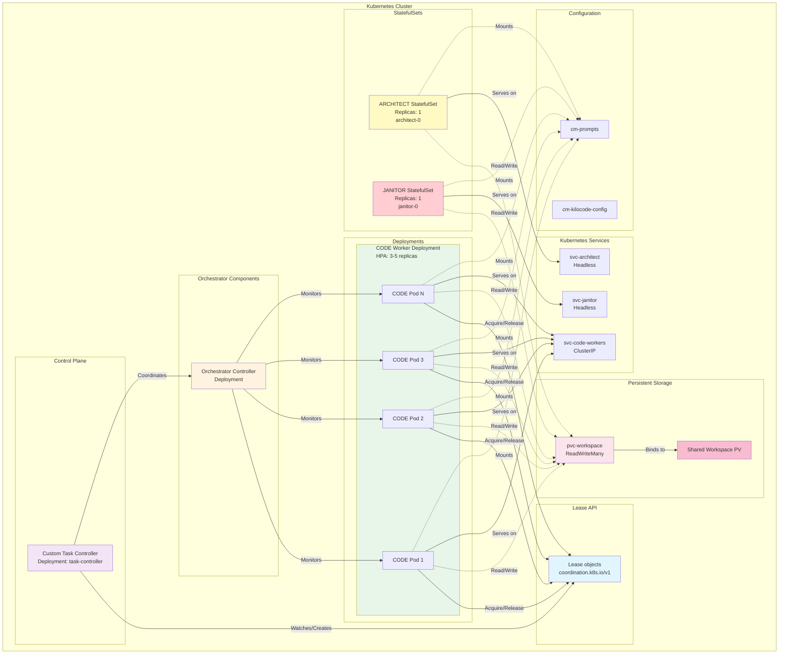
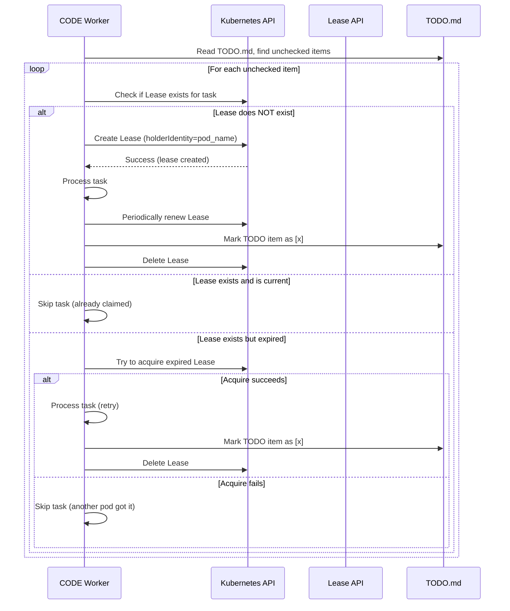
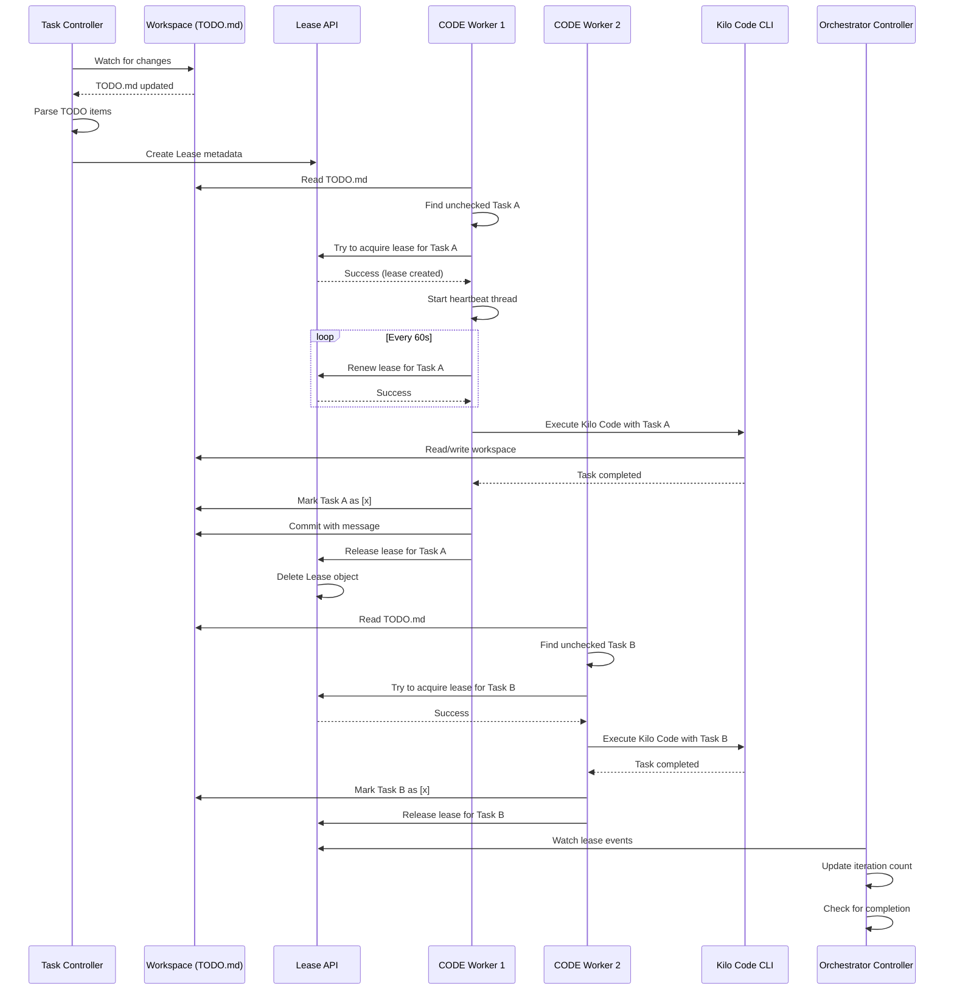
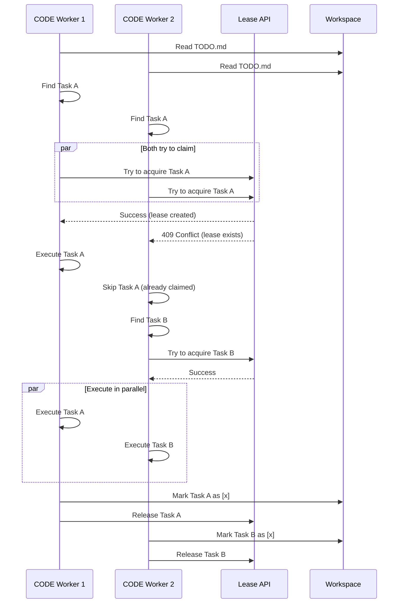
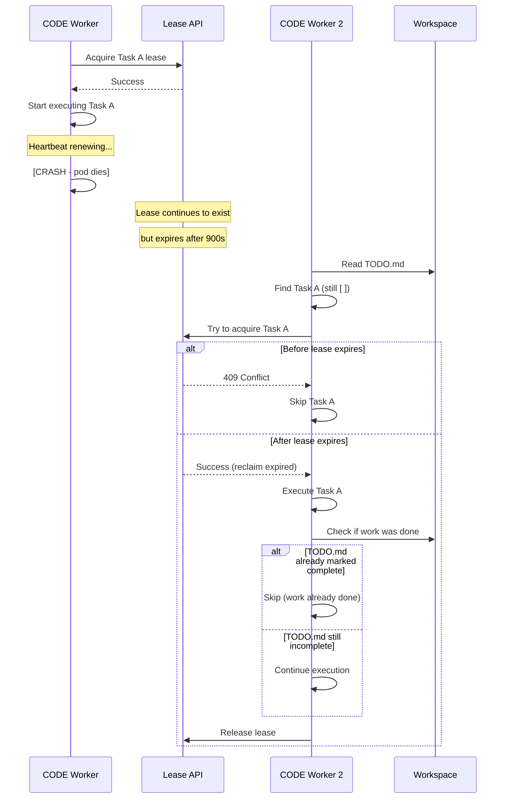
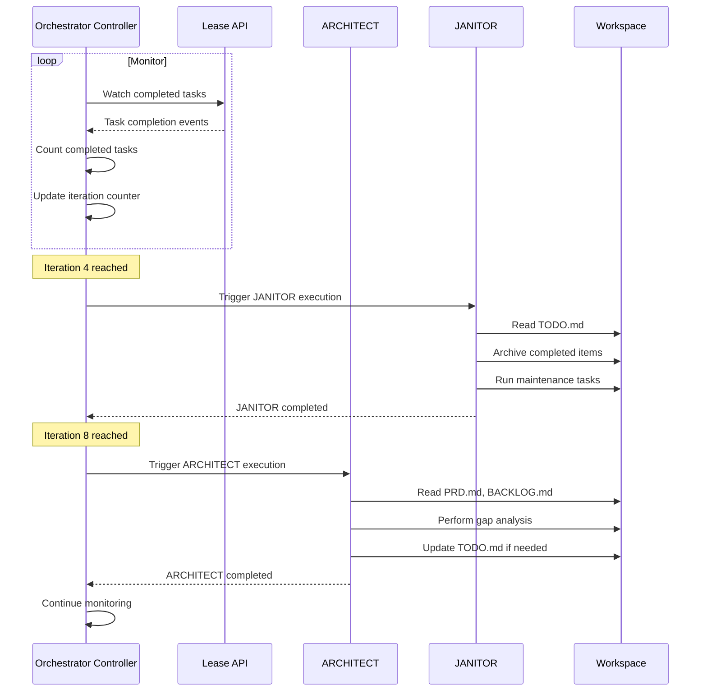
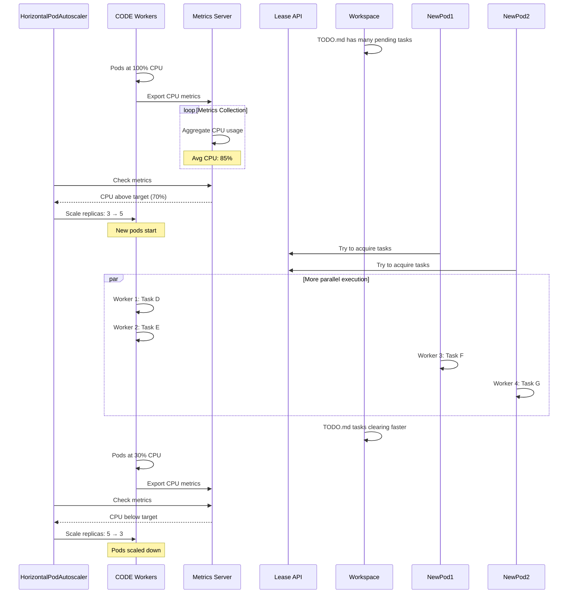

# Kubernetes/Orchestration Based Architecture for Parallel Agent Execution

## Approach 3: Kubernetes/Orchestration Architecture

**Version:** 1.0  
**Date:** 2026-02-06  
**Author:** Architecture Design Document

---

## Executive Summary

This document describes a Kubernetes-based architecture that enables parallel execution of AI agents using native Kubernetes orchestration primitives. The architecture leverages Kubernetes' built-in features for pod orchestration, service discovery, configuration management, and resource scheduling to create a production-ready, scalable system where multiple CODE agents work in parallel on different tasks while ARCHITECT and JANITOR agents coordinate the overall workflow.

### Key Decisions

| Decision | Choice | Rationale |
|----------|--------|-----------|
| Pod Orchestration | **Deployments + StatefulSets** | Deployments for stateless workers, StatefulSets for stateful components |
| Service Discovery | **Kubernetes Services (ClusterIP + Headless)** | Native service discovery with DNS resolution |
| Configuration | **ConfigMaps + Secrets** | Kubernetes-native configuration management |
| Workload Management | **Custom Controller + Lease API** | Leverage Kubernetes Lease API for deconfliction, custom controller for task orchestration |
| Task Granularity | **Entire TODO item** | Aligns with current orchestration model, maintains task coherence |
| Parallelism | **3-5 CODE agents** (HPA scalable) | Balanced resource utilization, horizontal scaling via HPA |
| Deconfliction | **Kubernetes Lease API (coordination.k8s.io)** | Native distributed coordination, handles crashes gracefully |
| Priority | **Production readiness & scalability** | Leverages battle-tested Kubernetes primitives, minimal custom logic |

---

## 1. High-Level Architecture

### 1.1 Architecture Overview

```
┌─────────────────────────────────────────────────────────────────────────────────────────────┐
│                              Kubernetes Cluster (k8s cluster)                               │
├─────────────────────────────────────────────────────────────────────────────────────────────┤
│                                                                                             │
│  ┌─────────────────────────────────────────────────────────────────────────────────────┐   │
│  │                    Custom Task Controller (Pod)                                      │   │
│  │  - Watches workspace for task changes                                                 │   │
│  │  - Creates/updates Lease objects for task tracking                                    │   │
│  │  - Coordinates CODE worker scaling                                                    │   │
│  │  - Monitors agent health                                                              │   │
│  └─────────────────────────────────────────────────────────────────────────────────────┘   │
│                                                                                             │
│  ┌─────────────────────────────────────────────────────────────────────────────────────┐   │
│  │                          Kubernetes Lease API                                        │   │
│  │  - Task coordination and deconfliction                                               │   │
│  │  - Leader election for ARCHITECT/JANITOR triggers                                   │   │
│  └─────────────────────────────────────────────────────────────────────────────────────┘   │
│                                                                                             │
│      ┌───────────────────────────────────┐    ┌──────────────────────────────────────┐    │
│      │   CODE Worker Deployment (HPA)    │    │   ARCHITECT StatefulSet             │    │
│      │   - ReplicaCount: 3 (auto-scaled) │    │   - Replicas: 1                     │    │
│      │   - 3-5 parallel workers          │    │   - Stable network identity         │    │
│      └───────────────────────────────────┘    └──────────────────────────────────────┘    │
│                                                                                             │
│      ┌───────────────────────────────────┐    ┌──────────────────────────────────────┐    │
│      │   JANITOR StatefulSet             │    │   Orchestrator Controller           │    │
│      │   - Replicas: 1                   │    │   - Monitors task progress          │    │
│      │   - Stable network identity       │    │   - Triggers ARCHITECT/JANITOR       │    │
│      └───────────────────────────────────┘    └──────────────────────────────────────┘    │
│                                                                                             │
│  ┌─────────────────────────────────────────────────────────────────────────────────────┐   │
│  │                         Kubernetes Services (DNS-based)                             │   │
│  │  - svc-code-workers (ClusterIP, multi-port)                                        │   │
│  │  - svc-architect (Headless)                                                        │   │
│  │  - svc-janitor (Headless)                                                          │   │
│  └─────────────────────────────────────────────────────────────────────────────────────┘   │
│                                                                                             │
│  ┌─────────────────────────────────────────────────────────────────────────────────────┐   │
│  │                   ConfigMaps & Secrets (Configuration)                               │   │
│  │  - cm-prompts (agent prompts mounted as files)                                     │   │
│  │  - cm-kilocode-config (Kilo Code CLI configuration)                                │   │
│  │  - secret-kilocode-creds (optional Kilo Code credentials)                           │   │
│  └─────────────────────────────────────────────────────────────────────────────────────┘   │
│                                                                                             │
│  ┌─────────────────────────────────────────────────────────────────────────────────────┐   │
│  │                   PersistentVolumes & PersistentVolumeClaims                        │   │
│  │  - pvc-workspace (ReadWriteMany - shared workspace)                                │   │
│  │  - pvc-state (ReadWriteOnce - per-pod state if needed)                              │   │
│  └─────────────────────────────────────────────────────────────────────────────────────┘   │
│                                                                                             │
└─────────────────────────────────────────────────────────────────────────────────────────────┘
                                       │
                                       │ Volume Mounts
                                       ▼
                          ┌─────────────────────────────────────┐
                          │         Shared Workspace PV         │
                          │  - /workspace (ReadWriteMany)         │
                          │  - TODO.md, ARCHITECTURE.md         │
                          │  - PRD.md, state files               │
                          └─────────────────────────────────────┘
```

### 1.2 Mermaid Architecture Diagram



### 1.3 Component Summary

| Component | K8s Resource | Primary Function | Count | Scaling |
|-----------|--------------|-------------------|-------|---------|
| Task Controller | Deployment | Task orchestration, lease management | 1 | N/A |
| CODE Workers | Deployment + HPA | Process TODO items in parallel | 3-5 | HPA (CPU/Task Queue) |
| ARCHITECT | StatefulSet | Periodic architecture review | 1 | Fixed |
| JANITOR | StatefulSet | Repository maintenance | 1 | Fixed |
| Orchestrator Controller | Deployment | Workflow coordination, agent triggering | 1 | N/A |
| Services | Service | Inter-pod communication | 3 | N/A |
| ConfigMaps | ConfigMap | Configuration & prompts | 2 | N/A |
| Workspace PVC | PersistentVolumeClaim | Shared workspace storage | 1 | N/A |

---

## 2. Kubernetes Resource Definitions

### 2.1 Namespace

```yaml
# namespace.yaml
apiVersion: v1
kind: Namespace
metadata:
  name: agent-system
  labels:
    app: agent-orchestration
    version: v1
```

### 2.2 ConfigMaps

#### 2.2.1 Agent Prompts ConfigMap

```yaml
# configmap-prompts.yaml
apiVersion: v1
kind: ConfigMap
metadata:
  name: cm-prompts
  namespace: agent-system
  labels:
    app: agent-system
    component: prompts
data:
  # CODE Agent Prompt (renamed from PROMPT)
  CODE.md: |
    # CODE.md
    
    You are an **orchestrator agent**. You do NOT write code directly. Your job is to
    plan, decompose, delegate to code-mode subagents, verify results, and maintain
    project state.
    
    ## Your Role vs. Subagent Roles
    
    | You (Orchestrator) | Code Subagents |
    |---|---|
    | Read PRD, maintain TODO.md | Write code, run tests |
    | Decompose tasks into subtasks | Execute exactly ONE subtask |
    | Verify subagent output | Report back success/failure |
    | Update project state files | Never modify TODO.md |
    | Make architectural decisions | Follow instructions precisely |
    
    ---
    
    ## Phase Detection
    
    First, examine the repository to determine what phase you're in:
    
    1. **BOOTSTRAP** (only PRD.md exists, no src/, no package.json):
       - Delegate scaffolding to a subagent with explicit instructions
       - Create TODO.md with implementation tasks derived from the PRD
       - Create ARCHITECTURE.md with key decisions
    
    2. **IMPLEMENTATION** (TODO.md has unchecked items):
       - Pick the next unchecked task from TODO.md
       - Decompose it into atomic subtasks
       - Delegate each subtask to a code subagent sequentially
       - Verify each subtask before moving to the next
       - Mark the parent task complete when all subtasks pass
    
    3. **VERIFICATION** (all TODO.md items checked):
       - Delegate a full test suite run to a subagent
       - Review results for gaps vs PRD
       - If gaps found, add new TODO items and continue
       - If complete, create a .done file
    
    ---
    
    ## Task Decomposition Protocol
    
    When you pick a task from TODO.md, you MUST decompose it before delegating.
    
    ### Decomposition Rules
    
    1. **Each subtask must be a single, atomic code change** — one file, one concern.
    2. **Each subtask must be independently verifiable** — it either compiles, passes a
       test, or produces a visible output.
    3. **Subtasks must be ordered** — later subtasks can depend on earlier ones.
    4. **Include verification criteria** — tell the subagent how to prove it worked.
    5. **Include context** — the subagent has no memory of previous subtasks. Always
       include relevant file paths, function signatures, and type definitions.
    
    ---
    
    ## Rules
    
    - **STRICT: Single Task Enforcement.** Complete exactly ONE parent item from TODO.md
      per session (which may involve multiple subtask delegations).
    - **Session Termination:** Once you have committed and checked a box in TODO.md,
      you MUST STOP.
    - **Always commit your work** before the session ends.
    - **Never write code yourself.** All code changes go through subagents.
    - **If blocked**, document the blocker in BLOCKERS.md and move to next task.
    - **Provide full context** in every subagent delegation. Assume the subagent knows
      nothing about this project beyond what you tell it.
    
    ## Communication
    
    ### 1. Check Inbox (Start of Session)
    
    Before taking action, check `comms/inbox/` for any files.
    - Read responses and integrate into your plan or ARCHITECTURE.md.
    - Move processed files to `comms/archive/`.
    - Update TODO.md if new information unblocks a task.
    
    ## Learnings
    
    After each session, append discoveries to LEARNINGS.md:
    - Gotchas encountered
    - Patterns that work in this codebase
    - Decisions made and why
    
    ## Task Sizing (for TODO.md creation)
    
    Each TODO.md item should be:
    - Decomposable into 2–5 subtasks
    - Completable (with all subtasks) in under 15 minutes
    - Focused on a single feature or concern
    
    ## Commit Convention
    
    Use conventional commits: `feat:`, `fix:`, `chore:`, `docs:`
    
    ## Completion Check
    
    The project is complete when:
    1. All TODO.md items are checked
    2. All tests pass
    3. The app builds successfully
    4. Core PRD requirements have corresponding implementations
    
    If complete, create `.done` with a summary of what was built.

  ARCHITECT.md: |
    # ARCHITECT.md
    
    You are the Lead Architect. You run periodically to ensure the project is on track.
    You do NOT write code. You plan. Each task should be delegated to a subagent.
    
    ## The Golden Rule
    **NEVER MODIFY `PRD.md`.** It is the immutable source of truth.
    
    ## Session Protocol (Idempotency)
    
    This prompt may be interrupted by timeouts. You MUST follow this protocol to ensure
    work can be resumed across multiple sessions.
    
    ### On Session Start
    1. **Check for continuation:** Look for `.architect_in_progress` marker file
    2. **If marker exists:** Read `ARCHITECT_STATE.md` to see what was completed and resume from there
    3. **If no marker:** Create `.architect_in_progress` and start fresh
    
    ### During Session
    - After completing each major task, update `ARCHITECT_STATE.md` with your progress
    - Commit progress incrementally: `git commit -m "chore(architect): completed [task name]"`
    
    ### On Session End
    
    **If ALL tasks complete:**
    1. Delete `.architect_in_progress` marker
    2. Delete `ARCHITECT_STATE.md`
    3. Commit: `chore(architect): session complete`
    
    **If session ends with work remaining (timeout/interrupt):**
    1. **Keep** `.architect_in_progress` marker (do NOT delete)
    2. **Update** `ARCHITECT_STATE.md` with current state (see format below)
    3. Commit: `chore(architect): session partial - will continue`
    
    ## Your Tasks
    
    Work through these tasks **in order**. Update `ARCHITECT_STATE.md` after each one.
    
    ### Task 1: Gap Analysis & Sprint Planning
    - Read `PRD.md` (Requirements) and `BACKLOG.md` (Future Work)
    - Compare to `TODO.md` (Current Sprint) and `src/` (Reality)
    - **New Requirements:** If requirements in the PRD are missing from both `TODO` and `BACKLOG`, add them to `BACKLOG.md`
    - **Refinement:** If items in `BACKLOG.md` are vague, break them down into smaller, atomic tasks
    - ✅ Mark complete in `ARCHITECT_STATE.md` when done
    
    ### Task 2: Sprint Management (The Gatekeeper)
    - **Check Status:** Look for a file named `.sprint_complete`
    - **IF `.sprint_complete` EXISTS:**
      - The previous sprint works and builds successfully
      - Move the *next* logical group of tasks from `BACKLOG.md` to `TODO.md` (Start Sprint N+1)
      - **Delete** `.sprint_complete` to reset the gate
    - **IF `.sprint_complete` DOES NOT EXIST:**
      - Focus only on the current `TODO.md`
      - Do NOT move new items from `BACKLOG` to `TODO`
      - Ensure the final task in `TODO.md` is the "Sprint QA" task
    - ✅ Mark complete in `ARCHITECT_STATE.md` when done
    
    ### Task 3: Blocker Review
    - Read `BLOCKERS.md`
    - If you can solve a blocker by making an architectural decision, write the solution in `ARCHITECTURE.md` and remove the blocker
    - ✅ Mark complete in `ARCHITECT_STATE.md` when done
    
    ### Task 4: Communication
    - If the PRD is ambiguous or impossible to implement, write a specific question to `comms/outbox/` for the user to answer
    - ✅ Mark complete in `ARCHITECT_STATE.md` when done
    
    ### Task 5: Cleanup (Final Task)
    - Delete `.architect_in_progress` marker
    - Delete `ARCHITECT_STATE.md`
    - Commit final state
    - ✅ Session complete
    
    ## Execution Rules
    - **Focus:** You are the bridge between the PRD and the TODO list
    - **Output:** Your main output is a high-quality `TODO.md` (current work) and `BACKLOG.md` (future work)
    - **Time Awareness:** You have ~15 minutes. If running low on time, commit your progress and update `ARCHITECT_STATE.md`

  JANITOR.md: |
    # JANITOR.md
    
    You are the Repository Maintainer. You do NOT write feature code. 
    Your job is to ensure the repository is clean and the TODO list reflects reality.
    Each task should be delegated to a subagent.
    
    ## The Golden Rule
    **NEVER MODIFY `PRD.md`.** It is the immutable source of truth.
    
    ## Your Tasks
    1. **Archive Completed Work:** - Check `TODO.md` for completed items (marked `[x]`).
       - **MOVE** these lines from `TODO.md` to `COMPLETED.md`.
       - Append them under a header with the current date (e.g., `## [YYYY-MM-DD]`).
       - *Goal:* Keep `TODO.md` strictly focused on *remaining* active work.
    
    2. **Flag Drift:** Compare `src/` against `PRD.md`. 
       - If the code implements something *not* in the PRD, create a `TODO` item: "refactor: Remove unrequested feature X".
       - If the code contradicts the PRD, create a `TODO` item: "fix: Align feature Y with PRD requirements".
    
    3. **Clean File Structure:** Identify unused files, empty directories, or temp files and delete them.
    
    4. **Documentation Sync:** Update `ARCHITECTURE.md` or inline code comments to match the current implementation.
    
    5. **Test Health:** Run the test suite (`npm test` or equivalent).
       - If tests fail, check if the failure is from a recent commit.
       - If so, add a TODO: "fix: Failing test in [file] from commit [hash]"
       - This ensures broken tests don't accumulate.
    
    ## Execution Rules
    - **READ-ONLY:** `PRD.md`.
    - **WRITE:** `TODO.md`, `COMPLETED.md`, `ARCHITECTURE.md`, `src/**/*.md` (docs only), file deletion.
    - **Commit Prefix:** Use `chore:`, `docs:`, or `refactor:`.
    - **Stop Condition:** Perform one significant cleanup task, then stop.
```

#### 2.2.2 Kilo Code Configuration ConfigMap

```yaml
# configmap-kilocode-config.yaml
apiVersion: v1
kind: ConfigMap
metadata:
  name: cm-kilocode-config
  namespace: agent-system
  labels:
    app: agent-system
    component: config
data:
  # Common configuration for all agents
  KILOCODE_TIMEOUT: "900"
  KILOCODE_MODE: "orchestrator"
  KILOCODE_AUTO: "true"
  
  # Workspace configuration
  WORKSPACE_PATH: "/workspace"
  
  # Loop configuration
  LOOP_TYPE: "development"
  
  # Agent intervals (in iterations)
  ARCHITECT_INTERVAL: "8"
  JANITOR_INTERVAL: "4"
  
  # CODE worker configuration
  WORKER_HEARTBEAT_INTERVAL_MS: "30000"
  WORKER_TASK_TIMEOUT_MS: "960000"  # 16 minutes (allow time for Kilo Code timeout)
  
  # Status check interval
  STATUS_CHECK_INTERVAL_MS: "10000"
```

### 2.3 PersistentVolume and PersistentVolumeClaim

```yaml
# persistentvolume.yaml
apiVersion: v1
kind: PersistentVolume
metadata:
  name: pv-workspace
  labels:
    app: agent-system
    type: local
spec:
  storageClassName: manual
  capacity:
    storage: 10Gi
  accessModes:
    - ReadWriteMany
  persistentVolumeReclaimPolicy: Retain
  hostPath:
    path: /mnt/data/workspace
  # For cloud providers, use appropriate storage class instead:
  # storageClassName: standard
  # For AWS EFS, Azure Files, or GKE Filestore

---

# persistentvolumeclaim.yaml
apiVersion: v1
kind: PersistentVolumeClaim
metadata:
  name: pvc-workspace
  namespace: agent-system
  labels:
    app: agent-system
    component: storage
spec:
  accessModes:
    - ReadWriteMany
  storageClassName: manual  # Or cloud provider storage class
  resources:
    requests:
      storage: 10Gi
```

### 2.4 Services

```yaml
# services.yaml
apiVersion: v1
kind: Service
metadata:
  name: svc-code-workers
  namespace: agent-system
  labels:
    app: agent-system
    component: code-workers
spec:
  type: ClusterIP
  selector:
    app: agent-system
    component: code-worker
  ports:
    - name: status
      port: 8080
      targetPort: 8080
      protocol: TCP
    - name: metrics
      port: 9090
      targetPort: 9090
      protocol: TCP
---
apiVersion: v1
kind: Service
metadata:
  name: svc-architect
  namespace: agent-system
  labels:
    app: agent-system
    component: architect
spec:
  type: ClusterIP
  clusterIP: None  # Headless service for StatefulSet
  selector:
    app: agent-system
    component: architect
  ports:
    - name: status
      port: 8080
      targetPort: 8080
      protocol: TCP
---
apiVersion: v1
kind: Service
metadata:
  name: svc-janitor
  namespace: agent-system
  labels:
    app: agent-system
    component: janitor
spec:
  type: ClusterIP
  clusterIP: None  # Headless service for StatefulSet
  selector:
    app: agent-system
    component: janitor
  ports:
    - name: status
      port: 8080
      targetPort: 8080
      protocol: TCP
```

### 2.5 CODE Worker Deployment with HPA

```yaml
# deployment-code-workers.yaml
apiVersion: apps/v1
kind: Deployment
metadata:
  name: deployment-code-workers
  namespace: agent-system
  labels:
    app: agent-system
    component: code-workers
spec:
  replicas: 3  # Initial replica count
  selector:
    matchLabels:
      app: agent-system
      component: code-worker
  template:
    metadata:
      labels:
        app: agent-system
        component: code-worker
    spec:
      # Use service account for RBAC (if needed)
      serviceAccountName: sa-code-worker
      
      # Restart policy for pods
      restartPolicy: Always
      
      # Affinity rules for better scheduling
      affinity:
        podAntiAffinity:
          preferredDuringSchedulingIgnoredDuringExecution:
            - weight: 100
              podAffinityTerm:
                labelSelector:
                  matchLabels:
                    app: agent-system
                    component: code-worker
                topologyKey: kubernetes.io/hostname
      
      containers:
        - name: code-worker
          image: agent-system/code-worker:latest
          imagePullPolicy: IfNotPresent
          
          # Resource requests and limits
          resources:
            requests:
              cpu: "500m"
              memory: "512Mi"
            limits:
              cpu: "2000m"
              memory: "2Gi"
          
          # Environment variables from ConfigMap
          envFrom:
            - configMapRef:
                name: cm-kilocode-config
          env:
            - name: AGENT_TYPE
              value: "CODE"
            - name: WORKER_ID
              valueFrom:
                fieldRef:
                  fieldPath: metadata.name
            - name: POD_IP
              valueFrom:
                fieldRef:
                  fieldPath: status.podIP
            - name: PROMPT_PATH
              value: "/prompts/CODE.md"
            - name: POD_NAMESPACE
              valueFrom:
                fieldRef:
                  fieldPath: metadata.namespace
            - name: LEASE_NAMESPACE
              valueFrom:
                fieldRef:
                  fieldPath: metadata.namespace
            
          # Volume mounts
          volumeMounts:
            - name: workspace-volume
              mountPath: /workspace
            - name: prompts-volume
              mountPath: /prompts
              readOnly: true
            - name: tmp-volume
              mountPath: /tmp
            
          # Liveness probe - restart pod if unhealthy
          livenessProbe:
            httpGet:
              path: /health/live
              port: 8080
            initialDelaySeconds: 30
            periodSeconds: 30
            timeoutSeconds: 5
            failureThreshold: 3
          
          # Readiness probe - mark pod ready to receive tasks
          readinessProbe:
            httpGet:
              path: /health/ready
              port: 8080
            initialDelaySeconds: 10
            periodSeconds: 10
            timeoutSeconds: 3
            failureThreshold: 3
          
          # Startup probe - give more time for slow startup
          startupProbe:
            httpGet:
              path: /health/startup
              port: 8080
            initialDelaySeconds: 0
            periodSeconds: 10
            timeoutSeconds: 3
            failureThreshold: 30  # Up to 5 minutes for startup
      
      volumes:
        - name: workspace-volume
          persistentVolumeClaim:
            claimName: pvc-workspace
        - name: prompts-volume
          configMap:
            name: cm-prompts
        - name: tmp-volume
          emptyDir: {}

---
# HorizontalPodAutoscaler for CODE Workers
apiVersion: autoscaling/v2
kind: HorizontalPodAutoscaler
metadata:
  name: hpa-code-workers
  namespace: agent-system
  labels:
    app: agent-system
    component: code-workers
spec:
  scaleTargetRef:
    apiVersion: apps/v1
    kind: Deployment
    name: deployment-code-workers
  minReplicas: 3
  maxReplicas: 10
  metrics:
    - type: Resource
      resource:
        name: cpu
        target:
          type: Utilization
          averageUtilization: 70
    - type: Resource
      resource:
        name: memory
        target:
          type: Utilization
          averageUtilization: 80
  behavior:
    scaleUp:
      stabilizationWindowSeconds: 60
      policies:
        - type: Percent
          value: 100
          periodSeconds: 60
        - type: Pods
          value: 2
          periodSeconds: 60
      selectPolicy: Max
    scaleDown:
      stabilizationWindowSeconds: 300
      policies:
        - type: Percent
          value: 50
          periodSeconds: 120
      selectPolicy: Min
```

### 2.6 ARCHITECT StatefulSet

```yaml
# statefulset-architect.yaml
apiVersion: apps/v1
kind: StatefulSet
metadata:
  name: statefulset-architect
  namespace: agent-system
  labels:
    app: agent-system
    component: architect
spec:
  serviceName: svc-architect
  replicas: 1
  selector:
    matchLabels:
      app: agent-system
      component: architect
  template:
    metadata:
      labels:
        app: agent-system
        component: architect
    spec:
      serviceAccountName: sa-architect
      restartPolicy: Always
      
      containers:
        - name: architect
          image: agent-system/agent-worker:latest
          imagePullPolicy: IfNotPresent
          
          resources:
            requests:
              cpu: "500m"
              memory: "512Mi"
            limits:
              cpu: "1000m"
              memory: "1Gi"
          
          envFrom:
            - configMapRef:
                name: cm-kilocode-config
          env:
            - name: AGENT_TYPE
              value: "ARCHITECT"
            - name: POD_NAME
              valueFrom:
                fieldRef:
                  fieldPath: metadata.name
            - name: PROMPT_PATH
              value: "/prompts/ARCHITECT.md"
            - name: LEASE_NAMESPACE
              valueFrom:
                fieldRef:
                  fieldPath: metadata.namespace
          
          volumeMounts:
            - name: workspace-volume
              mountPath: /workspace
            - name: prompts-volume
              mountPath: /prompts
              readOnly: true
            - name: architect-state-volume
              mountPath: /state
          
          livenessProbe:
            httpGet:
              path: /health/live
              port: 8080
            initialDelaySeconds: 30
            periodSeconds: 60
            timeoutSeconds: 5
            failureThreshold: 3
          
          readinessProbe:
            httpGet:
              path: /health/ready
              port: 8080
            initialDelaySeconds: 15
            periodSeconds: 15
            timeoutSeconds: 3
            failureThreshold: 3
      
      volumes:
        - name: workspace-volume
          persistentVolumeClaim:
            claimName: pvc-workspace
        - name: prompts-volume
          configMap:
            name: cm-prompts
  
  volumeClaimTemplates:
    - metadata:
        name: architect-state-volume
      spec:
        accessModes: ["ReadWriteOnce"]
        storageClassName: standard  # Use default storage class
        resources:
          requests:
            storage: 1Gi
```

### 2.7 JANITOR StatefulSet

```yaml
# statefulset-janitor.yaml
apiVersion: apps/v1
kind: StatefulSet
metadata:
  name: statefulset-janitor
  namespace: agent-system
  labels:
    app: agent-system
    component: janitor
spec:
  serviceName: svc-janitor
  replicas: 1
  selector:
    matchLabels:
      app: agent-system
      component: janitor
  template:
    metadata:
      labels:
        app: agent-system
        component: janitor
    spec:
      serviceAccountName: sa-janitor
      restartPolicy: Always
      
      containers:
        - name: janitor
          image: agent-system/agent-worker:latest
          imagePullPolicy: IfNotPresent
          
          resources:
            requests:
              cpu: "250m"
              memory: "256Mi"
            limits:
              cpu: "500m"
              memory: "512Mi"
          
          envFrom:
            - configMapRef:
                name: cm-kilocode-config
          env:
            - name: AGENT_TYPE
              value: "JANITOR"
            - name: POD_NAME
              valueFrom:
                fieldRef:
                  fieldPath: metadata.name
            - name: PROMPT_PATH
              value: "/prompts/JANITOR.md"
            - name: LEASE_NAMESPACE
              valueFrom:
                fieldRef:
                  fieldPath: metadata.namespace
          
          volumeMounts:
            - name: workspace-volume
              mountPath: /workspace
            - name: prompts-volume
              mountPath: /prompts
              readOnly: true
            - name: janitor-state-volume
              mountPath: /state
          
          livenessProbe:
            httpGet:
              path: /health/live
              port: 8080
            initialDelaySeconds: 30
            periodSeconds: 60
            timeoutSeconds: 5
            failureThreshold: 3
          
          readinessProbe:
            httpGet:
              path: /health/ready
              port: 8080
            initialDelaySeconds: 15
            periodSeconds: 15
            timeoutSeconds: 3
            failureThreshold: 3
      
      volumes:
        - name: workspace-volume
          persistentVolumeClaim:
            claimName: pvc-workspace
        - name: prompts-volume
          configMap:
            name: cm-prompts
  
  volumeClaimTemplates:
    - metadata:
        name: janitor-state-volume
      spec:
        accessModes: ["ReadWriteOnce"]
        storageClassName: standard
        resources:
          requests:
            storage: 1Gi
```

### 2.8 Orchestrator Controller Deployment

```yaml
# deployment-orchestrator-controller.yaml
apiVersion: apps/v1
kind: Deployment
metadata:
  name: deployment-orchestrator-controller
  namespace: agent-system
  labels:
    app: agent-system
    component: orchestrator-controller
spec:
  replicas: 1
  selector:
    matchLabels:
      app: agent-system
      component: orchestrator-controller
  template:
    metadata:
      labels:
        app: agent-system
        component: orchestrator-controller
    spec:
      serviceAccountName: sa-orchestrator-controller
      restartPolicy: Always
      
      containers:
        - name: orchestrator-controller
          image: agent-system/orchestrator-controller:latest
          imagePullPolicy: IfNotPresent
          
          resources:
            requests:
              cpu: "250m"
              memory: "256Mi"
            limits:
              cpu: "500m"
              memory: "512Mi"
          
          envFrom:
            - configMapRef:
                name: cm-kilocode-config
          env:
            - name: LEASE_NAMESPACE
              valueFrom:
                fieldRef:
                  fieldPath: metadata.namespace
            
          volumeMounts:
            - name: workspace-volume
              mountPath: /workspace
          
          livenessProbe:
            httpGet:
              path: /health/live
              port: 8080
            initialDelaySeconds: 30
            periodSeconds: 60
            failureThreshold: 3
          
          readinessProbe:
            httpGet:
              path: /health/ready
              port: 8080
            initialDelaySeconds: 10
            periodSeconds: 10
            failureThreshold: 3
      
      volumes:
        - name: workspace-volume
          persistentVolumeClaim:
            claimName: pvc-workspace
```

### 2.9 Custom Task Controller Deployment

```yaml
# deployment-task-controller.yaml
apiVersion: apps/v1
kind: Deployment
metadata:
  name: deployment-task-controller
  namespace: agent-system
  labels:
    app: agent-system
    component: task-controller
spec:
  replicas: 1
  selector:
    matchLabels:
      app: agent-system
      component: task-controller
  template:
    metadata:
      labels:
      - app: agent-system
        component: task-controller
    spec:
      serviceAccountName: sa-task-controller
      restartPolicy: Always
      
      containers:
        - name: task-controller
          image: agent-system/task-controller:latest
          imagePullPolicy: IfNotPresent
          
          resources:
            requests:
              cpu: "100m"
              memory: "128Mi"
            limits:
              cpu: "500m"
              memory: "256Mi"
          
          env:
            - name: LEASE_NAMESPACE
              valueFrom:
                fieldRef:
                  fieldPath: metadata.namespace
            - name: WORKSPACE_PATH
              value: "/workspace"
            - name: LEASE_DURATION_SECONDS
              value: "900"
            - name: RESYNC_INTERVAL_SECONDS
              value: "30"
          
          volumeMounts:
            - name: workspace-volume
              mountPath: /workspace
          
          livenessProbe:
            httpGet:
              path: /health/live
              port: 8080
            initialDelaySeconds: 30
            periodSeconds: 60
            failureThreshold: 3
          
          readinessProbe:
            httpGet:
              path: /health/ready
              port: 8080
            initialDelaySeconds: 10
            periodSeconds: 10
            failureThreshold: 3
      
      volumes:
        - name: workspace-volume
          persistentVolumeClaim:
            claimName: pvc-workspace
```

### 2.10 Service Accounts and RBAC

```yaml
# serviceaccounts.yaml
apiVersion: v1
kind: ServiceAccount
metadata:
  name: sa-code-worker
  namespace: agent-system
---
apiVersion: v1
kind: ServiceAccount
metadata:
  name: sa-architect
  namespace: agent-system
---
apiVersion: v1
kind: ServiceAccount
metadata:
  name: sa-janitor
  namespace: agent-system
---
apiVersion: v1
kind: ServiceAccount
metadata:
  name: sa-orchestrator-controller
  namespace: agent-system
---
apiVersion: v1
kind: ServiceAccount
metadata:
  name: sa-task-controller
  namespace: agent-system

---
# rbac.yaml
apiVersion: rbac.authorization.k8s.io/v1
kind: Role
metadata:
  name: role-lease-access
  namespace: agent-system
rules:
  - apiGroups: ["coordination.k8s.io"]
    resources: ["leases"]
    verbs: ["get", "list", "watch", "create", "update", "patch", "delete"]
---
apiVersion: rbac.authorization.k8s.io/v1
kind: RoleBinding
metadata:
  name: rb-code-worker-leases
  namespace: agent-system
subjects:
  - kind: ServiceAccount
    name: sa-code-worker
roleRef:
  kind: Role
  name: role-lease-access
  apiGroup: rbac.authorization.k8s.io
---
apiVersion: rbac.authorization.k8s.io/v1
kind: RoleBinding
metadata:
  name: rb-architect-leases
  namespace: agent-system
subjects:
  - kind: ServiceAccount
    name: sa-architect
roleRef:
  kind: Role
  name: role-lease-access
  apiGroup: rbac.authorization.k8s.io
---
apiVersion: rbac.authorization.k8s.io/v1
kind: RoleBinding
metadata:
  name: rb-janitor-leases
  namespace: agent-system
subjects:
  - kind: ServiceAccount
    name: sa-janitor
roleRef:
  kind: Role
  name: role-lease-access
  apiGroup: rbac.authorization.k8s.io
---
apiVersion: rbac.authorization.k8s.io/v1
kind: RoleBinding
metadata:
  name: rb-orchestrator-controller-leases
  namespace: agent-system
subjects:
  - kind: ServiceAccount
    name: sa-orchestrator-controller
roleRef:
  kind: Role
  name: role-lease-access
  apiGroup: rbac.authorization.k8s.io
---
apiVersion: rbac.authorization.k8s.io/v1
kind: RoleBinding
metadata:
  name: rb-task-controller-leases
  namespace: agent-system
subjects:
  - kind: ServiceAccount
    name: sa-task-controller
roleRef:
  kind: Role
  name: role-lease-access
  apiGroup: rbac.authorization.k8s.io
```

---

## 3. Deconfliction Strategy Using Kubernetes Lease API

### 3.1 Overview

The Kubernetes Lease API ([`coordination.k8s.io/v1`](https://kubernetes.io/docs/reference/kubernetes-api/cluster-resources/lease-v1/)) provides a lightweight mechanism for distributed coordination and leader election. We use it to implement a robust deconfliction strategy that:

1. Prevents multiple CODE workers from taking the same TODO item
2. Handles pod crashes gracefully (leases automatically expire)
3. Supports task timeouts and reassignment
4. Allows monitoring of task state via Kubernetes-native tools

### 3.2 Lease Object Structure

Each TODO item has a corresponding Lease object:

```yaml
apiVersion: coordination.k8s.io/v1
kind: Lease
metadata:
  name: task-<uuid-v4>  # Unique task ID
  namespace: agent-system
  labels:
    app: agent-system
    task-type: "todo-item"
spec:
  holderIdentity: "deployment-code-workers-7abc8d9e-1234"  # Pod name
  leaseDurationSeconds: 900  # 15 minutes
  acquireTime: "2026-02-06T20:00:00.000Z"
  renewTime: "2026-02-06T20:05:00.000Z"
  leaseTransitions: 1
```

### 3.3 Deconfliction Flow



### 3.4 Pseudocode for Lease-based Task Claiming

```python
import time
from kubernetes import client, config

class TaskLeaseManager:
    def __init__(self, pod_name, namespace, lease_duration=900):
        self.pod_name = pod_name
        self.namespace = namespace
        self.lease_duration = lease_duration
        config.load_incluster_config()
        self.coordination_api = client.CoordinationV1Api()
    
    def claim_task(self, task_id):
        """
        Attempt to claim a task using a Lease object.
        Returns True if claimed successfully, False otherwise.
        """
        lease_name = f"task-{task_id}"
        
        # Check if lease already exists
        try:
            existing_lease = self.coordination_api.read_namespaced_lease(
                name=lease_name,
                namespace=self.namespace
            )
            
            # Check if lease is expired
            if self._is_lease_expired(existing_lease):
                # Try to acquire expired lease
                return self._try_acquire_lease(lease_name)
            else:
                # Another pod holds the lease
                return False
                
        except client.exceptions.ApiException as e:
            if e.status == 404:
                # Lease doesn't exist, create it
                return self._create_lease(lease_name)
            else:
                raise
    
    def _create_lease(self, lease_name):
        """Create a new Lease for the task."""
        now = time.time()
        lease = client.V1Lease(
            metadata=client.V1ObjectMeta(
                name=lease_name,
                namespace=self.namespace,
                labels={
                    "app": "agent-system",
                    "task-type": "todo-item",
                    "task-id": lease_name.replace("task-", "")
                }
            ),
            spec=client.V1LeaseSpec(
                holder_identity=self.pod_name,
                lease_duration_seconds=self.lease_duration,
                acquire_time=now,
                renew_time=now,
                lease_transitions=0
            )
        )
        self.coordination_api.create_namespaced_lease(
            namespace=self.namespace,
            body=lease
        )
        return True
    
    def _try_acquire_lease(self, lease_name):
        """Try to acquire an expired lease using optimistic concurrency."""
        try:
            existing_lease = self.coordination_api.read_namespaced_lease(
                name=lease_name,
                namespace=self.namespace
            )
            
            # Update with our identity
            now = time.time()
            existing_lease.spec.holder_identity = self.pod_name
            existing_lease.spec.acquire_time = now
            existing_lease.spec.renew_time = now
            existing_lease.spec.lease_transitions = (
                existing_lease.spec.lease_transitions + 1
            )
            
            self.coordination_api.replace_namespaced_lease(
                name=lease_name,
                namespace=self.namespace,
                body=existing_lease
            )
            return True
            
        except client.exceptions.ApiException as e:
            if e.status == 409:
                # Conflict - another pod acquired it first
                return False
            raise
    
    def renew_lease(self, task_id):
        """Renew the lease for a task being processed."""
        lease_name = f"task-{task_id}"
        try:
            lease = self.coordination_api.read_namespaced_lease(
                name=lease_name,
                namespace=self.namespace
            )
            
            # Only renew if we're still the holder
            if lease.spec.holder_identity == self.pod_name:
                lease.spec.renew_time = time.time()
                self.coordination_api.replace_namespaced_lease(
                    name=lease_name,
                    namespace=self.namespace,
                    body=lease
                )
                return True
            return False
        except client.exceptions.ApiException:
            return False
    
    def release_lease(self, task_id):
        """Release the lease after task completion."""
        lease_name = f"task-{task_id}"
        try:
            self.coordination_api.delete_namespaced_lease(
                name=lease_name,
                namespace=self.namespace
            )
        except client.exceptions.ApiException:
            pass  # Lease may already be deleted
    
    def _is_lease_expired(self, lease):
        """Check if a lease has expired."""
        if not lease.spec.renew_time:
            return True
        
        now = time.time()
        renew_time = lease.spec.renew_time
        return now > (renew_time + lease.spec.lease_duration_seconds)


# Worker main loop pseudocode
def code_worker_main():
    pod_name = os.environ["POD_NAME"]
    namespace = os.environ["LEASE_NAMESPACE"]
    lease_manager = TaskLeaseManager(pod_name, namespace)
    
    while True:
        # Read TODO.md from workspace
        todo_items = read_todo_md("/workspace/TODO.md")
        
        for item in todo_items:
            if item["checked"]:
                continue  # Skip completed items
            
            # Generate task ID from item content (hash or uuid)
            task_id = generate_task_id(item["text"])
            
            # Try to claim the task
            if lease_manager.claim_task(task_id):
                # Success - we own this task
                
                # Start heartbeat thread to renew lease
                heartbeat = Thread(target=renew_lease_thread, 
                                  args=(lease_manager, task_id))
                heartbeat.start()
                
                try:
                    # Execute task (run Kilo Code)
                    execute_task(item["text"])
                    
                    # Mark TODO item as complete
                    mark_todo_item_complete(task_id)
                    
                finally:
                    # Clean up
                    heartbeat.stop()
                    lease_manager.release_lease(task_id)
```

### 3.5 Handling Edge Cases

#### 3.5.1 Pod Crash During Task Execution

If a CODE pod crashes while holding a task lease:
1. The lease expires after `leaseDurationSeconds` (default: 900s)
2. Other workers can then claim the expired lease
3. The workspace state (TODO.md) reflects whether work was actually done
4. Workers verify TODO.md state before processing

#### 3.5.2 Multiple Pods Attempting Same Task

Kubernetes API server's optimistic concurrency ensures only one pod succeeds:
```python
# Multiple pods read the same lease
lease = api.read_namespaced_lease(name, namespace)

# Both try to update with their identity
lease.spec.holder_identity = self.pod_name
api.replace_namespaced_lease(name, namespace, lease)

# First pod succeeds, second gets 409 Conflict
```

#### 3.5.3 Long-Running Tasks

For tasks that exceed the default lease duration:
1. Worker must periodically renew the lease via heartbeat
2. If heartbeat fails (pod crash, network partition), lease expires
3. Task becomes available for other workers

### 3.6 Monitoring Lease State

Use standard Kubernetes tools to monitor task allocation:

```bash
# List all task leases
kubectl get leases -n agent-system -l task-type=todo-item

# Show detailed lease info
kubectl describe lease task-uuid-v4 -n agent-system

# Watch lease changes
kubectl get leases -n agent-system -l task-type=todo-item -w

# Find tasks held by specific worker
kubectl get leases -n agent-system -l task-type=todo-item \
  -o jsonpath='{.items[?(@.spec.holderIdentity=="pod-name")].metadata.name}'
```

---

## 4. Component Descriptions

### 4.1 Custom Task Controller

**Purpose:** A Kubernetes controller that watches the workspace for changes, manages task leases, and coordinates the overall task execution lifecycle.

**Responsibilities:**
1. Watch workspace directory for TODO.md changes
2. Parse TODO.md and create task metadata
3. Manage Lease objects for each task
4. Monitor CODE worker pod health and readiness
5. Trigger ARCHITECT/JANITOR at appropriate intervals
6. Collect and aggregate task status metrics
7. Handle pod restarts and lease cleanup

**Implementation:** Custom Kubernetes controller using client-go or similar library. Runs as a Deployment for high availability.

**Key Functions:**
- `reconcileTodoTasks()`: Synchronize TODO.md with Lease objects
- `watchWorkspace()`: File watcher for workspace changes
- `monitorWorkers()`: Health checks for CODE workers
- `triggerAgent(agentType)`: Trigger ARCHITECT/JANITOR execution
- `collectMetrics()`: Gather and export metrics for observability

### 4.2 CODE Worker Deployment

**Purpose:** Stateless worker pods that execute TODO items using Kilo Code. Multiple pods run in parallel, each claiming tasks via Lease API.

**Responsibilities:**
1. Read TODO.md from shared workspace
2. Claim tasks using Kubernetes Lease API
3. Execute tasks using Kilo Code CLI
4. Periodically renew task leases (heartbeat)
5. Update TODO.md with completion status
6. Commit work with conventional commit messages
7. Expose HTTP endpoints for health/liveness/readiness

**Environment Variables:**
- `AGENT_TYPE`: Set to "CODE"
- `WORKER_ID`: Auto-generated from pod name
- `POD_IP`: Pod's IP address
- `PROMPT_PATH`: Path to CODE.md prompt
- `LEASE_NAMESPACE`: Namespace for Lease objects
- `WORKSPACE_PATH`: Path to workspace volume
- `KILOCODE_TIMEOUT`: Kilo Code CLI timeout in seconds

**Ports:**
- 8080: HTTP health/status endpoints
- 9090: Prometheus metrics endpoint

### 4.3 ARCHITECT StatefulSet

**Purpose:** Stateful pod that runs periodic architecture reviews, gap analysis, and sprint management. Runs every 8 iterations.

**Responsibilities:**
1. Execute ARCHITECT.md prompt at scheduled intervals
2. Support continuation via `.architect_in_progress` marker
3. Maintain state in dedicated PVC
4. Read/write ARCHITECTURE.md, BACKLOG.md
5. Manage sprint transitions via `.sprint_complete`
6. Write ARCHITECT_STATE.md for idempotency

**Why StatefulSet?**
- Stable network identity (`architect-0`)
- Dedicated persistent storage for state
- Ordered, graceful deployment and scaling
- Predictable DNS name for other components

### 4.4 JANITOR StatefulSet

**Purpose:** Stateful pod that runs repository maintenance every 4 iterations. Cleans up completed TODOs, identifies drift, removes unused files.

**Responsibilities:**
1. Execute JANITOR.md prompt at scheduled intervals
2. Archive completed items to COMPLETED.md
3. Identify code drift from PRD
4. Clean unused files and directories
5. Update documentation to match implementation
6. Run test health checks
7. Maintain state in dedicated PVC

**Why StatefulSet?**
- Same benefits as ARCHITECT
- Stable identity for orchestration controller
- Dedicated storage for any state files

### 4.5 Orchestrator Controller

**Purpose:** Central coordinator that monitors overall progress, handles agent scheduling, and manages workflow state.

**Responsibilities:**
1. Monitor Lease objects for task status
2. Track completed tasks and iteration count
3. Trigger ARCHITECT at iteration % 8 == 0
4. Trigger JANITOR at iteration % 4 == 0
5. Check for completion conditions (`.done` file)
6. Aggregate results and logs
7. Export Prometheus metrics
8. Handle workflow state transitions

**Interaction with Task Controller:**
- Task Controller manages task-level operations (leases, parsing)
- Orchestrator Controller manages workflow-level operations (scheduling, triggers)
- Both coordinate via shared Lease objects and workspace state

### 4.6 Kubernetes Services

**svc-code-workers** (ClusterIP):
- Provides stable DNS endpoint for CODE worker deployment
- Load balances across all CODE worker pods
- Used by Orchestrator Controller for health checks
- Port 8080: Health/status endpoints

**svc-architect** (Headless):
- Provides direct DNS resolution to ARCHITECT pod
- Used for direct communication when needed
- DNS: `architect-0.svc-architect.agent-system.svc.cluster.local`

**svc-janitor** (Headless):
- Same pattern as ARCHITECT service
- DNS: `janitor-0.svc-janitor.agent-system.svc.cluster.local`

---

## 5. Message Flow Sequences

### 5.1 Normal Task Execution Flow



### 5.2 Deconfliction Flow



### 5.3 Pod Crash Recovery Flow



### 5.4 ARCHITECT/JANITOR Trigger Flow



### 5.5 Scaling Flow (HPA)



---

## 6. Pod and Container Specifications

### 6.1 CODE Worker Pod Specification

**Pod Template:**
```yaml
apiVersion: v1
kind: Pod
metadata:
  name: code-worker-7abc8d9e-1234
  namespace: agent-system
  labels:
    app: agent-system
    component: code-worker
spec:
  # Node selector for scheduling (optional)
  nodeSelector:
    agent-type: worker
  
  # Toleration for worker nodes (optional)
  tolerations:
    - key: "agent-workload"
      operator: "Equal"
      value: "true"
      effect: "NoSchedule"
  
  # Restart policy
  restartPolicy: Always
  
  # Init containers (if needed for setup)
  initContainers:
    - name: init-workspace
      image: busybox:1.35
      command: ['sh', '-c', 'mkdir -p /workspace/tmp']
      volumeMounts:
        - name: workspace-volume
          mountPath: /workspace
  
  # Main container
  containers:
    - name: code-worker
      image: agent-system/code-worker:latest
      
      # Image pull policy
      imagePullPolicy: IfNotPresent
      
      # Resources
      resources:
        requests:
          cpu: "500m"
          memory: "512Mi"
        limits:
          cpu: "2000m"
          memory: "2Gi"
      
      # Command and args
      command: ["/usr/local/bin/node"]
      args: ["/app/worker.js"]
      
      # Environment variables
      envFrom:
        - configMapRef:
            name: cm-kilocode-config
      env:
        - name: AGENT_TYPE
          value: "CODE"
        - name: WORKER_ID
          valueFrom:
            fieldRef:
              fieldPath: metadata.name
        - name: POD_IP
          valueFrom:
            fieldRef:
              fieldPath: status.podIP
        - name: POD_NAME
          valueFrom:
            fieldRef:
              fieldPath: metadata.name
        - name: NODE_NAME
          valueFrom:
            fieldRef:
              fieldPath: spec.nodeName
        - name: PROMPT_PATH
          value: "/prompts/CODE.md"
        - name: LEASE_NAMESPACE
          valueFrom:
            fieldRef:
              fieldPath: metadata.namespace
        - name: KILOCODE_PATH
          value: "/usr/local/bin/kilocode"
        - name: GIT_AUTHOR_NAME
          value: "CODE Agent"
        - name: GIT_AUTHOR_EMAIL
          value: "code-agent@agent-system.local"
      
      # Volume mounts
      volumeMounts:
        - name: workspace-volume
          mountPath: /workspace
        - name: prompts-volume
          mountPath: /prompts
          readOnly: true
        - name: tmp-volume
          mountPath: /tmp
        - name: git-config-volume
          mountPath: /etc/git
          readOnly: true
      
      # Ports
      ports:
        - name: http-status
          containerPort: 8080
          protocol: TCP
        - name: http-metrics
          containerPort: 9090
          protocol: TCP
      
      # Probes
      livenessProbe:
        httpGet:
          path: /health/live
          port: 8080
        initialDelaySeconds: 30
        periodSeconds: 30
        timeoutSeconds: 5
        failureThreshold: 3
      
      readinessProbe:
        httpGet:
          path: /health/ready
          port: 8080
        initialDelaySeconds: 10
        periodSeconds: 10
        timeoutSeconds: 3
        failureThreshold: 3
      
      startupProbe:
        httpGet:
          path: /health/startup
          port: 8080
        initialDelaySeconds: 0
        periodSeconds: 10
        timeoutSeconds: 3
        failureThreshold: 30
      
      # Security context
      securityContext:
        runAsNonRoot: true
        runAsUser: 1000
        allowPrivilegeEscalation: false
        readOnlyRootFilesystem: true
        capabilities:
          drop:
            - ALL
  
  # Volumes
  volumes:
    - name: workspace-volume
      persistentVolumeClaim:
        claimName: pvc-workspace
    - name: prompts-volume
      configMap:
        name: cm-prompts
    - name: tmp-volume
      emptyDir:
        sizeLimit: "1Gi"
    - name: git-config-volume
      configMap:
        name: cm-git-config
  
  # DNS policy
  dnsPolicy: ClusterFirst
  
  # Termination grace period
  terminationGracePeriodSeconds: 60
  
  # Priority class
  priorityClassName: medium-priority
```

### 6.2 ARCHITECT StatefulSet Pod Specification

```yaml
apiVersion: v1
kind: Pod
metadata:
  name: architect-0
  namespace: agent-system
  labels:
    app: agent-system
    component: architect
spec:
  # StatefulSet-specific
  hostname: architect
  subdomain: svc-architect
  
  restartPolicy: Always
  
  containers:
    - name: architect
      image: agent-system/agent-worker:latest
      
      resources:
        requests:
          cpu: "500m"
          memory: "512Mi"
        limits:
          cpu: "1000m"
          memory: "1Gi"
      
      command: ["/usr/local/bin/node"]
      args: ["/app/agent.js"]
      
      envFrom:
        - configMapRef:
            name: cm-kilocode-config
      env:
        - name: AGENT_TYPE
          value: "ARCHITECT"
        - name: POD_NAME
          valueFrom:
            fieldRef:
              fieldPath: metadata.name
        - name: PROMPT_PATH
          value: "/prompts/ARCHITECT.md"
        - name: LEASE_NAMESPACE
          valueFrom:
            fieldRef:
              fieldPath: metadata.namespace
        - name: STATE_PATH
          value: "/state"
      
      volumeMounts:
        - name: workspace-volume
          mountPath: /workspace
        - name: prompts-volume
          mountPath: /prompts
          readOnly: true
        - name: architect-state-volume
          mountPath: /state
      
      ports:
        - name: http-status
          containerPort: 8080
          protocol: TCP
      
      livenessProbe:
        httpGet:
          path: /health/live
          port: 8080
        initialDelaySeconds: 30
        periodSeconds: 60
        timeoutSeconds: 5
        failureThreshold: 3
      
      readinessProbe:
        httpGet:
          path: /health/ready
          port: 8080
        initialDelaySeconds: 15
        periodSeconds: 15
        timeoutSeconds: 3
        failureThreshold: 3
      
      securityContext:
        runAsNonRoot: true
        runAsUser: 1000
  
  volumes:
    - name: workspace-volume
      persistentVolumeClaim:
        claimName: pvc-workspace
    - name: prompts-volume
      configMap:
        name: cm-prompts
```

### 6.3 Container Image Specifications

**CODE Worker Image (`Dockerfile.code-worker`):**
```dockerfile
FROM node:18-alpine

# Install dependencies
RUN apk add --no-cache \
    git \
    openssh-client \
    bash

# Install Kilo Code CLI
# Assume kilocode binary is available or copy from build stage
COPY kilocode /usr/local/bin/kilocode
RUN chmod +x /usr/local/bin/kilocode

# Create app directory
WORKDIR /app

# Copy application code
COPY package*.json ./
RUN npm ci --only=production

COPY worker.js ./

# Create non-root user
RUN addgroup -g 1000 agent && \
    adduser -D -u 1000 -G agent agent
RUN chown -R agent:agent /app

USER agent

# Expose ports
EXPOSE 8080 9090

# Health check
HEALTHCHECK --interval=30s --timeout=5s --start-period=30s --retries=3 \
    CMD wget --no-verbose --tries=1 --spider http://localhost:8080/health/live || exit 1

# Run the worker
ENTRYPOINT ["/usr/local/bin/node", "/app/worker.js"]
```

**Agent Worker Image (`Dockerfile.agent-worker`)** - Used for ARCHITECT/JANITOR:
```dockerfile
FROM node:18-alpine

RUN apk add --no-cache \
    git \
    openssh-client \
    bash

COPY kilocode /usr/local/bin/kilocode
RUN chmod +x /usr/local/bin/kilocode

WORKDIR /app

COPY package*.json ./
RUN npm ci --only=production

COPY agent.js ./

RUN addgroup -g 1000 agent && \
    adduser -D -u 1000 -G agent agent
RUN chown -R agent:agent /app

USER agent

EXPOSE 8080

HEALTHCHECK --interval=60s --timeout=5s --start-period=30s --retries=3 \
    CMD wget --no-verbose --tries=1 --spider http://localhost:8080/health/live || exit 1

ENTRYPOINT ["/usr/local/bin/node", "/app/agent.js"]
```

---

## 7. Scaling Strategy

### 7.1 HorizontalPodAutoscaler (HPA) Configuration

The CODE worker deployment uses HPA to automatically scale based on CPU/memory utilization:

```yaml
apiVersion: autoscaling/v2
kind: HorizontalPodAutoscaler
metadata:
  name: hpa-code-workers
  namespace: agent-system
spec:
  scaleTargetRef:
    apiVersion: apps/v1
    kind: Deployment
    name: deployment-code-workers
  minReplicas: 3
  maxReplicas: 10
  metrics:
    - type: Resource
      resource:
        name: cpu
        target:
          type: Utilization
          averageUtilization: 70
    - type: Resource
      resource:
        name: memory
        target:
          type: Utilization
          averageUtilization: 80
  behavior:
    scaleUp:
      stabilizationWindowSeconds: 60
      policies:
        - type: Percent
          value: 100
          periodSeconds: 60
        - type: Pods
          value: 2
          periodSeconds: 60
      selectPolicy: Max
    scaleDown:
      stabilizationWindowSeconds: 300
      policies:
        - type: Percent
          value: 50
          periodSeconds: 120
      selectPolicy: Min
```

### 7.2 Custom Scaling Based on Task Queue

For more intelligent scaling, a custom metrics adapter can be implemented:

```yaml
apiVersion: autoscaling/v2
kind: HorizontalPodAutoscaler
metadata:
  name: hpa-code-workers-custom
  namespace: agent-system
spec:
  scaleTargetRef:
    apiVersion: apps/v1
    kind: Deployment
    name: deployment-code-workers
  minReplicas: 3
  maxReplicas: 20
  metrics:
    - type: Pods
      pods:
        metric:
          name: active_tasks
        target:
          type: AverageValue
          averageValue: "2"  # Scale to maintain ~2 active tasks per pod
```

The custom controller exposes a metric `active_tasks` for each CODE worker pod, representing the number of tasks currently being processed.

### 7.3 Scaling Behavior Summary

| Metric | Scale Up Trigger | Scale Down Trigger | Notes |
|--------|------------------|-------------------|-------|
| CPU Utilization | > 70% | < 50% | Default HPA metric |
| Memory Utilization | > 80% | < 60% | Prevent OOM kills |
| Active Tasks per Pod | > 2 | < 1 | Custom metric (optional) |
| Pending Tasks | High queue | Low queue | Custom metric (optional) |

### 7.4 Node-Level Scaling (Cluster Autoscaler)

For cloud deployments, enable the Kubernetes Cluster Autoscaler:

```yaml
# Example node pool configuration (cloud provider specific)
apiVersion: cluster.k8s.io/v1beta1
kind: MachineDeployment
metadata:
  name: worker-pool
spec:
  replicas: 2
  minReplicas: 2
  maxReplicas: 10
  template:
    spec:
      providerSpec:
        value:
          # Cloud provider specific node configuration
          instanceType: "n2-standard-4"
          diskSizeGB: 100
```

---

## 8. Persistent Storage Strategy

### 8.1 Workspace Storage (ReadWriteMany)

The workspace is shared across all agent pods:

```yaml
apiVersion: v1
kind: PersistentVolume
metadata:
  name: pv-workspace
spec:
  storageClassName: manual
  capacity:
    storage: 10Gi
  accessModes:
    - ReadWriteMany
  persistentVolumeReclaimPolicy: Retain
  # For local development (hostPath)
  hostPath:
    path: /mnt/data/workspace
  # For production, use cloud provider-specific storage:
  # AWS: EFS CSI driver
  # Azure: Azure Files
  # GKE: Filestore or Cloud Storage FUSE
```

### 8.2 Agent State Storage (ReadWriteOnce)

Each agent (ARCHITECT, JANITOR) has dedicated state storage:

```yaml
# Part of StatefulSet volumeClaimTemplates
volumeClaimTemplates:
  - metadata:
        name: architect-state-volume
      spec:
        accessModes: ["ReadWriteOnce"]
        storageClassName: standard
        resources:
          requests:
            storage: 1Gi
```

### 8.3 Cloud Provider Storage Options

| Cloud Provider | ReadWriteMany Solution | Notes |
|----------------|------------------------|-------|
| AWS | EFS CSI Driver | Fully managed, scalable file storage |
| GCP | Filestore or GCS FUSE | Filestore for performance, GCS for cost |
| Azure | Azure Files | Native SMB protocol support |
| On-prem | NFS / CIFS | Requires infrastructure setup |
| Local | hostPath (development only) | Not production-ready |

### 8.4 Backup and Recovery Strategy

**Backup Strategy:**
1. **Regular snapshots** of workspace PV (cloud provider snapshots)
2. **Git repository** as primary source of truth for code
3. **Periodic backups** of state PVs (ARCHITECT, JANITOR)

**Recovery Procedure:**
```bash
# 1. Restore from snapshot (cloud provider specific)
kubectl create -f pv-workspace-restored.yaml

# 2. Delete existing PVC
kubectl delete pvc pvc-workspace -n agent-system

# 3. Recreate PVC pointing to restored PV
kubectl create -f persistentvolumeclaim.yaml

# 4. Verify workspace integrity
kubectl exec -it deployment-code-workers-xxx -n agent-system -- \
  ls -la /workspace
```

---

## 9. Resource Management

### 9.1 Resource Requests and Limits

```yaml
# CODE Worker (per pod)
resources:
  requests:
    cpu: "500m"      # 0.5 CPU cores
    memory: "512Mi"  # 512 MB RAM
  limits:
    cpu: "2000m"     # 2.0 CPU cores max
    memory: "2Gi"    # 2 GB RAM max

# ARCHITECT
resources:
  requests:
    cpu: "500m"
    memory: "512Mi"
  limits:
    cpu: "1000m"
    memory: "1Gi"

# JANITOR
resources:
  requests:
    cpu: "250m"
    memory: "256Mi"
  limits:
    cpu: "500m"
    memory: "512Mi"

# Task Controller
resources:
  requests:
    cpu: "100m"
    memory: "128Mi"
  limits:
    cpu: "500m"
    memory: "256Mi"

# Orchestrator Controller
resources:
  requests:
    cpu: "250m"
    memory: "256Mi"
  limits:
    cpu: "500m"
    memory: "512Mi"
```

### 9.2 Total Resource Calculation (3 CODE Workers)

| Component | Replicas | CPU Request | CPU Limit | Memory Request | Memory Limit |
|-----------|----------|-------------|-----------|----------------|-------------|
| CODE Workers | 3 | 1500m | 6000m | 1.5Gi | 6Gi |
| ARCHITECT | 1 | 500m | 1000m | 512Mi | 1Gi |
| JANITOR | 1 | 250m | 500m | 256Mi | 512Mi |
| Task Controller | 1 | 100m | 500m | 128Mi | 256Mi |
| Orchestrator Controller | 1 | 250m | 500m | 256Mi | 512Mi |
| **Total** | - | **2600m (2.6 cores)** | **8500m (8.5 cores)** | **2.65Gi** | **8.25Gi** |

### 9.3 Node Capacity Planning

For 3 CODE workers + supporting components:
- **Minimum:** 1 node with 4 CPU cores, 16GB RAM
- **Recommended:** 2-3 nodes for high availability, spread across availability zones
- **Maximum (10 CODE workers):** ~9 CPU cores, 24GB RAM

---

## 10. Pros and Cons Analysis

### 10.1 Pros of Kubernetes/Orchestration Approach

| Aspect | Benefits |
|--------|----------|
| **Production Readiness** | Battle-tested orchestration platform used by major enterprises |
| **Built-in Features** | Service discovery, load balancing, health checks, auto-restart, rolling updates |
| **Scalability** | Horizontal scaling via HPA, vertical scaling via resource limits |
| **Resource Management** | Fine-grained CPU/memory control, quotas, limits, requests |
| **Self-Healing** | Automatic pod restart, node failure recovery |
| **Declarative Configuration** | GitOps-friendly, reproducible deployments |
| **Extensibility** | Custom controllers, CRDs, webhooks, operators |
| **Observability** | Native integration with Prometheus, Grafana, Loki |
| **Multi-Cloud** | Cloud-agnostic, runs on AWS, GCP, Azure, on-prem |
| **Ecosystem** | Large ecosystem of tools, charts, operators |
| **Deconfliction** | Native Lease API for distributed coordination |
| **Security** | RBAC, NetworkPolicies, PodSecurityPolicies |
| **Traffic Management** | Ingress controllers, service mesh support |
| **Storage Flexibility** | Support for multiple storage backends |

### 10.2 Cons of Kubernetes/Orchestration Approach

| Aspect | Drawbacks |
|--------|-----------|
| **Complexity** | Steep learning curve, many concepts to understand |
| **Setup Overhead** | Cluster setup, configuration, maintenance required |
| **Resource Overhead** | Control plane resources, etcd, kube-proxy overhead |
| **Development Complexity** | More complex than simple message queue approach |
| **Debugging** | Distributed debugging, pod logs, network issues |
| **Cost** | Managed cluster costs (EKS, GKE, AKS) or operational overhead for self-managed |
| **Operational Burden** | Cluster upgrades, security patches, monitoring |
| **Latency** | Additional network hops via services |
| **Stateful Complexity** | StatefulSets have their own complexity |
| **Learning Curve** | Understanding pods, services, ingress, RBAC, etc. |

### 10.3 Comparison Summary

| Aspect | Message Queue | gRPC/Microservices | Kubernetes |
|--------|---------------|-------------------|------------|
| **Complexity** | Low | Medium | High |
| **Setup Time** | Fast | Medium | Slow |
| **Scalability** | Good | Excellent | Excellent |
| **Production Ready** | Good | Very Good | Excellent |
| **Resource Efficiency** | High | High | Medium (control plane overhead) |
| **Observability** | Medium | Good | Excellent |
| **Self-Healing** | Manual | Custom | Built-in |
| **Multi-Cloud** | Excellent | Good | Excellent |
| **Learning Curve** | Low | Medium | High |
| **Best For** | Simple setups | Custom communication | Production deployments |

---

## 11. Deployment Checklist

### 11.1 Prerequisites

- [ ] Kubernetes cluster (v1.24+ recommended)
- [ ] kubectl configured with cluster access
- [ ] Container registry access (Docker Hub, ECR, GCR, etc.)
- [ ] ReadWriteMany storage class configured
- [ ] Kilo Code CLI built into container images

### 11.2 Deployment Steps

1. **Create namespace:**
   ```bash
   kubectl apply -f namespace.yaml
   ```

2. **Create ConfigMaps:**
   ```bash
   kubectl apply -f configmap-prompts.yaml
   kubectl apply -f configmap-kilocode-config.yaml
   ```

3. **Create persistent storage:**
   ```bash
   kubectl apply -f persistentvolume.yaml
   kubectl apply -f persistentvolumeclaim.yaml
   ```

4. **Create ServiceAccounts and RBAC:**
   ```bash
   kubectl apply -f serviceaccounts.yaml
   kubectl apply -f rbac.yaml
   ```

5. **Create Services:**
   ```bash
   kubectl apply -f services.yaml
   ```

6. **Deploy controllers:**
   ```bash
   kubectl apply -f deployment-task-controller.yaml
   kubectl apply -f deployment-orchestrator-controller.yaml
   ```

7. **Deploy StatefulSets (ARCHITECT, JANITOR):**
   ```bash
   kubectl apply -f statefulset-architect.yaml
   kubectl apply -f statefulset-janitor.yaml
   ```

8. **Deploy CODE Workers:**
   ```bash
   kubectl apply -f deployment-code-workers.yaml
   kubectl apply -f hpa-code-workers.yaml
   ```

9. **Verify deployment:**
   ```bash
   kubectl get all -n agent-system
   kubectl get leases -n agent-system
   kubectl get pvc -n agent-system
   ```

### 11.3 Validation

```bash
# Check pod status
kubectl get pods -n agent-system

# Check pod logs
kubectl logs -f deployment-code-workers-xxx -n agent-system

# Check lease objects
kubectl get leases -n agent-system -l task-type=todo-item

# Check HPA status
kubectl get hpa -n agent-system

# Describe a pod
kubectl describe pod architect-0 -n agent-system
```

---

## 12. Monitoring and Observability

### 12.1 Prometheus Metrics

**CODE Worker Metrics:**
- `code_worker_tasks_claimed_total`: Total tasks claimed
- `code_worker_tasks_completed_total`: Total tasks completed
- `code_worker_tasks_failed_total`: Total tasks failed
- `code_worker_tasks_active`: Currently active tasks
- `code_worker_kilocode_duration_seconds`: Kilo Code execution duration
- `code_worker_lease_renewals_total`: Lease renewal count

**Controller Metrics:**
- `task_controller_todo_items_total`: Total TODO items
- `task_controller_tasks_pending`: Pending tasks in queue
- `orchestrator_controller_iteration_total`: Total iterations
- `orchestrator_controller_architect_runs_total`: ARCHITECT runs
- `orchestrator_controller_janitor_runs_total`: JANITOR runs

### 12.2 Logging

**Structured logging format:**
```json
{
  "timestamp": "2026-02-06T20:00:00.000Z",
  "level": "info",
  "component": "code-worker",
  "pod": "deployment-code-workers-7abc8d9e-1234",
  "worker_id": "deployment-code-workers-7abc8d9e-1234",
  "task_id": "uuid-v4",
  "message": "Task claimed successfully",
  "lease_duration": 900
}
```

**Log aggregation:**
- Use Loki/Fluentd/Elastic Stack for log aggregation
- Ship logs to central location for analysis
- Enable structured JSON logging

### 12.3 Alerts

**Alertmanager alerts:**
```yaml
groups:
  - name: agent-system
    rules:
      - alert: HighTaskFailureRate
        expr: rate(code_worker_tasks_failed_total[5m]) > 0.1
        for: 5m
        labels:
          severity: warning
        annotations:
          summary: "High task failure rate detected"
      
      - alert: StuckTasks
        expr: code_worker_tasks_active > 0 for 15m
        for: 15m
        labels:
          severity: critical
        annotations:
          summary: "Tasks stuck for more than 15 minutes"
      
      - alert: HPAAtMaxReplicas
        expr: kube_hpa_status_current_replicas == kube_hpa_spec_max_replicas
        for: 10m
        labels:
          severity: warning
        annotations:
          summary: "CODE workers at maximum replicas"
```

---

## 13. Security Considerations

### 13.1 RBAC Configuration

- Principle of least privilege for ServiceAccounts
- Use RoleBindings scoped to specific namespaces
- Regularly audit RBAC policies

### 13.2 Pod Security

- Use `runAsNonRoot: true`
- Drop unnecessary capabilities
- Use `readOnlyRootFilesystem: true` where possible
- Enable PodSecurityPolicies or Pod Security Standards

### 13.3 Network Policies

```yaml
apiVersion: networking.k8s.io/v1
kind: NetworkPolicy
metadata:
  name: agent-system-network-policy
  namespace: agent-system
spec:
  podSelector: {}
  policyTypes:
    - Ingress
    - Egress
  ingress:
    - from:
        - namespaceSelector: {}
      ports:
        - protocol: TCP
          port: 8080
  egress:
    - to:
        - namespaceSelector: {}
      ports:
        - protocol: TCP
          port: 443  # For Kilo Code external calls
    - to:
        - namespaceSelector: {}
      ports:
        - protocol: TCP
          port: 6379  # For any Redis dependencies (if used)
```

### 13.4 Secrets Management

- Use Kubernetes Secrets for sensitive data
- Consider external secrets management (HashiCorp Vault, AWS Secrets Manager)
- Enable secret encryption at rest (etcd encryption)

---

## 14. Conclusion

This Kubernetes-based architecture provides a production-ready, scalable solution for parallel agent execution. By leveraging native Kubernetes primitives like:

- **Deployments and StatefulSets** for pod orchestration
- **Services** for service discovery
- **ConfigMaps and Secrets** for configuration management
- **Lease API** for distributed coordination and deconfliction
- **HPA** for automatic scaling
- **PersistentVolumes** for shared workspace storage

The system achieves:

1. **Parallel Execution:** Multiple CODE workers processing TODO items simultaneously
2. **Task Deconfliction:** Lease API ensures no duplicate work
3. **Self-Healing:** Automatic pod restart and recovery
4. **Scalability:** Horizontal scaling via HPA
5. **Observability:** Native metrics and logging
6. **Production Ready:** Battle-tested Kubernetes platform

The tradeoff is increased complexity compared to simpler approaches (message queue, gRPC), but the benefits in terms of production readiness, scalability, and ecosystem support make this an excellent choice for long-term, production deployments of the agent orchestration system.
