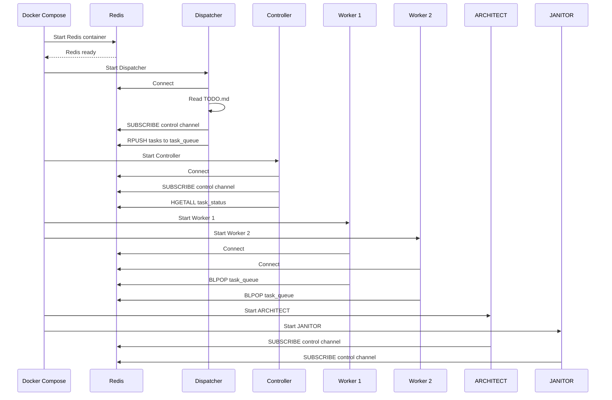
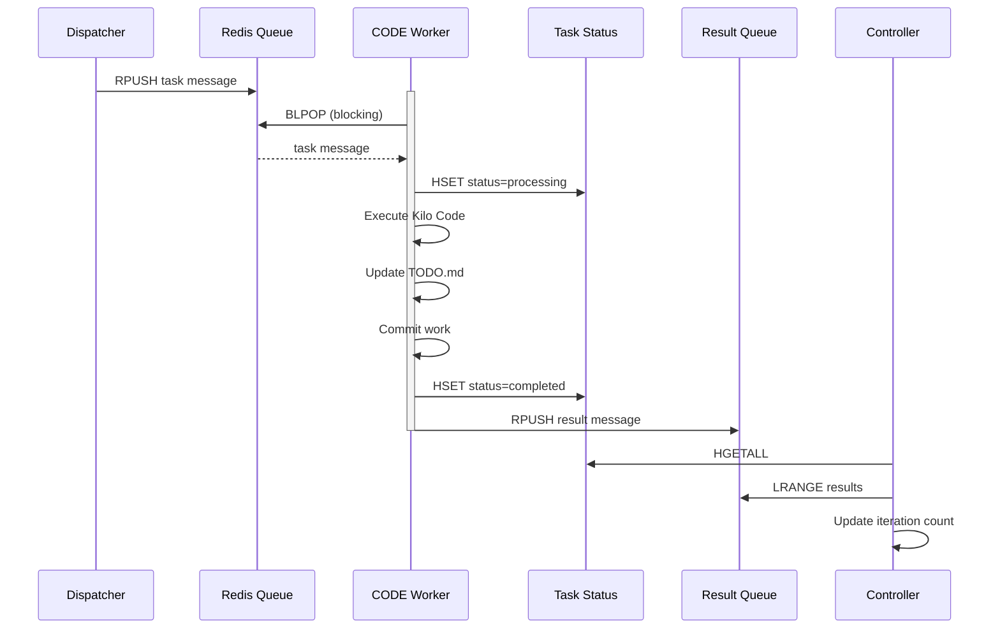
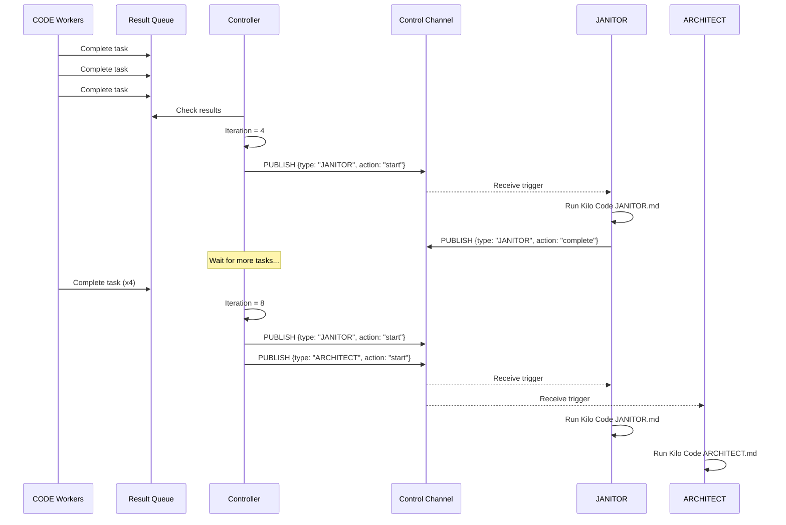
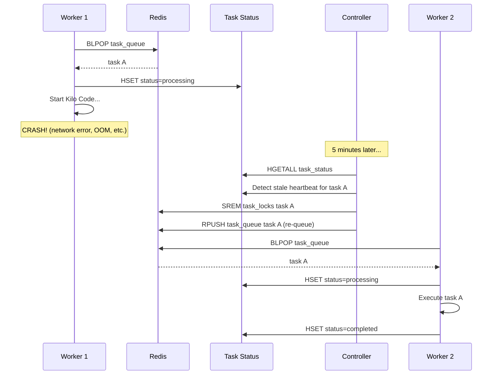

# Message Queue Based Architecture for Parallel Agent Execution

## Approach 1: Message Queue Architecture

**Version:** 1.0  
**Date:** 2026-02-06  
**Author:** Architecture Design Document

---

## Executive Summary

This document describes a message queue based architecture that enables parallel execution of AI agents using Redis as the message broker. The architecture transforms the current sequential orchestration system into a distributed, scalable system where multiple CODE agents can work in parallel on different TODO items while ARCHITECT and JANITOR agents coordinate the overall workflow.

### Key Decisions

| Decision | Choice | Rationale |
|----------|--------|-----------|
| Message Queue | **Redis** | Lightweight, familiar to developers, built-in data structures, excellent pub/sub, minimal overhead |
| Task Granularity | **Entire TODO item** | Aligns with current orchestration model, maintains task coherence |
| Parallelism | **3-5 CODE agents** | Balanced resource utilization without overwhelming the workspace |
| Priority | **Simplicity first** | Easy to implement, debug, and extend while remaining functionally complete |

---

## 1. High-Level Architecture

### 1.1 Architecture Overview

```
┌─────────────────────────────────────────────────────────────────────────────┐
│                              Message Queue System                           │
│                                     (Redis)                                 │
├─────────────────────────────────────────────────────────────────────────────┤
│  ┌──────────────┐  ┌──────────────┐  ┌──────────────┐  ┌──────────────┐  │
│  │ Task Queue   │  │ Result Queue │  │ Status Queue │  │ Control Queue │  │
│  │ (LIST)       │  │ (LIST)       │  │ (HASH)       │  │ (PUB/SUB)     │  │
│  └──────────────┘  └──────────────┘  └──────────────┘  └──────────────┘  │
└─────────────────────────────────────────────────────────────────────────────┘
                                        ▲
                                        │ Publish/Subscribe & LPOP/RPUSH
                                        │
         ┌──────────────────────────────┼──────────────────────────────┐
         │                              │                              │
         │                              │                              │
┌─────────────────┐           ┌─────────────────┐           ┌─────────────────┐
│  Dispatcher     │           │  Code Agents    │           │  Orchestrator   │
│  Container      │           │  (3-5 workers)  │           │  Controller     │
│                 │           │                 │           │                 │
│  - Reads TODO.md│           │  CODE Worker 1  │           │  - ARCHITECT    │
│  - Enqueues     │           │  CODE Worker 2  │           │  - JANITOR      │
│    tasks        │           │  CODE Worker 3  │           │                 │
│  - Manages      │           │  CODE Worker N  │           │  - Monitors     │
│    queue        │           │                 │           │    progress     │
└─────────────────┘           └─────────────────┘           └─────────────────┘
```

### 1.2 Mermaid Architecture Diagram

```mermaid
graph TB
    subgraph Redis["Redis Message Broker"]
        TQ[Task Queue<br/>task_queue<br/>LIST]
        RQ[Result Queue<br/>result_queue<br/>LIST]
        SQ[Status Store<br/>task_status<br/>HASH]
        CQ[Control Channel<br/>control<br/>PUB/SUB]
    end

    subgraph Dispatcher["Dispatcher Container"]
        D1[Task Reader<br/>reads TODO.md]
        D2[Task Enqueuer<br/>RPUSH task_queue]
        D3[Status Tracker<br/>monitors task_status]
    end

    subgraph CodeWorkers["Code Agent Pool (3-5 containers)"]
        CW1[CODE Worker 1]
        CW2[CODE Worker 2]
        CW3[CODE Worker 3]
        CWN[CODE Worker N]
    end

    subgraph Orchestrator["Orchestrator Controller"]
        ARC[ARCHITECT Agent]
        JAN[JANITOR Agent]
        MON[Progress Monitor]
    end

    D2 -->|RPUSH| TQ
    CW1 -->|LPOP/BLPOP| TQ
    CW2 -->|LPOP/BLPOP| TQ
    CW3 -->|LPOP/BLPOP| TQ
    CWN -->|LPOP/BLPOP| TQ

    CW1 -->|HSET| SQ
    CW2 -->|HSET| SQ
    CW3 -->|HSET| SQ
    CWN -->|HSET| SQ

    CW1 -->|RPUSH| RQ
    CW2 -->|RPUSH| RQ
    CW3 -->|RPUSH| RQ
    CWN -->|RPUSH| RQ

    ARC -->|SUBSCRIBE| CQ
    JAN -->|SUBSCRIBE| CQ
    MON -->|HGETALL| SQ

    D3 -->|HGET| SQ

    style Redis fill:#e1f5fe
    style Dispatcher fill:#f3e5f5
    style CodeWorkers fill:#e8f5e9
    style Orchestrator fill:#fff3e0
```



### 1.3 Component Summary

| Component | Type | Primary Function | Count |
|-----------|------|-------------------|-------|
| Redis | Infrastructure | Message broker and state store | 1 |
| Dispatcher | Docker Container | Reads TODO.md, enqueues tasks | 1 |
| CODE Worker | Docker Container | Processes TODO items | 3-5 (configurable) |
| ARCHITECT | Docker Container | Periodic architecture review | 1 |
| JANITOR | Docker Container | Repository maintenance | 1 |
| Orchestrator Controller | Docker Container | Coordinates all agents | 1 |

---

## 2. Queue Topology

### 2.1 Redis Data Structures

| Key | Type | Purpose | Operations |
|-----|------|---------|------------|
| `task_queue` | LIST | Queue of pending TODO items | `RPUSH` (dispatcher), `BLPOP` (workers) |
| `result_queue` | LIST | Completed task results | `RPUSH` (workers), `LRANGE` (orchestrator) |
| `task_status` | HASH | Real-time task status | `HSET` (update), `HGET` (query), `HGETALL` (monitor) |
| `control` | PUB/SUB | Control signals (pause/resume/stop) | `PUBLISH`, `SUBSCRIBE` |
| `agent_heartbeat` | HASH | Worker health tracking | `HSET`, `HGET`, `HGETALL` |
| `task_locks` | SET | Distributed locks for deconfliction | `SADD`, `SREM`, `SCARD` |

### 2.2 Task Message Format

```json
{
  "task_id": "uuid-v4",
  "todo_item": "Create User model with email and passwordHash fields",
  "priority": 1,
  "created_at": "2026-02-06T20:00:00.000Z",
  "metadata": {
    "file_context": ["src/models/", "README.md"],
    "dependencies": [],
    "estimated_subtasks": 3
  }
}
```

### 2.3 Result Message Format

```json
{
  "task_id": "uuid-v4",
  "worker_id": "code-worker-1",
  "status": "completed",
  "started_at": "2026-02-06T20:01:00.000Z",
  "completed_at": "2026-02-06T20:05:00.000Z",
  "exit_code": 0,
  "commit_hash": "abc123def",
  "result_summary": "Implemented User model with Mongoose schema",
  "subtasks_completed": [
    "Create user.model.ts file",
    "Define Mongoose schema",
    "Export User model"
  ]
}
```

### 2.4 Status Hash Format

```json
{
  "task_id:uuid-v4:status": "processing",
  "task_id:uuid-v4:worker_id": "code-worker-2",
  "task_id:uuid-v4:started_at": "2026-02-06T20:01:00.000Z",
  "task_id:uuid-v4:last_heartbeat": "2026-02-06T20:02:00.000Z",
  "task_id:uuid-v4:subtasks_total": 3,
  "task_id:uuid-v4:subtasks_completed": 2
}
```

---

## 3. Component Descriptions

### 3.1 Dispatcher Container

**Purpose:** Acts as the bridge between the current file-based TODO system and the message queue. Reads `TODO.md`, converts unchecked items to task messages, and manages the task queue.

**Responsibilities:**
1. Read `TODO.md` from workspace
2. Extract unchecked items
3. Generate unique task IDs (UUID v4)
4. Enqueue tasks to `task_queue`
5. Track which tasks have been dispatched
6. Handle task priority (optional)
7. Respond to pause/resume commands from control channel

**Entry Point:** `dispatcher.js`

**Environment Variables:**
- `REDIS_HOST` (default: `redis`)
- `REDIS_PORT` (default: `6379`)
- `WORKSPACE_PATH` (default: `/workspace`)
- `DISPATCH_INTERVAL_MS` (default: `5000`)
- `AUTO_DISPATCH` (default: `true`)

**Workflow:**
```
1. Start dispatcher.js
2. Connect to Redis
3. Subscribe to control channel
4. While not paused:
   a. Read TODO.md
   b. Find unchecked items not yet dispatched
   c. For each new item:
      - Generate task_id
      - Create task message
      - RPUSH to task_queue
      - Record dispatch in local state
   d. Sleep DISPATCH_INTERVAL_MS
```

---

### 3.2 CODE Worker Container

**Purpose:** Pulls tasks from the queue, executes them using Kilo Code in orchestrator mode, and reports results back to the result queue.

**Responsibilities:**
1. Connect to Redis
2. Subscribe to control channel for pause/resume/stop
3. Continuously poll `task_queue` using `BLPOP` (blocking pop)
4. Upon receiving a task:
   - Acquire distributed lock for task
   - Update task status to "processing"
   - Execute task (run Kilo Code)
   - Update task status to "completed" or "failed"
   - Release lock
   - Push result to `result_queue`
5. Send periodic heartbeats to `agent_heartbeat`
6. Handle graceful shutdown

**Entry Point:** `code-worker.js`

**Environment Variables:**
- `REDIS_HOST` (default: `redis`)
- `REDIS_PORT` (default: `6379`)
- `WORKER_ID` (auto-generated if not provided)
- `WORKSPACE_PATH` (default: `/workspace`)
- `KILOCODE_TIMEOUT` (default: `900`)
- `HEARTBEAT_INTERVAL_MS` (default: `30000`)

**Workflow:**
```
1. Start code-worker.js
2. Connect to Redis, generate unique worker_id
3. Subscribe to control channel
4. Start heartbeat thread
5. While not stopped:
   a. BLPOP task_queue (blocking, timeout 5s)
   b. If task received:
      - Parse task message
      - Check if already in task_locks (skip if locked)
      - SADD task_locks task_id
      - Update task_status: processing
      - Spawn kilocode with TODO item
      - Wait for completion
      - Update task_status: completed/failed
      - SREM task_locks task_id
      - RPUSH result_queue with result
   c. Else (timeout): continue loop
6. On SIGTERM: clean up, release locks
```

---

### 3.3 ARCHITECT Agent Container

**Purpose:** Runs periodic architecture reviews, gap analysis, and sprint management. Runs every 8 iterations or when triggered.

**Responsibilities:**
1. Run ARCHITECT.md prompt periodically (every 8 iterations)
2. Support continuation via `.architect_in_progress` marker
3. Publish status updates to control channel
4. Coordinate with dispatcher when sprint is complete

**Entry Point:** `agent-orchestrator.js` (multi-agent container)

**Environment Variables:**
- `REDIS_HOST` (default: `redis`)
- `REDIS_PORT` (default: `6379`)
- `WORKSPACE_PATH` (default: `/workspace`)
- `ARCHITECT_INTERVAL` (default: `8` iterations)
- `AGENT_TYPE` (default: `ARCHITECT`)

**Workflow:**
```
1. Start agent-orchestrator.js with AGENT_TYPE=ARCHITECT
2. Connect to Redis
3. Subscribe to control channel
4. Track iteration count from task completion events
5. On ARCHITECT_INTERVAL-th iteration:
   - Publish status: "ARCHITECT starting"
   - Run Kilo Code with ARCHITECT.md prompt
   - Publish status: "ARCHITECT completed"
6. Handle continuation markers
```

---

### 3.4 JANITOR Agent Container

**Purpose:** Runs repository maintenance tasks every 4 iterations. Cleans up completed TODOs, identifies drift, removes unused files.

**Responsibilities:**
1. Run JANITOR.md prompt periodically (every 4 iterations)
2. Archive completed TODO items to COMPLETED.md
3. Identify code drift from PRD
4. Clean unused files and directories
5. Publish status to control channel

**Entry Point:** `agent-orchestrator.js` (multi-agent container)

**Environment Variables:**
- `REDIS_HOST` (default: `redis`)
- `REDIS_PORT` (default: `6379`)
- `WORKSPACE_PATH` (default: `/workspace`)
- `JANITOR_INTERVAL` (default: `4` iterations)
- `AGENT_TYPE` (default: `JANITOR`)

**Workflow:**
```
1. Start agent-orchestrator.js with AGENT_TYPE=JANITOR
2. Connect to Redis
3. Subscribe to control channel
4. Track iteration count from task completion events
5. On JANITOR_INTERVAL-th iteration:
   - Publish status: "JANITOR starting"
   - Run Kilo Code with JANITOR.md prompt
   - Publish status: "JANITOR completed"
```

---

### 3.5 Orchestrator Controller Container

**Purpose:** Central coordinator that monitors progress, handles agent scheduling, publishes control signals, and manages overall workflow.

**Responsibilities:**
1. Monitor `task_status` hash for progress
2. Track completed tasks
3. Trigger ARCHITECT and JANITOR at appropriate intervals
4. Check for completion conditions (`.done` file)
5. Aggregate results from `result_queue`
6. Update iteration state
7. Publish control signals (pause/resume/stop)

**Entry Point:** `orchestrator-controller.js`

**Environment Variables:**
- `REDIS_HOST` (default: `redis`)
- `REDIS_PORT` (default: `6379`)
- `WORKSPACE_PATH` (default: `/workspace`)
- `STATUS_CHECK_INTERVAL_MS` (default: `10000`)

**Workflow:**
```
1. Start orchestrator-controller.js
2. Connect to Redis
3. Subscribe to control channel
4. Initialize iteration counter
5. While not stopped:
   a. HGETALL task_status
   b. Count completed tasks since last check
   c. Update iteration counter
   d. If iteration % 4 == 0: PUBLISH JANITOR trigger
   e. If iteration % 8 == 0: PUBLISH ARCHITECT trigger
   f. Check workspace/.done for completion
   g. LRANGE result_queue for new results
   h. Aggregate and log progress
   i. Sleep STATUS_CHECK_INTERVAL_MS
```

---

## 4. Message Flow Sequences

### 4.1 Normal Task Execution Flow

```
┌─────────────┐
│ Dispatcher  │
│             │
└──────┬──────┘
       │
       │ 1. Read TODO.md
       │    Extract unchecked items
       │
       ▼
┌─────────────────────────────────────────────────────────────────┐
│ Redis                                                          │
│ ┌──────────────┐                                               │
│ │ task_queue   │◄────────────────────────────────────────────┐ │
│ └──────────────┘                                               │ │
└─────────────────────────────────────────────────────────────────┘ │
      │                                                          │
      │ 2. RPUSH task_queue task_msg                             │
      │                                                          │
      │                                                          │
      ▼                                                          │
┌─────────────────────────────────────────────────────────────────┤
│ CODE Worker 1                                                  │
│                                                                 │
│ 3. BLPOP task_queue (blocking)                                  │
│ 4. Receive task_msg                                            │
│ 5. SADD task_locks task_id                                     │
│ 6. HSET task_status:task_id:status "processing"                │
│ 7. HSET task_status:task_id:worker_id "code-worker-1"          │
│                                                                 │
│ 8. Execute Kilo Code                                           │
│    - Decompose TODO item into subtasks                         │
│    - Delegate to code subagents                                │
│    - Verify results                                            │
│    - Update TODO.md (mark complete)                            │
│    - Commit work                                               │
│                                                                 │
│ 9. HSET task_status:task_id:status "completed"                 │
│ 10. SREM task_locks task_id                                    │
│ 11. RPUSH result_queue result_msg                              │
└─────────────────────────────────────────────────────────────────┘
      │
      │ 12. RPUSH result_queue
      ▼
┌─────────────────────────────────────────────────────────────────┐
│ Orchestrator Controller                                        │
│                                                                 │
│ 13. LRANGE result_queue (new results)                          │
│ 14. HGETALL task_status                                        │
│ 15. Update iteration counter                                   │
│ 16. Log progress                                               │
└─────────────────────────────────────────────────────────────────┘
```

### 4.2 Deconfliction Flow

```
CODE Worker 1              CODE Worker 2              Redis
     │                           │                      │
     │ 1. BLPOP task_queue       │                      │
     │    receives task A        │                      │
     ▼                           │                      │
     │ 2. SADD task_locks A      │                      │
     ├───────────────────────────>│                      │
     │                           │                      │
     │ 3. SADD returns 1         │                      │
     │    (lock acquired)        │                      │
     ◄───────────────────────────┤                      │
     │                           │                      │
     │ 4. Execute task A         │                      │
     │                           │                      │
     │                           │ 5. BLPOP task_queue │
     │                           │    receives task B   │
     │                           ▼                      │
     │                           │ 6. SADD task_locks B │
     │                           ├─────────────────────>│
     │                           │                      │
     │                           │ 7. SADD returns 1    │
     │                           │    (lock acquired)  │
     │                           ◄─────────────────────┤
     │                           │                      │
     │ 8. SREM task_locks A      │                      │
     ├───────────────────────────>│                      │
     │                           │ 9. Execute task B    │
     │                           │                      │
     │                           │ 10. SREM task_locks B│
     │                           ├─────────────────────>│
     ▼                           ▼                      │
 Task A Complete          Task B Complete            │
```

### 4.3 Parallel Task Execution (3 Workers)

```
Time ->
Worker 1:  [Task A]-------[Task D]-------[Task G]------
Worker 2:       [Task B]-------[Task E]-------[Task H]--
Worker 3:            [Task C]-------[Task F]-------[Task I]
           ↑         ↑         ↑         ↑
           BLPOP     BLPOP     BLPOP     BLPOP
```

### 4.4 Agent Coordination Flow

```
┌────────────────────────────────────────────────────────────────────┐
│ Orchestrator Controller                                            │
│                                                                    │
│  Iteration 4:                                                     │
│  ┌──────────────────────────────────────────────────────────────┐ │
│  │ - 3 tasks completed                                           │ │
│  │ - Publish control: {"type": "JANITOR", "action": "start"}   │ │
│  └──────────────────────────────────────────────────────────────┘ │
│                                                                    │
│  Iteration 8:                                                     │
│  ┌──────────────────────────────────────────────────────────────┐ │
│  │ - 6 tasks completed (since last ARCHITECT)                   │ │
│  │ - Publish control: {"type": "ARCHITECT", "action": "start"}  │ │
│  │ - Publish control: {"type": "JANITOR", "action": "start"}   │ │
│  └──────────────────────────────────────────────────────────────┘ │
└────────────────────────────────────────────────────────────────────┘
                              │
                              │ PUB/SUB
                              ▼
┌────────────────────────────────────────────────────────────────────┐
│ JANITOR Agent                       ARCHITECT Agent                 │
│                                                                    │
│  - Subscribe to control channel         - Subscribe to control      │
│  - Receive JANITOR start trigger        channel                     │
│  - Run Kilo Code JANITOR.md             - Receive ARCHITECT start   │
│  - Publish status: "JANITOR completed"  trigger                     │
│                                         - Run Kilo Code             │
│                                         ARCHITECT.md                │
│                                         - Publish status:           │
│                                         "ARCHITECT completed"       │
└────────────────────────────────────────────────────────────────────┘
```

---

## 5. Deconfliction Mechanism

### 5.1 Deconfliction Strategy Overview

The deconfliction mechanism ensures that multiple CODE agents never process the same TODO item simultaneously. This is achieved through a distributed locking system using Redis Sets combined with status tracking.

### 5.2 Distributed Lock Design

**Lock Key:** `task_locks` (Redis SET)  
**Lock Value:** `task_id` (UUID)  
**Lock Duration:** Implicit (cleared on completion or timeout)

**Operations:**
```javascript
// Acquire lock (returns 1 if acquired, 0 if already locked)
const acquired = await redis.sadd('task_locks', task_id);

if (acquired === 1) {
  // Lock acquired, proceed with task
} else {
  // Task already locked by another worker, skip
}
```

### 5.3 Pseudocode: Worker Lock Handling

```javascript
async function processTask(redis, taskMessage) {
  const taskId = taskMessage.task_id;
  const workerId = process.env.WORKER_ID;
  
  // Step 1: Try to acquire lock
  const lockAcquired = await redis.sadd('task_locks', taskId);
  
  if (lockAcquired === 0) {
    console.log(`Task ${taskId} already locked by another worker`);
    return; // Skip this task
  }
  
  // Step 2: Set initial status
  const statusKey = `task_id:${taskId}:status`;
  const workerKey = `task_id:${taskId}:worker_id`;
  const startedKey = `task_id:${taskId}:started_at`;
  
  await Promise.all([
    redis.hset('task_status', statusKey, 'processing'),
    redis.hset('task_status', workerKey, workerId),
    redis.hset('task_status', startedKey, new Date().toISOString()),
    redis.hset('task_status', `task_id:${taskId}:last_heartbeat`, new Date().toISOString())
  ]);
  
  // Step 3: Start heartbeat thread
  const heartbeatInterval = setInterval(async () => {
    await redis.hset('task_status', `task_id:${taskId}:last_heartbeat`, new Date().toISOString());
  }, 30000); // Every 30 seconds
  
  try {
    // Step 4: Execute the task
    const result = await executeKiloCode(taskMessage);
    
    // Step 5: Update status to completed
    await Promise.all([
      redis.hset('task_status', statusKey, result.status),
      redis.hset('task_status', `task_id:${taskId}:completed_at`, new Date().toISOString())
    ]);
    
    // Step 6: Push result to result queue
    await redis.rpush('result_queue', JSON.stringify(result));
    
  } catch (error) {
    // Step 7: Handle failure
    await redis.hset('task_status', statusKey, 'failed');
    await redis.hset('task_status', `task_id:${taskId}:error`, error.message);
    
    // Step 8: Optionally re-queue task
    if (shouldRetry(error)) {
      await redis.rpush('task_queue', JSON.stringify(taskMessage));
    }
  } finally {
    // Step 9: Clean up
    clearInterval(heartbeatInterval);
    await redis.srem('task_locks', taskId);
  }
}
```

### 5.4 Timeout and Recovery

**Heartbeat Mechanism:**
- Each worker updates `task_status` with a timestamp every 30 seconds
- Orchestrator monitors for stale heartbeats (> 5 minutes without update)

**Recovery Flow:**
```javascript
// Orchestrator runs every minute
async function checkForStaleTasks(redis) {
  const allStatus = await redis.hgetall('task_status');
  const staleTasks = [];
  
  for (const [key, value] of Object.entries(allStatus)) {
    if (key.includes('last_heartbeat')) {
      const lastHeartbeat = new Date(value);
      const now = new Date();
      const age = now - lastHeartbeat;
      
      if (age > 5 * 60 * 1000) { // 5 minutes
        const taskId = key.split(':')[1];
        staleTasks.push(taskId);
      }
    }
  }
  
  // For each stale task, release lock and re-queue
  for (const taskId of staleTasks) {
    await redis.srem('task_locks', taskId);
    
    // Optionally re-queue the task
    const taskInfo = await getTaskInfo(redis, taskId);
    if (taskInfo) {
      await redis.rpush('task_queue', JSON.stringify(taskInfo.task));
    }
    
    console.log(`Reclaimed stale task: ${taskId}`);
  }
}
```

### 5.5 Deconfliction Guarantees

| Scenario | Behavior |
|----------|----------|
| Two workers BLPOP same task | Impossible - Redis LIST is atomic, each task only received by one worker |
| Worker crashes during task | Heartbeat timeout → Lock released → Task re-queued |
| Worker disconnects | Lock released in finally block → Task can be picked up by another worker |
| Redis crashes | All locks lost → Tasks re-queued by dispatcher on restart |
| Task execution hangs | Timeout detected → Lock released → Task re-queued |

---

## 6. Task Lifecycle Management

### 6.1 Task States

```
┌──────────┐   ┌─────────────┐   ┌─────────────┐   ┌──────────┐
│ Created  │──▶│ Dispatched  │──▶│ Processing  │──▶│Completed │
└──────────┘   └─────────────┘   └─────────────┘   └──────────┘
     │                                    │
     │                                    ▼
     │                           ┌──────────────┐
     │                           │   Failed     │
     │                           └──────────────┘
     │                                    │
     │                                    ▼
     └────────────────────────────────────┴─▶  Re-queued
```

### 6.2 State Transitions

| From | To | Trigger | Who |
|------|-----|---------|-----|
| - | Created | TODO.md item exists | N/A |
| Created | Dispatched | RPUSH to task_queue | Dispatcher |
| Dispatched | Processing | BLPOP + lock acquired | CODE Worker |
| Processing | Completed | Task succeeds | CODE Worker |
| Processing | Failed | Task error/timeout | CODE Worker |
| Failed | Re-queued | Retry policy | Orchestrator/Dispatcher |

### 6.3 Task Priority

For simplicity, tasks are processed FIFO. If priority is needed:

**Priority Queue Extension:**
```javascript
// Instead of simple RPUSH, use sorted sets
const priorityScore = getPriority(task);
await redis.zadd('task_queue_priority', priorityScore, JSON.stringify(taskMessage));

// Workers pop highest priority
const task = await redis.zpopmax('task_queue_priority');
```

### 6.4 Task Retry Policy

```javascript
function shouldRetry(error) {
  const retryableErrors = [
    'ECONNREFUSED',
    'ETIMEDOUT',
    'ENOTFOUND',
    'KILOCODE_TIMEOUT'
  ];
  
  const errorCode = error.code || error.name;
  return retryableErrors.includes(errorCode);
}

async function handleFailedTask(redis, task, error) {
  const retryKey = `task_retries:${task.task_id}`;
  const retries = await redis.incr(retryKey);
  
  if (retries < 3) { // Max 3 retries
    await redis.rpush('task_queue', JSON.stringify(task));
    console.log(`Task ${task.task_id} re-queued (attempt ${retries})`);
  } else {
    await redis.del(retryKey);
    await redis.hset('task_status', `task_id:${task.task_id}:status`, 'permanently_failed');
    console.log(`Task ${task.task_id} permanently failed after ${retries} attempts`);
  }
}
```

---

## 7. Docker Container Specifications

### 7.1 Base Dockerfile (Shared)

```dockerfile
# Base image for all agent containers
FROM node:18-alpine

# Install Kilo Code CLI
RUN apk add --no-cache git curl && \
    curl -fsSL https://get.kilocode.io | sh

# Create workspace directory
WORKDIR /workspace

# Copy shared utilities
COPY utils/ /app/utils/

# Set environment
ENV NODE_ENV=production
```

### 7.2 Dispatcher Container

```dockerfile
FROM node:18-alpine AS dispatcher

# Install Redis client
RUN apk add --no-cache git && \
    npm install ioredis@5.3.2 uuid@9.0.0

WORKDIR /app

# Copy dispatcher code
COPY dispatcher.js /app/
COPY package.json /app/

# Mount workspace volume
VOLUME ["/workspace"]

# Environment variables
ENV REDIS_HOST=redis
ENV REDIS_PORT=6379
ENV WORKSPACE_PATH=/workspace
ENV DISPATCH_INTERVAL_MS=5000
ENV AUTO_DISPATCH=true

CMD ["node", "dispatcher.js"]
```

**Docker Compose:**
```yaml
dispatcher:
  build:
    context: .
    dockerfile: Dockerfile.dispatcher
  container_name: agent-dispatcher
  volumes:
    - ../workspace:/workspace
  environment:
    - REDIS_HOST=redis
    - REDIS_PORT=6379
  depends_on:
    - redis
  restart: unless-stopped
```

### 7.3 CODE Worker Container

```dockerfile
FROM node:18-alpine AS code-worker

# Install Kilo Code and dependencies
RUN apk add --no-cache git curl && \
    npm install ioredis@5.3.2 uuid@9.0.0 && \
    curl -fsSL https://get.kilocode.io | sh

WORKDIR /app

# Copy worker code
COPY code-worker.js /app/
COPY prompts/ /app/prompts/

# Mount workspace volume
VOLUME ["/workspace"]

# Environment variables
ENV REDIS_HOST=redis
ENV REDIS_PORT=6379
ENV WORKSPACE_PATH=/workspace
ENV KILOCODE_TIMEOUT=900
ENV HEARTBEAT_INTERVAL_MS=30000

CMD ["node", "code-worker.js"]
```

**Docker Compose (3 workers):**
```yaml
code-worker-1:
  build:
    context: .
    dockerfile: Dockerfile.code-worker
  container_name: code-worker-1
  environment:
    - REDIS_HOST=redis
    - REDIS_PORT=6379
    - WORKER_ID=code-worker-1
  volumes:
    - ../workspace:/workspace
  depends_on:
    - redis
  restart: unless-stopped

code-worker-2:
  extends: code-worker-1
  container_name: code-worker-2
  environment:
    - WORKER_ID=code-worker-2

code-worker-3:
  extends: code-worker-1
  container_name: code-worker-3
  environment:
    - WORKER_ID=code-worker-3
```

### 7.4 Orchestrator Container (ARCHITECT + JANITOR)

```dockerfile
FROM node:18-alpine AS orchestrator

# Install dependencies
RUN apk add --no-cache git && \
    npm install ioredis@5.3.2

WORKDIR /app

# Copy orchestrator code
COPY agent-orchestrator.js /app/
COPY prompts/ /app/prompts/

# Mount workspace volume
VOLUME ["/workspace"]

# Environment variables
ENV REDIS_HOST=redis
ENV REDIS_PORT=6379
ENV WORKSPACE_PATH=/workspace
ENV AGENT_TYPE=orchestrator

CMD ["node", "agent-orchestrator.js"]
```

**Docker Compose:**
```yaml
architect:
  build:
    context: .
    dockerfile: Dockerfile.orchestrator
  container_name: architect-agent
  environment:
    - REDIS_HOST=redis
    - REDIS_PORT=6379
    - AGENT_TYPE=ARCHITECT
    - ARCHITECT_INTERVAL=8
  volumes:
    - ../workspace:/workspace
  depends_on:
    - redis
    - dispatcher
  restart: unless-stopped

janitor:
  extends: architect
  container_name: janitor-agent
  environment:
    - AGENT_TYPE=JANITOR
    - JANITOR_INTERVAL=4
```

### 7.5 Orchestrator Controller Container

```dockerfile
FROM node:18-alpine AS controller

# Install dependencies
RUN npm install ioredis@5.3.2

WORKDIR /app

# Copy controller code
COPY orchestrator-controller.js /app/

# Mount workspace volume
VOLUME ["/workspace"]

# Environment variables
ENV REDIS_HOST=redis
ENV REDIS_PORT=6379
ENV WORKSPACE_PATH=/workspace
ENV STATUS_CHECK_INTERVAL_MS=10000

CMD ["node", "orchestrator-controller.js"]
```

**Docker Compose:**
```yaml
orchestrator-controller:
  build:
    context: .
    dockerfile: Dockerfile.controller
  container_name: orchestrator-controller
  environment:
    - REDIS_HOST=redis
    - REDIS_PORT=6379
  depends_on:
    - redis
  restart: unless-stopped
```

### 7.6 Redis Container

```yaml
redis:
  image: redis:7-alpine
  container_name: redis-broker
  command: redis-server --appendonly yes --save 900 1 --save 300 10
  volumes:
    - redis-data:/data
  ports:
    - "6379:6379"
  restart: unless-stopped

volumes:
  redis-data:
```

### 7.7 Complete Docker Compose

```yaml
version: '3.8'

services:
  redis:
    image: redis:7-alpine
    container_name: redis-broker
    command: redis-server --appendonly yes --save 900 1 --save 300 10
    volumes:
      - redis-data:/data
    ports:
      - "6379:6379"
    restart: unless-stopped

  dispatcher:
    build:
      context: .
      dockerfile: Dockerfile.dispatcher
    container_name: agent-dispatcher
    volumes:
      - ../workspace:/workspace
    environment:
      - REDIS_HOST=redis
      - REDIS_PORT=6379
    depends_on:
      - redis
    restart: unless-stopped

  code-worker-1:
    build:
      context: .
      dockerfile: Dockerfile.code-worker
    container_name: code-worker-1
    environment:
      - REDIS_HOST=redis
      - REDIS_PORT=6379
      - WORKER_ID=code-worker-1
    volumes:
      - ../workspace:/workspace
    depends_on:
      - redis
    restart: unless-stopped

  code-worker-2:
    extends: code-worker-1
    container_name: code-worker-2
    environment:
      - WORKER_ID=code-worker-2

  code-worker-3:
    extends: code-worker-1
    container_name: code-worker-3
    environment:
      - WORKER_ID=code-worker-3

  architect:
    build:
      context: .
      dockerfile: Dockerfile.orchestrator
    container_name: architect-agent
    environment:
      - REDIS_HOST=redis
      - REDIS_PORT=6379
      - AGENT_TYPE=ARCHITECT
      - ARCHITECT_INTERVAL=8
    volumes:
      - ../workspace:/workspace
    depends_on:
      - redis
      - dispatcher
    restart: unless-stopped

  janitor:
    extends: architect
    container_name: janitor-agent
    environment:
      - AGENT_TYPE=JANITOR
      - JANITOR_INTERVAL=4

  orchestrator-controller:
    build:
      context: .
      dockerfile: Dockerfile.controller
    container_name: orchestrator-controller
    environment:
      - REDIS_HOST=redis
      - REDIS_PORT=6379
    depends_on:
      - redis
    restart: unless-stopped

volumes:
  redis-data:
```

---

## 8. Scaling Strategy

### 8.1 Dynamic Worker Scaling

**Manual Scaling:**
```bash
# Scale up to 5 workers
docker-compose up -d --scale code-worker=5

# Scale down to 2 workers
docker-compose up -d --scale code-worker=2
```

**Auto-Scaling Logic (Future Enhancement):**
```javascript
// In orchestrator-controller.js
async function autoScaleWorkers(redis, docker) {
  // Get queue depth
  const queueDepth = await redis.llen('task_queue');
  
  // Get active workers
  const activeWorkers = await getActiveWorkers(docker);
  
  // Scaling rules
  if (queueDepth > 10 && activeWorkers.length < 5) {
    // Scale up
    await scaleUp(docker, 1);
  } else if (queueDepth === 0 && activeWorkers.length > 2) {
    // Scale down (gracefully)
    await scaleDown(docker, 1);
  }
}
```

### 8.2 Scaling Considerations

| Factor | Recommendation |
|--------|----------------|
| Minimum Workers | 2 (for true parallelism) |
| Maximum Workers | 5 (avoid workspace contention) |
| Scale Up Trigger | Queue depth > 10 for 5+ minutes |
| Scale Down Trigger | Queue depth = 0 for 15+ minutes |
| Graceful Scale Down | Let workers finish current tasks |

### 8.3 Resource Allocation

**Per CODE Worker:**
- CPU: 0.5-1 core
- Memory: 512MB - 1GB
- Disk: Shared workspace volume

**Per Orchestrator Agent (ARCHITECT/JANITOR):**
- CPU: 0.5 core
- Memory: 512MB
- Disk: Shared workspace volume

**Redis:**
- CPU: 0.5 core
- Memory: 256MB - 512MB (depending on queue depth)
- Disk: Persistent volume for AOF/RDB

---

## 9. File Structure

```
agent-coding-container/
├── automation/
│   ├── plans/
│   │   └── message-queue-architecture.md      # This document
│   ├── dispatcher.js                          # Task dispatcher
│   ├── code-worker.js                        # CODE agent worker
│   ├── agent-orchestrator.js                 # ARCHITECT/JANITOR agent
│   ├── orchestrator-controller.js            # Central controller
│   ├── utils/
│   │   ├── redis.js                          # Redis client wrapper
│   │   ├── logger.js                         # Logging utilities
│   │   └── lock.js                           # Distributed lock helpers
│   ├── prompts/
│   │   ├── development/
│   │   │   ├── CODE.md                       # Renamed from PROMPT.md
│   │   │   ├── ARCHITECT.md
│   │   │   └── JANITOR.md
│   │   ├── bugfixer/
│   │   │   ├── BUGFIXER.md
│   │   │   └── BUGFIXER_BUGCHECK.md
│   │   └── linter/
│   │       ├── LINTER.md
│   │       ├── LINTER_SCAN.md
│   │       └── LINTER_PRIORITIZE.md
│   ├── Dockerfile.dispatcher
│   ├── Dockerfile.code-worker
│   ├── Dockerfile.orchestrator
│   ├── Dockerfile.controller
│   ├── docker-compose.yml                    # Complete stack
│   ├── package.json
│   └── run.js                                # Legacy (kept for compatibility)
└── workspace/                                # Shared workspace volume
    ├── PRD.md
    ├── TODO.md
    ├── ARCHITECTURE.md
    ├── BLOCKERS.md
    ├── COMPLETED.md
    ├── LEARNINGS.md
    └── src/
```

---

## 10. Control Flow Diagrams

### 10.1 Startup Sequence



### 10.2 Normal Task Execution



### 10.3 Agent Coordination (Every 4/8 Iterations)



### 10.4 Failure Recovery



---

## 11. Monitoring and Observability

### 11.1 Metrics to Track

| Metric | Source | Use Case |
|--------|--------|----------|
| `task_queue` length | `LLEN task_queue` | Queue depth |
| `result_queue` length | `LLEN result_queue` | Throughput |
| Tasks in `processing` state | `HGETALL task_status` filter | Active work |
| Tasks completed | Count `status=completed` | Progress |
| Tasks failed | Count `status=failed` | Error rate |
| Active workers | `HGETALL agent_heartbeat` | Worker health |
| Stale tasks | Old heartbeats | Failure detection |
| Lock contention | `SCARD task_locks` vs active workers | Bottleneck detection |

### 11.2 Logging Strategy

Each container logs to stdout/stderr, captured by Docker:

```javascript
// Standardized log format
function log(level, message, metadata = {}) {
  const logEntry = {
    timestamp: new Date().toISOString(),
    level: level,
    component: process.env.COMPONENT || 'unknown',
    message: message,
    ...metadata
  };
  console.log(JSON.stringify(logEntry));
}
```

**Example logs:**
```json
{"timestamp":"2026-02-06T20:00:00.000Z","level":"INFO","component":"code-worker-1","message":"Received task","task_id":"abc-123","todo":"Create User model"}
{"timestamp":"2026-02-06T20:01:00.000Z","level":"INFO","component":"code-worker-1","message":"Task completed","task_id":"abc-123","duration_ms":60000}
{"timestamp":"2026-02-06T20:08:00.000Z","level":"INFO","component":"orchestrator","message":"Triggering JANITOR","iteration":4}
```

### 11.3 Health Checks

**Redis Health:**
```bash
redis-cli ping
# Expected: PONG
```

**Worker Health:**
```javascript
app.get('/health', (req, res) => {
  res.json({
    status: 'healthy',
    worker_id: process.env.WORKER_ID,
    current_task: currentTaskId,
    last_heartbeat: lastHeartbeat
  });
});
```

---

## 12. Pros and Cons of Message Queue Approach

### 12.1 Pros

| Aspect | Benefit |
|--------|---------|
| **Parallelism** | 3-5 CODE agents work simultaneously, reducing total execution time |
| **Scalability** | Easy to add/remove workers by scaling Docker containers |
| **Decoupling** | Agents don't need to know about each other; they only interact with the queue |
| **Fault Isolation** | One worker crashing doesn't stop others; tasks can be re-queued |
| **Load Balancing** | Tasks automatically distributed among available workers |
| **Resource Efficiency** | Workers only run when there's work to do (if using scale-to-zero) |
| **Visibility** | Queue depth and task status provide real-time progress visibility |
| **Simplicity** | Redis is lightweight and well-understood |
| **State Persistence** | Redis AOF/RDB provides durability for queue state |
| **No Single Point of Failure** (with Redis replication) | Can add Redis replicas for HA |

### 12.2 Cons

| Aspect | Drawback |
|--------|----------|
| **Complexity** | More moving parts than sequential execution |
| **Redis Dependency** | System requires Redis running; single point of failure (without replication) |
| **Network Overhead** | All communication goes through Redis |
| **Workspace Contention** | Multiple workers writing to same workspace can cause conflicts |
| **Race Conditions** | Need careful deconfliction for parallel file operations |
| **Debugging Difficulty** | Harder to trace which worker did what |
| **Resource Usage** | Running multiple containers uses more memory/CPU |
| **Startup Latency** | Need to start all containers before work begins |
| **Commit Conflicts** | Multiple workers committing to same git repo can cause conflicts |
| **State Synchronization** | TODO.md modifications by parallel workers need coordination |

### 12.3 Comparison with Alternatives

| Feature | Message Queue (Redis) | Shared Memory | RPC/HTTP API |
|---------|----------------------|--------------|--------------|
| Parallelism | ✅ High | ✅ High | ⚠️ Limited |
| Fault Tolerance | ✅ Good | ❌ Poor | ✅ Good |
| Implementation Complexity | ⚠️ Medium | ✅ Simple | ⚠️ Medium |
| Scalability | ✅ Excellent | ❌ Poor | ⚠️ Limited |
| Visibility | ✅ Excellent | ❌ Poor | ⚠️ Medium |
| Redis Required | ✅ Yes | ❌ No | ❌ No |
| Network Overhead | ⚠️ Yes | ❌ No | ⚠️ Yes |
| Workspace Contention | ⚠️ High | ⚠️ High | ⚠️ Medium |

### 12.4 When to Use Message Queue Approach

**Good Fit:**
- Many independent tasks that can run in parallel
- Tasks are coarse-grained (entire TODO items, not single file edits)
- Need visibility into task progress and queue depth
- Want ability to scale workers dynamically
- Can tolerate occasional workspace conflicts

**Not Ideal:**
- Tasks are tightly coupled and dependent on each other
- Very small number of tasks (no benefit from parallelism)
- Workspace conflicts are common (e.g., shared config files)
- Need strict ordering guarantees
- Resources are extremely constrained

---

## 13. Migration Path from Current System

### 13.1 Phase 1: Infrastructure Setup

1. Add Redis to current setup
2. Create Docker Compose file with Redis
3. Test Redis connectivity from host

### 13.2 Phase 2: Dispatcher Implementation

1. Write `dispatcher.js` to read TODO.md and enqueue tasks
2. Test with single task
3. Verify Redis queue operations

### 13.3 Phase 3: Single Worker

1. Write `code-worker.js` with single CODE agent
2. Implement Redis BLPOP loop
3. Test end-to-end: Dispatcher → Worker → Result
4. Compare output with current `run.js`

### 13.4 Phase 4: Multiple Workers

1. Scale to 2-3 workers using Docker Compose
2. Implement deconfliction (task_locks)
3. Test parallel execution
4. Monitor for conflicts

### 13.5 Phase 5: Orchestrator Agents

1. Add ARCHITECT and JANITOR containers
2. Implement control channel (PUB/SUB)
3. Add orchestrator controller
4. Test agent coordination

### 13.6 Phase 6: Migration Complete

1. Deprecate `run.js` (keep for compatibility)
2. Update documentation
3. Train operators on new system
4. Monitor and tune

---

## 14. Known Limitations and Future Enhancements

### 14.1 Known Limitations

1. **Workspace Contention:** Multiple workers writing to same files may cause issues
   - Mitigation: Tasks should be independent
   - Future: File-level locking mechanism

2. **Git Conflicts:** Multiple workers committing to same branch
   - Mitigation: Use feature branches or rebase strategy
   - Future: Merge request workflow

3. **No Task Dependencies:** All tasks are independent in queue
   - Mitigation: Group dependent tasks in TODO item
   - Future: DAG-based task scheduling

4. **Simple FIFO:** No task priority
   - Mitigation: Manually order TODO.md
   - Future: Priority queue with Redis sorted sets

5. **Manual Scaling:** Workers must be scaled manually
   - Mitigation: Pre-configure desired number
   - Future: Auto-scaling based on queue depth

### 14.2 Future Enhancements

| Enhancement | Description | Complexity |
|-------------|-------------|------------|
| **Redis Sentinel/Cluster** | High availability for Redis | Medium |
| **Task Priority Queue** | Use Redis sorted sets for priorities | Low |
| **Auto-Scaling Workers** | Dynamic scaling based on queue depth | Medium |
| **File-Level Locking** | Prevent conflicts on shared files | High |
| **Feature Branch Workflow** | Each worker works on branch | Medium |
| **Web Dashboard** | Real-time visualization of progress | Medium |
| **Task Dependencies** | DAG-based scheduling | High |
| **Result Aggregation** | Automatic summary of completed work | Low |
| **Metrics Export** | Prometheus-compatible metrics | Low |
| **Graceful Scale Down** | Wait for task completion before stopping | Low |

---

## 15. Conclusion

The message queue based architecture provides a solid foundation for parallel agent execution. Key strengths include:

1. **Simplicity:** Redis is lightweight and well-understood
2. **Scalability:** Easy to add/remove workers
3. **Fault Tolerance:** Workers can crash without stopping the system
4. **Visibility:** Queue depth and status provide real-time progress

The design balances simplicity with functionality, making it practical to implement while providing the benefits of parallel execution. The deconfliction mechanism using Redis sets ensures tasks are not processed by multiple workers, and the heartbeat system handles worker failures gracefully.

**Next Steps:**
1. Review and approve this architecture
2. Implement Approach 2 and Approach 3 for comparison
3. Choose best approach based on requirements
4. Implement chosen approach in Code mode

---

## Appendix A: Configuration Reference

### A.1 Environment Variables

| Variable | Default | Description |
|----------|---------|-------------|
| `REDIS_HOST` | `redis` | Redis server hostname |
| `REDIS_PORT` | `6379` | Redis server port |
| `WORKSPACE_PATH` | `/workspace` | Path to project workspace |
| `WORKER_ID` | auto-generated | Unique identifier for worker |
| `DISPATCH_INTERVAL_MS` | `5000` | Dispatcher polling interval |
| `AUTO_DISPATCH` | `true` | Automatically dispatch tasks |
| `KILOCODE_TIMEOUT` | `900` | Kilo Code execution timeout (seconds) |
| `HEARTBEAT_INTERVAL_MS` | `30000` | Worker heartbeat interval |
| `STATUS_CHECK_INTERVAL_MS` | `10000` | Controller status check interval |
| `ARCHITECT_INTERVAL` | `8` | ARCHITECT runs every N iterations |
| `JANITOR_INTERVAL` | `4` | JANITOR runs every N iterations |

### A.2 Redis Keys Reference

| Key | Type | Description |
|-----|------|-------------|
| `task_queue` | LIST | Queue of pending tasks |
| `result_queue` | LIST | Completed task results |
| `task_status` | HASH | Real-time task status |
| `control` | PUB/SUB | Control signals |
| `agent_heartbeat` | HASH | Worker health tracking |
| `task_locks` | SET | Distributed locks |
| `task_retries:<task_id>` | COUNTER | Retry counter for task |

---

## Appendix B: Glossary

| Term | Definition |
|------|------------|
| **Dispatcher** | Component that reads TODO.md and enqueues tasks |
| **Worker** | CODE agent that processes tasks from the queue |
| **Task** | A TODO item that needs to be completed |
| **Lock** | Distributed mechanism to prevent multiple workers from processing same task |
| **Heartbeat** | Periodic signal from worker indicating it's alive |
| **Queue Depth** | Number of tasks waiting to be processed |
| **Iteration** | One complete cycle through all agents |
| **Control Channel** | Redis PUB/SUB channel for coordination messages |
| **Result Queue** | Queue where completed results are pushed |
| **Task Status** | Current state of a task (created, processing, completed, failed) |

---

**Document End**
