# Multi-Container Prompts Architecture

**Version:** 1.0  
**Date:** 2026-02-07  
**Author:** Architecture Design Document

---

## 1. Executive Summary

This document describes a multi-container architecture that separates each AI prompt (PROMPT, JANITOR, ARCHITECT) into its own Docker container with periodic independent execution. The architecture transforms the current single-container sequential system into a distributed container-based system where each prompt type runs in isolation on its own schedule, sharing a common workspace volume.

### Current Architecture Summary

The current implementation uses a single Docker container (`agent_coding_container`) that runs all prompts sequentially via the [`run.js`](../run.js) script:

| Loop Type | Prompts Run | Scheduling |
|-----------|-------------|------------|
| `development` | PROMPT, JANITOR, ARCHITECT | PROMPT every iteration, JANITOR every 4, ARCHITECT every 8 |
| `bugfixer` | BUGFIXER, BUGFIXER_BUGCHECK | BUGFIXER every iteration, BUGFIXER_BUGCHECK every 4 |
| `linter` | LINTER, LINTER_SCAN, LINTER_PRIORITIZE | LINTER every iteration, LINTER_SCAN every 4, LINTER_PRIORITIZE every 8 |

### Proposed Architecture Summary

The new architecture separates each prompt into its own container:

| Development Loop | Container | Schedule | Purpose |
|------------------|-----------|----------|---------|
| Primary | `agent_prompt` | Every 5 minutes | Main orchestration and task execution |
| Periodic | `agent_janitor` | Every 20 minutes (every 4th PROMPT cycle) | Repository maintenance and cleanup |
| Periodic | `agent_architect` | Every 40 minutes (every 8th PROMPT cycle) | Architecture planning and gap analysis |

### Key Benefits

| Benefit | Description |
|---------|-------------|
| **Isolation** | Each prompt type runs in its own container, preventing cross-contamination of state and resources |
| **Independent Scaling** | Containers can be scaled independently based on workload requirements |
| **Fault Tolerance** | Failure in one container does not affect the others |
| **Observability** | Individual logs and metrics per container for better monitoring and debugging |
| **Scheduling Flexibility** | Each container can have its own execution frequency and schedule |
| **Easier Testing** | Individual containers can be tested in isolation |
| **Resource Optimization** | Containers can be configured with different resource limits based on their needs |

### Motivations for Change

1. **Current Limitations:**
   - Single container means all prompts share the same runtime environment
   - If one prompt fails or hangs, it blocks all subsequent prompts
   - Difficult to debug which specific prompt caused an issue
   - No independent scaling or resource allocation per prompt type
   - Shared state in a single process can lead to race conditions

2. **Operational Benefits:**
   - Independent container restarts without affecting other prompts
   - Separate health checks and monitoring per prompt type
   - Easier to extend with new prompt types (bugfixer, linter) as separate containers
   - Clear separation of concerns aligns with containerization best practices

---

## 2. Architecture Design

### 2.1 High-Level Architecture

```
┌─────────────────────────────────────────────────────────────────────────────────────────┐
│                         Multi-Container Prompts Architecture                            │
├─────────────────────────────────────────────────────────────────────────────────────────┤
│                                                                                         │
│  ┌─────────────────────────────────────────────────────────────────────────────┐      │
│  │                           Docker Compose Network                             │      │
│  │                           agent-network (bridge)                             │      │
│  └─────────────────────────────────────────────────────────────────────────────┘      │
│                                          │                                            │
│                      ┌───────────────────┼───────────────────┐                      │
│                      │                   │                   │                      │
│                      ▼                   ▼                   ▼                      │
│  ┌─────────────────────────────┐ ┌─────────────────────────────┐ ┌─────────────────────────────┐
│  │   agent_prompt Container    │ │   agent_janitor Container   │ │   agent_architect Container  │
│  │                             │ │                             │ │                             │
│  │  - Runs PROMPT.md           │ │  - Runs JANITOR.md         │ │  - Runs ARCHITECT.md        │
│  │  - Schedule: Every 5 min    │ │  - Schedule: Every 20 min   │ │  - Schedule: Every 40 min   │
│  │  - Orchestrator mode        │ │  - Janitor maintenance     │ │  - Architecture planning    │
│  │  - Task execution           │ │  - Repository cleanup       │ │  - Gap analysis             │
│  │  - TODO management          │ │  - Archive completed work   │ │  - Sprint management        │
│  │  - Continuation support     │ │  - Documentation sync       │ │  - Blocker review           │
│  │                             │ │  - Test health check        │ │  - Communication            │
│  └─────────────────────────────┘ └─────────────────────────────┘ └─────────────────────────────┘
│              │                               │                               │               │
│              └───────────────────────────────┼───────────────────────────────┘               │
│                                              │                                               │
│              ┌───────────────────────────────┴───────────────────────────────┐               │
│              │              Shared Workspace Volume (Read/Write)              │               │
│              │              workspace:/home/workspace                         │               │
│              └───────────────────────────────┬───────────────────────────────┘               │
│                                              │                                               │
│  ┌─────────────────────────────────────────────────────────────────────────────┐              │
│  │                    Shared Files & Directories                                 │              │
│  │                                                                             │              │
│  │  ├── TODO.md                  - Current sprint tasks (all read/write)      │              │
│  │  ├── BACKLOG.md               - Future sprint tasks (ARCHITECT r/w)       │              │
│  │  ├── COMPLETED.md             - Completed work (JANITOR r/w)               │              │
│  │  ├── PRD.md                   - Product requirements (read-only)           │              │
│  │  ├── ARCHITECTURE.md          - Architecture docs (ARCHITECT r/w)          │              │
│  │  ├── BLOCKERS.md              - Current blockers (ARCHITECT r/w)           │              │
│  │  ├── .architect_in_progress   - ARCHITECT continuation marker               │              │
│  │  ├── ARCHITECT_STATE.md       - ARCHITECT state file                        │              │
│  │  ├── .state_development.json  - Development loop state                     │              │
│  │  ├── comms/inbox/             - User communications (all read)             │              │
│  │  └── comms/outbox/            - Questions to user (all write)              │              │
│  └─────────────────────────────────────────────────────────────────────────────┘              │
│                                                                                         │
└─────────────────────────────────────────────────────────────────────────────────────────┘
```

### 2.2 Mermaid Architecture Diagram

```mermaid
graph TB
    subgraph DockerCompose["Docker Compose Environment"]
        Network["agent-network<br/>bridge network"]
        
        subgraph PromptContainer["agent_prompt Container<br/>Schedule: Every 5 min"]
            PEntry["run-prompt.js<br/>Entry Point"]
            PSched["Node-cron Scheduler<br/>every 5 minutes"]
            PExec["Kilocode Orchestrator<br/>PROMPT.md"]
        end
        
        subgraph JanitorContainer["agent_janitor Container<br/>Schedule: Every 20 min"]
            JEntry["run-janitor.js<br/>Entry Point"]
            JSched["Node-cron Scheduler<br/>every 20 minutes"]
            JExec["Kilocode Orchestrator<br/>JANITOR.md"]
        end
        
        subgraph ArchitectContainer["agent_architect Container<br/>Schedule: Every 40 min"]
            AEntry["run-architect.js<br/>Entry Point"]
            ASched["Node-cron Scheduler<br/>every 40 minutes"]
            AExec["Kilocode Orchestrator<br/>ARCHITECT.md"]
        end
    end
    
    subgraph SharedWorkspace["Shared Workspace Volume<br/>/home/workspace"]
        TODO["TODO.md<br/>All: r/w"]
        BACKLOG["BACKLOG.md<br/>ARCHITECT: r/w, Others: r"]
        COMPLETED["COMPLETED.md<br/>JANITOR: r/w, Others: r"]
        PRD["PRD.md<br/>All: r"]
        ARCHMD["ARCHITECTURE.md<br/>ARCHITECT: r/w, Others: r"]
        BLOCKERS["BLOCKERS.md<br/>ARCHITECT: r/w, Others: r"]
        AMarker[".architect_in_progress<br/>ARCHITECT: r/w"]
        AState["ARCHITECT_STATE.md<br/>ARCHITECT: r/w"]
        StateDev[".state_development.json<br/>PROMPT: r/w"]
        CommsIn["comms/inbox/<br/>All: r"]
        CommsOut["comms/outbox/<br/>All: w"]
    end
    
    PEntry --> PSched --> PExec
    JEntry --> JSched --> JExec
    AEntry --> ASched --> AExec
    
    PExec -.->|Read/Write| TODO
    PExec -.->|Read| BACKLOG
    PExec -.->|Read| COMPLETED
    PExec -.->|Read| PRD
    PExec -.->|Read| ARCHMD
    PExec -.->|Read| BLOCKERS
    PExec -.->|Read/Write| StateDev
    PExec -.->|Read| CommsIn
    PExec -.->|Write| CommsOut
    
    JExec -.->|Read/Write| TODO
    JExec -.->|Read| BACKLOG
    JExec -.->|Read/Write| COMPLETED
    JExec -.->|Read| PRD
    JExec -.->|Read/Write| ARCHMD
    JExec -.->|Read| BLOCKERS
    JExec -.->|Read| StateDev
    JExec -.->|Read| CommsIn
    JExec -.->|Write| CommsOut
    
    AExec -.->|Read/Write| TODO
    AExec -.->|Read/Write| BACKLOG
    AExec -.->|Read| COMPLETED
    AExec -.->|Read| PRD
    AExec -.->|Read/Write| ARCHMD
    AExec -.->|Read/Write| BLOCKERS
    AExec -.->|Read/Write| AMarker
    AExec -.->|Read/Write| AState
    AExec -.->|Read| StateDev
    AExec -.->|Read| CommsIn
    AExec -.->|Write| CommsOut
    
    Network <--> PromptContainer
    Network <--> JanitorContainer
    Network <--> ArchitectContainer
    
    style PromptContainer fill:#e3f2fd
    style JanitorContainer fill:#fff3e0
    style ArchitectContainer fill:#f3e5f5
    style SharedWorkspace fill:#e8f5e9
```



### 2.3 Container Responsibilities

| Container | Primary Responsibility | Secondary Responsibilities | State Managed |
|-----------|----------------------|----------------------------|----------------|
| `agent_prompt` | Execute PROMPT.md every iteration | Manage TODO.md, coordinate subagents, verify results | `.state_development.json` |
| `agent_janitor` | Repository maintenance and cleanup | Archive completed work, sync documentation, run tests | None (stateless) |
| `agent_architect` | Architecture planning and gap analysis | Sprint management, blocker review, communication | `.architect_in_progress`, `ARCHITECT_STATE.md` |

### 2.4 Communication and Coordination

Communication between containers occurs through the shared workspace volume:

| Communication Pattern | Description | Example |
|----------------------|-------------|---------|
| **State File Sharing** | All containers read/write state files in workspace | PROMPT writes iteration count to `.state_development.json` |
| **Todo List Coordination** | PROMPT executes tasks, JANITOR archives completed ones | PROMPT marks item `[x]`, JANITOR moves to COMPLETED.md |
| **Architect Direction** | ARCHITECT modifies TODO.md and BACKLOG.md | ARCHITECT moves tasks from BACKLOG to TODO |
| **Marker-Based Continuation** | Containers check for in-progress markers before running | ARCHITECT checks `.architect_in_progress` |

**No direct inter-container communication** - all coordination is mediated through the shared file system, which provides:
- Atomicity at the file level (single writes are atomic)
- Simple checkpoint/resume semantics
- Easy debugging through file inspection
- No network dependencies between containers

### 2.5 Shared Resources Management

| Resource | Access Pattern | Owner | Consumers |
|----------|----------------|-------|-----------|
| `TODO.md` | Read/write by all | PROMPT (primary) | PROMPT, JANITOR, ARCHITECT |
| `BACKLOG.md` | Write by ARCHITECT, read by PROMPT | ARCHITECT | ARCHITECT (w), PROMPT (r) |
| `COMPLETED.md` | Write by JANITOR, read by all | JANITOR | JANITOR (w), all (r) |
| `PRD.md` | Read-only by all | Immutable | All |
| `.state_development.json` | Write by PROMPT, read by JANITOR/ARCHITECT | PROMPT | PROMPT (w), JANITOR/ARCHITECT (r) |
| `.architect_in_progress` | Write by ARCHITECT | ARCHITECT | ARCHITECT only |
| `ARCHITECT_STATE.md` | Write by ARCHITECT | ARCHITECT | ARCHITECT only |

---

## 3. Container Specifications

### 3.1 agent_prompt Container

| Specification | Value |
|--------------|-------|
| **Container Name** | `agent_prompt` |
| **Schedule** | Every 5 minutes (`*/5 * * * *`) |
| **Purpose** | Main orchestration and task execution |
| **Prompt File** | `/home/automation/prompts/development/PROMPT.md` |
| **Entry Point** | `node /home/automation/run-prompt.js` |

**Environment Variables:**

| Variable | Required | Default | Description |
|----------|----------|---------|-------------|
| `PROMPT_TYPE` | No | `PROMPT` | Type of prompt this container runs |
| `SCHEDULE_CRON` | No | `*/5 * * * *` | Cron schedule for execution |
| `KILOCODE_TIMEOUT` | No | `900` | Timeout in seconds for kilocode execution |
| `WORKSPACE_PATH` | No | `/home/workspace` | Path to workspace directory |
| `LOOP_TYPE` | No | `development` | Loop type identifier |

**Volume Mounts:**

| Host Path | Container Path | Access Mode | Purpose |
|-----------|----------------|--------------|---------|
| `${MOUNT_HOST_DIR}` | `/home/workspace` | Read/Write | Shared workspace |
| `./automation` | `/home/automation` | Read-only | Automation scripts |
| `./.kilocode` | `/root/.kilocode` | Read-only | Kilocode config |

**Command Differences:**
- Runs in continuous scheduling mode using node-cron
- Executes only PROMPT.md (not JANITOR or ARCHITECT)
- Maintains its own state file: `.state_development.json`

### 3.2 agent_janitor Container

| Specification | Value |
|--------------|-------|
| **Container Name** | `agent_janitor` |
| **Schedule** | Every 20 minutes (`*/20 * * * *`) |
| **Purpose** | Repository maintenance and cleanup |
| **Prompt File** | `/home/automation/prompts/development/JANITOR.md` |
| **Entry Point** | `node /home/automation/run-janitor.js` |

**Environment Variables:**

| Variable | Required | Default | Description |
|----------|----------|---------|-------------|
| `PROMPT_TYPE` | No | `JANITOR` | Type of prompt this container runs |
| `SCHEDULE_CRON` | No | `*/20 * * * *` | Cron schedule for execution |
| `KILOCODE_TIMEOUT` | No | `900` | Timeout in seconds for kilocode execution |
| `WORKSPACE_PATH` | No | `/home/workspace` | Path to workspace directory |
| `LOOP_TYPE` | No | `development` | Loop type identifier |

**Volume Mounts:**

| Host Path | Container Path | Access Mode | Purpose |
|-----------|----------------|--------------|---------|
| `${MOUNT_HOST_DIR}` | `/home/workspace` | Read/Write | Shared workspace |
| `./automation` | `/home/automation` | Read-only | Automation scripts |
| `./.kilocode` | `/root/.kilocode` | Read-only | Kilocode config |

**Command Differences:**
- Runs on a 20-minute schedule (every 4th PROMPT cycle)
- Executes only JANITOR.md
- Stateless - no persistent state file needed
- Archives completed work from TODO.md to COMPLETED.md

### 3.3 agent_architect Container

| Specification | Value |
|--------------|-------|
| **Container Name** | `agent_architect` |
| **Schedule** | Every 40 minutes (`*/40 * * * *`) |
| **Purpose** | Architecture planning and gap analysis |
| **Prompt File** | `/home/automation/prompts/development/ARCHITECT.md` |
| **Entry Point** | `node /home/automation/run-architect.js` |

**Environment Variables:**

| Variable | Required | Default | Description |
|----------|----------|---------|-------------|
| `PROMPT_TYPE` | No | `ARCHITECT` | Type of prompt this container runs |
| `SCHEDULE_CRON` | No | `*/40 * * * *` | Cron schedule for execution |
| `KILOCODE_TIMEOUT` | No | `900` | Timeout in seconds for kilocode execution |
| `WORKSPACE_PATH` | No | `/home/workspace` | Path to workspace directory |
| `LOOP_TYPE` | No | `development` | Loop type identifier |

**Volume Mounts:**

| Host Path | Container Path | Access Mode | Purpose |
|-----------|----------------|--------------|---------|
| `${MOUNT_HOST_DIR}` | `/home/workspace` | Read/Write | Shared workspace |
| `./automation` | `/home/automation` | Read-only | Automation scripts |
| `./.kilocode` | `/root/.kilocode` | Read-only | Kilocode config |

**Command Differences:**
- Runs on a 40-minute schedule (every 8th PROMPT cycle)
- Executes only ARCHITECT.md
- Manages continuation state via `.architect_in_progress` marker
- Writes progress to `ARCHITECT_STATE.md`
- Can resume interrupted sessions based on marker file

---

## 4. Docker Compose Design

### 4.1 New docker-compose.yml Structure

```yaml
# ============================================================================
# Multi-Container Configuration for Development Loop
# ============================================================================

# Project Name Configuration
# Set COMPOSE_PROJECT_NAME to create unique instance names (required for running multiple instances)
# Default: agent-coding-container (derived from directory name)
#
#   Linux/Mac:
#     COMPOSE_PROJECT_NAME=my-project docker-compose up
#
#   Windows (PowerShell):
#     $env:COMPOSE_PROJECT_NAME="my-project"; docker-compose up
#
#   Windows (CMD):
#     set COMPOSE_PROJECT_NAME=my-project && docker-compose up

# ============================================================================
# SCHEDULING CONFIGURATION
# ============================================================================
# Each prompt type runs on its own schedule using cron syntax
#
# PROMPT Schedule: Every 5 minutes
#   - P PROMPT_SCHEDULE="*/5 * * * *"  (default)
#
# JANITOR Schedule: Every 20 minutes (every 4th PROMPT cycle)
#   - JANITOR_SCHEDULE="*/20 * * * *" (default)
#
# ARCHITECT Schedule: Every 40 minutes (every 8th PROMPT cycle)
#   - ARCHITECT_SCHEDULE="*/40 * * * *" (default)
#
# To customize schedules, set environment variables before running docker-compose:
#
#   Linux/Mac:
#     PROMPT_SCHEDULE="*/10 * * * *" docker-compose up
#
#   Windows (PowerShell):
#     $env:PROMPT_SCHEDULE="*/10 * * * *"; docker-compose up

# ============================================================================
# VOLUME MOUNT CONFIGURATION
# ============================================================================
# See comments in original docker-compose.yml for details on MOUNT_HOST_DIR
# and MAIN_REPO_GIT_DIR configuration

# ============================================================================
# NETWORK CONFIGURATION
# ============================================================================
# All containers connect to the same bridge network for potential future
# inter-container communication (though current design uses file-based coordination)
#
# Network: agent-network (bridge)

networks:
  agent-network:
    driver: bridge

services:
  # ============================================================================
  # PROMPT Container - Main orchestration and task execution
  # ============================================================================
  agent_prompt:
    build: .
    container_name: ${COMPOSE_PROJECT_NAME:-agent-coding-container}_agent_prompt_1
    environment:
      # Prompt type identification
      - PROMPT_TYPE=PROMPT
      - LOOP_TYPE=development
      
      # Scheduling configuration (cron format)
      - PROMPT_SCHEDULE=${PROMPT_SCHEDULE:-*/5 * * * *}
      
      # Execution configuration
      - KILOCODE_TIMEOUT=${KILOCODE_TIMEOUT:-900}
      - WORKSPACE_PATH=/home/workspace
      
      # Loop type identifier
      - LOOP_TYPE=development
    volumes:
      # User-configurable volume mount for workspace/data access
      - ${MOUNT_HOST_DIR:-./workspace}:/home/workspace
      # Git worktree support (only if MAIN_REPO_GIT_DIR is set)
      - ${MAIN_REPO_GIT_DIR:-./.git-placeholder}:/home/.git-placeholder
      # Automation scripts and prompts (read-only for integrity)
      - ./automation:/home/automation:ro
      # Kilocode configuration
      - ./.kilocode:/root/.kilocode:ro
    restart: unless-stopped
    networks:
      - agent-network
    healthcheck:
      test: ["CMD", "node", "-e", "console.log('healthy')"]
      interval: 30s
      timeout: 10s
      retries: 3
      start_period: 10s
    logging:
      driver: "json-file"
      options:
        max-size: "10m"
        max-file: "3"

  # ============================================================================
  # JANITOR Container - Repository maintenance and cleanup
  # ============================================================================
  agent_janitor:
    build: .
    container_name: ${COMPOSE_PROJECT_NAME:-agent-coding-container}_agent_janitor_1
    environment:
      # Prompt type identification
      - PROMPT_TYPE=JANITOR
      - LOOP_TYPE=development
      
      # Scheduling configuration (cron format)
      - JANITOR_SCHEDULE=${JANITOR_SCHEDULE:-*/20 * * * *}
      
      # Execution configuration
      - KILOCODE_TIMEOUT=${KILOCODE_TIMEOUT:-900}
      - WORKSPACE_PATH=/home/workspace
      
      # Loop type identifier
      - LOOP_TYPE=development
    volumes:
      # User-configurable volume mount for workspace/data access
      - ${MOUNT_HOST_DIR:-./workspace}:/home/workspace
      # Git worktree support (only if MAIN_REPO_GIT_DIR is set)
      - ${MAIN_REPO_GIT_DIR:-./.git-placeholder}:/home/.git-placeholder
      # Automation scripts and prompts (read-only for integrity)
      - ./automation:/home/automation:ro
      # Kilocode configuration
      - ./.kilocode:/root/.kilocode:ro
    restart: unless-stopped
    networks:
      - agent-network
    healthcheck:
      test: ["CMD", "node", "-e", "console.log('healthy')"]
      interval: 30s
      timeout: 10s
      retries: 3
      start_period: 10s
    logging:
      driver: "json-file"
      options:
        max-size: "10m"
        max-file: "3"

  # ============================================================================
  # ARCHITECT Container - Architecture planning and gap analysis
  # ============================================================================
  agent_architect:
    build: .
    container_name: ${COMPOSE_PROJECT_NAME:-agent-coding-container}_agent_architect_1
    environment:
      # Prompt type identification
      - PROMPT_TYPE=ARCHITECT
      - LOOP_TYPE=development
      
      # Scheduling configuration (cron format)
      - ARCHITECT_SCHEDULE=${ARCHITECT_SCHEDULE:-*/40 * * * *}
      
      # Execution configuration
      - KILOCODE_TIMEOUT=${KILOCODE_TIMEOUT:-900}
      - WORKSPACE_PATH=/home/workspace
      
      # Loop type identifier
      - LOOP_TYPE=development
    volumes:
      # User-configurable volume mount for workspace/data access
      - ${MOUNT_HOST_DIR:-./workspace}:/home/workspace
      # Git worktree support (only if MAIN_REPO_GIT_DIR is set)
      - ${MAIN_REPO_GIT_DIR:-./.git-placeholder}:/home/.git-placeholder
      # Automation scripts and prompts (read-only for integrity)
      - ./automation:/home/automation:ro
      # Kilocode configuration
      - ./.kilocode:/root/.kilocode:ro
    restart: unless-stopped
    networks:
      - agent-network
    healthcheck:
      test: ["CMD", "node", "-e", "console.log('healthy')"]
      interval: 30s
      timeout: 10s
      retries: 3
      start_period: 10s
    logging:
      driver: "json-file"
      options:
        max-size: "10m"
        max-file: "3"
```

### 4.2 Service Definitions

#### agent_prompt Service

| Property | Value | Description |
|----------|-------|-------------|
| `build` | `.` | Build from current directory Dockerfile |
| `container_name` | `${COMPOSE_PROJECT_NAME}_agent_prompt_1` | Dynamic naming |
| `restart` | `unless-stopped` | Auto-restart policy |
| `networks` | `agent-network` | Bridge network |

#### agent_janitor Service

| Property | Value | Description |
|----------|-------|-------------|
| `build` | `.` | Build from current directory Dockerfile |
| `container_name` | `${COMPOSE_PROJECT_NAME}_agent_janitor_1` | Dynamic naming |
| `restart` | `unless-stopped` | Auto-restart policy |
| `networks` | `agent-network` | Bridge network |

#### agent_architect Service

| Property | Value | Description |
|----------|-------|-------------|
| `build` | `.` | Build from current directory Dockerfile |
| `container_name` | `${COMPOSE_PROJECT_NAME}_agent_architect_1` | Dynamic naming |
| `restart` | `unless-stopped` | Auto-restart policy |
| `networks` | `agent-network` | Bridge network |

### 4.3 Shared Volumes Configuration

All services share the same workspace volume configuration:

```yaml
volumes:
  - ${MOUNT_HOST_DIR:-./workspace}:/home/workspace
```

This ensures:
- All containers see the same workspace
- Changes made by one container are immediately visible to others
- Git operations work correctly across containers
- State files are accessible to all containers that need them

### 4.4 Network Configuration

**Network Type:** Bridge network named `agent-network`

**Purpose:**
- Provides isolation from external networks
- Enables potential future inter-container communication
- Allows containers to be managed as a group
- Facilitates future extensions (health checks, metrics collection)

**All services attach to this network:**
- `agent_prompt`
- `agent_janitor`
- `agent_architect`

### 4.5 Dependencies Between Services

**Current Design: No explicit dependencies**

Rationale:
- Each container operates independently based on its schedule
- Coordination occurs through shared workspace files
- No container needs to wait for another to start
- Failure of one container does not affect others

**Future Enhancement (Optional):**

If explicit ordering becomes necessary, Docker Compose supports:

```yaml
agent_janitor:
  depends_on:
    agent_prompt:
      condition: service_healthy
```

This would ensure JANITOR only runs after PROMPT is healthy, but adds coupling complexity.

---

## 5. Coordination Strategy

### 5.1 Avoiding Race Conditions on Shared Workspace

Since all containers read/write the same workspace files, coordination is essential:

#### File-Level Atomicity Strategy

| File | Write Strategy | Coordination Mechanism |
|------|----------------|----------------------|
| `TODO.md` | PROMPT: Single pass, marks complete | JANITOR reads only completed items |
| `BACKLOG.md` | ARCHITECT: Full rewrite | No other writers |
| `COMPLETED.md` | JANITOR: Append-only | No other writers |
| `.state_development.json` | PROMPT: Full rewrite | Others read only |
| `.architect_in_progress` | ARCHITECT: Create/delete | Others check existence |
| `ARCHITECT_STATE.md` | ARCHITECT: Full rewrite | ARCHITECT only |

#### Race Condition Prevention

1. **Single Writer Per File:**
   - Each file has exactly one container that writes to it
   - Other containers only read the file
   - Example: `BACKLOG.md` is only written by ARCHITECT

2. **Append-Only for Logs:**
   - `COMPLETED.md` uses append-only writes
   - Each entry is timestamped and atomic
   - No risk of clobbering existing content

3. **Marker Files for Work-in-Progress:**
   - `.architect_in_progress` signals active work
   - Other containers check this before proceeding
   - Cleaned up on completion or handled on next run

4. **Timestamp-Based Ordering:**
   - State files include timestamps
   - Containers can detect stale state
   - Newest state wins on conflict

### 5.2 Handling of Continuation Markers

Continuation markers (`.marker` files) enable idempotent resumption of interrupted sessions.

#### Current Markers

| Marker | Owner | Purpose | Lifecycle |
|--------|-------|---------|-----------|
| `.architect_in_progress` | ARCHITECT | Signals ARCHITECT session in progress | Created on start, deleted on completion |
| `.linter_scan_in_progress` | LINTER_SCAN | (future extension) | Similar pattern |
| `.bugfixer_bugcheck_in_progress` | BUGFIXER_BUGCHECK | (future extension) | Similar pattern |

#### Marker Protocol

```javascript
// On session start
if (fs.existsSync('.architect_in_progress')) {
    // Check ARCHITECT_STATE.md for progress
    // Resume from last checkpoint
} else {
    // Create marker
    fs.writeFileSync('.architect_in_progress', Date.now());
}

// On completion
fs.unlinkSync('.architect_in_progress');
```

#### Cross-Container Marker Awareness

While each container manages its own marker, other containers should be aware:

| Container | Markers Checked | Action |
|-----------|----------------|--------|
| PROMPT | None (stateless) | N/A |
| JANITOR | None (stateless) | N/A |
| ARCHITECT | `.architect_in_progress` | Resume or create new |

### 5.3 State File Management

#### State Files

| State File | Owner | Format | Update Frequency |
|------------|-------|--------|------------------|
| `.state_development.json` | PROMPT | JSON | Every PROMPT run |
| `ARCHITECT_STATE.md` | ARCHITECT | Markdown | During ARCHITECT session |

#### State File Format: `.state_development.json`

```json
{
  "iteration": 42,
  "lastRun": "2026-02-07T00:57:37.826Z",
  "promptType": "PROMPT",
  "workspacePath": "/home/workspace"
}
```

#### State File Format: `ARCHITECT_STATE.md`

```markdown
# ARCHITECT_STATE.md
> Last Updated: 2026-02-07T00:57:37.826Z
> Status: IN_PROGRESS

## Completed This Session
- [x] Gap Analysis & Sprint Planning
- [x] Sprint Management

## Currently Working On
- [ ] Blocker Review
  - Context: Reviewing BLOCKERS.md for architecture-related issues

## Remaining Tasks
- [ ] Communication
- [ ] Cleanup
```

### 5.4 Locking Mechanism for Shared Resources

Given the single-writer-per-file design, explicit locking is not required for most files. However, for files where multiple containers might write concurrently:

#### Advisory Locking Strategy

```javascript
const LOCK_TIMEOUT = 30000; // 30 seconds

function acquireLock(lockPath, timeout = LOCK_TIMEOUT) {
    const startTime = Date.now();
    while (Date.now() - startTime < timeout) {
        try {
            // Try to create lock file exclusively
            fs.writeFileSync(lockPath, process.pid, { flag: 'wx' });
            return true; // Lock acquired
        } catch (e) {
            if (e.code === 'EEXIST') {
                // Lock exists, check if stale
                const lockTime = fs.statSync(lockPath).mtime.getTime();
                if (Date.now() - lockTime > timeout) {
                    // Stale lock, remove and retry
                    fs.unlinkSync(lockPath);
                    continue;
                }
            }
            // Wait and retry
            sleep(1000);
        }
    }
    return false; // Lock acquisition failed
}

function releaseLock(lockPath) {
    try {
        fs.unlinkSync(lockPath);
    } catch (e) {
        // Lock may have been cleaned up
    }
}

// Usage
const lockPath = path.join(WORKSPACE, '.todo_write.lock');
if (acquireLock(lockPath)) {
    try {
        // Critical section: write to TODO.md
        fs.writeFileSync(todoPath, content);
    } finally {
        releaseLock(lockPath);
    }
}
```

#### Lock File Locations

| Resource | Lock File | Container |
|----------|-----------|-----------|
| `TODO.md` | `.todo_write.lock` | PROMPT (rarely needed, single writer) |
| `BACKLOG.md` | `.backlog_write.lock` | ARCHITECT (rarely needed, single writer) |
| `COMPLETED.md` | `.completed_write.lock` | JANITOR (rarely needed, append-only) |

**Note:** In practice, locks may not be necessary given the scheduling offsets (PROMPT every 5 min, JANITOR every 20 min, ARCHITECT every 40 min). However, implementing locking provides robustness against edge cases.

### 5.5 Synchronization Approach

#### Temporal Synchronization

The schedules naturally provide synchronization:

```
Timeline (minutes):
0:     PROMPT runs
5:     PROMPT runs
10:    PROMPT runs
15:    PROMPT runs
20:    PROMPT runs
20:    JANITOR runs (synchronized with PROMPT)
25:    PROMPT runs
30:    PROMPT runs
35:    PROMPT runs
40:    PROMPT runs
40:    ARCHITECT runs (synchronized with PROMPT)
40:    JANITOR runs (every 20min)
45:    PROMPT runs
...
```

#### State-Based Synchronization

Containers check state files to ensure safe operations:

```javascript
// Before ARCHITECT runs
if (fs.existsSync('.architect_in_progress')) {
    console.log('Resuming interrupted ARCHITECT session...');
    // Load ARCHITECT_STATE.md and continue
}

// Before JANITOR archives completed items
const todoContent = fs.readFileSync('TODO.md', 'utf8');
const completedItems = todoContent.match(/^\- \[x\].*$/gm);
if (completedItems && completedItems.length > 0) {
    // Archive only items marked [x]
}
```

#### Git-Based Synchronization

Since the workspace is a git repository, commits provide synchronization points:

| Container | Git Commit Pattern | Purpose |
|-----------|-------------------|---------|
| PROMPT | `feat:`, `fix:`, `refactor:` | Code changes |
| JANITOR | `chore:`, `docs:` | Cleanup and documentation |
| ARCHITECT | `chore(architect):` | Architecture planning |

Commits serve as:
- Checkpoints for state recovery
- Audit trail of container activities
- Conflict resolution boundaries

---

## 6. Run.js Refactoring

### 6.1 New Structure

The current [`run.js`](../run.js) will be refactored into three separate entry points:

| Entry Point | File | Purpose |
|--------------|------|---------|
| PROMPT Runner | `automation/run-prompt.js` | Runs PROMPT.md on schedule |
| JANITOR Runner | `automation/run-janitor.js` | Runs JANITOR.md on schedule |
| ARCHITECT Runner | `automation/run-architect.js` | Runs ARCHITECT.md with continuation support |

### 6.2 run-prompt.js Structure

```javascript
// automation/run-prompt.js
const cron = require('node-cron');
const path = require('path');
const fs = require('fs');
const { spawnSync } = require('child_process');

// Configuration
const PROMPT_PATH = path.join(__dirname, 'prompts/development/PROMPT.md');
const WORKSPACE_PATH = path.resolve(__dirname, '../workspace');
const STATE_FILE = path.join(WORKSPACE_PATH, '.state_development.json');
const DONE_FILE = path.join(WORKSPACE_PATH, '.done');

// Environment variables
const PROMPT_TYPE = process.env.PROMPT_TYPE || 'PROMPT';
const SCHEDULE_CRON = process.env.PROMPT_SCHEDULE || '*/5 * * * *';
const KILOCODE_TIMEOUT = process.env.KILOCODE_TIMEOUT || '900';
const LOOP_TYPE = process.env.LOOP_TYPE || 'development';

// State management
function loadState() {
    // Load iteration count from state file
    try {
        if (fs.existsSync(STATE_FILE)) {
            const stateContent = fs.readFileSync(STATE_FILE, 'utf8');
            return JSON.parse(stateContent);
        }
        return { iteration: 0, lastRun: null };
    } catch (error) {
        console.warn(`Warning: Failed to load state file: ${error.message}`);
        return { iteration: 0, lastRun: null };
    }
}

function saveState(iteration) {
    try {
        const state = {
            iteration: iteration,
            lastRun: new Date().toISOString(),
            promptType: PROMPT_TYPE,
            workspacePath: WORKSPACE_PATH
        };
        fs.writeFileSync(STATE_FILE, JSON.stringify(state, null, 2), 'utf8');
        console.log(`Saved state to ${STATE_FILE}`);
    } catch (error) {
        console.error(`Error: Failed to save state file: ${error.message}`);
    }
}

function runKiloWithPrompt(promptPath) {
    console.log(`${new Date().toLocaleString()}: Starting ${PROMPT_TYPE}...`);
    console.log(`Target Workspace: ${WORKSPACE_PATH}`);

    const promptContent = fs.readFileSync(promptPath, 'utf8').trim();

    const args = [
        '--mode', 'orchestrator',
        '--auto',
        '--timeout', KILOCODE_TIMEOUT,
        '--workspace', WORKSPACE_PATH
    ];

    const result = spawnSync('kilocode', args, {
        stdio: ['pipe', 'inherit', 'inherit'],
        input: promptContent,
        shell: true
    });

    if (result.error) {
        console.error(`${PROMPT_TYPE} execution failed:`, result.error.message);
        return -1;
    }

    console.log(`${new Date().toLocaleString()}: ${PROMPT_TYPE} completed with exit code ${result.status}`);
    return result.status;
}

function main() {
    console.log(`🔄 Starting ${PROMPT_TYPE} container`);
    console.log(`   Schedule: ${SCHEDULE_CRON}`);
    console.log(`   Workspace: ${WORKSPACE_PATH}`);
    console.log(`   Prompt: ${PROMPT_PATH}`);

    // Validate workspace
    if (!fs.existsSync(WORKSPACE_PATH)) {
        console.error(`Error: Workspace folder not found at ${WORKSPACE_PATH}`);
        process.exit(1);
    }

    // Validate prompt exists
    if (!fs.existsSync(PROMPT_PATH)) {
        console.error(`Error: Prompt file not found at ${PROMPT_PATH}`);
        process.exit(1);
    }

    // Load initial state
    const state = loadState();
    console.log(`📂 Loaded state: iteration ${state.iteration}`);

    // Schedule task execution
    const task = cron.schedule(SCHEDULE_CRON, () => {
        const iteration = state.iteration + 1;
        console.log(`\n${'='.repeat(60)}`);
        console.log(`${new Date().toLocaleString()}: Iteration #${iteration}`);
        console.log(`${'='.repeat(60)}\n`);

        // Run PROMPT
        const exitCode = runKiloWithPrompt(PROMPT_PATH);

        // Check for .done file
        if (exitCode === 0 && fs.existsSync(DONE_FILE)) {
            console.log("✅ Project marked complete!");
            task.stop();
            process.exit(0);
        }

        // Save state
        saveState(iteration);
        state.iteration = iteration;
    }, { scheduled: false });

    // Start the cron job
    task.start();
    console.log(`✅ Scheduled ${PROMPT_TYPE} to run: ${SCHEDULE_CRON}`);

    // Graceful shutdown
    process.on('SIGINT', () => {
        console.log("\nStopping the automation loop...");
        task.stop();
        process.exit();
    });
}

main();
```

### 6.3 run-janitor.js Structure

```javascript
// automation/run-janitor.js
const cron = require('node-cron');
const path = require('path');
const fs = require('fs');
const { spawnSync } = require('child_process');

// Configuration
const JANITOR_PATH = path.join(__dirname, 'prompts/development/JANITOR.md');
const WORKSPACE_PATH = path.resolve(__dirname, '../workspace');

// Environment variables
const PROMPT_TYPE = process.env.PROMPT_TYPE || 'JANITOR';
const SCHEDULE_CRON = process.env.JANITOR_SCHEDULE || '*/20 * * * *';
const KILOCODE_TIMEOUT = process.env.KILOCODE_TIMEOUT || '900';
const LOOP_TYPE = process.env.LOOP_TYPE || 'development';

function runKiloWithPrompt(promptPath) {
    console.log(`${new Date().toLocaleString()}: Starting ${PROMPT_TYPE}...`);
    console.log(`Target Workspace: ${WORKSPACE_PATH}`);

    const promptContent = fs.readFileSync(promptPath, 'utf8').trim();

    const args = [
        '--mode', 'orchestrator',
        '--auto',
        '--timeout', KILOCODE_TIMEOUT,
        '--workspace', WORKSPACE_PATH
    ];

    const result = spawnSync('kilocode', args, {
        stdio: ['pipe', 'inherit', 'inherit'],
        input: promptContent,
        shell: true
    });

    if (result.error) {
        console.error(`${PROMPT_TYPE} execution failed:`, result.error.message);
        return -1;
    }

    console.log(`${new Date().toLocaleString()}: ${PROMPT_TYPE} completed with exit code ${result.status}`);
    return result.status;
}

function main() {
    console.log(`🧹 Starting ${PROMPT_TYPE} container`);
    console.log(`   Schedule: ${SCHEDULE_CRON}`);
    console.log(`   Workspace: ${WORKSPACE_PATH}`);
    console.log(`   Prompt: ${JANITOR_PATH}`);

    // Validate workspace
    if (!fs.existsSync(WORKSPACE_PATH)) {
        console.error(`Error: Workspace folder not found at ${WORKSPACE_PATH}`);
        process.exit(1);
    }

    // Validate prompt exists
    if (!fs.existsSync(JANITOR_PATH)) {
        console.error(`Error: Prompt file not found at ${JANITOR_PATH}`);
        process.exit(1);
    }

    // Schedule task execution
    const task = cron.schedule(SCHEDULE_CRON, () => {
        console.log(`\n${'='.repeat(60)}`);
        console.log(`${new Date().toLocaleString()}: Running ${PROMPT_TYPE}`);
        console.log(`${'='.repeat(60)}\n`);

        // Run JANITOR
        runKiloWithPrompt(JANITOR_PATH);
    }, { scheduled: false });

    // Start the cron job
    task.start();
    console.log(`✅ Scheduled ${PROMPT_TYPE} to run: ${SCHEDULE_CRON}`);

    // Graceful shutdown
    process.on('SIGINT', () => {
        console.log("\nStopping the automation loop...");
        task.stop();
        process.exit();
    });
}

main();
```

### 6.4 run-architect.js Structure

```javascript
// automation/run-architect.js
const cron = require('node-cron');
const path = require('path');
const fs = require('fs');
const { spawnSync } = require('child_process');

// Configuration
const ARCHITECT_PATH = path.join(__dirname, 'prompts/development/ARCHITECT.md');
const WORKSPACE_PATH = path.resolve(__dirname, '../workspace');

// Continuation marker configuration
const MARKER_FILE = path.join(WORKSPACE_PATH, '.architect_in_progress');
const STATE_FILE = path.join(WORKSPACE_PATH, 'ARCHITECT_STATE.md');

// Environment variables
const PROMPT_TYPE = process.env.PROMPT_TYPE || 'ARCHITECT';
const SCHEDULE_CRON = process.env.ARCHITECT_SCHEDULE || '*/40 * * * *';
const KILOCODE_TIMEOUT = process.env.KILOCODE_TIMEOUT || '900';
const LOOP_TYPE = process.env.LOOP_TYPE || 'development';

function checkForContinuation() {
    const markerExists = fs.existsSync(MARKER_FILE);
    const stateExists = fs.existsSync(STATE_FILE);
    
    if (markerExists) {
        console.log('🔄 Found incomplete ARCHITECT session');
        console.log(`   - Marker: ${MARKER_FILE}`);
        console.log(`   - State file exists: ${stateExists}`);
        
        if (stateExists) {
            try {
                const stateContent = fs.readFileSync(STATE_FILE, 'utf8');
                const statusMatch = stateContent.match(/Status:\s*(\w+)/i);
                if (statusMatch) {
                    console.log(`   - Status: ${statusMatch[1]}`);
                }
            } catch (e) {
                // Ignore read errors
            }
        }
        return true;
    }
    return false;
}

function runKiloWithPrompt(promptPath) {
    console.log(`${new Date().toLocaleString()}: Starting ${PROMPT_TYPE}...`);
    console.log(`Target Workspace: ${WORKSPACE_PATH}`);

    const promptContent = fs.readFileSync(promptPath, 'utf8').trim();

    const args = [
        '--mode', 'orchestrator',
        '--auto',
        '--timeout', KILOCODE_TIMEOUT,
        '--workspace', WORKSPACE_PATH
    ];

    const result = spawnSync('kilocode', args, {
        stdio: ['pipe', 'inherit', 'inherit'],
        input: promptContent,
        shell: true
    });

    if (result.error) {
        console.error(`${PROMPT_TYPE} execution failed:`, result.error.message);
        return -1;
    }

    console.log(`${new Date().toLocaleString()}: ${PROMPT_TYPE} completed with exit code ${result.status}`);
    return result.status;
}

function main() {
    console.log(`🏗️ Starting ${PROMPT_TYPE} container`);
    console.log(`   Schedule: ${SCHEDULE_CRON}`);
    console.log(`   Workspace: ${WORKSPACE_PATH}`);
    console.log(`   Prompt: ${ARCHITECT_PATH}`);

    // Validate workspace
    if (!fs.existsSync(WORKSPACE_PATH)) {
        console.error(`Error: Workspace folder not found at ${WORKSPACE_PATH}`);
        process.exit(1);
    }

    // Validate prompt exists
    if (!fs.existsSync(ARCHITECT_PATH)) {
        console.error(`Error: Prompt file not found at ${ARCHITECT_PATH}`);
        process.exit(1);
    }

    // Schedule task execution
    const task = cron.schedule(SCHEDULE_CRON, () => {
        console.log(`\n${'='.repeat(60)}`);
        console.log(`${new Date().toLocaleString()}: Running ${PROMPT_TYPE}`);
        console.log(`${'='.repeat(60)}\n`);

        // Check for continuation
        const isContinuation = checkForContinuation();
        if (isContinuation) {
            console.log('📋 Resuming interrupted ARCHITECT session...');
        }

        // Run ARCHITECT
        runKiloWithPrompt(ARCHITECT_PATH);

    }, { scheduled: false });

    // Start the cron job
    task.start();
    console.log(`✅ Scheduled ${PROMPT_TYPE} to run: ${SCHEDULE_CRON}`);

    // Graceful shutdown
    process.on('SIGINT', () => {
        console.log("\nStopping the automation loop...");
        task.stop();
        process.exit();
    });
}

main();
```

### 6.5 Scheduling Implementation

Scheduling is implemented using the `node-cron` library:

```javascript
// Add to package.json dependencies:
// "node-cron": "^3.0.3"

const cron = require('node-cron');

// Define cron schedule
const schedule = process.env.PROMPT_SCHEDULE || '*/5 * * * *';

// Schedule task
const task = cron.schedule(schedule, () => {
    // Task execution logic here
}, { scheduled: false });

// Start the scheduler
task.start();

// Stop on shutdown
process.on('SIGINT', () => {
    task.stop();
    process.exit();
});
```

### 6.6 Environment-Specific Configuration

Each container determines its prompt type via environment variable:

| Environment Variable | Valid Values | Default |
|---------------------|--------------|---------|
| `PROMPT_TYPE` | `PROMPT`, `JANITOR`, `ARCHITECT` | Set per container |
| `LOOP_TYPE` | `development`, `bugfixer`, `linter` | `development` |

Configuration lookup based on `PROMPT_TYPE`:

```javascript
const PROMPT_CONFIG = {
    'PROMPT': {
        promptPath: path.join(__dirname, 'prompts/development/PROMPT.md'),
        schedule: process.env.PROMPT_SCHEDULE || '*/5 * * * *',
        stateFile: path.join(WORKSPACE_PATH, '.state_development.json'),
        hasContinuation: false
    },
    'JANITOR': {
        promptPath: path.join(__dirname, 'prompts/development/JANITOR.md'),
        schedule: process.env.JANITOR_SCHEDULE || '*/20 * * * *',
        stateFile: null,
        hasContinuation: false
    },
    'ARCHITECT': {
        promptPath: path.join(__dirname, 'prompts/development/ARCHITECT.md'),
        schedule: process.env.ARCHITECT_SCHEDULE || '*/40 * * * *',
        stateFile: path.join(WORKSPACE_PATH, 'ARCHITECT_STATE.md'),
        hasContinuation: true
    }
};

const config = PROMPT_CONFIG[process.env.PROMPT_TYPE];
```

---

## 7. Environment Variables

### 7.1 Complete Environment Variable List

#### Docker Compose Level Variables

| Variable | Required | Default | Description | Per-Container |
|----------|----------|---------|-------------|---------------|
| `COMPOSE_PROJECT_NAME` | No | `<directory-name>` | Docker Compose project name | Shared |
| `MOUNT_HOST_DIR` | No | `./workspace` | Host directory to mount as workspace | Shared |
| `MAIN_REPO_GIT_DIR` | No | `./.git-placeholder` | Main repo .git directory for worktree support | Shared |

#### Scheduling Variables

| Variable | Required | Default | Description | Per-Container |
|----------|----------|---------|-------------|---------------|
| `PROMPT_SCHEDULE` | No | `*/5 * * * *` | Cron schedule for PROMPT container | PROMPT only |
| `JANITOR_SCHEDULE` | No | `*/20 * * * *` | Cron schedule for JANITOR container | JANITOR only |
| `ARCHITECT_SCHEDULE` | No | `*/40 * * * *` | Cron schedule for ARCHITECT container | ARCHITECT only |

#### Execution Variables

| Variable | Required | Default | Description | Per-Container |
|----------|----------|---------|-------------|---------------|
| `KILOCODE_TIMEOUT` | No | `900` | Timeout in seconds for kilocode execution | All |
| `WORKSPACE_PATH` | No | `/home/workspace` | Path to workspace inside container | All |

#### Identification Variables

| Variable | Required | Default | Description | Per-Container |
|----------|----------|---------|-------------|---------------|
| `PROMPT_TYPE` | No | Set per container | Type of prompt: PROMPT, JANITOR, ARCHITECT | Per container |
| `LOOP_TYPE` | No | `development` | Loop type: development, bugfixer, linter | All |

### 7.2 Environment Variable Configuration by Container

#### agent_prompt Container

```bash
# Required (set in docker-compose.yml)
PROMPT_TYPE=PROMPT
LOOP_TYPE=development

# Optional scheduling
PROMPT_SCHEDULE=*/5 * * * *

# Optional execution
KILOCODE_TIMEOUT=900
WORKSPACE_PATH=/home/workspace

# Optional loop configuration
LOOP_TYPE=development
```

#### agent_janitor Container

```bash
# Required (set in docker-compose.yml)
PROMPT_TYPE=JANITOR
LOOP_TYPE=development

# Optional scheduling
JANITOR_SCHEDULE=*/20 * * * *

# Optional execution
KILOCODE_TIMEOUT=900
WORKSPACE_PATH=/home/workspace

# Optional loop configuration
LOOP_TYPE=development
```

#### agent_architect Container

```bash
# Required (set in docker-compose.yml)
PROMPT_TYPE=ARCHITECT
LOOP_TYPE=development

# Optional scheduling
ARCHITECT_SCHEDULE=*/40 * * * *

# Optional execution
KILOCODE_TIMEOUT=900
WORKSPACE_PATH=/home/workspace

# Optional loop configuration
LOOP_TYPE=development
```

### 7.3 Shared vs Per-Container Variables

| Variable | Scope | Notes |
|----------|-------|-------|
| `COMPOSE_PROJECT_NAME` | Shared | Affects all container names |
| `MOUNT_HOST_DIR` | Shared | All containers mount the same workspace |
| `MAIN_REPO_GIT_DIR` | Shared | Git configuration applies to all |
| `PROMPT_TYPE` | Per Container | Identifies each container's role |
| `PROMPT_SCHEDULE` | Per Container | Each container has its own schedule |
| `JANITOR_SCHEDULE` | Per Container | Only applies to JANITOR container |
| `ARCHITECT_SCHEDULE` | Per Container | Only applies to ARCHITECT container |
| `KILOCODE_TIMEOUT` | Per Container | Can be customized per container |
| `WORKSPACE_PATH` | Per Container | Should be consistent across containers |
| `LOOP_TYPE` | Per Container | Identifies the loop type (all same in this design) |

### 7.4 Updated .env.example

```bash
# Docker Configuration
# Copy this file to .env and customize the values

# ============================================================================
# PROJECT CONFIGURATION
# ============================================================================

# Project Name: Unique identifier for this Docker Compose project
# This is REQUIRED when running multiple instances simultaneously
COMPOSE_PROJECT_NAME=agent-coding-container

# ============================================================================
# LOOP TYPE CONFIGURATION
# ============================================================================

# Loop Type: development or bugfixer or linter
# development: Runs PROMPT + JANITOR (every 4) + ARCHITECT (every 8)
# bugfixer: Runs BUGFIXER + BUGFIXER_BUGCHECK (every 4)
# linter: Runs LINTER + LINTER_SCAN (every 4) + LINTER_PRIORITIZE (every 8)
LOOP_TYPE=development

# ============================================================================
# SCHEDULING CONFIGURATION
# ============================================================================

# Cron schedules for each container (all in standard cron format: min hour dom mon dow)
# Default schedules align with the original sequential implementation:
#   - PROMPT every 5 minutes (8x per hour)
#   - JANITOR every 20 minutes (3x per hour, every 4th PROMPT cycle)
#   - ARCHITECT every 40 minutes (1.5x per hour, every 8th PROMPT cycle)

PROMPT_SCHEDULE=*/5 * * * *
JANITOR_SCHEDULE=*/20 * * * *
ARCHITECT_SCHEDULE=*/40 * * * *

# ============================================================================
# EXECUTION CONFIGURATION
# ============================================================================

# Timeout for kilocode execution in seconds
KILOCODE_TIMEOUT=900

# Workspace path inside container (should match volume mount)
WORKSPACE_PATH=/home/workspace

# ============================================================================
# VOLUME MOUNT CONFIGURATION
# ============================================================================

# Mount Host Directory: Path to your project directory on the host machine
# The mounted directory will be accessible at /home/workspace inside the container
# Linux/Mac example: /home/user/my-project
# Windows example: C:/Users/YourName/Projects/my-project
# Default: ./workspace (relative to docker-compose.yml)
MOUNT_HOST_DIR=./workspace

# ============================================================================
# GIT WORKTREE SUPPORT (OPTIONAL)
# ============================================================================

# Main Repository Git Directory: Path to the main repo's .git folder
# Required only if MOUNT_HOST_DIR is a git worktree
# Example: /path/to/main-project/.git
# Default: Not set (worktree support disabled)
# MAIN_REPO_GIT_DIR=
```

---

## 8. Implementation Steps

### 8.1 Phase 1: Docker Compose Changes

**Objective:** Update docker-compose.yml to use separate containers

| Step | Action | Description |
|------|--------|-------------|
| 1.1 | Create backup | Copy existing `docker-compose.yml` to `docker-compose.yml.bak` |
| 1.2 | Add network definition | Define `agent-network` bridge network |
| 1.3 | Create `agent_prompt` service | Define PROMPT container with schedule and volumes |
| 1.4 | Create `agent_janitor` service | Define JANITOR container with schedule and volumes |
| 1.5 | Create `agent_architect` service | Define ARCHITECT container with schedule and volumes |
| 1.6 | Remove old service | Remove or comment out `agent_coding_container` service |
| 1.7 | Add health checks | Configure health checks for each service |
| 1.8 | Configure logging | Set up log rotation for each container |
| 1.9 | Validate compose file | Run `docker-compose config` to verify syntax |

**Acceptance Criteria:**
- `docker-compose config` produces valid output
- All three services are defined with correct environment variables
- Network configuration is valid
- Volume mounts are correctly specified

### 8.2 Phase 2: Run.js Refactoring

**Objective:** Create separate entry points for each container

| Step | Action | Description |
|------|--------|-------------|
| 2.1 | Backup existing file | Copy `run.js` to `run.js.bak` |
| 2.2 | Install dependencies | Add `node-cron` to `automation/package.json` |
| 2.3 | Create `run-prompt.js` | Extract PROMPT-specific logic with scheduling |
| 2.4 | Create `run-janitor.js` | Extract JANITOR-specific logic with scheduling |
| 2.5 | Create `run-architect.js` | Extract ARCHITECT-specific logic with scheduling and continuation |
| 2.6 | Update Dockerfile | Modify CMD to accept `PROMPT_TYPE` argument |
| 2.7 | Test individual scripts | Run each script locally to verify functionality |
| 2.8 | Verify state management | Confirm state files are written correctly |
| 2.9 | Verify continuation | Test ARCHITECT continuation marker behavior |

**Acceptance Criteria:**
- Each script runs independently without errors
- Scheduling works correctly with `node-cron`
- State files are written to the workspace
- Continuation markers work for ARCHITECT
- Each container can be started with correct entry point

**Dockerfile Update:**

```dockerfile
# Update the CMD line to accept PROMPT_TYPE
# FROM:
# CMD ["sh", "-c", "node /home/automation/run.js $LOOP_TYPE"]
# TO:
CMD ["sh", "-c", "if [ \"$PROMPT_TYPE\" = \"PROMPT\" ]; then node /home/automation/run-prompt.js; elif [ \"$PROMPT_TYPE\" = \"JANITOR\" ]; then node /home/automation/run-janitor.js; elif [ \"$PROMPT_TYPE\" = \"ARCHITECT\" ]; then node /home/automation/run-architect.js; fi"]
```

### 8.3 Phase 3: Testing and Validation

**Objective:** Verify the new architecture works correctly

| Step | Action | Description |
|------|--------|-------------|
| 3.1 | Build containers | Run `docker-compose build` |
| 3.2 | Start containers | Run `docker-compose up -d` |
| 3.3 | Verify health checks | Run `docker-compose ps` to confirm all containers are healthy |
| 3.4 | Check logs | Run `docker-compose logs -f` to verify startup |
| 3.5 | Wait for first PROMPT execution | Verify PROMPT runs on schedule |
| 3.6 | Wait for first JANITOR execution | Verify JANITOR runs on schedule |
| 3.7 | Wait for first ARCHITECT execution | Verify ARCHITECT runs on schedule |
| 3.8 | Verify state files | Check `.state_development.json` is updated |
| 3.9 | Test continuation | Interrupt ARCHITECT and verify resumption |
| 3.10 | Test workspace sharing | Modify TODO.md from one container, verify others see changes |
| 3.11 | Test restart | Restart containers and verify state recovery |
| 3.12 | Test .done file | Create `.done` and verify containers stop |

**Acceptance Criteria:**
- All three containers start successfully
- Each container runs on its designated schedule
- State files are created and updated correctly
- Continuation works for ARCHITECT sessions
- Workspace changes are visible to all containers
- Containers can be restarted without data loss

### 8.4 Phase 4: Migration Strategy

**Objective:** Migrate from single-container to multi-container architecture

| Step | Action | Description |
|------|--------|-------------|
| 4.1 | Stop existing containers | Run `docker-compose down` |
| 4.2 | Preserve workspace | Ensure workspace directory is not affected |
| 4.3 | Backup state files | Copy existing state files to backup location |
| 4.4 | Update docker-compose.yml | Deploy the new multi-container configuration |
| 4.5 | Start new containers | Run `docker-compose up -d` |
| 4.6 | Monitor initial runs | Observe first execution cycles for each container |
| 4.7 | Validate behavior | Compare results with previous single-container behavior |
| 4.8 | Update documentation | Update README.md and DOCKER.md with new architecture |
| 4.9 | Archive old files | Move `run.js.bak` and `docker-compose.yml.bak` to archive |
| 4.10 | Communicate changes | Update any external documentation or wikis |

**Rollback Plan:**

If issues arise during migration:

| Step | Action | Description |
|------|--------|-------------|
| R1 | Stop new containers | `docker-compose down` |
| R2 | Restore old config | Copy `docker-compose.yml.bak` to `docker-compose.yml` |
| R3 | Restore old run.js | Copy `run.js.bak` to `run.js` |
| R4 | Restart single container | `docker-compose up -d` |
| R5 | Verify operation | Confirm original behavior is restored |

---

## 9. Risk Analysis

### 9.1 Potential Issues

| Risk | Likelihood | Impact | Description |
|------|------------|--------|-------------|
| **Race conditions on workspace files** | Medium | High | Multiple containers writing to same files simultaneously |
| **Schedule drift** | Low | Medium | Cron schedules may drift over time, causing misalignment |
| **Container resource contention** | Medium | Medium | Multiple containers may compete for CPU/memory |
| **State file corruption** | Low | High | Unexpected crashes during state file writes |
| **Continuation marker orphaning** | Low | Medium | ARCHITECT marker left behind after crash, preventing new runs |
| **Docker Compose version compatibility** | Low | Medium | New compose syntax may not work with older Docker versions |
| **Workspace volume mount issues** | Medium | High | Incorrect mount paths causing data loss or access issues |
| **Git worktree configuration complexity** | Low | Medium | Worktree support may break with multiple containers |
| **Increased operational complexity** | High | Low | More containers = more things to monitor and manage |
| **Log volume increase** | Medium | Low | Three containers producing more logs than one |

### 9.2 Mitigation Strategies

#### Race Conditions on Workspace Files

**Mitigation:**
- Enforce single-writer-per-file design (already implemented)
- Implement advisory file locking (optional, see Section 5.4)
- Use append-only writes where possible (COMPLETED.md)
- Validate file integrity before operations

**Implementation:**
```javascript
// Advisory lock example (optional)
const lock = acquireLock('.todo_write.lock');
try {
    fs.writeFileSync(todoPath, content);
} finally {
    releaseLock(lock);
}
```

#### Schedule Drift

**Mitigation:**
- Use system time for all scheduling (default `node-cron` behavior)
- Align schedules at common intervals (5, 20, 40 are multiples)
- Monitor container logs for timing issues
- Consider health checks to verify container responsiveness

#### Container Resource Contention

**Mitigation:**
- Add resource limits to docker-compose.yml:
  ```yaml
  deploy:
    resources:
      limits:
        cpus: '0.5'
        memory: 1G
      reservations:
        cpus: '0.25'
        memory: 512M
  ```
- Monitor container resource usage with `docker stats`
- Adjust schedules to avoid overlapping execution where possible

#### State File Corruption

**Mitigation:**
- Use atomic write patterns (write to temp file, then rename)
- Implement state file validation with checksums
- Create automatic backups of state files
- Implement recovery logic to detect and handle corruption

**Implementation:**
```javascript
function atomicWrite(filePath, content) {
    const tempPath = `${filePath}.tmp`;
    fs.writeFileSync(tempPath, content);
    fs.renameSync(tempPath, filePath);
}
```

#### Continuation Marker Orphaning

**Mitigation:**
- Implement marker age checking (ignore markers older than X hours)
- Add manual cleanup command for stale markers
- Log marker creation with timestamps
- Provide manual override to force new ARCHITECT session

**Implementation:**
```javascript
const MARKER_MAX_AGE = 24 * 60 * 60 * 1000; // 24 hours

function shouldIgnoreMarker(markerPath) {
    if (!fs.existsSync(markerPath)) return false;
    const age = Date.now() - fs.statSync(markerPath).mtime.getTime();
    return age > MARKER_MAX_AGE;
}
```

#### Docker Compose Version Compatibility

**Mitigation:**
- Specify minimum Docker Compose version in file header
- Use only widely-supported features (avoid experimental syntax)
- Test on multiple Docker versions during development
- Document supported versions in README

#### Workspace Volume Mount Issues

**Mitigation:**
- Validate mount paths exist on host before starting
- Use absolute paths instead of relative where possible
- Test mount permissions on different OS (Linux, Mac, Windows)
- Provide clear error messages if workspace is inaccessible

**Pre-flight Check:**
```javascript
function validateWorkspace(workspacePath) {
    if (!fs.existsSync(workspacePath)) {
        throw new Error(`Workspace not found: ${workspacePath}`);
    }
    const stats = fs.statSync(workspacePath);
    if (!stats.isDirectory()) {
        throw new Error(`Workspace path is not a directory: ${workspacePath}`);
    }
    fs.accessSync(workspacePath, fs.constants.R_OK | fs.constants.W_OK);
}
```

#### Git Worktree Configuration Complexity

**Mitigation:**
- Keep worktree support optional (only enabled if `MAIN_REPO_GIT_DIR` is set)
- Provide clear documentation for worktree setup
- Test worktree scenarios during development
- Consider simplifying to standard git operations first

#### Increased Operational Complexity

**Mitigation:**
- Provide clear monitoring and troubleshooting documentation
- Implement comprehensive logging with correlation IDs
- Create helper scripts for common operations
- Provide dashboard or aggregation tool for logs

#### Log Volume Increase

**Mitigation:**
- Configure log rotation in docker-compose.yml
- Use structured logging for easier parsing
- Implement log aggregation if needed
- Set appropriate log levels for production

### 9.3 Rollback Plan

If critical issues arise that cannot be resolved in production:

| Step | Action | Commands |
|------|--------|----------|
| 1 | Stop all containers | `docker-compose down` |
| 2 | Restore docker-compose.yml | `cp docker-compose.yml.bak docker-compose.yml` |
| 3 | Restore run.js | `cp automation/run.js.bak automation/run.js` |
| 4 | Remove node-cron dependency | `cd automation && npm uninstall node-cron` |
| 5 | Restart single container | `docker-compose up -d` |
| 6 | Verify operation | `docker-compose logs -f` |
| 7 | Archive new files for analysis | `mkdir rollback-archive && mv run-prompt.js run-janitor.js run-architect.js rollback-archive/` |

**Rollback Triggers:**
- Data loss or corruption in workspace
- Inability to recover from state file issues
- Critical bugs preventing any progress
- Unacceptable performance degradation

---

## 10. Trade-offs

### 10.1 Benefits vs Costs

| Aspect | Single Container | Multi-Container | Assessment |
|--------|-----------------|----------------|------------|
| **Development Complexity** | Low - single script to maintain | Medium - 3 scripts + scheduling | Multi-container is more complex |
| **Operational Complexity** | Low - one container to monitor | Medium - 3 containers to monitor | Multi-container requires more oversight |
| **Fault Isolation** | Poor - one failure stops everything | Excellent - independent containers | Multi-container wins |
| **Observability** | Limited - mixed logs from all prompts | Excellent - separate logs per prompt | Multi-container wins |
| **Scalability** | Poor - cannot scale individually | Good - containers can scale independently | Multi-container wins |
| **Resource Efficiency** | Better - one runtime overhead | Lower - 3 runtime overheads | Single container wins |
| **Testing** | Harder - must test entire loop | Easier - test each container in isolation | Multi-container wins |
| **Debugging** | Harder - mixed logs, unclear source | Easier - clear separation of concerns | Multi-container wins |
| **Extension** | Difficult - adding new prompts changes single file | Easy - add new container/service | Multi-container wins |
| **Deployment** | Simple - one container to deploy | Slightly more complex - 3 containers | Similar complexity with compose |

**Overall Assessment:** The multi-container architecture provides significant benefits in fault isolation, observability, and extensibility, at the cost of increased complexity in development and operations. For an automation system, these benefits are valuable.

### 10.2 Complexity Considerations

#### Development Complexity

**Single Container:**
- One entry point file (`run.js`)
- Linear execution flow
- Simple scheduling logic

**Multi-Container:**
- Three entry point files
- Cron scheduling per container
- State management across containers
- Coordination through shared files

**Mitigation:**
- Keep entry point files simple and focused
- Extract common code to shared modules
- Provide clear documentation for each file
- Use standard patterns (cron, state files)

#### Operational Complexity

**Single Container:**
- Monitor one container
- One set of logs
- Simple health check

**Multi-Container:**
- Monitor three containers
- Three sets of logs
- Three health checks
- Potential inter-dependencies

**Mitigation:**
- Use Docker Compose for unified management
- Aggregate logs with centralized logging
- Use health checks and restart policies
- Provide monitoring dashboards

### 10.3 Performance Implications

#### Resource Usage

| Metric | Single Container | Multi-Container | Difference |
|--------|-----------------|----------------|------------|
| Base Memory | ~200MB | ~600MB (3x) | +400MB |
| Base CPU | ~2% idle | ~6% idle (3x) | +4% |
| Disk I/O | Sequential | Concurrent | Similar |
| Network | Minimal | Minimal | Similar |

**Analysis:**
- Base resource usage triples with multi-container design
- However, execution is still serial due to schedules
- Most time is spent idle (between scheduled runs)
- Extra overhead is acceptable given benefits

#### Execution Latency

| Aspect | Single Container | Multi-Container |
|--------|-----------------|----------------|
| PROMPT latency | Immediate | Immediate (on schedule) |
| JANITOR latency | After PROMPT (same iteration) | 20-minute cycle (similar) |
| ARCHITECT latency | After PROMPT (every 8th) | 40-minute cycle (similar) |
| Overall cycle time | ~15 minutes (PROMPT only) | ~5 minutes (PROMPT only) |

**Analysis:**
- Actual execution latency is similar for both designs
- PROMPT runs more frequently in multi-container (5 min vs 0 min interval)
- This is an improvement - faster iteration on tasks

#### Startup Time

| Metric | Single Container | Multi-Container |
|--------|-----------------|----------------|
| Container startup | ~5 seconds | ~15 seconds (parallel) |
| First PROMPT execution | ~5 seconds after startup | ~5 seconds after startup |
| First JANITOR execution | N/A (follows PROMPT) | ~20 seconds after startup |
| First ARCHITECT execution | N/A (follows PROMPT) | ~40 seconds after startup |

**Analysis:**
- Initial startup is slightly slower (3 containers vs 1)
- However, containers start in parallel, so difference is minimal
- First execution times are similar

### 10.4 Summary Trade-offs

| Trade-off | Multi-Container Wins | Single Container Wins |
|-----------|---------------------|---------------------|
| Fault isolation | ✅ | ❌ |
| Observability | ✅ | ❌ |
| Debugging | ✅ | ❌ |
| Extensibility | ✅ | ❌ |
| Testing | ✅ | ❌ |
| Resource efficiency | ❌ | ✅ |
| Development simplicity | ❌ | ✅ |
| Operational simplicity | ❌ | ✅ |

**Recommendation:** The multi-container architecture is recommended because:
1. Fault isolation and observability are critical for automation systems
2. The operational complexity can be managed with Docker Compose
3. The resource overhead is acceptable given containers are mostly idle
4. Future extensions (bugfixer, linter) will be much easier to implement

---

## 11. Extension to Other Loops

### 11.1 Bugfixer Loop

The multi-container design can be extended to the bugfixer loop with two containers:

| Container | Prompt | Schedule | Purpose |
|-----------|--------|----------|---------|
| `agent_bugfixer` | `BUGFIXER.md` | Every 5 minutes | Main bug fixing |
| `agent_bugfixer_bugcheck` | `BUGFIXER_BUGCHECK.md` | Every 20 minutes | Bug verification |

**docker-compose.yml additions:**

```yaml
services:
  agent_bugfixer:
    build: .
    container_name: ${COMPOSE_PROJECT_NAME:-agent-coding-container}_agent_bugfixer_1
    environment:
      - PROMPT_TYPE=BUGFIXER
      - LOOP_TYPE=bugfixer
      - BUGFIXER_SCHEDULE=${BUGFIXER_SCHEDULE:-*/5 * * * *}
      - KILOCODE_TIMEOUT=${KILOCODE_TIMEOUT:-900}
    volumes:
      - ${MOUNT_HOST_DIR:-./workspace}:/home/workspace
      - ./automation:/home/automation:ro
      - ./.kilocode:/root/.kilocode:ro
    restart: unless-stopped
    networks:
      - agent-network

  agent_bugfixer_bugcheck:
    build: .
    container_name: ${COMPOSE_PROJECT_NAME:-agent-coding-container}_agent_bugfixer_bugcheck_1
    environment:
      - PROMPT_TYPE=BUGFIXER_BUGCHECK
      - LOOP_TYPE=bugfixer
      - BUGCHECK_SCHEDULE=${BUGCHECK_SCHEDULE:-*/20 * * * *}
      - KILOCODE_TIMEOUT=${KILOCODE_TIMEOUT:-900}
    volumes:
      - ${MOUNT_HOST_DIR:-./workspace}:/home/workspace
      - ./automation:/home/automation:ro
      - ./.kilocode:/root/.kilocode:ro
    restart: unless-stopped
    networks:
      - agent-network
```

### 11.2 Linter Loop

The multi-container design can be extended to the linter loop with three containers:

| Container | Prompt | Schedule | Purpose |
|-----------|--------|----------|---------|
| `agent_linter` | `LINTER.md` | Every 5 minutes | Main linting |
| `agent_linter_scan` | `LINTER_SCAN.md` | Every 20 minutes | Code scanning |
| `agent_linter_prioritize` | `LINTER_PRIORITIZE.md` | Every 40 minutes | Issue prioritization |

**docker-compose.yml additions:**

```yaml
services:
  agent_linter:
    build: .
    container_name: ${COMPOSE_PROJECT_NAME:-agent-coding-container}_agent_linter_1
    environment:
      - PROMPT_TYPE=LINTER
      - LOOP_TYPE=linter
      - LINTER_SCHEDULE=${LINTER_SCHEDULE:-*/5 * * * *}
      - KILOCODE_TIMEOUT=${KILOCODE_TIMEOUT:-900}
    volumes:
      - ${MOUNT_HOST_DIR:-./workspace}:/home/workspace
      - ./automation:/home/automation:ro
      - ./.kilocode:/root/.kilocode:ro
    restart: unless-stopped
    networks:
      - agent-network

  agent_linter_scan:
    build: .
    container_name: ${COMPOSE_PROJECT_NAME:-agent-coding-container}_agent_linter_scan_1
    environment:
      - PROMPT_TYPE=LINTER_SCAN
      - LOOP_TYPE=linter
      - LINTER_SCAN_SCHEDULE=${LINTER_SCAN_SCHEDULE:-*/20 * * * *}
      - KILOCODE_TIMEOUT=${KILOCODE_TIMEOUT:-900}
    volumes:
      - ${MOUNT_HOST_DIR:-./workspace}:/home/workspace
      - ./automation:/home/automation:ro
      - ./.kilocode:/root/.kilocode:ro
    restart: unless-stopped
    networks:
      - agent-network

  agent_linter_prioritize:
    build: .
    container_name: ${COMPOSE_PROJECT_NAME:-agent-coding-container}_agent_linter_prioritize_1
    environment:
      - PROMPT_TYPE=LINTER_PRIORITIZE
      - LOOP_TYPE=linter
      - LINTER_PRIORITIZE_SCHEDULE=${LINTER_PRIORITIZE_SCHEDULE:-*/40 * * * *}
      - KILOCODE_TIMEOUT=${KILOCODE_TIMEOUT:-900}
    volumes:
      - ${MOUNT_HOST_DIR:-./workspace}:/home/workspace
      - ./automation:/home/automation:ro
      - ./.kilocode:/root/.kilocode:ro
    restart: unless-stopped
    networks:
      - agent-network
```

### 11.3 Future Extensions

The modular design enables several future enhancements:

| Enhancement | Description | Benefit |
|------------|-------------|---------|
| **Health monitoring service** | Separate container that monitors all other containers and sends alerts | Better operational visibility |
| **Metrics collection** | Add Prometheus metrics endpoints to each container | Enable dashboards and alerting |
| **Log aggregation** | Integrate with ELK/Loki for centralized logging | Easier debugging and analysis |
| **Dynamic scheduling** | Read schedules from a shared config file | Runtime adjustment without restart |
| **A/B testing** | Run different prompt variants in parallel containers | Experiment with prompt improvements |
| **Priority queues** | Higher-priority containers could preempt lower-priority ones | Better response to urgent tasks |

---

## 12. Conclusion

This architecture plan outlines a comprehensive refactoring from a single-container sequential system to a multi-container distributed system where each prompt type runs independently on its own schedule. The design maintains the core functionality of the existing system while providing significant improvements in fault isolation, observability, and extensibility.

### Key Achievements

1. **Separation of Concerns:** Each prompt type has its own container and schedule
2. **Shared Workspace:** All containers coordinate through a shared workspace volume
3. **Backward Compatible:** Maintains the same file structure and workflow
4. **Extensible:** Easy to add new prompt types or loop types
5. **Production Ready:** Includes health checks, logging, and monitoring considerations

### Next Steps

1. Review this architecture plan with stakeholders
2. Approve or modify the design based on feedback
3. Begin implementation following the phased approach in Section 8
4. Test thoroughly in a development environment
5. Deploy to production with monitoring and rollback readiness

### Additional Resources

- **Docker Documentation:** https://docs.docker.com/compose/
- **node-cron Documentation:** https://www.npmjs.com/package/node-cron
- **Kilocode CLI:** Currently using version 0.26.0

---

**Document Version:** 1.0  
**Last Updated:** 2026-02-07  
**Status:** Draft - Pending Review
