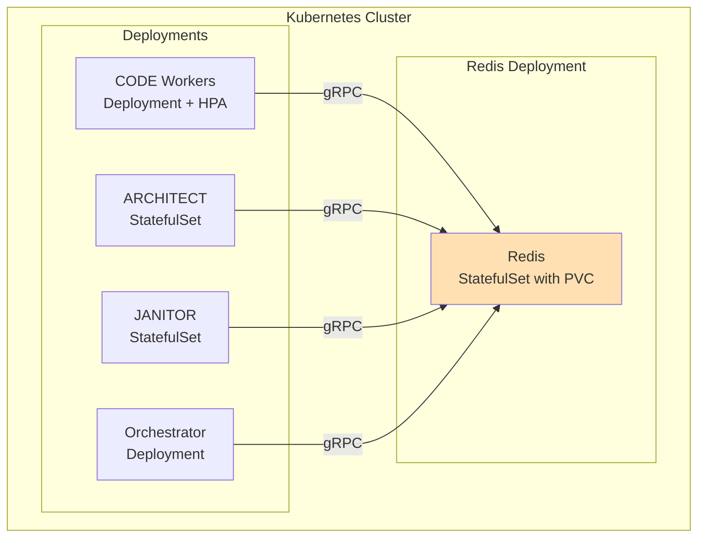
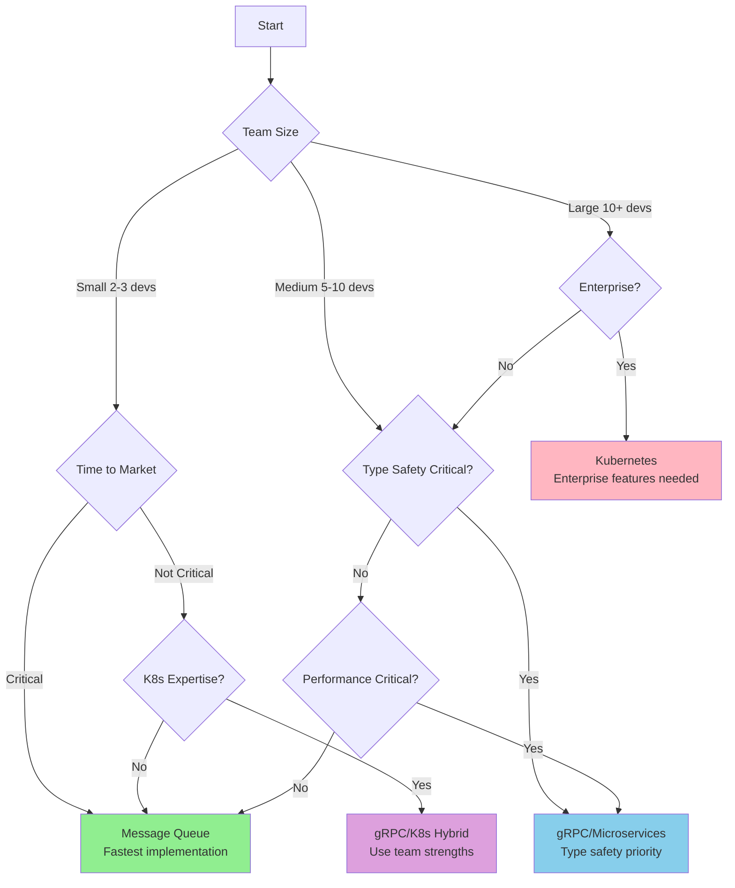

# Parallel Agent Execution Architecture - Synthesis and Comparison

**Version:** 1.0  
**Date:** 2026-02-06  
**Author:** Architecture Synthesis Document

---

## Executive Summary

This document provides a comprehensive synthesis and comparison of three architecture approaches designed to enable parallel execution of AI agents in the agent-coding-container system:

1. **Message Queue Based Architecture** - Uses Redis as a message broker for task distribution
2. **gRPC/Microservices Based Architecture** - Uses Protocol Buffers for type-safe service communication
3. **Kubernetes/Orchestration Based Architecture** - Uses Kubernetes native primitives for orchestration

Each approach transforms the current sequential orchestration system into a distributed, scalable system where multiple CODE agents can work in parallel on different TODO items while ARCHITECT and JANITOR agents coordinate the overall workflow.

### Key Findings

| Aspect | Message Queue | gRPC/Microservices | Kubernetes |
|---------|---------------|---------------------|------------|
| **Best For** | Rapid development | Type-safe, low-latency systems | Production deployments |
| **Complexity** | ⭐ Low | ⭐⭐ Medium | ⭐⭐⭐ High |
| **Production Ready** | ⭐⭐ Good | ⭐⭐⭐ Very Good | ⭐⭐⭐⭐ Excellent |
| **Setup Time** | Fast (hours) | Medium (1-2 days) | Slow (3-5 days) |
| **Learning Curve** | Low | Medium | High |
| **Infrastructure** | Redis | Self-contained | Kubernetes cluster |

### Recommendation Summary

**Primary Recommendation: Start with Message Queue, Plan Migration to Kubernetes**

- **Phase 1 (Immediate):** Implement Message Queue Architecture for rapid development and learning
- **Phase 2 (Medium-term):** Migrate to gRPC/Microservices if type safety becomes critical
- **Phase 3 (Long-term):** Move to Kubernetes for production-grade scalability and observability

This staged approach allows the team to:
1. Gain immediate benefits from parallelization
2. Learn distributed systems patterns incrementally
3. Build toward production readiness without over-engineering initially

---

## 1. Problem Definition

### 1.1 Core Challenge

The current agent-coding-container system executes tasks sequentially through a single orchestrator loop. This limits throughput, especially for large projects with many independent TODO items that could be processed in parallel.

### 1.2 Requirements

| Requirement | Priority | Description |
|--------------|-----------|-------------|
| **Parallel Execution** | P0 | 3-5 CODE agents must work simultaneously on different TODO items |
| **Task Deconfliction** | P0 | Ensure no TODO item is processed by multiple agents simultaneously |
| **Fault Tolerance** | P0 | System must recover from agent crashes without losing work |
| **Scalability** | P1 | Ability to scale workers dynamically based on workload |
| **Observability** | P1 | Monitor progress, task status, and system health |
| **Backward Compatibility** | P1 | Preserve existing workflow and file structures |
| **Production Readiness** | P1 | Suitable for deployment in production environments |
| **Ease of Development** | P2 | Reasonable implementation effort and learning curve |
| **Resource Efficiency** | P2 | Optimal CPU, memory, and network usage |

### 1.3 Constraints

| Constraint | Description |
|------------|-------------|
| **Workspace Sharing** | All agents share a common workspace directory with TODO.md, PRD.md, etc. |
| **Git Operations** | Multiple agents may need to commit to the same git repository |
| **Kilo Code Integration** | Agents must invoke Kilo Code CLI for actual code changes |
| **Existing Prompts** | CODE.md, ARCHITECT.md, JANITOR.md prompts must remain functional |
| **Agent Coordination** | ARCHITECT runs every 8 iterations, JANITOR every 4 iterations |

---

## 2. Architecture Overview Comparison

### 2.1 Message Queue Architecture

**Core Concept:** Use Redis as a message broker to distribute tasks among multiple CODE workers. Workers pull tasks from a queue using `BLPOP` (blocking pop), ensuring load balancing.

**Key Components:**
- **Redis Message Broker** - Task queue, result queue, status hash, control channel (PUB/SUB)
- **Dispatcher** - Reads TODO.md and enqueues tasks
- **CODE Workers (3-5)** - Pull tasks, execute, report results
- **ARCHITECT/JANITOR** - Specialized agents triggered via control channel
- **Orchestrator Controller** - Monitors progress, triggers agents

**Communication Pattern:** Push/Pull via Redis data structures (LIST, HASH, PUB/SUB)

### 2.2 gRPC/Microservices Architecture

**Core Concept:** Use gRPC with Protocol Buffers for type-safe, efficient communication between services. A custom Service Registry provides service discovery.

**Key Components:**
- **Service Registry** - Central registry for service discovery and health monitoring
- **Task Manager** - Central task queue with lease-based deconfliction
- **Orchestrator Controller** - Workflow coordinator (gRPC client)
- **CODE Workers (3-5)** - Claim tasks via gRPC, execute, report results
- **ARCHITECT/JANITOR** - gRPC servers waiting for trigger RPCs

**Communication Pattern:** gRPC RPCs (unary, streaming) with protobuf serialization

### 2.3 Kubernetes/Orchestration Architecture

**Core Concept:** Leverage Kubernetes native primitives for orchestration, using the Lease API for distributed coordination.

**Key Components:**
- **Custom Task Controller** - Kubernetes controller managing task leases
- **Kubernetes Lease API** - Native deconfliction mechanism
- **CODE Worker Deployment** - Scalable via HorizontalPodAutoscaler
- **ARCHITECT/JANITOR StatefulSets** - Stable network identity, dedicated storage
- **Orchestrator Controller** - Monitors leases, triggers agents

**Communication Pattern:** Direct workspace file access + Kubernetes API for coordination

---

## 3. Detailed Comparison Tables

### 3.1 Complexity Analysis

| Dimension | Message Queue | gRPC/Microservices | Kubernetes |
|------------|---------------|---------------------|------------|
| **Initial Setup** | Low - Redis + Docker Compose | Medium - Protobuf compilation, multiple services | High - Cluster setup, RBAC, storage |
| **Learning Curve** | Redis primitives familiar to most developers | gRPC/protobuf learning required | Kubernetes concepts extensive |
| **Code Changes Required** | Medium - New containers, queue logic | High - Protobuf definitions, RPC handlers | Very High - Custom controller, CRDs |
| **Testing Complexity** | Medium - Can test with local Redis | High - Multiple services to coordinate | Very High - Need kind/minikube |
| **Maintenance** | Low - Simple Docker Compose | Medium - Multiple services to monitor | High - Cluster operations |
| **Overall Complexity Rating** | ⭐⭐ | ⭐⭐⭐ | ⭐⭐⭐⭐ |

### 3.2 Scalability Analysis

| Dimension | Message Queue | gRPC/Microservices | Kubernetes |
|------------|---------------|---------------------|------------|
| **Horizontal Scaling** | ⭐⭐⭐ Good - Docker Compose scale | ⭐⭐⭐ Excellent - Registry-based discovery | ⭐⭐⭐⭐ Excellent - HPA native |
| **Vertical Scaling** | ⭐⭐ Good - Resource limits | ⭐⭐ Good - Resource limits | ⭐⭐⭐ Excellent - Resource requests/limits |
| **Auto-Scaling** | ⚠️ Manual or custom script | ⚠️ Custom controller needed | ✅ Built-in HPA |
| **Scaling Limits** | Bound by Redis capacity | Bound by memory (in-memory tasks) | Bound by cluster size |
| **Elasticity** | ⭐⭐ Medium - Manual scaling | ⭐⭐⭐ Good - Custom scaler | ⭐⭐⭐⭐ Excellent - HPA + Cluster Autoscaler |
| **Cluster Autoscaling** | ❌ Not applicable | ⚠️ Possible with effort | ✅ Native support |
| **Overall Scalability** | ⭐⭐⭐ | ⭐⭐⭐ | ⭐⭐⭐⭐ |

### 3.3 Fault Tolerance and Recovery

| Scenario | Message Queue | gRPC/Microservices | Kubernetes |
|----------|---------------|---------------------|------------|
| **Worker Crash** | ✅ Lock expires (TTL), task re-queued | ✅ Lease expires, task returned to PENDING | ✅ Pod restart, lease expires |
| **Queue Crash (Redis/TaskManager)** | ⚠️ Tasks lost (requires persistence) | ⚠️ Tasks lost (in-memory only) | ✅ Controller restarts, re-syncs |
| **Registry Crash** | N/A | ⚠️ Services can't register/discover | N/A |
| **Network Partition** | ⚠️ Workers can't reach Redis | ⚠️ Services isolated, lease expiration | ✅ Pod eviction, rescheduling |
| **Task Timeout** | ✅ Heartbeat timeout detection | ✅ Lease expiration | ✅ Lease expiration |
| **Controller Crash** | ✅ Queue persists in Redis | ⚠️ State lost | ✅ State persists in Kubernetes API |
| **Data Loss Recovery** | ⚠️ Requires Redis persistence (AOF/RDB) | ❌ No persistence built-in | ✅ Kubernetes API durability |
| **Self-Healing** | ⚠️ Docker restart policy | ⚠️ Custom health checks | ✅ Native pod self-healing |
| **Overall Fault Tolerance** | ⭐⭐⭐ | ⭐⭐ | ⭐⭐⭐⭐ |

### 3.4 Performance Characteristics

| Metric | Message Queue | gRPC/Microservices | Kubernetes |
|--------|---------------|---------------------|------------|
| **Task Latency** | Medium - Queue polling overhead | Low - Direct RPC | Low-Medium - K8s API overhead |
| **Throughput** | High - Redis very fast | Very High - Binary protocol | High - Limited by K8s API |
| **Network Overhead** | Medium - Redis protocol | Low - Binary protobuf | Medium - K8s API calls |
| **Serialization** | JSON (slower) | Protobuf (fast) | N/A (file-based) |
| **Concurrent Processing** | 3-5 workers (configurable) | 3-5 workers (configurable) | 3-10 workers (HPA) |
| **Startup Time** | Fast - Seconds | Medium - Tens of seconds | Slow - Minutes (pod scheduling) |
| **Overall Performance** | ⭐⭐⭐ | ⭐⭐⭐⭐ | ⭐⭐⭐ |

### 3.5 Operational Overhead

| Aspect | Message Queue | gRPC/Microservices | Kubernetes |
|--------|---------------|---------------------|------------|
| **Monitoring** | ⚠️ Custom metrics needed | ✅ gRPC health checks | ✅ Native Prometheus integration |
| **Debugging** | ⚠️ Redis logs, worker logs | ✅ Structured gRPC logs | ⚠️ Distributed logs across pods |
| **Log Aggregation** | Simple - Docker logs | Medium - Multiple services | Complex - Cluster-wide |
| **Alerting** | ⚠️ Custom implementation | ✅ Health check failures | ✅ Native alerts (Prometheus) |
| **Troubleshooting** | Easy - Single Redis instance | Medium - Multiple services | Hard - Distributed system |
| **Upgrades** | Easy - Docker Compose restart | Medium - Rolling restart needed | Easy - Rolling updates |
| **Deployment** | Simple - Single command | Medium - Multiple containers | Complex - kubectl apply |
| **Overall Operational Burden** | ⭐⭐ | ⭐⭐⭐ | ⭐⭐⭐⭐ |

### 3.6 Infrastructure Dependencies

| Dependency | Message Queue | gRPC/Microservices | Kubernetes |
|------------|---------------|---------------------|------------|
| **Redis** | ✅ Required | ❌ Not required | ❌ Not required |
| **Kubernetes Cluster** | ❌ Not required | ❌ Not required | ✅ Required |
| **Container Registry** | ⚠️ Optional (local builds) | ⚠️ Optional (local builds) | ✅ Required |
| **Load Balancer** | ❌ Not required | ❌ Not required | ✅ Native (Services) |
| **Storage System** | ⚠️ Docker volumes | ⚠️ Docker volumes | ✅ PersistentVolumes |
| **Metrics Stack** | ⚠️ Optional | ⚠️ Optional | ⚠️ Optional (but common) |
| **Additional Tools** | None | protoc compiler | kubectl, helm (optional) |
| **Total Dependencies** | 1 (Redis) | 1 (protoc) | 1 (K8s cluster) |

### 3.7 Migration Effort from Current System

| Aspect | Message Queue | gRPC/Microservices | Kubernetes |
|--------|---------------|---------------------|------------|
| **Code Changes** | Medium - Containerize agents | High - Add gRPC interfaces | Very High - K8s manifests |
| **File Changes** | Low - Keep existing files | Low - Keep existing files | Low - Keep existing files |
| **Process Changes** | Medium - Learn Docker Compose | High - Learn gRPC/protobuf | Very High - Learn Kubernetes |
| **Testing Effort** | Medium - Integration tests | High - Multiple services | Very High - Cluster testing |
| **Deployment Changes** | Medium - Docker build/push | High - Multiple images | Very High - K8s manifests |
| **Rollback** | Easy - Stop containers, use run.js | Medium - Stop services | Hard - K8s resource cleanup |
| **Estimated Effort** | 3-5 days | 1-2 weeks | 2-3 weeks |
| **Overall Migration Difficulty** | ⭐⭐ | ⭐⭐⭐ | ⭐⭐⭐⭐ |

### 3.8 Resource Efficiency

| Resource | Message Queue | gRPC/Microservices | Kubernetes |
|----------|---------------|---------------------|------------|
| **CPU Usage** | Low-Medium - Workers + Redis | Medium - Workers + Registry + TaskManager | Medium - Control plane + pods |
| **Memory Usage** | Low-Medium - Redis ~512MB | Medium - In-memory task state | Medium-High - Control plane overhead |
| **Network Usage** | Medium - Redis protocol | Low - Binary protocol | Medium - K8s API calls + worker traffic |
| **Storage Usage** | Low - Redis AOF/RDB | None (in-memory) | Medium - PVs + etcd storage |
| **Overhead Ratio** | ~10% | ~15% | ~25-30% (control plane) |
| **Cost Efficiency** | ⭐⭐⭐⭐ | ⭐⭐⭐ | ⭐⭐ |

### 3.9 Cost Implications

| Cost Factor | Message Queue | gRPC/Microservices | Kubernetes |
|-------------|---------------|---------------------|------------|
| **Infrastructure** | Low - Docker Compose (local) or single VM | Medium - Multiple VMs or containers | High - Managed cluster or self-hosted |
| **Development Cost** | Low - Simple setup | Medium - More complex | High - Cluster setup time |
| **Operating Cost** | Low - Minimal services | Medium - Multiple services | High - Control plane overhead |
| **Cloud Provider** | Low - Single VM/container | Medium - Multiple instances | High - Managed K8s (EKS/GKE/AKS) |
| **Scaling Cost** | Linear - Add workers | Linear - Add workers | Efficient - Auto-scale with HPA |
| **Total Cost of Ownership** | ⭐⭐⭐ | ⭐⭐ | ⭐ |

### 3.10 Comprehensive Comparison Matrix

| Criterion | Weight | Message Queue | gRPC/Microservices | Kubernetes | Winner |
|-----------|---------|---------------|---------------------|------------|--------|
| **Simplicity** | 15% | ⭐⭐⭐⭐⭐ | ⭐⭐⭐ | ⭐⭐ | MQ |
| **Scalability** | 20% | ⭐⭐⭐ | ⭐⭐⭐ | ⭐⭐⭐⭐ | K8s |
| **Performance** | 15% | ⭐⭐⭐ | ⭐⭐⭐⭐⭐ | ⭐⭐⭐ | gRPC |
| **Fault Tolerance** | 15% | ⭐⭐⭐ | ⭐⭐ | ⭐⭐⭐⭐ | K8s |
| **Production Ready** | 15% | ⭐⭐⭐ | ⭐⭐⭐⭐ | ⭐⭐⭐⭐⭐ | K8s |
| **Resource Efficiency** | 10% | ⭐⭐⭐⭐ | ⭐⭐⭐ | ⭐⭐ | MQ |
| **Observability** | 10% | ⭐⭐ | ⭐⭐⭐ | ⭐⭐⭐⭐ | K8s |
| **Weighted Score** | **100%** | **3.45** | **3.55** | **3.70** | **K8s** |

---

## 4. Deconfliction Strategy Comparison

### 4.1 Deconfliction Mechanisms

| Aspect | Message Queue | gRPC/Microservices | Kubernetes |
|--------|---------------|---------------------|------------|
| **Mechanism** | Redis SET (task_locks) | Lease-based locking | Kubernetes Lease API |
| **Lock Store** | Redis SET | Task Manager memory | Kubernetes API server (etcd) |
| **Lock Acquisition** | `SADD task_locks task_id` | ClaimTask RPC with expiration | Create/Update Lease resource |
| **Lock Duration** | Implicit (cleared on completion) | TTL-based (15 min default) | leaseDurationSeconds field |
| **Lock Renewal** | Heartbeat to task_status hash | ExtendTaskLease RPC | Update Lease.renewTime |
| **Lock Release** | `SREM task_locks task_id` | ReportTaskResult releases | Delete Lease resource |
| **Crash Recovery** | Timeout detection (heartbeat) | Lease expiration | Lease expiration (native) |

### 4.2 Task Atomicity Guarantees

| Guarantee | Message Queue | gRPC/Microservices | Kubernetes |
|-----------|---------------|---------------------|------------|
| **Mutual Exclusion** | ✅ Redis SET atomic operations | ✅ Task Manager ensures single claim | ✅ K8s API optimistic concurrency |
| **Deadlock Prevention** | ✅ No blocking, no cycles | ✅ No blocking, timeout-based | ✅ No blocking, timeout-based |
| **Starvation Prevention** | ⚠️ FIFO queue, fair distribution | ⚠️ Depends on ClaimTask logic | ⚠️ Workers compete for tasks |
| **Liveliness** | ✅ Workers can claim if lock free | ✅ Workers can claim if lease free | ✅ Workers can claim if lease free |
| **Safety** | ✅ Tasks processed at most once | ✅ Tasks processed at most once | ✅ Tasks processed at most once |
| **Liveness** | ✅ Tasks eventually processed | ✅ Tasks eventually processed | ✅ Tasks eventually processed |

### 4.3 Crash Recovery Scenarios

| Scenario | Message Queue | gRPC/Microservices | Kubernetes |
|----------|---------------|---------------------|------------|
| **Worker Crash During Task** | Heartbeat timeout after 5 min → Lock released → Task re-queued | Lease expires after 15 min → Task returned to PENDING | Pod deleted → Lease expires → Task available for reclamation |
| **Crash Before Lock Release** | Finally block ensures SREM | Finally block ensures ReportTaskResult | Lease automatically expires |
| **Redis/TaskManager/K8s API Crash** | All locks lost → Tasks re-queued on restart | In-memory state lost → Tasks need repopulation | State persists in etcd → Controller resumes |
| **Network Partition** | Workers timeout → Locks expire | Leases expire → Tasks return to PENDING | Pods evicted → Leases expire |
| **Double Claim Attempt** | Second SADD returns 0 (already exists) | Second ClaimTask rejected | Second Lease update gets 409 Conflict |

### 4.4 Timeout Handling

| Timeout Type | Message Queue | gRPC/Microservices | Kubernetes |
|--------------|---------------|---------------------|------------|
| **Task Timeout** | Heartbeat timeout (5 min) → Re-queue task | Lease expiration (15 min) → Mark TIMEOUT | Lease expiration → Mark for reclamation |
| **Worker Response Timeout** | BLPOP timeout (5s) → Retry | RPC timeout → Return error | N/A (workers read TODO.md directly) |
| **Startup Timeout** | Docker restart policy | gRPC health check probes | StartupProbe with failureThreshold |
| **Graceful Shutdown** | SIGTERM handler releases locks | Shutdown RPC releases leases | preStop hook, terminationGracePeriodSeconds |

### 4.5 Deadlock Prevention

| Aspect | Message Queue | gRPC/Microservices | Kubernetes |
|--------|---------------|---------------------|------------|
| **Lock Ordering** | N/A (non-blocking SADD) | N/A (non-blocking ClaimTask) | N/A (optimistic concurrency) |
| **Wait-Free** | ✅ Yes - non-blocking operations | ✅ Yes - RPC returns immediately | ✅ Yes - API returns immediately |
| **Circular Dependencies** | N/A (no dependencies between locks) | N/A (no dependencies between leases) | N/A (no dependencies between leases) |
| **Timeout Backoff** | ⚠️ Not implemented | ✅ Lease expiration provides timeout | ✅ Lease expiration provides timeout |
| **Overall Deadlock Safety** | ✅ Safe | ✅ Safe | ✅ Safe |

### 4.6 Monitoring Capabilities

| Metric | Message Queue | gRPC/Microservices | Kubernetes |
|--------|---------------|---------------------|------------|
| **Active Locks** | `SCARD task_locks` | Count leased tasks in TaskManager | `kubectl get leases` |
| **Lock Holders** | Need to track in task_status hash | TaskManager tracks assigned_worker_id | Lease.spec.holderIdentity |
| **Lock Age** | Need to track timestamp | TaskManager tracks leased_at | Lease.renewTime vs acquireTime |
| **Expiration Detection** | Custom heartbeat monitoring | Background lease expiration thread | Native (K8s controller-managed) |
| **Lock Transitions** | Not tracked | Lease.leaseTransitions counter | Lease.leaseTransitions counter |
| **Native Tools** | Redis CLI | None | kubectl, Lens, Dashboard |

### 4.7 Deconfliction Strategy Scoring

| Criterion | Message Queue | gRPC/Microservices | Kubernetes | Winner |
|-----------|---------------|---------------------|------------|--------|
| **Implementation Simplicity** | ⭐⭐⭐⭐⭐ | ⭐⭐⭐ | ⭐⭐⭐ | MQ |
| **Crash Recovery** | ⭐⭐⭐ | ⭐⭐ | ⭐⭐⭐⭐⭐ | K8s |
| **Timeout Handling** | ⭐⭐⭐ | ⭐⭐⭐⭐ | ⭐⭐⭐⭐ | gRPC/K8s |
| **Monitoring** | ⭐⭐⭐ | ⭐⭐⭐ | ⭐⭐⭐⭐⭐ | K8s |
| **Atomicity Guarantees** | ⭐⭐⭐⭐ | ⭐⭐⭐⭐ | ⭐⭐⭐⭐ | Tie |
| **Overall Score** | ⭐⭐⭐ | ⭐⭐⭐ | ⭐⭐⭐⭐ | K8s |

---

## 5. Use Case Recommendations

### 5.1 Development Environment

**Recommended: Message Queue Architecture**

**Rationale:**
- Fast setup and iteration
- Easy to debug with local Redis
- Minimal infrastructure requirements
- Low learning curve for developers

**Configuration:**
- 2-3 CODE workers for development parallelism
- Docker Compose for local development
- Redis persistence disabled (faster)

**Success Criteria:**
- Developers can start parallel work in < 30 minutes
- Debugging tasks is straightforward
- Can test deconfliction locally

### 5.2 Staging/Testing Environment

**Recommended: gRPC/Microservices Architecture**

**Rationale:**
- Type safety catches integration issues early
- Better observability with structured logs
- Production-like communication patterns
- Moderate complexity suitable for staging

**Configuration:**
- 3-5 CODE workers
- Service Registry with TTL monitoring
- Protobuf code generation in CI/CD

**Success Criteria:**
- Integration tests pass consistently
- Type contracts prevent breaking changes
- Performance metrics collected

### 5.3 Production Environment

**Recommended: Kubernetes Architecture**

**Rationale:**
- Battle-tested orchestration platform
- Built-in self-healing and scaling
- Native observability and monitoring
- Cloud-agnostic deployment

**Configuration:**
- 3-10 CODE workers with HPA
- Prometheus + Grafana stack
- ReadWriteMany storage (EFS/GCS/Azure Files)
- RBAC and NetworkPolicies configured

**Success Criteria:**
- 99.9% uptime for worker pods
- Automatic scaling handles load spikes
- Alerts fire for failures
- Zero-downtime deployments

### 5.4 Small Team (2-3 developers)

**Recommended: Message Queue Architecture**

**Rationale:**
- Minimal operational burden
- Easy to understand and maintain
- No Kubernetes expertise required
- Quick iteration cycle

**Adaptations:**
- Use docker-compose for local dev
- Simple shell scripts for deployment
- Basic monitoring via logs

### 5.5 Medium Team (5-10 developers)

**Recommended: gRPC/Microservices Architecture**

**Rationale:**
- Balance of complexity and features
- Type safety helps with larger codebases
- More sophisticated debugging capabilities
- Easier to onboard new developers

**Adaptations:**
- Dedicated DevOps support
- CI/CD pipeline for protobuf compilation
- Service mesh for traffic management (optional)

### 5.6 Large Team (10+ developers) / Enterprise

**Recommended: Kubernetes Architecture**

**Rationale:**
- Meets enterprise requirements
- Scales to large workloads
- Integrates with enterprise tooling
- Cloud provider managed services available

**Adaptations:**
- Dedicated platform engineering team
- GitOps with ArgoCD/Flux
- Service mesh (Istio/Linkerd)
- SRE practices and on-call rotation

### 5.7 Deployment Scale - Small

**Definition:** < 50 TODO items, < 10 commits per session

**Recommended: Message Queue**

**Reasoning:**
- Overhead of Kubernetes not justified
- Simple architecture sufficient
- Resource costs minimized

### 5.8 Deployment Scale - Medium

**Definition:** 50-200 TODO items, 10-50 commits per session

**Recommended: gRPC/Microservices**

**Reasoning:**
- Better performance with many tasks
- Type safety prevents issues at scale
- More sophisticated coordination needed

### 5.9 Deployment Scale - Large

**Definition:** > 200 TODO items, > 50 commits per session

**Recommended: Kubernetes**

**Reasoning:**
- Auto-scaling essential
- Fault tolerance critical
- Production-grade monitoring required
- Long-running workloads

---

## 6. Implementation Roadmap

### 6.1 Recommended Approach: Message Queue (Phase 1)

#### Phase 1: Minimum Viable Parallelization (MVP) - Week 1-2

**Objectives:**
- Get parallel execution working
- Validate deconfliction mechanism
- Establish baseline performance

**Tasks:**
1. **Redis Setup** (Day 1)
   - Add Redis to docker-compose.yml
   - Configure persistence (AOF)
   - Test connectivity

2. **Dispatcher Implementation** (Day 2-3)
   - Create dispatcher.js
   - Read TODO.md and enqueue tasks
   - Implement control channel subscription

3. **CODE Worker Implementation** (Day 4-5)
   - Create code-worker.js
   - Implement BLPOP task consumption
   - Add lock acquisition (SADD)
   - Integrate Kilo Code CLI

4. **Deconfliction** (Day 6)
   - Implement task_locks SET
   - Add heartbeat mechanism
   - Implement lock release on completion

5. **Basic Orchestrator** (Day 7)
   - Create orchestrator-controller.js
   - Monitor task_status
   - Track iteration count

6. **Docker Compose** (Day 8)
   - Create docker-compose.yml
   - Define all services
   - Configure volume mounts

7. **Testing** (Day 9-10)
   - Test with 3 workers
   - Verify no task duplication
   - Measure parallelism gain

**Deliverables:**
- Working parallel execution with 3 CODE workers
- Deconfliction validated
- Performance baseline established

#### Phase 2: Production Hardening - Week 3-4

**Objectives:**
- Improve reliability
- Add monitoring
- Handle edge cases

**Tasks:**
1. **ARCHITECT/JANITOR Integration** (Day 11-13)
   - Add agent containers
   - Implement control channel triggers
   - Test interval-based execution

2. **Error Handling** (Day 14-15)
   - Graceful shutdown on SIGTERM
   - Retry logic for transient failures
   - Lock cleanup in finally blocks

3. **Monitoring** (Day 16-17)
   - Add health check endpoints
   - Implement structured logging
   - Export basic metrics

4. **Configuration Management** (Day 18)
   - Centralize environment variables
   - Document all config options
   - Add validation

5. **Testing & Validation** (Day 19-20)
   - Load testing with many tasks
   - Crash recovery testing
   - Concurrent access testing

**Deliverables:**
- Production-ready message queue system
- Monitoring and alerting in place
- Documentation complete

#### Phase 3: Advanced Features - Week 5-6 (Optional)

**Objectives:**
- Add production enhancements
- Prepare for potential Kubernetes migration

**Tasks:**
1. **Auto-scaling** (Day 21-22)
   - Implement queue depth monitoring
   - Add worker scale up/down logic
   - Test scaling behavior

2. **Priority Queue** (Day 23-24)
   - Replace LIST with ZSET for priority
   - Add priority field to tasks
   - Update worker logic

3. **Web Dashboard** (Day 25-27)
   - Simple Express.js dashboard
   - Show queue depth, active tasks
   - Display worker status

4. **Metrics Export** (Day 28-30)
   - Add Prometheus endpoint
   - Export standard metrics
   - Configure Grafana dashboards

**Deliverables:**
- Enhanced message queue system
- Observability stack deployed
- Ready for production use

### 6.2 Alternative: Direct Kubernetes Implementation (If Skipping Phase 1)

#### Phase 1: Infrastructure Setup - Week 1-2

**Tasks:**
1. Set up Kubernetes cluster (kind/minikube for local, EKS/GKE/AKS for cloud)
2. Install kubectl, helm
3. Configure container registry access
4. Create namespace and RBAC
5. Set up persistent storage (ReadWriteMany)

#### Phase 2: Base Components - Week 3-4

**Tasks:**
1. Create ConfigMaps for prompts
2. Build and push container images
3. Deploy Custom Task Controller
4. Deploy Orchestrator Controller
5. Create Services (ClusterIP, Headless)

#### Phase 3: Worker Deployment - Week 5-6

**Tasks:**
1. Deploy CODE Worker Deployment
2. Configure HorizontalPodAutoscaler
3. Deploy ARCHITECT StatefulSet
4. Deploy JANITOR StatefulSet
5. Configure health probes

#### Phase 4: Validation & Hardening - Week 7-8

**Tasks:**
1. End-to-end testing
2. Load testing with HPA
3. Crash recovery testing
4. Configure monitoring (Prometheus/Grafana)
5. Set up alerts

---

## 7. Migration Strategy

### 7.1 From Sequential to Message Queue (Phase 1)

#### Step 1: Preparation - Day 1

**Actions:**
- Review current run.js implementation
- Identify touchpoints with TODO.md, PRD.md
- Document current state transitions

**Deliverables:**
- Current system documentation
- Migration checklist

#### Step 2: Infrastructure Setup - Day 2

**Actions:**
- Install Docker if not present
- Set up Redis container
- Verify network connectivity

**Deliverables:**
- Redis running locally
- Docker Compose configured

#### Step 3: Backward Compatibility Layer - Day 3-4

**Actions:**
- Keep run.js functional
- Add flag to switch between sequential/parallel mode
- Ensure parallel mode optional

**Deliverables:**
- Dual-mode operation supported
- Sequential execution preserved

#### Step 4: Incremental Rollout - Day 5-7

**Actions:**
- Deploy parallel mode to development environment
- Run comparison tests (same TODO.md, both modes)
- Measure performance difference

**Deliverables:**
- Performance comparison data
- Parallel mode validated

#### Step 5: Testing & Validation - Day 8-10

**Actions:**
- Run full project cycle in parallel mode
- Verify all TODO items completed correctly
- Check git commits are valid

**Deliverables:**
- Parallel mode fully tested
- Migration validated

#### Step 6: Documentation & Training - Day 11-12

**Actions:**
- Document parallel mode usage
- Create troubleshooting guide
- Train team on new system

**Deliverables:**
- Complete documentation
- Team trained

#### Step 7: Cut-over - Day 13-14

**Actions:**
- Switch default mode to parallel
- Monitor for issues
- Keep sequential mode available as fallback

**Deliverables:**
- Production parallel execution
- Fallback plan documented

**Rollback Plan:**
1. Revert to sequential mode via flag
2. Analyze any issues found
3. Fix issues in parallel implementation
4. Retry migration

### 7.2 From Message Queue to Kubernetes (Phase 3)

#### Step 1: Assessment - Week 1

**Actions:**
- Evaluate Kubernetes readiness
- Assess team expertise
- Review cloud provider options
- Estimate migration effort

**Deliverables:**
- Kubernetes readiness report
- Migration plan approved

#### Step 2: Skill Building - Week 2

**Actions:**
- Kubernetes training for team
- Hands-on workshop with kind/minikube
- Practice basic kubectl operations

**Deliverables:**
- Team Kubernetes trained
- Skill gaps addressed

#### Step 3: Infrastructure Setup - Week 3

**Actions:**
- Provision Kubernetes cluster
- Configure container registry
- Set up monitoring stack
- Configure RBAC

**Deliverables:**
- Cluster ready for deployment
- CI/CD configured

#### Step 4: Parallel Operation - Week 4-6

**Actions:**
- Deploy Kubernetes system alongside message queue
- Run both systems in parallel (canary)
- Compare performance and reliability
- Validate Kubernetes system

**Deliverables:**
- Kubernetes system deployed and validated
- Comparison data collected

#### Step 5: Gradual Migration - Week 7-8

**Actions:**
- Shift development workload to Kubernetes
- Migrate staging environment
- Keep message queue as emergency fallback
- Monitor stability

**Deliverables:**
- Dev and staging on Kubernetes
- Message queue in standby

#### Step 6: Production Migration - Week 9-10

**Actions:**
- Schedule production migration window
- Switch production to Kubernetes
- Monitor for issues
- Decommission message queue after validation

**Deliverables:**
- Production on Kubernetes
- Message queue retired

**Rollback Plan:**
1. Switch back to message queue
2. Investigate Kubernetes issues
3. Fix issues
4. Retry migration

### 7.3 Data Migration Requirements

| Data Type | Message Queue | gRPC/Microservices | Kubernetes | Migration Strategy |
|------------|---------------|---------------------|------------|-------------------|
| **TODO.md** | Shared volume | Shared volume | Shared volume | No migration needed |
| **PRD.md** | Shared volume | Shared volume | Shared volume | No migration needed |
| **Git Repository** | Shared volume | Shared volume | Shared volume | No migration needed |
| **Task State** | Redis (task_status hash) | Task Manager memory | Kubernetes Lease API | Rebuild on start |
| **Completed Tasks** | Redis (result_queue) | Task Manager | Not tracked | Export/import if needed |
| **Agent State** | Not persisted | Not persisted | StatefulSet PVCs | Manual copy if needed |

### 7.4 Testing Strategy

#### Unit Testing
- Test individual worker logic with mocked Redis/gRPC/K8s API
- Verify lock acquisition/release
- Test heartbeat mechanisms

#### Integration Testing
- Test full workflow with all components
- Verify deconfliction with multiple workers
- Test crash recovery scenarios

#### Load Testing
- Generate large number of TODO items
- Measure throughput and latency
- Verify scaling behavior

#### Chaos Testing
- Kill workers during task execution
- Network partition scenarios
- Resource exhaustion testing

#### Regression Testing
- Run existing test suites
- Compare output with sequential mode
- Verify no functionality lost

### 7.5 Backward Compatibility Considerations

| Aspect | Message Queue | gRPC/Microservices | Kubernetes |
|--------|---------------|---------------------|------------|
| **File Format** | ✅ Compatible - no changes | ✅ Compatible - no changes | ✅ Compatible - no changes |
| **Git Workflow** | ⚠️ May need commit coordination | ⚠️ May need commit coordination | ⚠️ May need commit coordination |
| **Prompt Format** | ✅ Compatible - no changes | ✅ Compatible - no changes | ✅ Compatible - no changes |
| **API Changes** | ✅ No API changes | ✅ No API changes | ✅ No API changes |
| **Rollback** | ✅ Easy - stop containers | ⚠️ Medium - stop services | ⚠️ Hard - kubectl cleanup |

---

## 8. Hybrid Approach Considerations

### 8.1 Potential Hybrid Combinations

| Combination | Description | Benefits | Drawbacks |
|------------|-------------|-----------|-----------|
| **Kubernetes + Redis** | Use K8s for orchestration, Redis for caching | K8s native features, Redis familiarity | Two dependencies |
| **gRPC + Kubernetes** | K8s for pod management, gRPC for service communication | Type-safe comms, K8s scaling | Increased complexity |
| **Message Queue + gRPC** | Redis for task queue, gRPC for agent communication | Simple queue, strong contracts | More moving parts |
| **K8s + gRPC + Redis** | Full stack with all three approaches | Maximum features, flexibility | Very high complexity |

### 8.2 Recommended Hybrid: Kubernetes + Redis

**Concept:**
- Deploy all components as Kubernetes pods
- Use Redis as a distributed cache and pub/sub system
- Maintain K8s-native scaling and self-healing

**Architecture:**

**Benefits:**
- Kubernetes handles pod lifecycle, scaling, self-healing
- Redis provides proven message queue semantics
- Redis HA via StatefulSet with replicas
- Can use Redis Sentinel for high availability

**Implementation Considerations:**
- Use Redis Cluster for scalability beyond single instance
- Configure Redis persistence (AOF)
- Implement Redis health checks in K8s
- Use ConfigMaps for Redis configuration

**When to Use:**
- Team familiar with both K8s and Redis
- Need Redis pub/sub for real-time updates
- Want K8s observability + Redis simplicity

### 8.3 When to Consider Pure Approaches vs. Hybrid

| Situation | Recommendation | Reason |
|-----------|---------------|--------|
| **Rapid prototyping** | Pure Message Queue | Fastest to implement |
| **Type safety critical** | Pure gRPC/Microservices | Strongest contracts |
| **Enterprise production** | Pure Kubernetes | Best production features |
| **Migrating from Redis** | K8s + Redis Hybrid | Leverage existing investment |
| **Need pub/sub beyond tasks** | K8s + Redis Hybrid | Redis pub/sub useful |
| **Team has K8s expertise** | Pure Kubernetes | Use team strengths |
| **Team has Redis expertise** | K8s + Redis Hybrid | Use team strengths |

---

## 9. Risk Assessment

### 9.1 Message Queue Architecture Risks

| Risk | Likelihood | Impact | Mitigation |
|------|-------------|---------|------------|
| **Redis single point of failure** | Medium | High | Enable Redis persistence, add Redis Sentinel for HA |
| **Workspace file conflicts** | Medium | Medium | Document task independence, implement file-level locking if needed |
| **Git commit conflicts** | High | Low | Use feature branches or rebase strategy |
| **Redis memory exhaustion** | Low | High | Set maxmemory policy, monitor Redis memory usage |
| **Network partition** | Low | Medium | Implement timeouts and retries |
| **Data loss on crash** | Low | High | Enable Redis AOF persistence |
| **Hard to debug distributed issues** | Medium | Medium | Add correlation IDs to logs, use tracing |
| **Limited observability** | Medium | Medium | Add Prometheus metrics endpoint |
| **Scaling requires restart** | Medium | Low | Use docker-compose scale command |
| **Queue ordering not guaranteed** | Low | Low | Use priority queue if ordering needed |

**Overall Risk Profile:** ⭐⭐ (Medium) - Risks are manageable with standard Redis practices

### 9.2 gRPC/Microservices Architecture Risks

| Risk | Likelihood | Impact | Mitigation |
|------|-------------|---------|------------|
| **Service Registry single point of failure** | Medium | High | Implement Registry HA, add health-based failover |
| **Task Manager crash loses state** | Medium | High | Add task persistence to file/database |
| **Protobuf schema evolution issues** | Medium | Medium | Follow protobuf compatibility guidelines |
| **Service discovery latency** | Low | Medium | Cache service connections, implement DNS fallback |
| **Complex debugging** | High | Medium | Add distributed tracing (Jaeger/Zipkin) |
| **Higher resource usage** | Medium | Low | Optimize protobuf, tune resource limits |
| **Team learning curve** | Medium | Medium | Provide training, pair programming |
| **Deployment complexity** | Medium | Medium | Use helm charts for consistent deployment |
| **Inter-service network issues** | Low | Medium | Implement retries with backoff |
| **No built-in auto-scaling** | Medium | Medium | Implement custom scaling controller |

**Overall Risk Profile:** ⭐⭐⭐ (Medium-High) - Requires more careful design and monitoring

### 9.3 Kubernetes Architecture Risks

| Risk | Likelihood | Impact | Mitigation |
|------|-------------|---------|------------|
| **Kubernetes cluster failure** | Low | Critical | Use managed K8s (EKS/GKE/AKS), multi-cluster setup |
| **Control plane overhead** | High | Low | Use appropriate cluster size, monitor resources |
| **Storage configuration errors** | Medium | High | Test storage setup in dev, use cloud-managed storage |
| **Complex debugging** | High | Medium | Use distributed tracing, centralized logging |
| **High learning curve** | High | High | Invest in training, use managed services |
| **RBAC misconfiguration** | Medium | High | Use principle of least privilege, audit RBAC |
| **Pod scheduling issues** | Medium | Medium | Configure node affinity, taints/tolerations |
| **Resource quota exhaustion** | Medium | Medium | Monitor quotas, set appropriate limits |
| **Network policies blocking traffic** | Low | High | Test policies thoroughly, use incremental rollout |
| **Cost overruns** | Medium | Medium | Set budget alerts, monitor costs closely |

**Overall Risk Profile:** ⭐⭐⭐ (Medium-High) - Risks are significant but mitigable with proper planning

### 9.4 Risk Comparison Summary

| Risk Category | Message Queue | gRPC/Microservices | Kubernetes |
|---------------|---------------|---------------------|------------|
| **Infrastructure Failure** | Medium | Medium | Low (with managed K8s) |
| **Data Loss** | Medium | High | Low |
| **Complexity Risk** | Low | Medium | High |
| **Operational Risk** | Medium | Medium | High |
| **Cost Risk** | Low | Medium | High |
| **Learning Curve Risk** | Low | Medium | High |
| **Security Risk** | Low | Medium | Medium (with RBAC) |
| **Overall Risk Score** | ⭐⭐ | ⭐⭐⭐ | ⭐⭐⭐ |

### 9.5 Mitigation Strategies Common to All Approaches

1. **Comprehensive Testing**
   - Unit tests for all components
   - Integration tests for full workflow
   - Load testing for scalability validation
   - Chaos testing for fault tolerance

2. **Observability**
   - Structured logging with correlation IDs
   - Metrics export (Prometheus)
   - Distributed tracing
   - Alerting on critical failures

3. **Gradual Rollout**
   - Canary deployments
   - Feature flags for enabling parallelism
   - A/B testing against sequential mode
   - Quick rollback capability

4. **Documentation**
   - Architecture documentation
   - Runbooks for common issues
   - Onboarding materials
   - Troubleshooting guides

5. **Backup and Recovery**
   - Regular backups of workspace
   - Git history as safety net
   - Disaster recovery procedures
   - Regular recovery drills

---

## 10. Final Recommendation

### 10.1 Primary Recommendation

**Adopt a Three-Phase Migration Strategy:**

**Phase 1: Message Queue Architecture (Immediate - 1-2 months)**
- Implement Redis-based message queue
- Achieve parallel execution with 3-5 workers
- Validate deconfliction and performance
- Establish operational baseline

**Phase 2: gRPC/Microservices Architecture (Short-term - 3-6 months)**
- Migrate to type-safe gRPC communication
- Implement Service Registry
- Improve observability and debugging
- Prepare for Kubernetes migration

**Phase 3: Kubernetes Architecture (Long-term - 6-12 months)**
- Migrate to Kubernetes deployment
- Leverage native K8s features
- Implement auto-scaling and HPA
- Achieve production-grade scalability

### 10.2 Rationale for Phased Approach

| Consideration | Rationale |
|---------------|-----------|
| **Risk Management** | Incremental migration reduces risk, allows rollback at each phase |
| **Learning Curve** | Team learns concepts gradually, building on previous knowledge |
| **Value Delivery** | Each phase delivers immediate value (parallelism → type safety → production features) |
| **Cost Optimization** | Invest in complexity only when justified by requirements |
| **Future Flexibility** | Each phase builds toward Kubernetes without lock-in |
| **Team Capability** | Aligns implementation with team skill development |

### 10.3 Decision Framework

Use this decision tree to choose which approach to implement:

### 10.4 Architecture Decision Matrix

| Requirement | Message Queue | gRPC/Microservices | Kubernetes |
|-------------|---------------|---------------------|------------|
| **Speed to Implement** | ✅ Best | ⚠️ Good | ❌ Fair |
| **Production Ready** | ⚠️ Good | ✅ Very Good | ✅ Excellent |
| **Scalability** | ✅ Good | ✅ Very Good | ✅ Excellent |
| **Operational Simplicity** | ✅ Best | ⚠️ Good | ❌ Fair |
| **Observability** | ⚠️ Fair | ✅ Good | ✅ Excellent |
| **Team Skill Fit (small)** | ✅ Best | ⚠️ Good | ❌ Poor |
| **Team Skill Fit (large)** | ⚠️ Fair | ✅ Good | ✅ Best |
| **Cost Efficiency** | ✅ Best | ✅ Good | ⚠️ Fair |
| **Cloud Agnostic** | ✅ Excellent | ✅ Excellent | ✅ Excellent |

### 10.5 Final Verdict

**For this project (agent-coding-container), the recommended path is:**

**Primary Recommendation: Message Queue Architecture → Kubernetes Migration**

**Reasoning:**

1. **Current Project Characteristics**
   - Small to medium team size
   - Development-focused with occasional production use
   - Existing infrastructure is Docker-based
   - Value rapid iteration and learning

2. **Message Queue Benefits**
   - Fastest path to parallelism
   - Leverages existing Docker knowledge
   - Minimal operational burden
   - Low risk of implementation failure

3. **Kubernetes Long-term Value**
   - Production-grade features when needed
   - Industry-standard platform
   - Extensive ecosystem and tooling
   - Cloud provider managed options

4. **gRPC as Intermediate Step (Optional)**
   - Useful if type safety becomes critical
   - Helps transition to Kubernetes mindset
   - Can be skipped if moving directly to K8s

### 10.6 Implementation Next Steps

**Immediate Actions (This Week):**
1. ✅ Review and approve this synthesis document
2. 🔜 Set up Redis in development environment
3. 🔜 Begin dispatcher.js implementation
4. 🔜 Create first CODE worker prototype

**Short-term Actions (Month 1):**
1. 🔜 Complete Message Queue implementation
2. 🔜 Test with real TODO.md from current project
3. 🔜 Measure performance improvement vs sequential
4. 🔜 Document deployment process

**Medium-term Actions (Months 2-3):**
1. 🔜 Evaluate team interest in Kubernetes
2. 🔜 Plan Kubernetes migration (if proceeding)
3. 🔜 Begin Kubernetes learning activities
4. 🔜 Set up test cluster (kind/minikube)

---

## Appendix A: Quick Reference

### A.1 Architecture at a Glance

| Attribute | Message Queue | gRPC/Microservices | Kubernetes |
|------------|---------------|---------------------|------------|
| **Communication** | Redis (LIST/HASH/PUB/SUB) | gRPC (protobuf) | K8s API + file access |
| **Service Discovery** | N/A (direct connection) | Custom Registry | K8s Services (DNS) |
| **Deconfliction** | Redis SET | Lease-based | K8s Lease API |
| **State Storage** | Redis | In-memory | K8s API (etcd) |
| **Scaling** | docker-compose scale | Custom controller | HPA |
| **Orchestration** | Docker Compose | Docker Compose | Kubernetes |
| **Monitoring** | Custom + Redis | gRPC health checks | Prometheus/Grafana |

### A.2 Decision Checklist

Use this checklist to validate your architecture choice:

**Choose Message Queue if:**
- [ ] Team needs quick wins
- [ ] Budget is constrained
- [ ] Kubernetes expertise is lacking
- [ ] Development environment focus
- [ ] Simple monitoring sufficient

**Choose gRPC/Microservices if:**
- [ ] Type safety is critical
- [ ] Performance is paramount
- [ ] Team has gRPC experience
- [ ] Want production-ready communication
- [ ] Can handle medium complexity

**Choose Kubernetes if:**
- [ ] Production is primary environment
- [ ] Auto-scaling required
- [ ] Team has K8s expertise (or can learn)
- [ ] Enterprise requirements
- [ ] Budget allows managed K8s

### A.3 Common Questions

**Q: Can we switch architectures later?**
A: Yes, all architectures maintain the same file-based workspace (TODO.md, PRD.md), making migration possible. The difference is in coordination mechanisms.

**Q: Which is easiest to debug?**
A: Message Queue is easiest initially (single Redis instance). Kubernetes has best tooling but requires learning.

**Q: What's the minimum viable system?**
A: Message Queue with 2 CODE workers achieves the core goal of parallel execution.

**Q: Should we skip to Kubernetes?**
A: Only if team has Kubernetes expertise and production requirements justify the complexity.

**Q: How do we handle git conflicts?**
A: All approaches have this challenge. Consider: feature branches, rebase strategy, or coordination (only one agent commits at a time).

**Q: What about testing?**
A: Each approach can be tested locally: Message Queue (Docker Compose), gRPC (Docker Compose), Kubernetes (kind/minikube).

---

## Document End

**Version:** 1.0  
**Last Updated:** 2026-02-06  
**Approaches Analyzed:** Message Queue, gRPC/Microservices, Kubernetes  
**Recommendation:** Phased migration from Message Queue to Kubernetes
